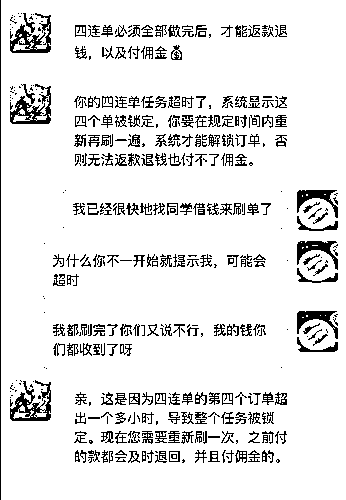
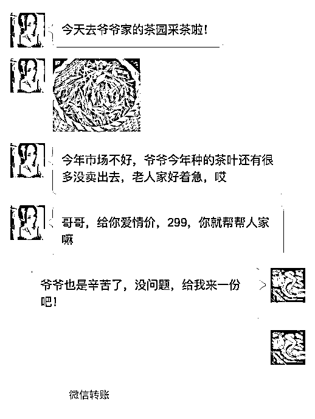
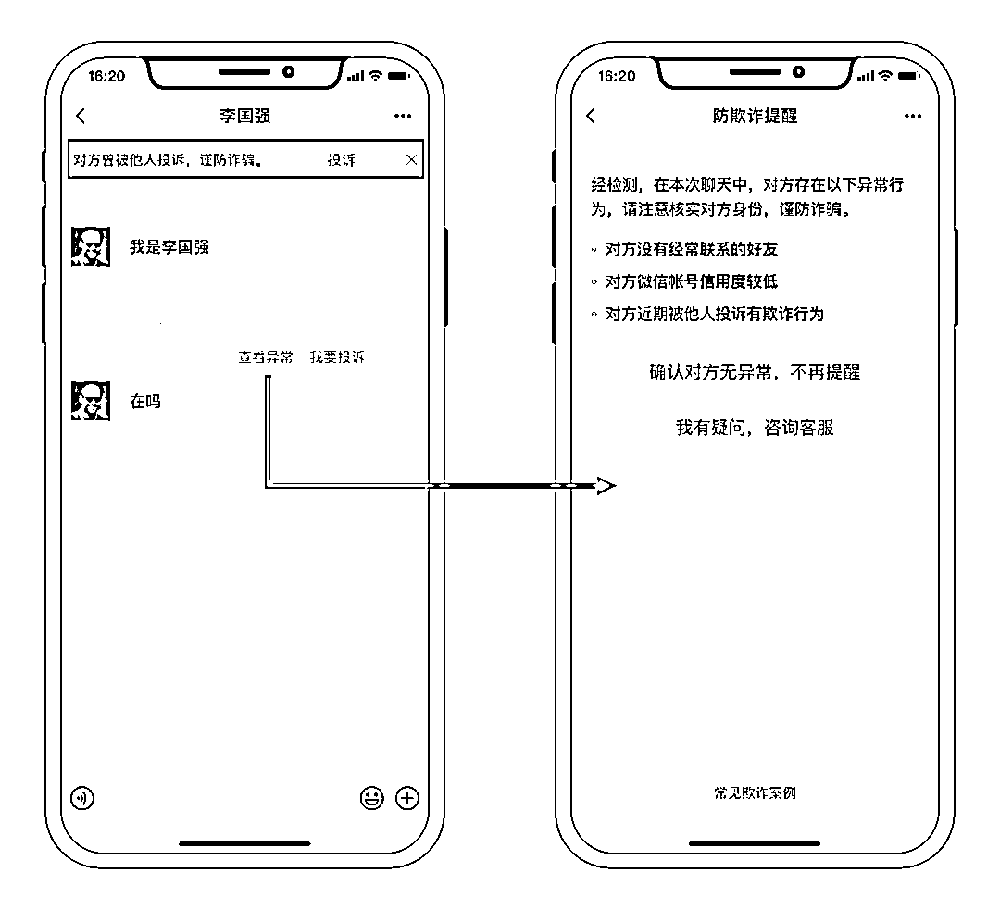
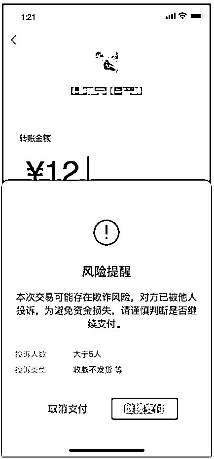
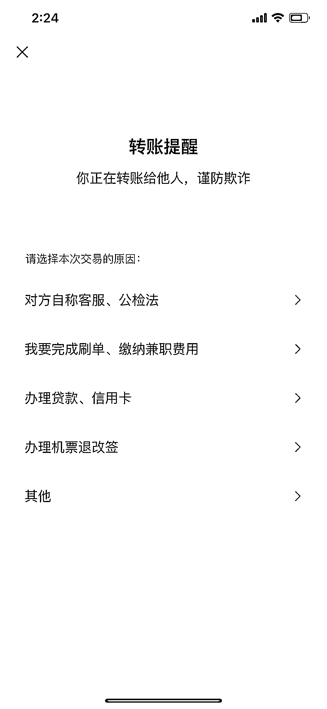
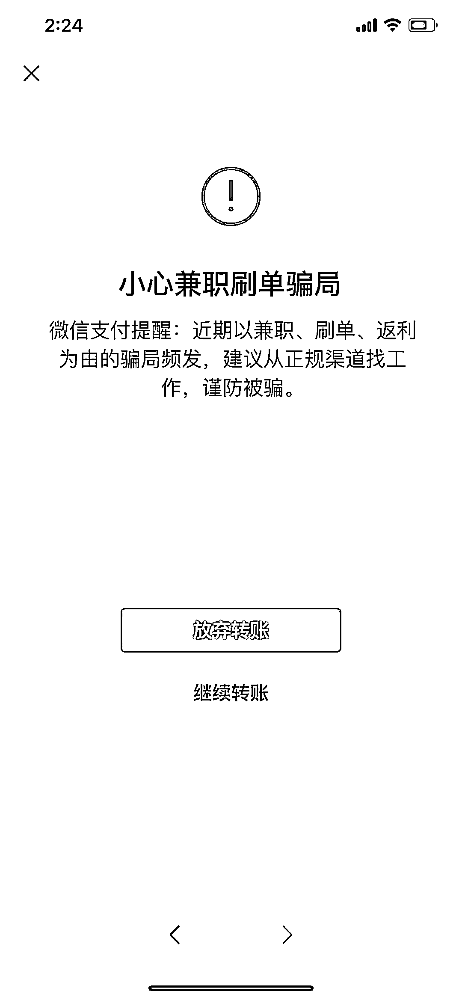

# 忍一时越想越亏，当时怎么没有把微信提醒当回事儿！

> 原文：[`mp.weixin.qq.com/s?__biz=MzIyMDYwMTk0Mw==&mid=2247501712&idx=2&sn=80e886914b0e3f5424ab273a37a17a65&chksm=97cb0ca8a0bc85be1a66ea382019ce78d52c7bc122094f732ba324946e74823d3b8f32ed5f06&scene=27#wechat_redirect`](http://mp.weixin.qq.com/s?__biz=MzIyMDYwMTk0Mw==&mid=2247501712&idx=2&sn=80e886914b0e3f5424ab273a37a17a65&chksm=97cb0ca8a0bc85be1a66ea382019ce78d52c7bc122094f732ba324946e74823d3b8f32ed5f06&scene=27#wechat_redirect)

**点击上方蓝色字体免费订阅“灰产圈”**

当代人的两大难题，一个是没钱，一个是没对象。 

在这个互联网日益发达的时代，大家越来越流行**通过网络渠道多赚钱、找对象**。与此同时，骗子**针对这两大需求而精心设计的骗局**也频频出现，不少人成了被坑害的对象。

**0 1**

**刷单兼职先交费**

**佣金没赚到，押金打水漂**

[`mp.weixin.qq.com/mp/readtemplate?t=pages/video_player_tmpl&action=mpvideo&auto=0&vid=wxv_1438307110361841666`](https://mp.weixin.qq.com/mp/readtemplate?t=pages/video_player_tmpl&action=mpvideo&auto=0&vid=wxv_1438307110361841666)

小林是一名大学生，平时空余时间很多，想通过网络兼职赚取一些外快。某天，小林看到多年没联系的老同学杨杨在朋友圈频频发布**兼职入账截图**。看着同学每天号称“**足不出户，日进斗金，动动手指轻松赚钱**”，还晒出“高收入”，小林心里蠢蠢欲动，于是主动联系了杨杨。经杨杨介绍，小林添加了刷单平台的客服，在缴纳押金之后按对方的教程开始刷单。开始刷单的小林先后支付了两个**数额不大**的订单后，客服都顺利给他返款，并收到佣金。

尝到甜头的小林开始刷客服推荐的高佣金“四连单”，每单金额从一千到数万元不等，客服表示，**四连单必须都做完后才能返款付佣金**。小林一一照办。然而客服发来截图，告诉小林他的任务超时，被系统锁定，需要重刷一遍才能解锁，否则无法返款。心急如焚的小林急忙又刷了一次四连单，此时，**小林已经支付数万元**。但客服仍然回复，小林操作错误，必须重新打款才能“解锁”。小林这才意识到上当，想找骗子要回押金，发现骗子已经把小林拉黑了。

**0 2**

**表面清纯甜美**

**背后却是抠脚大汉**

在“朋友圈诈骗江湖”里，也许你还听过“**卖茶女**”的传说。这一群“集才华与美貌于一身”的女子，头像总是清纯漂亮的照片，也经常在朋友圈晒爷爷家的茶园。她们拥有一股神奇“魔力”，能让男同胞心甘情愿“掏钱”。

[`mp.weixin.qq.com/mp/readtemplate?t=pages/video_player_tmpl&action=mpvideo&auto=0&vid=wxv_1438310102427320321`](https://mp.weixin.qq.com/mp/readtemplate?t=pages/video_player_tmpl&action=mpvideo&auto=0&vid=wxv_1438310102427320321)

心疼楚楚可怜的“卖茶”姑娘，男生们总是不假思索地慷慨解囊，却不知道买的“上等好茶”根本就是**劣质茶叶**，直到被拉黑后才知道自己上当了。

**0 3**

**“风险提醒”别轻视**

**继续支付请三思**

不论是兼职“客服”，还是“卖茶女”，他们的眼睛都只盯着你钱包里的钞票。遇到金钱交易时，多留一个心眼，就能成功避免受骗。为了阻止诈骗行为对被害人造成财产损失，微信构建了**有效识别恶意账号和交易的安全风控系统**。

1

对方微信号有欺诈风险

在添加新好友时，当系统识别出对方微信帐号有异常特征或行为时，微信会根据具体风险对用户进行提醒，提示用户**注意核实对方身份**。

2

收款账号有风险

在付款过程中，当系统识别出收款方账户有异常特征时，微信会根据风险的程度对用户进行**交易风险提醒或拦截**。当系统识别出收款方账号有异常且有被投诉记录时，微信会弹出风险提醒，并显示投诉人数和投诉类型，提示用户该收款账号已被他人投诉，遇到这类提醒，大家一定要**擦亮双眼，三思而后行**。

3

交易类型有风险

当系统识别出**当前交易有欺诈风险**时，会出现提示引导选择交易原因，这里会重点列举出**可能的欺诈场景**。
如果选择的交易类型极有可能存在欺诈行为时，微信会**再次弹出风险警告**，提醒用户该交易属于常见欺诈骗术，请务必核实对方身份，谨防被骗。

也就是说，当你付款时，***手机出现以上提到的任何一种风险提示弹窗，那就表示你很有可能正在被骗子套路！***在遇到风险提示弹窗提醒时，请务必**提高警惕，仔细核查**，千万别敷衍了事。冷静下来，思考交易是否存在风险，对方身份是否可疑。多想一步，别让骗子轻易得逞。**微信支付团队提醒你：** **1.网络兼职要小心，只要“先交钱”，一律说再见。**找兼职工作要去正规的招聘、公司和中介平台，并签订劳务合同，以保护自己的合法权益。**2.网络交友需谨慎，及时、认真核实对方身份。**手机软件交友容易掉入陷阱，其最终目的都在于钱，涉及金钱交易一定要警惕！3.使用微信支付时，**遇到风险提醒别嫌烦，继续支付请小心**！

来源：微信安全中心

← 向右滑动与灰产圈互动交流 →

**点击****阅读原文****加入灰产圈高端社群**

