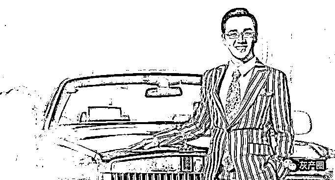
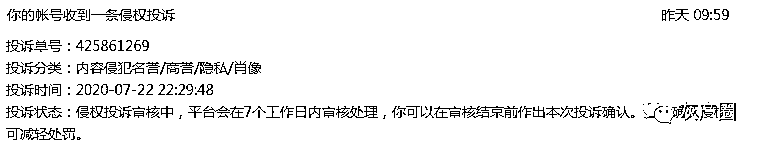

# “是的，我被成功学大师举报了！”

> 原文：[`mp.weixin.qq.com/s?__biz=MzIyMDYwMTk0Mw==&mid=2247501803&idx=1&sn=d7d9a6e02fa890a625488949e2ef3b54&chksm=97cb0cd3a0bc85c5be51c9020de477f5d2a5a23d8c74f2b5a14573d8b079357513d553a73db6&scene=27#wechat_redirect`](http://mp.weixin.qq.com/s?__biz=MzIyMDYwMTk0Mw==&mid=2247501803&idx=1&sn=d7d9a6e02fa890a625488949e2ef3b54&chksm=97cb0cd3a0bc85c5be51c9020de477f5d2a5a23d8c74f2b5a14573d8b079357513d553a73db6&scene=27#wechat_redirect)

**点击上方蓝色字体免费订阅“灰产圈”**

**正如标题所述，是的，没有错！大声确认说：YES！**

**我被成功学大师：姬剑晶 举报了？！更确切地说是他的合伙人：胡某（xiao）某(lin)！**

************

******一切都是那么的突然，2020 年 7 月 22 日 22 点 29 分 48 秒，后台显示一条信息显示被投诉举报了，点开一看，是因为这篇文章******

****《[岑怡诺 | 李白斗酒诗百篇 , 神童日作两千首 ！](http://mp.weixin.qq.com/s?__biz=MzIyMDYwMTk0Mw==&mid=2247501289&idx=1&sn=2327c9f55b89fd16abdc7132b99a94d5&chksm=97cb0ed1a0bc87c7582032715c96b0fbaf51ce241e6d7e318b49b602685be1f0a37fb88da883&scene=21#wechat_redirect)》****

******为何岑怡诺的文章被姬剑晶合伙人举报？关他啥子事嘛？****** 

******简单讲逻辑是这样滴：******

******岑怡诺花了 18 万拜师成功学导师姬剑晶，而姬剑晶作为岑怡诺师傅又是胡某某的合伙人（法人），那么岑怡诺的新闻也就间接跟胡某某有关了，再明白一点，就是某些负面信息同时影响胡某某（zhuanqian）了,这样就捋清了！******

******我不禁感叹： ******

******地狱空荡荡，“大师"在人间！小丑在殿堂,“大师”在流浪！******

*****0*1**********事件回顾****

******** 

****有些事，努力一把才知道成绩，奋斗一下才知道自己的潜能。花淡故雅，水淡故真，人淡故纯。做人需淡，淡而久香。不争、不谄、不艳、不俗。 淡中真滋味，淡中有真香。心若无恙，奈我何其；人若不恋，奈你何伤。痛苦缘于比较，烦恼缘于心。 淡定，故不伤；淡然，故不恼。欲望是壶里沸腾的水，人心是杯子里的茶，水因为火的热量而沸腾，心因为杯体的清凉而不惊。当欲望遇凉，沉淀于心，便不烦，不恼。 不要嘲笑他人的努力，不要轻视他人的成绩。每个人的价值不同，无需对任何人不屑。在你眼中的无用价值，未必真的无用。不轻一人，不废一物。活不是战场，无需一较高下。人与人之间，多一份理解就会少一些误会；心与心之间，多一份包容，就会少一些纷争。 不要以自己的眼光和认知去评论一个人，判断一件事的对错。不要苛求别人的观点与你相同，不要期望别人能完全理解你，每个人都有自己的性格和观点。 人往往把自己看得过重才会患得患失，觉得别人必须理解自己。其实，人要看轻自己，少一些自我，多一些换位，才能心生快乐。所谓心有多大，快乐就有多少；包容越多，得到越多。 而光脑，则是梅克斯博士在研究矩阵模拟系统程序的时候，意外发现灵能晶石的特异之处，不同于光电等任何物质和能量，灵能晶石蕴含的能源本质类似于精神这种虚无飘渺的东西。****

****   命一场， 或喜或悲，都是一次洗礼，一次岁月的历练；或浓或淡，都是一抹绽放，一抹美丽的风景。春风得意时，不必张扬骄傲， 淡定从容一些，没有人能永远一帆风顺。一切得与失、隐与显，无非风景与风情。淡看世事，静对春花秋月，即使遭受别人的不看好和挤兑，不必辩解讨好，云淡风轻一笑，用时间来证明自己。 何必追慕名车香宴，我只需清茶淡饭，爱相随，情也真。该来的自然来，会走的留不住。不违心，不刻意，不必太在乎，放开执念，随缘是最好的生活。 不管这世上会有多少寒凉，依旧会有不一样的烟火。遇山过山，遇雨撑伞，有桥桥渡，无桥自渡，淡若清风，含笑走过。人世喧嚣，名利来往，放下浮躁，心静自安。淡淡的岁月，淡淡的心。人生的味道，淡久生香，安之若素，人淡如菊。 淡淡地做人，淡淡地生活，淡淡的日子，每天都散发着淡淡的芳香。在某种程度上来说，机甲就是驾驶者，驾驶者就是机甲。而光脑的运算能力，也足够负担机甲运行时所需要的全部运算。****

****   但由于灵能的特质，导致机甲对驾驶者的精神强度要求较高。同时也出现了驾驶机甲的精神强度和精神契合度的问题。精神契合度是天生的，也是几乎恒定的，契合度越高，那么驾驶者与机甲的协调度也就越高。机甲的动作也更快更精准，更接近驾驶者使用自己肉.体的层次。世上最酸的感觉不是吃醋，而是无权吃醋。吃醋也要讲名份，和他相爱的是另一个人，他的醋也就轮不到你吃，自有另一个人光明正大地吃醋。原来，吃不到的醋才是最酸的。 最难过的，莫过于当你遇上一个特别的人，却明白永远不可能在一起，或迟或早，你不得不放弃。 曾经以为，伤心是会流很多眼泪的，原来，真正的伤心，是流不出一滴眼泪。什么事情都会过去，我们是这样活过来的。****

****   一切都像刚睡醒的样子，欣欣然张开了眼。山朗润起来了，水涨起来了，太阳的脸红起来了。 小草偷偷地从土里钻出来，嫩嫩的，绿绿的。园子里，田野里，瞧去，一大片一大片满是的。坐着，躺着，打两个滚，踢几脚球，赛几趟跑，捉几回迷藏。风轻悄悄的，草软绵绵的。 桃树、杏树、梨树，你不让我，我不让你，都开满了花赶趟儿。红的像火，粉的像霞，白的像雪。花里带着甜味儿；闭了眼，树上仿佛已经满是桃儿、杏儿、梨儿。花下成千成百的蜜蜂嗡嗡地闹着，大小的蝴蝶飞来飞去。 野花遍地是：杂样儿，有名字的，没名字的，散在草丛里，像眼睛，像星星，还眨呀眨的。 “吹面不寒杨柳风”，不错的，像母亲的手抚摸着你。风里带来些新翻的泥土的气息，混着青草味儿，还有各种花的香，都在微微润湿的空气里酝酿。 鸟儿将巢安在繁花嫩叶当中，高兴起来了，呼朋引伴地卖弄清脆的喉咙，唱出宛转的曲子，与轻风流水应和着。牛背上牧童的短笛，这时候也成天嘹亮地响着。 雨是最寻常的，一下就是三两天。可别恼。看，像牛毛，像花针，像细丝，密密地斜织着，人家屋顶上全笼着一层薄烟。树叶儿却绿得发亮，小草儿也青得逼你的眼。 傍晚时候，上灯了，一点点黄晕的光，烘托出一片安静而和平的夜。在乡下，小路上，石桥边，有撑起伞慢慢走着的人，地里还有工作的农民，披着蓑戴着笠。他们的房屋，稀稀疏疏的在雨里静默着。 天上风筝渐渐多了，地上孩子也多了。城里乡下，家家户户，老老小小，也赶趟儿似的，一个个都出来了。舒活舒活筋骨，抖擞抖擞精神，各做各的一份事去。“一年之计在于春”，刚起头儿，有的是工夫，有的是希望。 春天像刚落地的娃娃，从头到脚都是新的，它生长着。 春天像小姑娘，花枝招展的，笑着，走着。 春天像健壮的青年，有铁一般的胳膊和腰脚，领着我们上前去。 精神强度到达一定程度后可以提高驾驶者与机甲的契合度 1%—5%，但也仅止于此。                            往日时光，有那么一种情结，经年难解，有那么一件事，想做却没有勇气做，有那么一个人，自己没有笃定的意念追随。历历种种，都成为今天时而感叹的源由。然而，当机会摆在面前，依然会顾虑重重。当那个深恋过的人再次遇见，却一样没有勇气做什么！沧海桑田的变幻，并不是一句：物是人非，可以解释的了的！时过境迁的无奈，也不是一句：此情可待成追忆，能够诠释的心境！或许，留在光阴深处的，总是最珍贵，念念不忘的，总是最美好吧！ 我们时常在别人的故事里，一遍遍温习着自己曾经的心境，而所有有关年轻的记忆，都带着迷人的醉意。 茫茫大地的影子，似流光拉长的叹息，路旁夭折的情意，洒泪，为祭。太多想做的事、想见的人，没有固执到底，都丢在了旧年的风里；记下那人最初的样子，坚持着最真的自己。不言不语，将一扇往事的门，轻轻关上。 人生中经过的每个人，或温暖，或凉薄，都感恩于一场交集的缘分。留一抹绿意在心底，回眸，一个纯粹的微笑，便是一朵盛大的春天。做个不算糊涂的人，明了一些善意的委婉，也会发现流动风景的美丽。时间是一切生命哲学的定理，羁绊与遗憾都将散落尘埃。从未预约的前程，永恒着心上的希望与光明。 有生之年，不贪求事事皆如人意，不奢念所有想要的都得以圆满，只希望，生命中的每分每秒，都不曾浪费便好。每一天醒来，做着自己该做且喜欢做的事，每一段空闲，陪着自己该陪且珍爱的人；拈花惹草的心情，侍奉一些爱好情趣，品茶捧书的雅致，供养心灵与思想，如此，便不辜负命运优渥相待的静好时光。 光阴旧，覆水难收，再回首，敬往事一杯酒，说好，永不回头。向前走，穿过一段岁月的风烟迷雾，走到山清水秀……****

******想让你的孩子成为岑怡诺一样的神童吗？******

****只要 20 万！就能让你的孩子站在台上对 2000 人做演讲，给一群中年企业家做培训，实现自己 3 倍、5 倍、50 倍的收入，走上人生巅峰……****

****16 岁女神童刷爆朋友圈后，跟大众普遍质疑“2 年出 3 本书，日产 2000 首诗”不同，无数家长关心的是这个神童是谁制造的？****

********

****** 详细事件请看：******

******[“女神童”岑怡诺背后的成功学大师：总裁班 19800 元，20 万当终身弟子](http://mp.weixin.qq.com/s?__biz=MzIyMDYwMTk0Mw==&mid=2247501612&idx=1&sn=9fa9755d3206cfde8a8a3178f251ac8f&chksm=97cb0c14a0bc8502216f4c4ff3384a4c0f0d5b9b67440d76064bb083c039f223aa175caedbc9&scene=21#wechat_redirect)******

************

****澎湃新闻，凤凰网，新浪网均同步报道****

******果不其然，经过调查后得知，岑怡诺意外出名后，当初借了 18 万参加的培训机构（轩辕国际）电话被打爆，“总裁班”学费更是涨到了 19.8 万，谢绝一切还价！******

****无数家长和企业家趋之若鹜，急于把自己和孩子送上神童和天才的生产线……****

*****0*2**********起底 轩辕国际****

******** 

****这是一家名为“轩辕国际产业集团”的公司，满满溢出的传销味，还有一个更接地气的名字 “上海剑红文化传播有限公司”，他们的产品就是一节节的培训课，目标是成为培训界的海底捞，无数“神童”和“天才”就是这么诞生的。****

**** ****

******通过企查查查询“上海剑红文化传播有限公司”现在法人“王雷”******

****涉及四起开庭公告一起法院公告三项行政处罚，更为惊奇的是法人“姬剑晶”7 月 17 号也就是新闻爆出后悄悄地把法人变更成了“王雷”（最终受益人变更 从“姬剑晶，范俊红”变更为“王雷” 实际控制人变更 从“姬剑晶”变更为“王雷），至于为何，自己想想吧。****

************

******再说胡某某，也就是举报我们的人，通过企查查可查询到一家公司名为“姬剑晶（上海）科技有限公司”曾用名“****薇成客（上海）科技有限公司****”法人：胡笑林******

************

******通过企查查信息关联到官网：****http://www.jianjixingshi.net/******

******官网名为：见姬行事******

************

****通过“新闻中心”可以看到这个网站基本就是为姬剑晶做宣传的网站：****

************

************

************

****正如成功学导师一贯宣传手法，各种名人合影 ，不乏某些商业大佬，各类学员见证，学员感想，会议宣传。****

****像极了我在趣头条看到的兼职赚钱广告。****

************

****上图来源：中新经纬关于趣头条的新闻报道****

******来吧，展示！正式介绍一下，老板名叫“姬剑晶”**，按他的说法，自己有一段十分曲折的经历，几乎每次都会在他的演讲中被重点提及。**2008 年创业失败负债 20 万，在找不到方向的时候，他遇到了自己的人生导师，号称“亚洲销售女神”的徐鹤宁，借此结识了“中国成功学鼻祖”陈安之，才有了今天的成功**。**** 

******我们从岑怡诺的演讲中，可以轻易找到高度一致的经历**：****

****家中负债累累，自己无心上学，12 岁就“觉得失去了生活的方向”，直到一个名叫“姬剑晶”的男人出现，父亲举债 18 万支持自己追随其学习，一年后便开始“成功”，还准备今年买玛莎拉蒂。一次演讲中，岑怡诺说起这段经历，甚至激动的跪在了台上。****

*****0*3**********姬剑晶与陈安之****

********

******算下来，姬剑晶得管陈安之叫师公，而陈安之已经是岑怡诺的师祖了。******

******他们的故事大同小异，只要肯交钱跟他们学习，草根都可以变富翁，更何况其他有钱人！******

****但陈安之的徒弟们，可谓是“青出于蓝而胜于蓝”，不仅“取其精华去其糟粕”，而且名头更响，场面更大，牛皮吹的一个比一个无底线。****

****1、陈安之自诩为亚洲最顶尖极“演说家”和“世界成功学权威”，干过 18 个职业，21 岁银行存款为 0，25 岁设立训机构创业，2 年后成为亿万富翁，自称是“以最短的时间帮助最多人成功”的慈善家。****

******姬剑晶自诩为“亚洲首席创业导师”**，旗号是“帮助 1 亿家庭过上高品质生活”，**自称 3 年开上劳斯莱斯，5 年投资翻了 100 倍，连巴菲特和盖茨都为他推荐**，创立的品牌同小米、格力一同被评为亚洲品牌 100 强，这些当然都无从查证。****

********

******2、陈安之那会没有多少大旗和虎皮可以拉扯，但他的徒子徒孙却将这一招发扬光大。******

****参加一场巴菲特股东大会，就可以说自己受到巴菲特的邀请。****

******** 

****有了企业家的合照，就能比肩商业大亨。****

******** 

****有娱乐圈名流跟自己合影，不光能让明星给你代言，更能证明自己有着神通广大的高端人脉圈子。****

******** 

****3、陈安之有百人生日会，姬剑晶就能搞出千人生日会，而且还能邀请到“世界第一演说家吉姆·卡斯卡特”等一众普通人都没听说过的知名人士站台。****

****反正钱不是问题，一场会下来参会费、报名费就赚回来了。当然，陈安之搞的跪拜仪式，弟子们基本都摒弃了，也不会颁发什么终极弟子牌匾之类容易给舆论媒体留下把柄的东西。当然，自己出的书不算。****

****4、但走向“成功”的方法都一样，那就是先交钱成为他们的学生或弟子****

****然后再拉更多人进来购买课程拿提成，到头来才露出了传销的本质。终极弟子的门槛比较高，至少几十万起步，不轻易接纳，绝大多数都是成为姬剑晶的学生，分三个等级，普通三天体验班 998 元，销售演讲班 9800 元，总裁班 19800 元，而只有成为总裁班学员后，才能加入“劳斯莱斯俱乐部”，岑怡诺当初就是加入了最高级别的总裁班。****

****但所谓培训课，无非是用各类名人的励志故事打鸡血，逼迫交了钱的学员上台放开自我演讲，自己人客串“成功人士”来忽悠，最终能否成功的衡量标准，就是你能拉到多大金额的单子，他们赚不到钱，你谈何成功？****

********

****一句话，传销里有的他们都有，传销没有的，他们也有。在这些“成功学大师”眼里，我们网上看到传销手法和毒鸡汤，不过都是渣渣。****

*****0*4**********成功学与精神传销****

************ 

******说白了，这就是一种“精神传销”，却比传销更为凶残。******

******去年 11 月，人民日报曾痛批陈安之的成功学骗局，揭露了一起“成功学大师”把人“培训”至破产的悲剧**。****

******** 

****两个原本生活殷实的人，偶然间接触到“陈安之成功学培训”，被其巧言蛊惑，开始幻想所谓真正的成功，从 1000 多块钱的培训费开始，一步步走上变卖财产、抵押房产也要追随“大师”的不归路。其中一人交了 31 万才成为“入门弟子”，另一个交了 108 万，成为“终极弟子”，他们正准备一步登天的时候，才幡然醒悟这都是彻头彻尾的骗局。****

******无独有偶，去年 12 月，央视同样曝光了一起以“教练技术”为名的成功学骗局“众鼎商学院”，大批企业家花钱挨骂。******

******** 

****一位企业老板花了 70 多万的培训费，把自己家人、亲戚、朋友都“感召”进来，方才醒悟这场骗局的可怕，调查表明，高达 47%的学员在培训完后选择了离婚，有些人身体致残，还有人住进了精神病院……****

******岑怡诺神童的真相被揭露后，不少人觉得这种事应该没人会信了？******

****但事实却是，咨询报名想参加培训的人非常火爆，姬剑晶最近光是在上海就组织了两场培训。一场是 7 月 17-20 日，然而据实地考察发现，这场培训被紧急取消，理由是“受疫情影响”。****

******** 

****另一场是 7 月 24-25 日，目前仍在宣传当中。****

********

****这就是一个愿打，一个愿挨，成功了，就是人上人，失败了，就是自己学业不精，也怪不得老师，当然老师也不可能会承认。****

******这样也就能理解，为何时至今日，几十年前都被揭晓的“蒙眼识字”、“量子波动速读”，还有中国家长上当。******

*****0*5**************地狱空荡荡，“神童"是后浪？********

************ 

******有陈安之、姬剑晶这样的“大师”在，岑怡诺一定会常有，但天才从来都不常有。******

******神童不是复制品，天才更不是，在这些大师指导下能够成功的，也只有这些大师自己！******

******如果听几次课程就能随随便便成为神童**，继而成为某个领域的专家大拿，中国这些靠勤学苦读十几年才获得今天成就的马云、马化腾、刘强东们，岂不都成了蠢货？****

******如果只是上了几堂所谓的培训课，就能跨越阶层**，实现百倍财富增值，那些大师和导师们，何不把自己先培训成巴菲特、盖茨，哪里还用得着这么冒险赚钱，搞不好还把自己送进去。****

******总之，岑怡诺的所谓成功，永远不会让你成为第一个你，顶多只会成为第 N 个姬剑晶，但只要还有逼自己孩子成为“神童”的家长在，“大师”就不用担心没人买单。******

******最后，以成功学大师姬剑晶个人“宣传片”结尾吧？！******

 ****[`v.qq.com/iframe/preview.html?width=500&height=375&auto=0&vid=w03455bxzwg`](https://v.qq.com/iframe/preview.html?width=500&height=375&auto=0&vid=w03455bxzwg)**** 

********

****← 向右滑动与灰产圈互动交流 →****

**************点击****阅读原文****加入灰产圈高端社群******

********