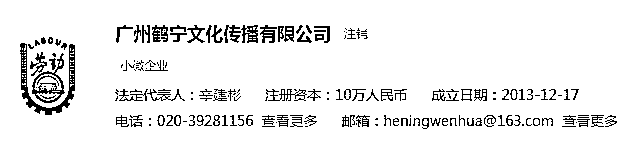
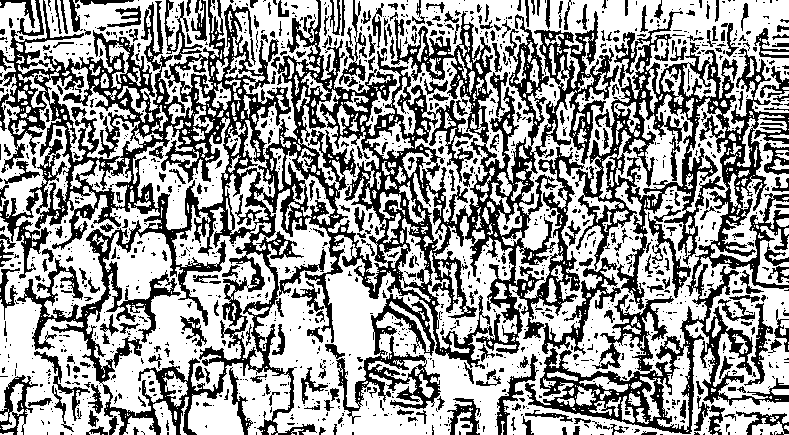

# 一代不如一代的成功学大师

> 原文：[`mp.weixin.qq.com/s?__biz=MzIyMDYwMTk0Mw==&mid=2247501859&idx=2&sn=f4defdf9608a7e1ae03dbfa79be17e00&chksm=97cb031ba0bc8a0ddfa13258c7e29ad5d016b8ce38fb44d9a311c8c3d6c090e65bf8ffed6ef9&scene=27#wechat_redirect`](http://mp.weixin.qq.com/s?__biz=MzIyMDYwMTk0Mw==&mid=2247501859&idx=2&sn=f4defdf9608a7e1ae03dbfa79be17e00&chksm=97cb031ba0bc8a0ddfa13258c7e29ad5d016b8ce38fb44d9a311c8c3d6c090e65bf8ffed6ef9&scene=27#wechat_redirect)

**点击上方蓝色字体免费订阅“灰产圈”**

从那位 16 岁“日作诗 2000 首”的天才少女岑某某，到美国已过世的成功学之父吉米·罗恩，中间只要通过 4 个人就能建立起联系。

岑某某—姬剑晶—徐鹤宁—陈安之—安东尼·罗宾—吉米·罗恩。在这串人物关系链上，连接号左边的都是右边的门徒。**他们拥有一个共同的名字：成功学大师。**

伟大的成功学就这样以师徒制的模式代代传承，让一代又一代人为之疯狂。

**“世界华人成功学第一人”**

2008 年，疯狂英语创始人李阳担任了一场特殊活动的翻译。美国最有名的成功学大师安东尼·罗宾第一次来中国演讲，应自己的中国徒弟、“世界华人成功学第一人”陈安之之邀，不太清晰的视频记录下了安东尼从私人飞机走下来的场景。

演讲在一个大型场馆举行，现场就像明星演唱会，所有人都被点燃。

李阳是见过世面的人，对这样的阵仗再熟悉不过。早在 1998 年，他就在故宫太庙大殿前举办了一场“疯狂英语故宫万人大演讲”，对着近万名疯狂追随者大喊：

*“学英语是为什么？”*

*“Make money”！*

李阳曾在公开场合承认，疯狂英语的根基就是“成功励志学”，他讲的很多话都受到陈老师的影响。2005 年，李阳带着自己的团队参加陈安之在深圳举办的训练营，评价为，“虽然之前看了那么多遍碟片和书，但没有像在课程现场，真能让人内心达到巅峰的状态。”

王朔曾为李阳《我疯狂我成功》一书作序，在序中毫不客气地说：*我见过这种煽动，那是一种古老的巫术，把一大群人集中，用嘴让他们激动起来，就能在现场产生一股排山倒海的力量，可怜的人也会顿时觉得自己不可战胜，这与其说是打气不如说是省事或说愚弄，中国的很多事都是这么办的，做一场梦，把所有问题解决掉。*

16 岁就出国读书的陈安之英语水平不亚于李阳。陈安之是台湾同胞，祖籍福建，16 岁被望子成龙的父母送到美国留学，被美国电视节目里流行的名人访谈故事搅得热血沸腾，在心里埋下成功的种子，4 年间换了 18 份工作，21 岁加入安东尼·罗宾的机构，全面学习如何取得成功。年纪轻轻的陈安之很快成为这里水平仅次于安东尼·罗宾的讲师。

陈安之说，他从老师那里学到的最重要的一句话是：*世界上赚钱的行业很多，但是没有哪一个行业比得上帮助别人成功和帮助别人改变命运更加有价值。*

90 年代，陈安之回国，立下宏愿：

*你知道为什么美国只有不到 300 年的历史却可以成为世界巨头吗？因为美国有成功学。我要把在海外学到的所有成功学知识，毫无保留地告诉给中国的每一个人，让中国在 21 世纪成为世界第一强国！*

先是在台湾，风生水起的传道工作因为被控非法集资而中断，随后辗转内地，投身于助力大陆同胞成功的事业。在央视《对话》节目里以“成功学专家”的身份教导马云“做人要谦虚”，大概是陈安之人生的高光时刻。

查看陈安之的各种宣传资料，不难发现他哄人上课有一套无懈可击的逻辑：

（1） 我从账户余额为 0，短短三年内成为亿万富翁；

（2） 总结出两个最浅显的道理，成功一定有方法，失败一定有原因；

（3） 将失败的原因总结为四个字：学习不够；

（4） 不够当然就要学，再告诉你，跟谁学比学习这两个字重要十万倍，那么跟谁学？当然是跟我。

钱就是这样来的。**成功学是时代的一场流行性感冒，传染性极强，又很难治愈。**

除了几千元的培训课程费，成为老师的“终极弟子”更让人心动。陈安之深谙“饥饿营销”之道，当气氛被推至最高点时，他往往乘胜追击，“如果想成为我的弟子，赶紧上台，我今天只收两三个（终极弟子）。”[2]成为入门弟子的价格是 20 万左右，私人订制的“终极弟子”“接班弟子”，费用高达上百万。

培训费和图书销售构成大师的两大收入来源。据陈安之机构 2012 年提供的数据， 他的成功学系列书籍在亚洲销量达到百万。

陈安之在演讲中总是频繁提起自己的美国老师安东尼·罗宾和师公吉米·罗恩，对两个人的故事信手拈来。在一个接近两个小时的授课视频里，他的节奏常常是：每一条成功法则后面，紧跟一个老师安东尼的励志故事，然后跟观众互动：那么我们是不是该为他鼓掌？然后进行到下一段。

跟陈安之合影的国内外各界名人数不胜数。从美国前总统小布什、奥巴马，影视圈当红明星等等。**如果用其师公吉米·罗恩的那句名言，你身边 5 个人的平均水平就是你的水平，那么陈老师的水平确实没几个人能比得了。**

他在宣传文案中提到，亚洲音乐天王王力宏，经常来自己的私人会所请教问题，通过自己的指导，他 2012 年成功举办了世界巡回演唱会《火力全开》，并且十分成功！

2019 年，因为一则“118 万的成功学培训，几乎令我家破人亡”的新闻，陈安之被《人民日报》点名批评，随后销声匿迹。但其个人微博保持着更新状态，风格依旧是“正确的废话”。

**神仙眷侣**

“亚洲销售女神”徐鹤宁是陈安之的得意门生。**她在恩师陈安之门下不仅收获了成功，还找到了志同道合的人生伴侣。**

《徐鹤宁写给徐嘉庆，我生命中最伟大的男人徐嘉庆》一文中，女神不吝表露自己对丈夫的崇拜，称对方做出了“令人震撼的生命突破”。她提到自己当年是如何被这个男人打动的：

最后，徐鹤宁总结自己取得成功的两大要素：一是选对了人生教练，二是嫁对了老公。也可以说是，**学得好，嫁得好。**

一份资料显示，1979 年生的徐鹤宁于 2001 年 3 月在长春参加陈安之的超级成功学训练营，次年以吉林地区冠军身份加盟陈安之国际训练机构，南下深圳。在深圳，“陈安之老师亲自指导下，进步神速，于 2002 年 8 月份在广州置业安家，随后以一个小时成交 104 批顾客的业绩打破亚洲销售记录。连续十六个月获得月销售冠军。”

徐鹤宁的“名头”众多：亚洲销售女神，世界华人冠军俱乐部主席，中国财富女人俱乐部主席，听起来光鲜亮丽，实则经不起推敲：你从来不知道“销售女神”销售的到底是啥，中国财富女人俱乐部在网上了无痕迹，至于世界华人冠军俱乐部，天眼查搜索出来的结果是这样的：

一家以徐鹤宁名字命名的公司，目前已注销。当然你可以说是巧合。

“出师”后的徐鹤宁于 2009 年前往上海创办自己的公司，也可以说是去帮恩师陈安之的忙。早在 2006 年，陈安之就将根据地从深圳转移到上海，将上海视为自己下一个重点“帮扶”的城市。

从那篇文章不难看出，徐鹤宁和丈夫徐嘉庆确立关系时，她的名气和业界地位远在丈夫之上。但她相信自己慧眼识珠，“他是一匹黑马，他当时还没有夺得冠军，是因为他的潜力还没有真正发挥出来，他的意识还没有被激发，他心中的巨人还没有被唤醒。但这只是早晚的事，因为能沉住气的人必定能成大器的。”

徐鹤宁没有看走眼，她嫁对了人。徐嘉庆不会让妻子失望，更没有给老师陈安之丢脸。很快**，他以“中国走火第一人”的名号出师了。**

所谓“走火大会”，是让人们光着脚，从高温的木炭火路上走过去，火道一般长 10-15 米，以激发人类的潜能，克服恐惧心理。（这确定不是一个杂技团吗？）这个项目的创始人正是安东尼·罗宾，也成为其培训课程的保留节目。

在陈安之的众多弟子中，徐嘉庆独辟蹊径，并没有选择像师父那样全面复制前人的所有经验，而是取前人精华之万一，做深做精，将“走火大会”这一个项目发挥到极致。

他的个人简介是这样的：

*徐嘉庆老师是中国教育培训界唯一开创了“上刀山，下火海”全新训练模式，《改变命运 走火大会》不是暂时的激励，而是创造永久改变，上课学员突破高达 85.5%以上。*

“上刀山，下火海”，听起来不像一所培训学校，俨然一个杂技团。

这个走火项目很快“走火”。2012 年 9 月的一则新闻曝出，扬州有单位组织员工接受一家培训机构开发的“拓展训练”，**在走“火道”环节中，7 名训练的员工脚底被严重烧伤，后送苏北医院烧伤整形科接受治疗。**

那家培训机构叫“思八达”，公司创始人刘一秒当年曾与李阳一起赴美在安东尼·罗宾的机构进修，回国后将佛法禅学与国外那一套调和勾兑，成功开创了自己的培训路子，在国内也备受追捧。

这些年来，夫妻二人以“培训界的明星伉俪”身份出现，羡煞旁人。2015 年，徐鹤宁官方账号《亚洲销售女神徐鹤宁与徐嘉庆老师 4000 人生日会现场 》一文，高度总结了这对夫妻的光辉一生，可歌可泣：

**神秘的劳斯莱斯**

陈安之是安东尼·罗宾的第一名，徐鹤宁是陈安之门下第一名，姬剑晶是徐鹤宁门徒中的第一名，天才少女岑某某是姬剑晶弟子中的第一名。

**正是这些杰出的第一名，维持着成功学香火延绵不绝。**

姬剑晶大学毕业后就加入徐鹤宁的公司，成为“金牌销售”。在公司宣传单上他的名字总能跟在老师后面。**他的 title 是“亚洲服务成交天王姬剑晶” 。**姬剑晶的个人宣传片里提到，他是全亚洲唯一打破乔·吉拉德世界销售记录的人，并得到乔吉拉德亲自颁发的亚洲销售之神奖杯。

乔·吉拉德是美国著名推销员，因从 1963 年至 1978 年共推销出 13001 辆雪佛兰汽车，而被载入吉尼斯世界纪录。**但正如我们不知道“销售女神”销售了什么，姬剑晶销售的是什么，我们同样无从知晓。**

我们可以知道的是，姬剑晶开着一辆劳斯莱斯。但很难确定这台劳斯莱斯是否在他名下。不妨看看“老中青”三代对这台劳斯莱斯的描述：

*徐鹤宁提到爱徒时说：姬剑晶只用了短短两个月的时间，就变出了人生第一台劳斯莱斯，他也是全中国最年轻的一位，开出劳斯莱斯的超级说服力演说家；*

*陈安之的说法是：有一天姬剑晶老师付给我 100 万人民币，请我教他怎么开出劳斯莱斯，我教他两次，两个半月，姬剑晶老师就开上了劳斯莱斯。*

这语焉不详的说法，听起来就像陈老师教姬老师学开车，学了两个月，学费 100 万。哪家驾校学费这么贵？

2013 年，开上劳斯莱斯的姬剑晶成立了自己的公司——上海剑红文化传播有限公司。“剑”与“红”，分别取自自己和妻子名字中的一个字。

网上可以找到一个标题为《穷小子也能拥有千人婚礼》，即姬剑晶与妻子的婚礼剪辑录像。与其说这段视频见证了一对爱人的诞生，不如说是姬剑晶本人的大型宣讲现场。毫不意外地，其恩师徐鹤宁担任了这场婚礼的司仪。

看着自己教出来的最优秀的学生离开自己去创业，这当然不是一件令人伤心的事，反而意味着，成功学大师们离自己的梦想越来越近——相比单打独斗，协同合作的方式有机会“帮助”更多。

姬剑晶成立自己公司那年，与陈安之、徐鹤宁师徒三个“第一名”合体，策划了一场主题为“如何成为亿万富翁”的全国巡回论坛。大概是出于回馈家乡的目的，始发站选在陈安之的老家福州。

最近备受争议的那位天才少女岑某某，即加入了姬剑晶的培训机构，因此“改变了命运”。**她的梦想是买一辆法拉利，这充分体现了尊师重道的精神——毕竟自己的老师姬剑晶，开的是劳斯莱斯。**

这位 16 岁少女在演讲台上惊人的**下跪之举**无疑也是姬剑晶传授的。

2013 年，姬剑晶参加《超级演说家》节目，讲自己小时候去书店偷书，被老板发现，回到家，父亲让他跪下。**讲到这里，他扑通一声跪在舞台上**，声情并茂地讲自己跪了整整一夜，“我的腿肿了，泪也流干了，第二天早上连腰都直不起来”。

敢情这些培训机构同时还是马戏团、驾校、戏剧学院，并承接大型婚礼生日会策划项目、以及视频制作等业务。

岑某某视频在网上曝光后，姬剑晶旗下公司被扒出，曾在 2018 年被上海市松江区市场监督管理局罚款 50 万元，没收违法所得 145 万元，处罚事由为“传销”。

**当然，成功学大师不会消失，**他们的繁殖路径是：跟大师学习，然后自己开公司，培养弟子，弟子出师，再开公司，子孙无穷匮也，互相帮扶，共同为实现“成功学强国”而奋斗；但**成功学的堕落，也是从“大师”们一代不如一代开始的。**虽然许多人对成功学深恶痛绝，但也不得不承认，成功学与成功学之间也有高下之分。

上世纪七八十年代，安东尼·罗宾向成功学之父吉米·罗恩求教的经历，还能作为一个像样的故事流传下来：

*安东尼因为没有钱，上不起培训课，请求吉米·罗恩将费用降低一些。罗恩告诉他：“如果你能够找到这一笔上课的费用，这比我教你的任何成功方法都更为可贵，因为你在向不可能挑战。”*

几十年以后，姬剑晶之流连包装都懒得包装，**他们能教给徒弟的，只有下跪了。**

参考资料：

[1].《“疯狂英语”李阳与“成功学”陈安之的大碰撞——疯狂英语创始人李阳谈“超级成功学”》 来源：陈安之博客

[2]. 《成功学大师和他的终极弟子：拜师费上百万，有人借高利贷》 来源：《消费日报》  作者：王彦入

[3].陈安之、徐鹤宁、徐嘉庆官方账号、博客

作者：彭梁洁   来源：商业人物（ID：biz-leaders）

← 向右滑动与灰产圈互动交流 →

**点击****阅读原文****加入灰产圈高端社群**

