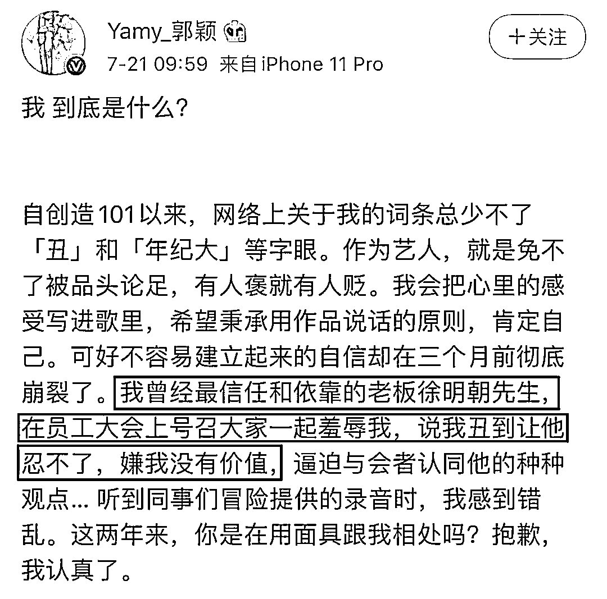
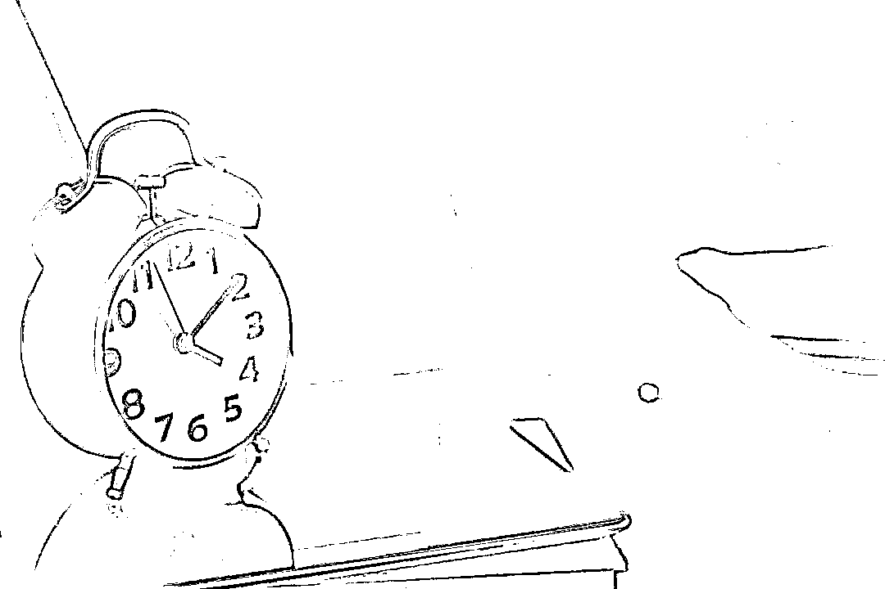

# 你永远也叫不醒一个被 PUA 催眠的人

> 原文：[`mp.weixin.qq.com/s?__biz=MzIyMDYwMTk0Mw==&mid=2247501859&idx=3&sn=ffa81dc6b75d9df558b1b1053e099fd7&chksm=97cb031ba0bc8a0da8b3ffe3597770ff33cc0704a4f4d3f9a8e82e79d5d6101a0c73267d9c93&scene=27#wechat_redirect`](http://mp.weixin.qq.com/s?__biz=MzIyMDYwMTk0Mw==&mid=2247501859&idx=3&sn=ffa81dc6b75d9df558b1b1053e099fd7&chksm=97cb031ba0bc8a0da8b3ffe3597770ff33cc0704a4f4d3f9a8e82e79d5d6101a0c73267d9c93&scene=27#wechat_redirect)

**点击上方蓝色字体免费订阅“灰产圈”**

“我到底是什么？”

今天上午 9 点 59 分，前火箭少女成员 Yamy 在微博上发出喟叹。

她公开了一则所属经纪公司“极创引力”的员工大会会议记录，时间 3 分 11 秒，老板徐明朝当着同事的面，说她“非常丑！很丑！超级丑！是你们所有人里面最丑的！”继而说她装时尚，穿的像刺猬。“有病！不会唱歌！之前就是个伴舞的……”

长达 2 年时间，徐明朝对 Yamy 的态度在矛盾的两极之间反复摇摆，一会儿说她有优势，一会儿说她不值得，一会儿说绝对支持她，一会儿说要让他高兴，再提需求。这种周而复始的打压指责让她陷入极度自我怀疑和低落，“如果有问题，那一定是我的错。整天活在自我怀疑中难以自拔。”

她发了解约函，被徐明朝威胁：不要作死。

由 Yamy 的遭遇，微博上引发一场关于“职场 PUA”的大讨论，有网友感慨：太感动了，职场 PUA 终于被重视起来了。“没有经历过的人永远不知道，无论怎么和别人讲，到头来都会觉得你矫情！”

但依然有很多人，陷在 PUA 的沼泽里，视“打压”为磨炼，自以为老板的严苛，都是“为我好。”

前某互联网巨头程序员刘白就有这样的困惑。好几名同事都来提醒他被 CEO 给 PUA 了，他不信，用不容置喙的语气回应：我和 CEO 都是理性、成熟的人。“他成就了我，我成就了他！”

刘白没想到自己被上司狠踹一脚的影响这么大。

这是 2019 年 8 月的一个下午，5 点左右，部门会议刚结束，消息就被扩散出去，随后全公司的同事都知道了——CTO 刘白因为服务器出现 BUG，没及时排查出来，被 CEO 又骂又踹。

“怎么能踢人呢！”伴随着震惊，同事们不约而同为刘白鸣不平，在小群里集体声讨 CEO：过分！

CEO 的打人历史也在线上线下聊天中，一点点被“挖”出来：总是一脸凶神恶煞，同事不止一次看见他打人；CEO 对刘白不止脚踢，还动过拳头；他之前还打过另一位同事，那位同事辞职走人了……

大家越聊越气，特别是在看到刘白被欺负后还一脸淡然，没有出现任何生气、反抗的举动，继续埋头工作。他们的心里更是堵得慌。

同在一个屋檐下，同事们的情绪风暴，刘白并不知道。第二天一早，他听到消息，一位部门同事申请离职，下午就离开了公司。这名同事刚入职不到一周，昨天下午开会前还一切正常。不久后，又有一名同事选择离职。交接当天，CEO 一进办公室大门就摔了电脑，当着所有同事的面警告这名离职同事：最好好好交接，否则背调不会说一句好话。

这位同事被气哭了。刘白在一旁帮忙找补，说 CEO 只是一时冲动说错话，“没有坏心眼。”还以过来人身份提醒她：离职不应该冲动，“这样的性格，去别的公司也会有问题。”

听得对方哭笑不得，“我在好几个月之前就想着离职，哪里是冲动！”

这名同事没敢跟刘白说，因为亲眼看过他被 CEO 用拳头打，听同事说他被 CEO 用脚踹，以至于在办公室，看到 CEO 出现就心惊胆战，进公司第 3 个月开始胸疼，被医生提醒要保持好心情，“辞职是及时止损。”

从那个群情激愤的下午开始，公司接连出现裁员、员工辞职，老同事各奔东西，偶尔聚在一起聊天，谈到刘白都是心疼：这么优秀的人，留在公司是图啥？

这个疑问，在当事人刘白看来，不值一提。他说，CEO 在那次会议上的打骂，纯粹是对事不对人。“我当时是真的出了错。”

他再三强调，自己非常佩服 CEO，是抱着学习的态度和他共事，“做 CEO 的人应该有棱角，我们不希望和和气气把事情干黄了！”

刘白是 CEO 的“脑残粉”。

在他眼里，CEO 是英雄出少年。大一就创业，做过校园外卖，卖过农产品，组建过线下培训班，2 年赚下 100 多万。毕业后进企业实习，短短 3 个月时间，薪资从 2 千涨到 2 万。去过 3 家公司工作，薪资都是成倍增长，曾担任某少儿编程软件公司的 COO，“现在这家公司估值几十亿，如果他不出来创业，身家已经上亿了。”

虽然 CEO 是个 95 后，比刘白小 8 岁。但刘白说自己完全比不上他。不管是为人处世，还是事业成就，CEO 远比自己优秀得多，“比我认识的所有人都强！”

这似乎是脑残粉的常见语录。但如果说刘白是井底之蛙，那就太小看他了。

刘白曾在某互联网巨头工作了 4 年，身边的技术大牛不计其数。个人实力也不容小觑。2018 年 6 月从某互联网巨头辞职后，曾经的老领导们竞相给他抛来橄榄枝，邀刘白加盟，许他 CTO 的职位。

刘白统统没瞧上。

他认准了 CEO 这位年轻弟弟。不仅基于他所认为的“能力强”，也在于“熟悉”。如果去掉工作因素，刘白说，自己和 CEO 的关系像是没有血缘的兄弟。

刘白和 CEO 的哥哥认识 12 年，既是大学同学，也是铁哥们，2013 年北漂后，又是合租在一起的室友，关系一向深厚，也因此认识了 CEO，2017 年刘白买房前，3 个人还曾合租过一段时间。

刘白觉得，CEO 潜能巨大。两人第一次见面时，CEO 读大一，性格内向，不爱说话，刘白不得不没话找话。等到再见面，聊起天来，他就被 CEO 折服了，“口才非常好，思维特别活跃。”

2018 年年初，CEO 邀请刘白加入公司当合伙人。刘白毫不犹豫答应，迅速从某互联网巨头辞职。

因为这个决定，刘白的年薪从原先的 60 万缩减近一半，某互联网巨头的期权股份成了废纸，他不得不戒了烧钱的摄影爱好。

刘白不在意自己当下的经济损失，“创业公司的工资都不高，合伙人主要靠分红。”

他看好公司的未来，“公司刚成立，就收到 500 万融资，情势一片大好。”他坚信，拿到巨额分红是迟早的事情。CEO 有能力把公司做起来，他选对了人。

和 CEO 合作前，刘白早有创业的想法。

特别是在即将 30 岁的 2018 年年初，程序员的年龄压力让他一下子慌了神：“很焦虑 35 岁的时候，会成为公司的累赘。”

刘白也曾是某互联网巨头的“脑残粉”。

2012 年从济南某高校计算机专业毕业初期，刘白赶凌晨 5 点的高铁，从济南来北京参加某互联网巨头招聘会。那天下着大雨，应聘的队伍很长，刘白在排队间隙和别人交流技术问题，越聊越自卑，最后干脆放弃面试，当天坐火车回了济南。

在济南待了一年后，刘白北漂，应聘进海淀区一家国企当程序员，每天朝九晚五，下午四点半就在收拾东西准备离开。

大半年时间里，刘白经常去西二旗，在某互联网巨头大楼下闲逛。看着身边一个个人进出大楼，他按捺不住想进公司参观一次，却被保安一把拦下，要求拿出工牌，盯得他脸红。

那天的回去路上，刘白发了一条朋友圈：我多么希望我不是一个过客。

他心里憋着一股劲儿，2014 年 9 月，拿到某互联网巨头工牌的第一天，刘白大摇大摆从大门走进去，心里面激动非常，“看你们谁敢拦我！”

他进入某互联网巨头的方式颇为曲折。2014 年年初从国企离职后，刘白投了两家公司，一家是酷我音乐盒，一家是去哪儿网。刘白拿到了酷我的 offer，打算入职，而在入职前夕，一家科技公司 HR 联系刘白，请他去面试，刘白在网上查资料发现，这家公司是由某互联网巨头全资控股，刘白果断选择了后者。

幸运的是，入职半年后，这家科技公司被某互联网巨头收编，刘白因此成了某互联网巨头公司员工。 入职某互联网巨头后，刘白得到了想要的一切梦想成真，“每天和技术大牛共事，交流思考方式、学习方法、技术经验，技术水平进步很快。”

4 年时间，刘白的职别从 T3 升到 T6，年薪翻倍涨，每年评价都是 A，入职第一年拿了 6 个月工资的年终奖，第二年的年终奖也有 3.5 个月工资，第三年就凑足首付，在北京买房安家，结婚娶妻——这在他进某互联网巨头之前，压根就不敢想，“最初的规划是在北京待几年，去杭州或者济南定居生活。”

30 岁之前，刘白走上了世俗意义上的小镇青年成功之路。但旧的问题解决了，新的问题随之产生。现实摆在眼前：程序员吃的是青春饭。某互联网巨头的技术岗有 4 万人，早已形成稳定的金字塔结构，越往上越难走，整个公司内部，T10 级别的技术总监，双手就能数清。普通的程序员，混到 T7、T8 已是罕见，大多数人卡在 T6，就需要琢磨下半辈子的路。“这是大龄程序员不可避免的中年危机，升职加薪很慢，事业没有往上走的可能，一眼就看到了天花板。”

在刘白看来，大厂出来的中年程序员，找工作并没有优势，“圈子很狭小”，属于进退两难——大厂对年龄都是一样的态度，小公司又给不起他们想要的高薪。刘白的几位领导，在某互联网巨头都是 T7、T8 级别，无一例外在 35 岁左右选择了离职创业。

创业也成了刘白唯一能选的途径，“创业天花板比较高，可以让我持续向上。”

变化比计划更快。到 2018 年年初，刘白所在的部门被要求单独拆分成公司，这也意味着，他一直看重的某互联网巨头工牌即将失效。

其他部门的同事曾主动来找刘白，邀请他换部门，不至于分拆出去。这让刘白犹豫了好一会儿，想换，又觉得没什么意义，“只是多抱几年大腿而已。”

他感激某互联网巨头带给自己的一切，也理解大厂生存规则。再待几年，还是要出去创业，风险也更大。“年纪越大成本越高，不仅是思想和精力跟不上年轻人，万一创业失败了，经济风险会很大，对家庭来说，就是毁灭性的打击。”

在这个关键时刻，某互联网巨头的前任领导、CEO 接连向他发出邀请，刘白却选择了那位“弟弟”。他说，老领导们的专长都在技术方面，自己没有优势，“CEO 不懂技术，刚好和我互补。”

刘白自称是个非常理性的人，职业规划很清晰，而和 CEO 联手创业，就是他解决中年危机的策略。

他觉得：“同龄人中，我是比较幸运的人。”

“幸运”的背后标有价码。

2018 年 6 月，刘白以 CTO 身份入职，玩命儿工作。

在某互联网巨头工作时，他的工作节奏是在晚上 10 点之前下班，一周工作 5 天，平时周末加班还能调休。在这家创业公司，调休是不可能的，工作节奏升级为 007，没有休息日。

刘白经常会加班到凌晨 2 点回家，第二天早上 10 点，又准时出现在公司。偶尔项目堆积，会主动熬通宵解决。在刘白看来，自己的职位是 CTO，需要以身作则，技术部同事无论加班到多晚，自己都要陪着。

他也因此成了同事眼里全公司最辛苦的人。

刘白乐在其中。他说，自己享受这种忙碌的感觉，越忙越有安全感。

但同事不这样想，他们觉得刘白太辛苦，为 CEO 对刘白的做法忿忿不平。

因为前一天熬夜加班，刘白偶尔早上迟到一两分钟，CEO 会当着全公司人的面教训：“不管你晚上加班多晚，早上一分钟都不能迟到！”

因为部门工作没有及时做完，CEO 时常会跑到刘白的工位上兴师问罪，口出恶言之外，还会动起拳头。刘白每次都毫无反抗。

同事们在私底下交流时，忍不住怀疑：刘白是不是有把柄被 CEO 捏住了？“其他人被打了之后会辞职，白哥怎么什么反应都没有？”

刘白则一如既往帮 CEO 找补。他说，CEO 每次骂完他之后，私底下很痛苦，会和他主动道歉。他把 CEO 的火爆脾气归结于做事要求高。“很多事情就是被逼出来的。我还有很大成长空间，去匹配他的能力。”

他提到比尔盖茨喜欢“辱骂高管”的例子：比尔盖茨经常站在桌子上去骂高管，“蠢猪”、“混蛋”，把对方骂得一无是处，还会当众丢书砸高管。“正因为这种态度，他们把微软做起来了。”

刘白同样是一门心思想把公司做起来。但天不从人愿。从 2019 年 8 月开始，公司项目收缩，接二连三裁员，从原本的 40 多人缩减到十几人。同事经常听到两人吵架，CEO 骂刘白“你真没用！”、“我明天就发招聘信息，重新招人来。”

年初的疫情则让公司处境雪上加霜。刘白在 3 月被降薪，“比公司一般员工的收入还低”。刘白不愿意透露具体数字，只说能保障基本生活水平，但生活比起之前要节俭得多。

“这是高管应该做的”，刘白说。等到公司赚钱了，高管的收益会比员工多得多。他目前能做的就是好好工作，帮公司尽快盈利。

在此之前，公司赚过不少钱，刘白听 CEO 说，创业要有危机意识，公司需要扩大，核心成员还不能分钱。那是在 2019 年 6 月，公司最好的时候，蒸蒸日上，员工人数达到 40 多人。但 2 个月后，公司就陷入不断收缩的境遇。

刘白对此看得很开。创业就是一场冒险，这几年没有拿到分红、年终奖，是在争取未来。“公司一定会走上去！”

甚至，为了防止自己拖后腿，他考虑过，一旦发觉自己的能力达不到 CEO 的要求，就主动离职，找一个更牛的人来替代自己。

部分 VC 不赏识 CEO，刘白感到委屈：“因为 CEO 太年轻，就说我们不靠谱！” 

面对老同事的不理解，刘白闪出迷茫的眼神。

他说，自己和 CEO 的相处模式，是基于两个人的信任。

他只在聊到女儿的时候忍不住叹气。他说，女儿只有 1 岁大，全靠妻子照料，“自己要工作，家庭要生活呀！”

（应采访者要求，刘白系化名）

← 向右滑动与灰产圈互动交流 →

**点击****阅读原文****加入灰产圈高端社群**

