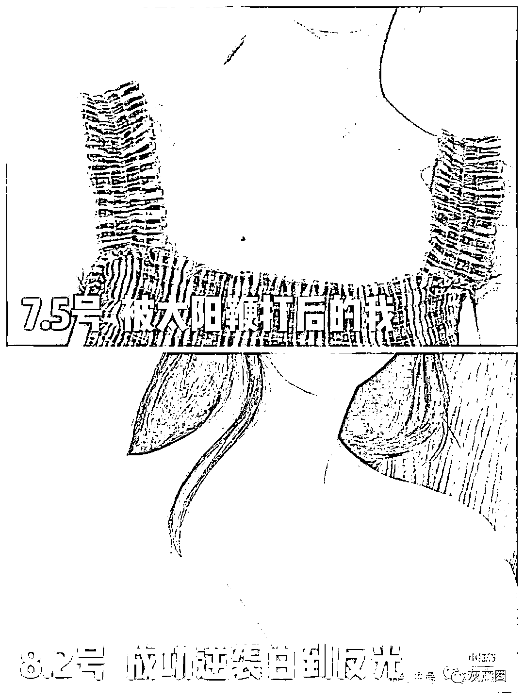

# 流量至上的「种草笔记」乱象：小红书变“黑”了

> 原文：[`mp.weixin.qq.com/s?__biz=MzIyMDYwMTk0Mw==&mid=2247501945&idx=1&sn=bcf844fd9979192e892fc667d054cc6c&chksm=97cb0341a0bc8a57d3e1b48fecd87d2c459e44dce343b544a2f1e4ea4efc7fe562118a38430a&scene=27#wechat_redirect`](http://mp.weixin.qq.com/s?__biz=MzIyMDYwMTk0Mw==&mid=2247501945&idx=1&sn=bcf844fd9979192e892fc667d054cc6c&chksm=97cb0341a0bc8a57d3e1b48fecd87d2c459e44dce343b544a2f1e4ea4efc7fe562118a38430a&scene=27#wechat_redirect)

**点击上方蓝色字体免费订阅“灰产圈”**

作为一个特别热衷于购物和剁手，市场分析消费行为，但是自己却深陷消费行为主义不可自拔的青年，本人的一大爱好就是刷淘宝。

在我看来，刷淘宝就是我这种死宅的逛街。

大家都知道，淘宝首页会根据大数据来给用户推荐商品。也就是所谓的“千人千面”，但即使如此，淘宝更多承担的还是完成【购买】场景。

而引导你去对某个商品感兴趣的工作，也就是大家说的【种草】，通常是由小红书这样的社区来完成的。

一个被消费主义所荼毒、被资本主义掏空存款、被营销软文所洗脑的年轻人，购买商品的典型路径就是：先在微博、小红书、是什么值得买等社区里被各路博主种草，然后在知乎、虎扑、B 站上搜索该产品的测评，最后去淘宝京东、拼多多这类电商下单。

这就是各大营销公司帮助品牌爸爸们进行投放的基本策略思路，搞清楚这个策略能有效帮助你剁手的时候....emmm 也没什么帮助。

**搞笑的广告**

在所有种草社区里，最神奇的当属小红书，不仅因为他是所有【种草平台】最出名的一个，同时也是神奇内容最多的一个，比如前段时间有媒体曝出过的“七天减肥三十斤，橡皮筋缠手上就能瘦”等，这些沙雕内容，这些内容简直就是我的快乐源泉，我看小红书就不是为买东西，纯粹是为了享受这份神奇的快乐。

如果你使用过小红书，一定有这样的体验，许多护肤测评水平可谓低下，全是堪比电视购物般夸张的言辞和赞誉，以及瞎子都能看出来的用美图秀秀 p 出来的对比图。

比如，搜索“美白”这个词，出来的封面上两张脸，一张黑中泛苦、一张白里透红，磨皮磨得毛孔都没了，用来呈现产品的神奇功效，七天就能美白，怕用的不是硫酸？

**各种护肤专家在线坐诊**

这也是最让人刷新三观的一点了，几块钱就能拯救肌肤的所有问题，什么痔疮膏去黑眼圈，皮筋捆手能瘦身，你信吗？

**败坏社会风气**

很多行业、平台在成立之初都会通过打擦边球的形式来扩大流量，但小红书目前已有超过 2.5 亿的用户却依然存在不少这方面的内容，没能担起一个企业的社会责任，实属不该。

有网友爆料，不少 po 主在小红书的酒店打卡，如果有网友看中了，就会问 po 主酒店多少钱一晚，和大学城外的饮料瓶很有异曲同工之妙啊。

**过度炫富**

中国一年销售一万台玛莎拉蒂，2000 台在小红书，二十出头的年纪，人人喜提玛莎拉蒂。

小红书上的女人个个年轻貌美，每天只需要保养皮肤，出去旅游，吃遍天下的美食，还拥有一抽屉海蓝之谜，纪梵希，香奈儿。不少人直呼：“上了小红书之后，才知道自己比自己想象的穷多了。”

然而这种谜一样的广告文章，却在小红书上获赞无数，随手点开一张广告文章就是几千赞、几百条评论（比我的评论多太多）评论倒是看起来很真实，都是真诚求购买渠道，热情的表达自己也用同款、效果超级好等等，还有一些产品细节的提问，仿佛就是小姐姐们一起分享护肤心得一般。

难道真的有很多人看不出来，这是一篇相当低劣的广告吗？真的有那么多人相信用了某某产品之后，七天就能丑小鸭变成公主吗？

小红书博主为什么那么有钱？

有一名经营小红书一年有余的博主 a，她觉着自己肯定可以比这些沙雕内容写得更好。于是也注册了一个小红书账号，找出自己常用的护肤品、写了一些内容详尽、评价中肯的笔记。然而数据十分惨淡，通常只要几个赞和几条评论。

不过幸运的是，她被拉进了一个小红书博主群，可以和大家一起学习如何进行小红书账号运营。这个群有几十个小红书博主，其中有几个厉害的小姑娘，已经有十几万粉了。博主 a 抱着学习的心态私信她们，问“你们是如何做到这么好的呢？”结果只用“图要精致，内容真实”只用的车轱辘话来应付她。

然而这些博主的很多笔记，大多也是简单的描述一个产品，再夸赞几句以及对比全靠 PS 的测评图。

直到有一天，一个人告诉博主 a，数据是可以维护起来的，你维护好了，可以给你拉广告。并且拉博主 a 进了一个新的群，此刻她才算真正进入小红书博主的世界。

**小红书博主运营真谛：数据维护**

**互赞互评**——是最基本维护方式，组织互赞互粉群，迅速增加曝光量，甚至形成增加群内独有的规则。

**刷粉买赞**——互联网公开的秘密，去年央视还公开批评了虚假流量，但是这个世界的灰色繁荣程度，恐怕远超普通人想象。点赞评论，真人互动会让内容更加好看。

像 10w 粉丝的博主，一条广告就在 3000 多，一个月起码能接到五条广告，轻松月入 15000，吊打一群小白领。

在这种数据面前，数据维护的费用就是九牛一毛，简直是稳赚不赔的生意。既然粉丝都是买来的，也不用担心博文数据。文案就随便写写，只要有甲方指定的关键词露出就可。唯一重要的就是图片，做到对比夸张。

很多人会有疑问，为什么甲方会为这样的广告买单呢？

**这种虚假的内容又怎么保证转化率？**

在小红书的投放执行上，从品牌到博主之间往往隔着广告公司和错层媒介或者 mcn，而距离博主最近的，直接与博主沟通的那一层被称之为【小红书 pr】，他们主管小红书关键词优化的运营。

小红书的推荐模式，是从【搜索】开始，比如用户搜索“口红色号”只要显示的前排全部都是软文，就从而实现种草的目的。

有人说，虚假流量是甲乙双方的共谋，而唯一受到伤害的就是消费者，不仅花时间看来广告，最后还被忽悠的脉络一堆没有用的产品。

面对灰产猖獗，其实小红书一直都在整治。

> **仅 2019 年就出来了**
> 
> **443.57 万篇作弊笔记**
> 
> **封禁了 2128 万个作弊笔记**
> 
> **拦截 14.23 亿次黑产作弊行为**

从这个数就能看出，灰产有多么巨大，用户毕竟不是傻子，发现被骗之后就会离开平台，最终造成整个平台流量的流失。

而一旦流量流失，博主们就会加大灰产投入，从而陷入恶性循环。

无论是灰产还是骗局，归根结底就是抓住了人急功近利的心态：

妄想随便写写内容就能流量暴涨、变现，最后盆满钵满。

← 向右滑动与灰产圈互动交流 →

**点击****阅读原文****加入灰产圈高端社群**

