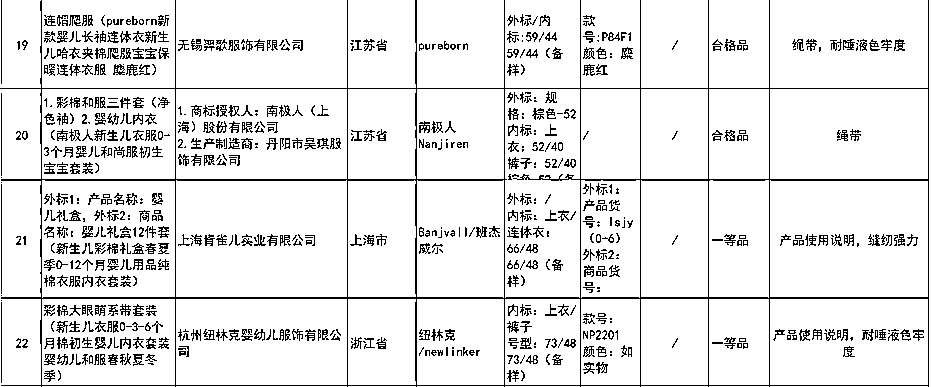

# 南极人：我们不生产商品，我们只是吊牌的搬运工

> 原文：[`mp.weixin.qq.com/s?__biz=MzIyMDYwMTk0Mw==&mid=2247501945&idx=2&sn=3b683fe6fa7b2c06a23c74176bc5b99b&chksm=97cb0341a0bc8a57d4dfbf9a8eed453e4a8280b8b21f5109881645ee28b6e1aa84b57707447c&scene=27#wechat_redirect`](http://mp.weixin.qq.com/s?__biz=MzIyMDYwMTk0Mw==&mid=2247501945&idx=2&sn=3b683fe6fa7b2c06a23c74176bc5b99b&chksm=97cb0341a0bc8a57d4dfbf9a8eed453e4a8280b8b21f5109881645ee28b6e1aa84b57707447c&scene=27#wechat_redirect)

**点击上方蓝色字体免费订阅“灰产圈”**

传统企业转型电商一直是个难题，南极人却靠着“秘籍”赚的盆满钵满。

2019 年，天猫“双十一狂欢节”战报显示，南极人成为 15 个销售额破 10 亿元的品牌之一，销售额逾 15 亿元。据南极电商（002127.SZ，前身为南极人）此前发布的 2019 年年报，公司在各电商渠道可统计的含未付款成交总额(GMV)达 305.59 亿元，同比增长 48.92%。它凭什么这么赚钱？

**不生产商品，只做吊牌的搬运工**

提及南极人，80 后们大都印象颇深。南极人创立于 1997 年，以“更薄、更暖、更舒适”为噱头，从保暖内衣市场出道。随后几年，它凭借葛优的广告词“南极人，不怕冷”火遍全国，靠在各大卫视砸下巨额广告而家喻户晓，与恒源祥、北极绒、俞兆林并称国民四大保暖内衣品牌。

图源：南极人广告视频截图

但许多人不知道的是，**南极人的业务早就从单一的保暖内衣扩展到了全品类。**搜索天猫可发现，南极人的产品从蚕丝被、棉服、童装到电推剪、卷发器、儿童车、纸尿裤……无所不包。据介绍，其标签已经出现在母婴、服装、厨品、鞋类、床品、家电等 9 大品类的 55 大类目产品线中。除了旗舰店外，它还有官方店、企业店、专卖店、直销店、自营店、工厂店等等。

图源：淘宝截图  

南极人靠什么壮大到了如此地步？**答案有些出人意料——现阶段市面上挂着“南极人”品牌的商品，没有一件是它制造的——这家公司已经彻底关停了所有的产品生产线，没有一家工厂，没有一个工人。**据《南方周末》报道，保暖内衣的红利期结束于 2008 年左右。彼时，因品牌同质化严重，纺织行业面临着诸如产品单一、款式老化、供应链过剩等问题。身处其中的南极人，产品价格不断被压低。为扭转困境，其创始人张玉祥将企业转型为“品牌授权”模式，推出了“NGTT”南极人共同体商业模式。南极人的蓬勃发展，得益于“品牌授权”与“电商”的化学反应。2013 年之后，天猫店铺采用邀请制，申请渠道收窄。没有品牌资源的电商只能求助于品牌方的授权。2015 年，南极人干脆放弃了实体零售和直销，将全副精力投入到品牌授权上。同年 12 月，南极人借壳新民科技上市，更名为南极电商。**品牌授权到底有多赚钱，从其财报中可窥一二。**南极电商在 2012-2014 年的营业收入分别为 2.34 亿元、2.79 亿元、2.74 亿元，实现净利润分别为 3181 万元、8008.99 万元、6650.09 万元。而借壳上市后的 2015 年度，公司实现营业总收入 3.89 亿元，较上年同期增长 59.81%，公司营业利润 1.97 亿元，较上年同期增长 136.51%；公司净利润 1.72 亿元，较上年同期增长 159.1%。

图源：同花顺截图

从 1998 年至 2015 年，南极电商品牌综合服务费的收入和毛利额分别增加了 6.51 倍和 8.08 倍。**到了 2017 年，它以 96.46%的毛利率成为 A 股电商的毛利之王。**这一数据在去年同样惊人。据其 2019 年年报显示，公司营收为 39.07 亿元，净利润 12.06 亿元。其中，与品牌授权相关的营收为 13.05 亿。报告期内公司合作供应商总数为 1113 家，其中主要合作供应商约 500 家；合作经销商总数为 4513 家，授权店铺 5800 家。值得注意的是，2019 年，其品牌综合服务业务毛利率高达 93.36%，**这意味着南极电商的利润几乎都来自“贴牌”。**

**脱颖而出**

南极人并非第一个“吃螃蟹的人”。在国外，品牌授权经营的历史颇为悠久。其中，最为有名的莫过于迪士尼。2019 年，迪士尼全球授权商品和服务的收入为 2928 亿美元，其中企业品牌授权全年的授权商品及服务收入为 601 亿美元，位居“全球授权商 Top 150”榜单第 1。**在国内同行业中，完全放弃工厂、转而实施品牌授权战略的企业，南极人也并非第一家。**早在 1991 年，恒源祥就开始探索联合体模式。位于无锡藕塘的绒线厂最先拿到恒源祥的授权，它生产的绒线使用恒源祥的标志，利润分恒源祥一半。到 2007 年，恒源祥已经发展了近百家上游工厂和两万多个下游经销网点，当年营业额 3 亿，其中收取的商标使用费就高达 2.66 亿，占到了公司收入的 80%以上。南极人的创始人张玉祥坦言，其贴牌路线，“基本参照恒源祥模式”。而南极人之所以能够在同行业的“贴牌大战”中脱颖而出，得益于其激情扩张的野心。据《南方周末》报道，2013 年保暖内衣掀起线上价格战，正常情况下工厂出厂价 50 元的保暖内衣，南极人经销商不得不以 19.9 元包邮的价格出售。依靠低价，南极人迅速抢占了市场并把守住了流量入口。2015 年，南极人发力家纺市场，几乎采用了同样的路数。**在品类拓展与延伸上，南极人也比恒源祥更加开放。**2015 年，公司仅有“南极人”一个品牌，且品牌旗下只有 20 个一级类目，129 个二级类目。 自 2016 年起，公司品类大幅扩张，“南极人”品牌一、二级类目相比 2015 年度分别增加 37 和 191 个。2016 年收购的“卡帝乐鳄鱼”品牌为公司新增一级类目 10 个，二级类目 184 个。2017 年,公司完成对时间互联的收购后，增加了移动互联网营销业务。 至 2018 年，公司进一步扩大了童装、运动户外、孕产用品和居家布艺等品类。目前，南极电商的自有可授权品牌包括：南极人、南极人+、南极人 Home、卡帝乐鳄鱼、精典泰迪等。

图源：南极人官网截图

授权门槛方面，南极人**“一降再降”**。2018 年底，《南方周末》曾报道南极人的“包销”制度，即一旦获得授权就要完成销量。例如 2018 年一家南极人男装专卖店销售目标达 600 万元，一旦获得授权就需要完成销量，并缴纳相应数额的标费，否则就算违约。而且在 2018 年前后，想要拿到南极人授权的经销商，在正式签合同前，想要进驻天猫店的商家还得先缴纳一笔 10 万元的保证金。网传的南极人电商授权申请表格
但现在，南极人的标费已经下降不少。据无冕财经报道，南极人夏装标牌的价格为 1.5 元/套，冬装的价格为 2 元/套。若按 2000 套标来算，品牌授权方最多只需要支付 4000 元，此外也没有保底销售目标。

**频登“黑榜”，危机降至？**

万物皆可“南极人”，也让其陷入品牌价值不断消耗的恶性循环。目前，与“南极人”有关的投诉贴，诸如“没有 logo”、“卖假货”、“质量差”等，在聚投诉、黑猫投诉上比比皆是。7 月 6 日，商标为“南极人”的彩棉和服三件套、婴幼儿内衣被北京市市场监督管理局通报存在绳带不合格问题。而据《南方周末》统计，仅 2018 年，南极人就上了 14 次国家质监部门及地方消费者协会的不合格产品黑名单，涉及蚕丝被、内衣、棉服、童装、电推剪、卷发器、按摩棒等产品。

图源：北京市市场监督管理局官网

据媒体报道，因平台方对商家的进驻要求越来越高，**南极电商已经无法再提供京东和淘宝的品牌授权。**目前，南极电商正试图转移平台，并逐步收紧自身的授权品类。除了产品质量问题，南极电商许多店铺还存在经营者、地址多次变更的情况，直接或间接控股的公司也有 27 家已经注销。其中，更名、更址、或变更经营者的店铺，大都有一个共同点——即 2019 年的 GMV（成交总额）暴增。例如，淘宝销量排名第七的“南极人杜尚专卖店”，背后的经营者是，南通慧道纺织品有限公司。这家公司原名为“上海杜尚信息科技有限公司”。2019 年 1 月，公司注册地由上海变更为南通，名称亦随之变更。“南极人杜尚专卖店” 2018 只有 8500 万 GMV，到了 2019 年，GMV 就达到了 4.89 亿元。“南极人微昊专卖店”这家店铺的经营者为南通硕舟家纺有限公司，该公司在 2020 年 1 月之前由“上海微昊实业有限公司”更名而来，注册地址也从上海变更到南通。南极人微昊专卖店，2018 年 GMV2900 万，到 2019 年，GMV 飙升至 2.82 亿元。这难免让人质疑南极电商数据的真实与可靠。此外，南极电商对外投资的鲈乡小贷在 2014 年 12 月到 2018 年 12 月间，存在 20 次被执行记录，分别被苏州市姑苏区人民法院、苏州市吴江区人民法院列为失信被执行人。面对质疑和现状，南极电商试图重新讲述自己的商业故事。今年 1 月 2 日，南极电商在回复深交所的公告中称，南极电商计划打造的零售店参考了 Costco 等零售商的经验，计划用线下零售店提升线上品牌的口碑。

图源：同花顺南极电商 2020 一季报截图
但**前景似乎并不乐观。**今年，在电商平台业绩普遍上涨的一季度，南极电商的营收同比下降 18.51%。一季度数据发布之后，2020 年 5 月，南极电商审计部负责人邬嘉峰请辞。

← 向右滑动与灰产圈互动交流 →

**点击****阅读原文****加入灰产圈高端社群**

