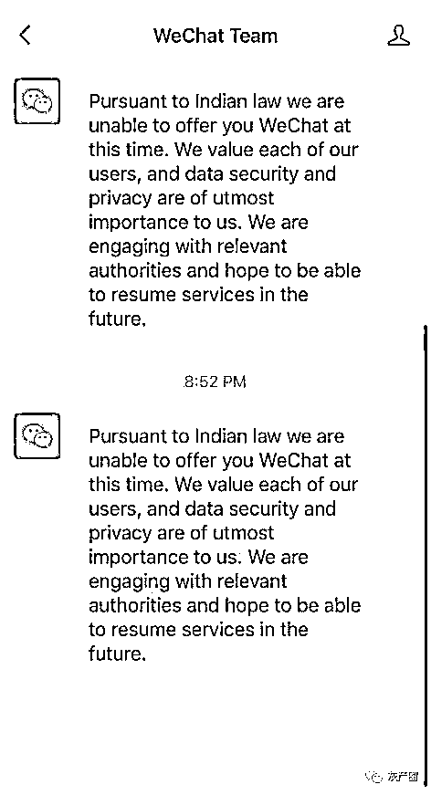
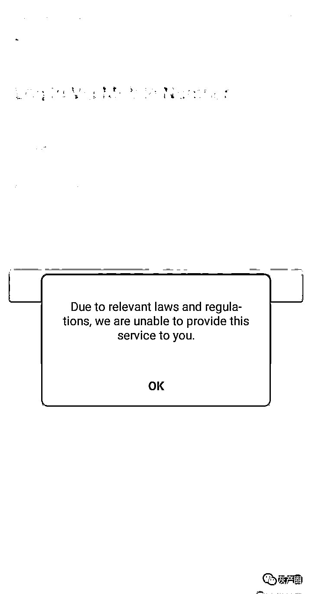
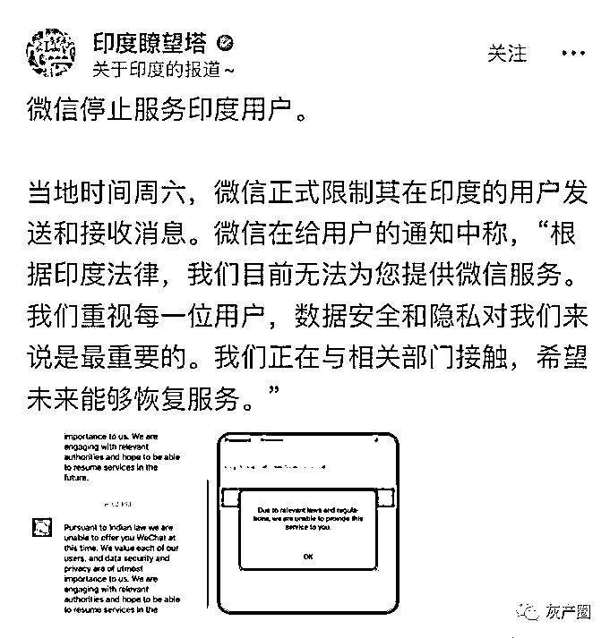
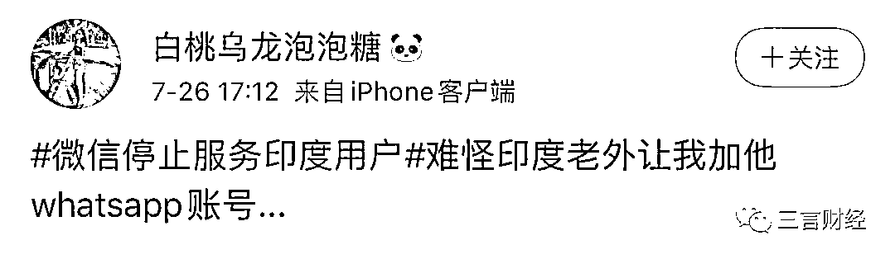
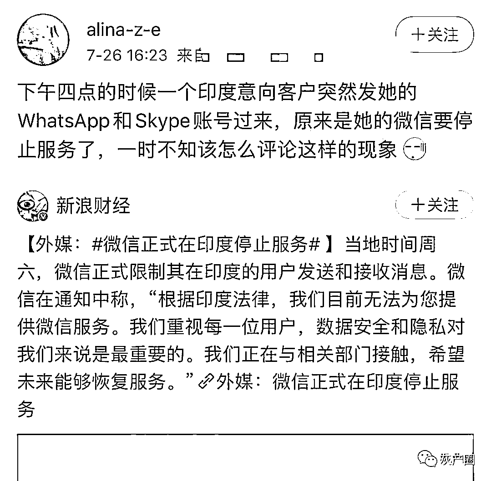

# 微信停止服务印度用户，马云被印度法院传唤

> 原文：[`mp.weixin.qq.com/s?__biz=MzIyMDYwMTk0Mw==&mid=2247501945&idx=3&sn=0f415b3bce5cfeb0cef5e4e86f1d99b6&chksm=97cb0341a0bc8a5790f25778c0c0015017c13e81b183527bab34458b9b1f356bc447f5eb13a7&scene=27#wechat_redirect`](http://mp.weixin.qq.com/s?__biz=MzIyMDYwMTk0Mw==&mid=2247501945&idx=3&sn=0f415b3bce5cfeb0cef5e4e86f1d99b6&chksm=97cb0341a0bc8a5790f25778c0c0015017c13e81b183527bab34458b9b1f356bc447f5eb13a7&scene=27#wechat_redirect)

**点击上方蓝色字体免费订阅“灰产圈”**

7 月 26 日消息，今日，据媒体报道，微信已经停止为印度用户提供服务。

据报道，多名印度用户表示自己的微信会被强制退出，并且无法重新登录。此外，即使通过 VPN 也无法使用微信。

不过，受影响的微信用户均为印度本地手机号注册，如果使用中国手机号注册则不受影响。当账号被登出时，微信提示为：“根据印度法律，我们目前不能为您提供微信服务。我们重视每一位用户，数据安全和隐私对我们来说是最重要的。我们正在与相关部门接触，希望能够在未来恢复服务。”

也有网友在社交平台中透露有印度客户改用其他软件交流。

据志象网报道，一名身在中国的印度人表示自己也出现微信被强制登出情况。虽然自己使用的是中国手机号注册，但据他推测，可能是微信方面误判其为印度用户。在尝试两三次后，他成功登陆微信，并且没有再被登出。

6 月 29 日，印度政府宣布禁止包括 TikTok、微信、UC 浏览器等在内的 59 款中国 App。

**阿里巴巴、马云被印度法院传唤**

今日，据外媒报道，根据印度法院的一份落款为 7 月 20 日的文件显示，一名阿里巴巴旗下 UCWeb 的前印度雇员以被错误解雇为由发起诉讼。法院已向阿里巴巴及其创始人马云发出传票。

该雇员名为普什潘德拉·辛格·帕玛(Pushpandra Singh Parmar)，他称自己因为反对公司应用程序中的虚假新闻而被错误解雇。

据这份法庭文件，该雇员帕玛展示了 UC News 中发布的帖子摘要，他指出这些文章是虚假的。2017 的一篇帖子以印地语“从今天午夜开始，禁止发行 2000 卢比纸币”为标题；2018 年一篇文章标题是：“刚刚，印巴爆发战争”，文中描述印巴两国就边界争议发生交火。事实上，印度并未禁止发行 2000 卢比纸币，2018 年印度和巴基斯坦间也未交火。

帕玛要求得到 26.8 万美元（约合人民币 190 万元）赔偿。法院方面已向阿里巴巴、马云等十几位个人或公司发出传票，要求他们本人或者通过律师在 7 月 29 日出庭。

此外，法官还要求被告公司及其高管于 30 天内作出书面回应。

对此，阿里巴巴方面回应称，UC 一直坚定地致力于服务印度市场和保护本地员工的福利，政策符合当地法律。因为这件事还在审判中，无法对这个问题作进一步评论。另有接近阿里巴巴的人士向媒体透露，马云目前尚未收到传票。

据分析公司 Sensor Tower 数据，UC 浏览器在印度下载量至少 6.89 亿次，UC News 下载量则为 7980 万次。

此前，印度政府宣布封杀中国 APP 后，阿里巴巴关闭 UC 浏览器在印度开设的公司。据媒体报道，阿里巴巴已向印度所有员工通知公司即将关闭的消息，并且已经关闭了两个办事处。并对在 UC 浏览器公司上班的印度员工进行了补偿。据悉，有九成 UC 员工收到裁员通知，包含公司基层保安直至初级管理人员。

此次封禁，涉及阿里巴巴、腾讯、字节跳动等多家中国头部互联网企业。也是中国互联网企业出海路上遭遇的较严重困难。

出品｜三言财经 作者｜DorAemon

← 向右滑动与灰产圈互动交流 →

**点击****阅读原文****加入灰产圈高端社群**

