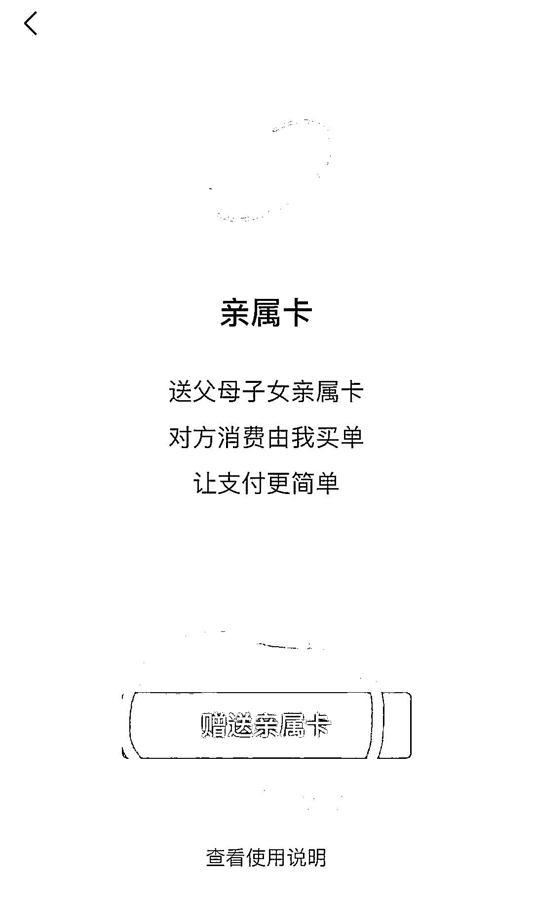
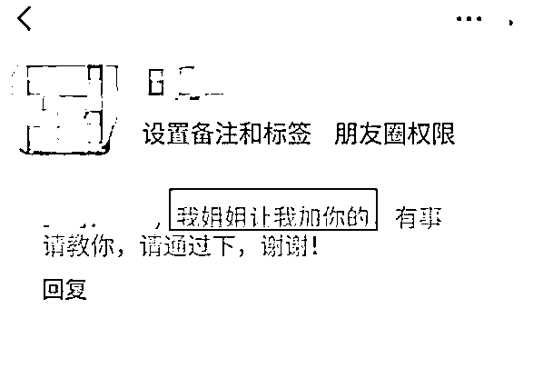
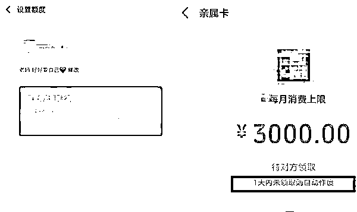
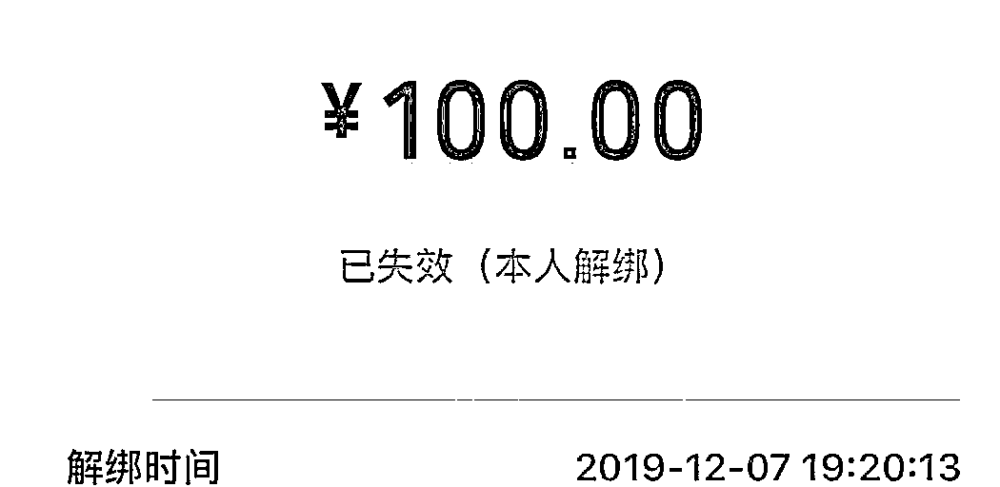

# 警惕！有诈骗分子盯上微信这个功能，已有多人中招！

> 原文：[`mp.weixin.qq.com/s?__biz=MzIyMDYwMTk0Mw==&mid=2247501995&idx=2&sn=27805407da81e80f4103cda62144a18d&chksm=97cb0393a0bc8a855049378104dce026aa52bef1a5029cbceeed47b3c930cce06575cbce0707&scene=27#wechat_redirect`](http://mp.weixin.qq.com/s?__biz=MzIyMDYwMTk0Mw==&mid=2247501995&idx=2&sn=27805407da81e80f4103cda62144a18d&chksm=97cb0393a0bc8a855049378104dce026aa52bef1a5029cbceeed47b3c930cce06575cbce0707&scene=27#wechat_redirect)

**点击上方蓝色字体免费订阅“灰产圈”**

**“微信亲属卡”**功能你用过吗？

诈骗分子盯上了这个微信功能

已经有不少人中招！

***什么是微信“亲属卡”？***

微信“亲属卡”是微信的代付功能，微信用户可在微信里赠送“亲属卡”给父母、子女作消费使用，代付方通过设置“亲属卡”的每月消费额度上限，将额度控制在 0.01 元到 3000 元之间，每月自动延续，**当父母、子女使用“亲属卡”消费时，消费资金将自动从代付方的支付账户扣除。**

***注意：骗子给你的“亲属卡”***

***其实是“空头支票”***

当你收到类似添加好友申请，就请提高警惕了。

对方不仅能准确无误地叫出自己的名字，且声称是“我姐姐让我加你”，除“姐姐”，还可能是“阿姨”“爸爸”“舅舅”......如果你在半信半疑之间，同意了对方的添加好友申请，或许已经开始一步步走进骗子的圈套。

首先，骗子们会通过套路式的嘘寒问暖，“包装”自己，让受骗者觉得骗子纯属善意，且完全不差钱； 

当受骗者没有了提防心，时机成熟后，骗子莫名送一张“亲属卡”给受骗者，然后迅速和受骗者发信息索要同等金额的亲属卡或转账金额。

然而，**骗子赠送的这张“亲属卡”虽标有额度但并不能完成支付。**

**注意：此时，问题来了……**

**1、骗子是以什么理由来要回亲属卡的？**

答：亲！我想给家人亲属卡，不小心发给你了，现在亲人在外面等着结账，非常着急，帮我退回来吧。（感情招牌）

**2、对方先给我发的，我先去消费了再退还不就行了？**

答：当受骗者用骗子给的“亲属卡”消费时，会发现这张卡无法使用，骗子便称：“需要互相赠送相同额度才能激活”为由，让受骗者回送骗子一张同等额度的“亲属卡”。（利用对软件功能的不熟悉忽悠你）

**3、为什么对方发来的“亲属卡”无法使用，我发出去的就可以使用？**

答：**因为对方微信余额里面根本就没有钱，而且绑定的银行卡也是一张空卡，根本就无法完成支付。**

**4、我已经给对方转款过去了，对方微信余额里面应该有钱了？**

答：没错，的确有钱了，拼速度的时候到了，骗子桌子上早就准备好了一张收款二维码，你敢发我就敢消费！

**5、我正好也在消费，看看谁快！！！**

答：那样咱们就拼一下速度好了，民警亲自体验了一下，对赠送的“亲属卡”原来还可以进行以下操作

**一秒迅速解绑**

  

**6、再之后呢？**

答：没有之后了，此时你已经被对方拉黑了，你收到的只是一张“空头支票”。

***网络犯罪套路升级***

***警惕之心不能丢***

**警方提醒：**

绑定“亲属卡”等同于默认对方从自己的微信中或绑定的银行卡中自动扣费，为了避免踩坑中招。

**请广大微信用户给他人发送亲属卡时一定要谨慎。**

**不要让一些人成为“套路”自己的“亲人”。**

来源：首都网警 新华社 深圳市反电信网络诈骗中心

← 向右滑动与灰产圈互动交流 →

**点击****阅读原文****加入灰产圈高端社群**

