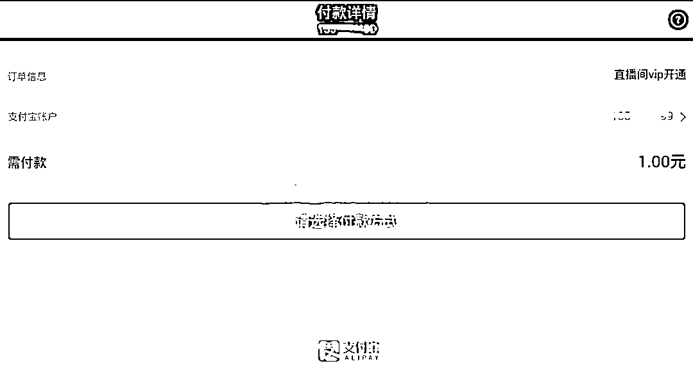

# 深度揭秘地下论坛“暗雷”产业链：“惊雷”现世，黑暗无边

> 原文：[`mp.weixin.qq.com/s?__biz=MzIyMDYwMTk0Mw==&mid=2247502019&idx=1&sn=d37b4d5b46cf63f806a84fb2a7f41bbe&chksm=97cb03fba0bc8aed84d6220a8bf4d18660c178dcd4ce8f52c8639105183443f37c682cb9e914&scene=27#wechat_redirect`](http://mp.weixin.qq.com/s?__biz=MzIyMDYwMTk0Mw==&mid=2247502019&idx=1&sn=d37b4d5b46cf63f806a84fb2a7f41bbe&chksm=97cb03fba0bc8aed84d6220a8bf4d18660c178dcd4ce8f52c8639105183443f37c682cb9e914&scene=27#wechat_redirect)

**点击上方蓝色字体免费订阅“灰产圈”**

***概述***

近日，奇安信病毒响应中心在日常黑产挖掘过程中发现一种利用支付宝支付和微信支付进行诱导诈骗的新型黑产项目，在地下论坛中被称为“暗雷”和“明雷”。

**实际效果为**：表面支付 1 元实际支付 0-5000 任意金额。由于“暗雷”和“明雷”在表现形式上有所不同，再结合对应的支付平台，该新型诈骗一共有三种形式：**微信明雷、微信暗雷、支付宝暗雷**。

通过调查发现“**微信暗雷**”并不存在，圈内用来进行“黑吃黑”，诈骗购买暗雷源码的黑产从业人员。我们会在下面的内容中进行详细的分析，同时我们对这类新型诈骗的市场进行了深入的调研，从源码搭建、售卖到洗钱过程，已形成一条完整的黑产生态链。

本次披露的新型诈骗使用的 APK 本身并没有特别明显的恶意行为，只是作为诈骗过程中的一环，支持双端 APP（Android,IOS）。杀软一般不会进行报毒，故一旦安装了这些 app，就会落入诱导消费的圈套，最终导致财产的损失。

通过奇安信大数据平台监测，目前中文互联网上已经有非常多的群众中招，为防止威胁进一步扩散，病毒响应中心负责任地对相关诈骗手法、技术、以及黑产生态进行披露和分析。

***背景***

产业链流程图如下：

近几年社会集中曝光最多的黑产诈骗手法非“杀猪盘”及其衍生品莫属，但是从本质上讲这类诈骗都是通过纯“话术”的方式对受害者进行诱导，非常考验语言的艺术。

而从今年以来新型的诈骗方式开始将“话术”与“技术”相结合通过以“话术为主，技术为辅”的设计思想设计出了如新型裸聊诈骗、以及本文要介绍的暗雷、明雷。

其实早在 2016 年，天眼实验室就曾经披露过在 PC 端进行支付宝诈骗的案例，由于当时支付宝风控系统不成熟，以及诈骗程序在技术层面容易被杀软查杀，故这类 PC 端的诈骗并没有流行起来。

       而暗雷同样能达到表面支付一元，实际支付 1000 的效果，主要针对移动端。

**支付宝暗雷演示视频如下（视频来源于互联网）：**

[`mp.weixin.qq.com/mp/readtemplate?t=pages/video_player_tmpl&action=mpvideo&auto=0&vid=wxv_1381797752262279168`](https://mp.weixin.qq.com/mp/readtemplate?t=pages/video_player_tmpl&action=mpvideo&auto=0&vid=wxv_1381797752262279168)

**微信明雷演示视频如下（视频来源于互联网）：**

[`mp.weixin.qq.com/mp/readtemplate?t=pages/video_player_tmpl&action=mpvideo&auto=0&vid=wxv_1396149412392517632`](https://mp.weixin.qq.com/mp/readtemplate?t=pages/video_player_tmpl&action=mpvideo&auto=0&vid=wxv_1396149412392517632)

**微信暗雷演示视频如下（视频来源于互联网，用于“黑吃黑”）：**

[`mp.weixin.qq.com/mp/readtemplate?t=pages/video_player_tmpl&action=mpvideo&auto=0&vid=wxv_1381789828953587715`](https://mp.weixin.qq.com/mp/readtemplate?t=pages/video_player_tmpl&action=mpvideo&auto=0&vid=wxv_1381789828953587715)

 **中文互联网上已经出现大量的受害者：**

 **诈骗流程大体如下**：

骗子会针对一个特定的人群定制一款符合该人群需求的 app，如色粉所需要的色播 app，兼职学生党所需要的兼职平台 app，游戏玩家所需要的游戏物品交易 app，以及促销购物平台。依据不同的受众使用不同的诱导方式，也可以通过垃圾短信的方式进行传播。

以兼职为例，黑产从业人员会在相关兼职群中主动加你向你发送兼职信息： 

之后“客服”会让你发送你的支付宝花呗额度，这时“客服”实际上会结合你花呗的余额在后台设置暗雷支付金额，发你兼职 app。  

指导你如何进行操作：

会让你填一段支付宝 h5 的链接：

虽然在 app 中显示的支付金额为 0 元，实际上最终支付的金额为“客服”在后台设置的金额，付款成功后，“客服”会注销链接造成出错的假象。

之后“客服”开始装无辜，让受害者以为是系统的问题，最后不了了之。 

而色播 app 的传播则较为简单粗暴，不必向兼职 app 那样需要“善后”流程，这是因为色播 app 的受众多，即使被骗也不敢说出来。下面我们就以色播 app 为例介绍相关技术。

***技术揭秘：支付宝暗雷***

| **文件名** | **MD5** |   | **类型** |
| **夜夜约** | 58cd3e09b0bbbc32d2fd146d55be09a0 |   | APK 文件 |

APK 打开后界面如下：

进入直播间后会弹出提示框，一元开通月度会员：

点击按钮后进入网页支付宝支付流程。目前在 app 调用支付宝支付接口有两种主流方法：

> **1、调用支付接口唤起支付宝 app 进行付款。**
> 
> **2、使用网页支付接口进行支付。**

由于支付宝 app 内的风控系统已经非常成熟，所以目前所有的暗雷走的都是网页支付宝通道。

我们对整个支付流程进行了抓包，发现在 apk 访问 anlei.php 后就进入了支付流程且访问的都是支付宝官方域名，并没有像互联网上有些视频和文章说的那样进入了钓鱼页面。

为了完整了解跳转全过程，我们找到了支付宝暗雷的后端源代码。

在后端源代码中可以看到配置企业支付宝的页面。

anlei.php 页面如下：

跳转到 Url.txt 中的网址，实际上就是跳转到支付宝 h5 地址，对 Apk 样本进行脱壳后，在被抽取的代码中我们找到了核心的逻辑。

当进入支付流程时，apk 会调用 WebView 修改付款详情页面，将需付款对应的金额改为 1.00 元，app 内的付款详情如下：

如果我们在浏览器访问支付宝 h5 页面进行付款时就会显示真实的付款金额为 9.9 元。

真实付款金额是在商户端进行设置并生成 H5 支付链接后设置到暗雷后台的。后台还支持渠道分发，不同的渠道会分得不同比例的佣金。

目前我们捕获的支付宝暗雷 app 页面如下：

***微信明雷、暗雷***

由于微信明雷、暗雷在国内出现的时间较早，且现在黑产都以支付宝暗雷为主，不再售卖微信明雷、暗雷，所以我们没有成功复现微信明雷、暗雷的全过程，只找到了微信明雷后端的源代码结合相关视频进行分析。后来我们咨询了业内人员，详细了解了一些内幕，他们表示“微信暗雷”并不存在，主要是用来骗一些刚入黑产圈不久的小白，进行“黑吃黑”活动。

不同于支付宝暗雷，微信明雷是不依托于 App 而是在微信群或者朋友圈中传播一些图片和链接。

而明雷和暗雷的区别在于，明雷在付款时会将真实付款的金额显示出来，在这种情况下，能否成功骗钱取决于受害者有没有仔细看付款页面的金额，付款图如下:

而微信暗雷，如文章开头的演示视频那样在付款页面依然是虚假的金额，而实际扣款时以百倍的价格扣除。

为了进一步探究原理，我们找到了微信进明雷后端的源代码。

后台界面如下：

当受害者扫描二维码或打开链接时会进入 pay.php 页面：

Jiage 变量实际上就是表示虚假的价格，外部传入可以在后台进行修改，点击立即加入后调用 pay 方法，跳转到 zf.php：

在支付页面，会将设置的金额乘以 100 并发起支付，可以手动设置倍数。

后台中可以创建种类不同的二维码针对不同的群体。

与支付宝暗雷类似，微信明雷、暗雷也有渠道机制。

## **产业链调查**

由于大部分支付宝用户都开通了花呗功能，即使钱包里没钱也能完成交易。所以目前支付宝暗雷的搭建数量是远大于微信暗雷。 

经过调查搭建暗雷台子根据客户需求收费 5000-15000 不等，免费维护，可以定制化。

在国内电商平台上也能搜到支付宝暗雷售卖的信息。

地下论坛的支付宝暗雷频道非常多，保守估计暗雷相关的黑产从业者有近千人。

当受害者付款后，钱流向了哪里？这背后其实隐藏着一个巨大的洗钱环节，早期黑产洗钱业内称作“支付跑分/微信跑分”，其主要流程如下：

以兼职为名义向正常用户租用微信/支付宝，将收款码通过技术手段整合成一张聚合码，也就是常说的聚合支付。正常用户在不知情的情况下，其名下的账户就会流入非法资金，给公安的取证工作带来了巨大的困难，后来微信和支付宝发布相关政策外加普通账号跑分流水速度太慢。导致黑产将目光转向了企业账号和其他形式的跑分如虚拟币跑分等。

**目前支付宝暗雷主要使用以下两种方法进行资金周转：**

> 1、对接企业支付宝。
> 
> 2、对接电商平台的商品，通过电商购物的方式将诈骗资金转出。

黑产通过使用企业支付宝现金红包的功能来走流水，由于支付宝默认现金红包属于社交性的，所以并不会触发风控告警，更妖的直接伪装成 OTC 交易平台，从中进行流水操作。

另一种常用的洗钱手法是，申请电商的代理，入住电商平台成为商家，设置商品类型和价格，受害者的资金会购买这些产品，从而进入正常的电商支付流水。而且这种内部的结算方式不受风控系统的限制，故这种洗钱方式深受黑产青睐。

上述只是支付宝暗雷使用的洗钱方式，如果纵观整个黑产圈所用到的洗钱方法就更多了，这里不展开细说了。

***总结***

从技术的角度讲，黑产完全有能力将支付页面做成钓鱼页面来达到利益最大化，但黑产并没有这样做，我们认为这是因为黑产诈骗的设计思路发生了变化，从原来的“人配合物”发展到现在的“物配合人”，人才是主体，所使用的 app 只不过是大流程种的一个环节,强调手法的可持续性。安全的角度来讲，不要点击来源不明的邮件和可执行文件，同时提高个人的安全意识，也能阻止诈骗活动的展开。

← 向右滑动与灰产圈互动交流 →

**点击****阅读原文****加入灰产圈高端社群**

