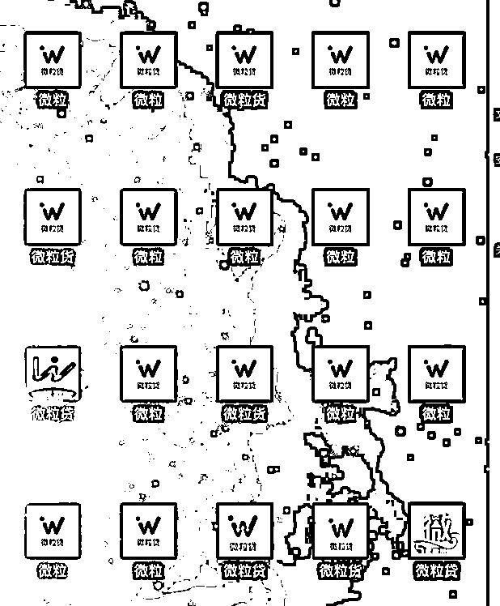
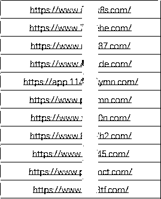
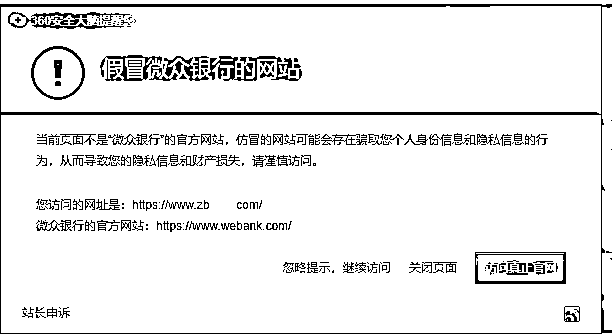
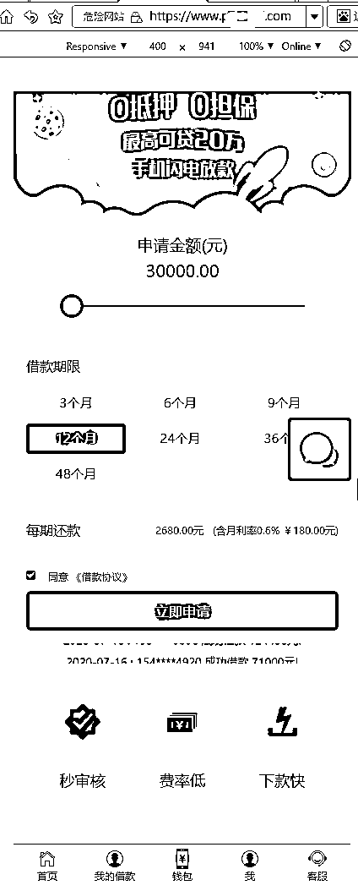
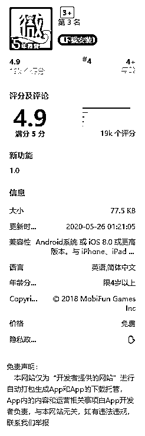
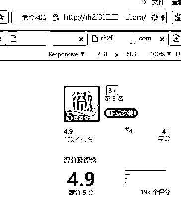
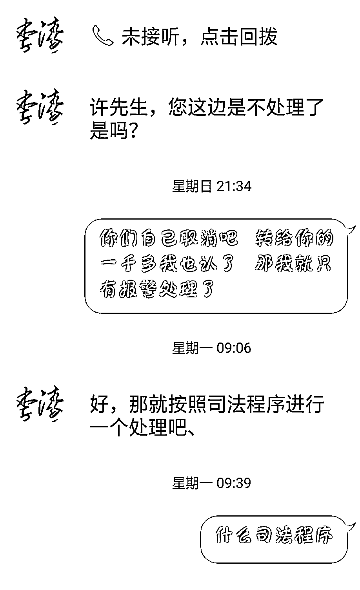
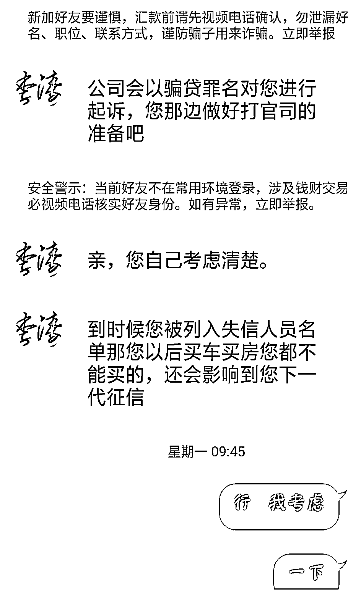
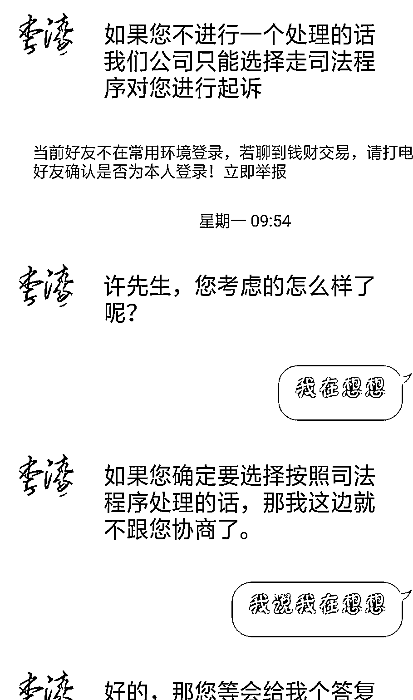

# 研究了 20 个假冒正规贷款的 App，发现原来他们都……

> 原文：[`mp.weixin.qq.com/s?__biz=MzIyMDYwMTk0Mw==&mid=2247502019&idx=2&sn=a7c3444a2ceabaf9d048c1874484f4b4&chksm=97cb03fba0bc8aed7b757e2b1b67b875a028abd0cafbfe746a0a4c6941623f53e91099751a3d&scene=27#wechat_redirect`](http://mp.weixin.qq.com/s?__biz=MzIyMDYwMTk0Mw==&mid=2247502019&idx=2&sn=a7c3444a2ceabaf9d048c1874484f4b4&chksm=97cb03fba0bc8aed7b757e2b1b67b875a028abd0cafbfe746a0a4c6941623f53e91099751a3d&scene=27#wechat_redirect)

**点击上方蓝色字体免费订阅“灰产圈”**

| 图片来源于猎网平台

看到这二十个“微粒贷”，你能分清哪个是真的吗？

**其实，没有真的。**

不管是“微粒”、“微粒货”、“微粒贷”都是仿冒正规贷款 App 制作的假冒 App。

我们通过运用技术手段发现了这些 App 的运营后台服务器链接。

|部分 App 后台链接地址

**这些 App 的后台服务器链接都不同。**

目前这些后台链接和下载链接都已经被 360 浏览器标记了风险提示，并告知了正规的微众银行链接。

| 图片来源于猎网平台

打开其中一部分 App 后台链接不难发现，这些网站虽然有着不同的网址，不同的下载地址，但是他们有着相同页面。

| 图片来源于猎网平台

具体注册流程和之前猎网分享的这篇内容：[如何辨别有“猫腻”的贷款 App？](http://mp.weixin.qq.com/s?__biz=MzIwMDAyMTM1OA==&mid=2650465524&idx=1&sn=1e5cfdd4469f27ddbde03d772f8e6954&chksm=8e8dc0f5b9fa49e35f9db458eacebe06adfb2622f7448a112dcf81d538a7d11542b99af081fa&scene=21#wechat_redirect)一样，在此就不多做赘述了。

**但由此可见，假冒正规贷款 App 也只是在虚假贷款 App 外面套了一个壳子而已。**

对于戏做全套的骗子来说，这些 App 的内容，甚至包括收集到的用户隐私其实都不太重要，更重要的是：怎么弄到钱。

**看上去很正规的下载页面可以提高下载成功率。**

我们都知道，虚假 App 因为其中内嵌的虚假链接，是无法通过正规安装应用中心人员审核的，而无法通过测试，则无法上线；为了诱导受害人下载这些 App，骗子们将这些 App 上传到了各种分发网站。

| 图片来源于猎网平台

为了诱导受害人下载，骗子会将这些下载页面做的和正规下载页面非常相似，很多网民就算看到网址也分辨不出真假，甚至包括我们的工作人员；我们下载了 App 运行后查到了 App 的后台链接，发现是个虚假网址，给此网站提示了风险。

| 图片来源于猎网平台

所以不随意点击他人给的链接，不下载这些链接里的 App，可以很大程度上避免被骗，如果想要贷款，可以去手机的应用中心下载相关知名贷款 App，更能保障自身财产安全。

**要求诉诸法律的恐吓威胁更有效果。**

之前猎网已经分享过骗子利用假冒贷款 App 诈骗的流程，其中有个环节是骗子以受害人贷款时填写的银行卡卡号错误，钱款被冻结为由，要求受害人充值解冻，此时很多受害人为了拿到贷款，会选择按照骗子要求解冻。

而那些不想按照骗子要求操作的受害人，又经历了什么？

**以骗贷罪为由，要求打官司。**

猎网微信后台经也常能收到粉丝私留言，问“自己贷款时候因为填错一位银行卡号，钱被冻结，需要充值相同款项解冻，如果不解冻就涉嫌犯罪，是不是真的？”。

| 图片来源于猎网平台

首先我们先来说说什么是：

**骗贷罪**

“

骗取贷款罪是指以欺骗手段取得银行或者其他金融机构贷款，**给银行或者其他金融机构造成重大损失或者有其他严重情节的行为。**本罪的法定刑为：处三年以下有期徒刑或者拘役，并处或者单处罚金；**给银行或者其他金融机构造成特别重大损失或者有其他特别严重情节的，**处三年以上七年以下有期徒刑，并处罚金。

**所以骗贷罪的构成，是需要给银行或者其他金融机构（正规机构）造成损失的。**

而所谓的银行卡号错误放款失败，钱也应该还在其账户内，根本没有损失，骗子这么说，只是为要钱罢了。

还有更重要的一点是：

**先要钱的贷款都是假的，不管是什么理由。**

骗子的理由包含了：保证金、会员费、工本费、解冻费、服务费、银行流水、违约金等，而大家要做的就是：**别给。**

**如何避免被骗？**

**遇事多问为什么？**

**不轻信他人，可以让自己更安全。**

无论骗子编的理由再动听，不要被利益冲昏头脑，不要被惶恐代替思考，不要在情绪不稳定的时候做下决定。

← 向右滑动与灰产圈互动交流 →

**点击****阅读原文****加入灰产圈高端社群**

