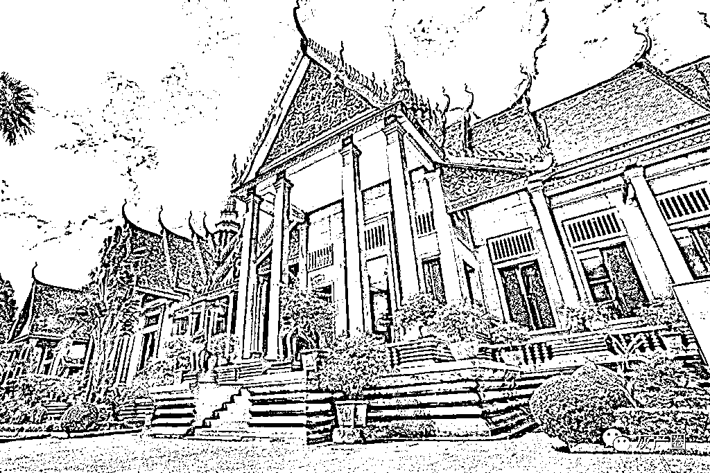

# “种菜失败后我在柬埔寨做‘蛇头’，曾帮无数菜农逃回国”

> 原文：[`mp.weixin.qq.com/s?__biz=MzIyMDYwMTk0Mw==&mid=2247502044&idx=1&sn=0c58c5e66bebcb2b9b644324f4a7473c&chksm=97cb03e4a0bc8af21fd20429fcd1f2452d1a5aa82cee1adf3eb6a34b04c112f14d4c74ae048a&scene=27#wechat_redirect`](http://mp.weixin.qq.com/s?__biz=MzIyMDYwMTk0Mw==&mid=2247502044&idx=1&sn=0c58c5e66bebcb2b9b644324f4a7473c&chksm=97cb03e4a0bc8af21fd20429fcd1f2452d1a5aa82cee1adf3eb6a34b04c112f14d4c74ae048a&scene=27#wechat_redirect)

**点击上方蓝色字体免费订阅“灰产圈”**

今天的文章是一篇关于中介的故事。

在很多人眼里，在柬埔寨做中介的要么是无良黑心商，要么是正儿八经的帮忙办证人。

当然也有一些人，游走在法律边缘，说他违法吧，似乎没有；说他不违法吧，但是他做的事又有点毁三观。

1

泥鳅最开始是打算来柬埔寨做菜农的。

但是做菜农并不是那么容易的一件事情，到了木牌 2 个月，他就有了走人的心思。

没挨过打，没挨过骂，甚至主管对他们都挺照顾的。

只是泥鳅心里始终还是迈步过去那道坎。

来柬埔寨的第 3 个月，泥鳅从公司出来了。

有赔付没有小黑屋，交了 1 万 5 以后，他拿着护照拖着行李箱，经过一道道检查出了公司大门。

毒辣的太阳光仿佛一把烈火，火烧火燎的吞噬着泥鳅的皮肤的温度。

捏着兜里的 50 美金，站在木牌一条破旧街头的他，破天荒的有了种错觉：

**我是不是不该离职？我是不是该继续回去骗人？**

语言不通兜里又没钱，再加上没有找工作的门路，如果不是赔付了那么一笔钱，泥鳅当时还真有可能转头又回了公司。

3 个月后，泥鳅在金边落地生根了。

至于这期间他经历了什么，泥鳅并未提起。

总之到金边之后，他成了一名中介，专门帮人办理各种证件。

一开始，泥鳅也是个老实本分的打工崽。

安安心心办证，每月到日期老老实实领工资。

虽然不高，但是这钱拿的至少舒坦。

当时泥鳅想的很美好，干上四五年，然后攒点钱回家盖房子。

17 年 10 月份，泥鳅晚上下班后，在店外面的街角被一个人叫住了。

那人缩在阴影里，如果不开口，任谁也想不到那个瘦小且有点杯弓蛇影的人，会是一个中国人。

叫住泥鳅的人叫猴子，他们曾经在同一个公司种过菜，睡过同一间宿舍。

**“泥鳅，你还记得我吗？我就睡你隔壁那个，瘦了吧唧的瘦猴啊，你赔付的时候，我还友情赞助了你 200 元人民币，你还记得吗？”**

这是猴子叫住泥鳅后说的第一句话，关于种菜公司的经历，泥鳅记忆深刻。

猴子这么一说，他也就想起来了。

猴子是瘦，但是在泥鳅的记忆里，至少还瘦的有个人样，哪像现在，活脱脱一副行走的骨架。

猴子还是有些顾忌，不敢跟泥鳅说太多，只是不断哀求泥鳅，让泥鳅一定要帮他半个旅行证让他回国，不然他一定会死在柬埔寨。

对于办证已经非常熟练的泥鳅来说，菜农跑路来金边办证的事情他不是没听过，但是没想到会发生在自己身上。

所以他还真不敢拿定主意。

猴子不管怎么哀求，泥鳅还是没敢松口，只是掏出 100 美金给了他，权当是回了当初猴子帮他赔付时的情谊。

再后来的几个月，泥鳅再也没见过猴子这人，有可能被抓回了公司，也有可能找途径自己办证回国了。

到月底吃饭的时候，泥鳅喝高了跟老板提了茬这事，老板当时拍了拍他的肩膀，意味深长的说：

**“以后有这样送上门的钱，不要白不要，我们帮他们办证，他们给我们钱，别慌，小意思。”**

喝到兴头的泥鳅也没在意，权当老板在放屁。

没想到第二天酒醒后，老板还真跟他商量了下帮菜农跑路办证的事情。

总而言之一句话，老板后面的背景也够大，放手干，不用慌。

2

泥鳅提到，其实那些跑路的菜农，别看他们一副杯弓蛇影的模样，其实大多数都精得像条泥鳅一样，被抓回去的也只是有少数。

18 年的时候，守在金边大使馆外面的中国人渐渐多了起来。

这些人里有多少是从菠菜公司跑出来的，谁也说不准。

至于边上又藏着多少菠菜公司的人，更是谁也说不准。

18 年 3 月，有人加了泥鳅，开门见山一句话：

**哥你好，我是猴子介绍过来的，请问你现在还能办证吗？**

泥鳅一看，这是有活上门了！

加泥鳅这人叫小牛，跟泥鳅聊了一会后，他直接点题了。

小牛不是一个人跑路的，还有 3 个菜农也不想干了，但是他们不想挨打也不想赔付，于是想方设法联系上了猴子，又联系上了泥鳅。

双方谈妥了价钱，泥鳅也准备好了接送的车子，就等着小牛几人说位置和日期。

4 月初的时候，泥鳅让司机去西港接小牛 4 人，这 4 人到金边后，在泥鳅安排的酒店住下了。

第二天一大早又去了大使馆办证，等拿到旅行证、收集完一些信息后后，就是泥鳅这边的操作了。

泥鳅走关系，出了打点的钱，移民局也就加急出了相关资料，等泥鳅将这些资料交到大使馆后，小牛几人才放下心来。

即将离开柬埔寨的前一晚，小牛几人对泥鳅感恩戴德，那模样恨不得当场就跟泥鳅拜把子。

同样是泥鳅安排的车子将这 4 人送到机场。

这是泥鳅做的第一笔菜农中介生意，利润挺可观，4 个人总共收了 2000 美金，至于赚多少，泥鳅也没透露。

这一遭事情过后，泥鳅的办证生意也越来越好。

当然，帮菜农跑路的事情干多了，自然也会引起一些菠菜公司的注意，自己所在的中介公司跟这些公司的谈判交锋过程，泥鳅并不清楚。

但是后来办证的时候，总有那么几个人因为形迹败露而被公司逮回去，其中的弯弯绕绕不点明大家也清楚，毕竟生活在柬埔寨，有的时候还是得低头。

18 年 8 月底的时候，泥鳅所在的这家中介公司，帮菜农办证的事情稍微收敛了很多。

直到后来老板开了个会。

4

开完会后，泥鳅他们随缘接菜农跑路的单子。

毕竟他们的赚钱大头一直都不在办证这方面，兜兜转转，老板去木牌的一个园区专门帮菜农办签证了，而泥鳅这人也被提拔成了金边这家公司的掌舵手。

当然，本质还是个打工崽。

18 年下半年接近年底的时候，泥鳅帮菜农办证的路子更野了，或者说是菜农变得更精明了。

先前是几个菜农提前联系泥鳅，发了工资后直接来金边窝在酒店几乎不出门，而现在，菜农却是明晃晃的坐车来金边，然后再明晃晃的领工资跑路。

对于这些跑路的菜农，泥鳅这些人充其量就是个跑腿，意思意思帮忙办个出境手续及证件什么的。

**“这些菜农不是一般的精明，他们提前联系我，跟我确定去使馆办证的时间，确定好了以后呢，你猜怎么着？这些人早上请个假来金边办证，办好以后又立刻坐车回公司上班。关键这期间那些公司还啥都没发觉，等到他们发现人跑了的时候，人工资都领了，早就坐上飞机了。”**

隔着屏幕，我似乎都能感受得到另一头，泥鳅对这些跑路菜农的佩服。

**“精，贼精，但是用这种方式跑路的菜农并不多。”**

在泥鳅的描述里，更多的菜农似乎更愿意选择前面那一种方式，领了工资之后由泥鳅他们派人接到金边，差不多待个几天后拿证件走人。

自己到底送了多少菜农回国，泥鳅其实也没谱，有时候是一个人，有时候是三五成群，对于这，我起初是不信的，你说哪家菠菜公司会一次性跑三五个人？

但是听完泥鳅的讲述，再结合之前一些菜农的爆料，我却信了。

泥鳅也自我调侃：“我在柬埔寨，就像一个专门帮菜农跑路回国的蛇头。”

5

****

**写在最后：**

“蛇头”泥鳅的故事，我删减了很多，写出来的这些，也是泥鳅授意的，至于一些更黑暗的东西，我们两人都闭口不谈。

帮人跑路回国这期间的风险有多大我不清楚，但是在我的认知里，与菠菜沾边，其实都是一件危险的事情。

至于那些疫情下想跑路的菜农，我也提醒一句：三思而后行。

毕竟在 2020 年以前，跑路菜农所需要的证件几乎可以由泥鳅这样的中介帮忙办理，且出点钱加急之后，甚至有时候当晚就能拿到出境签。

而 2020 年以后政策收紧，想要办证必须由证件持有人去到现场提交资料，付款面签，在经过系列取证后才能办理。（故事真实发生，人名为匿名)

作者：衔云散人 来源：柬漂故事集

← 向右滑动与灰产圈互动交流 →

**点击****阅读原文****加入灰产圈高端社群**

