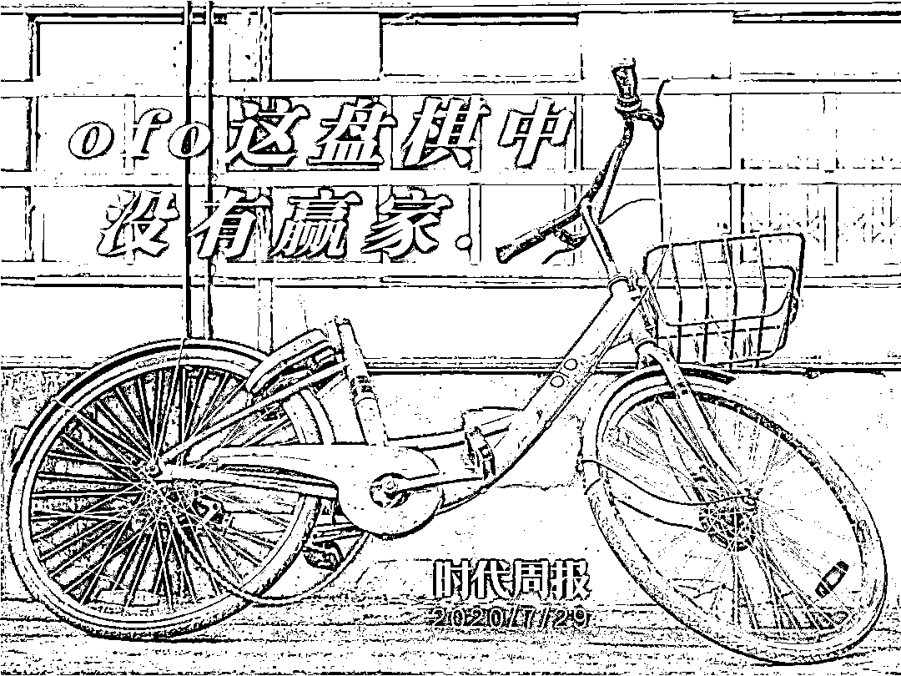
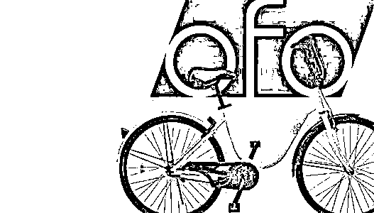
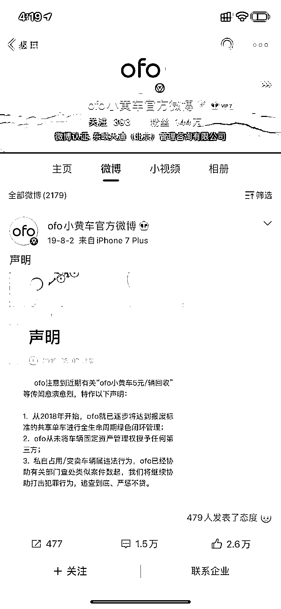
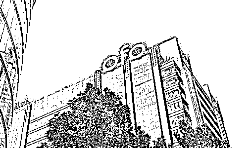
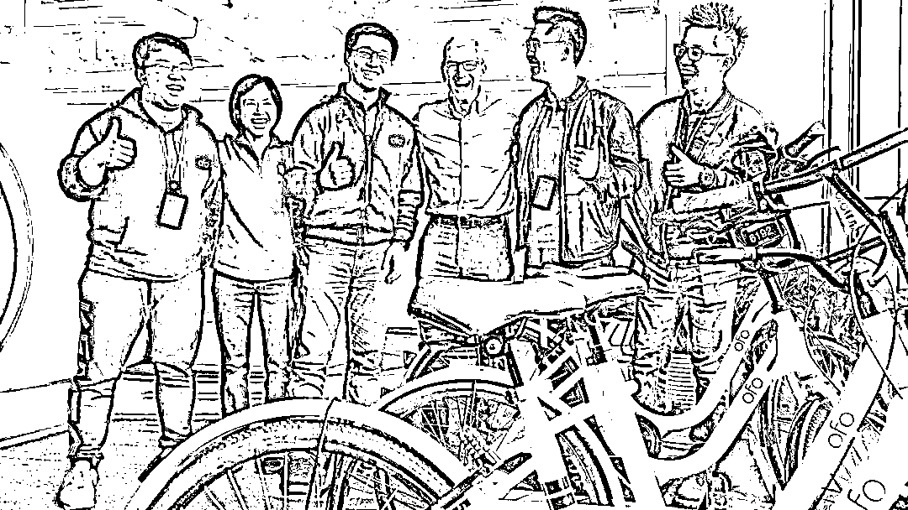
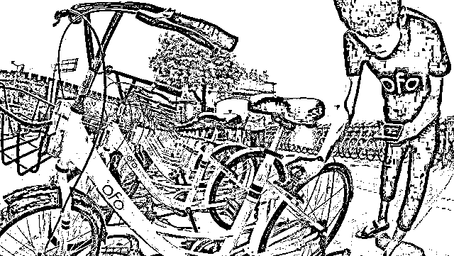
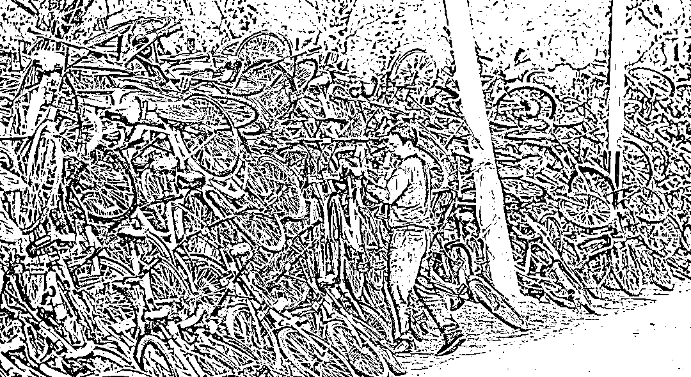
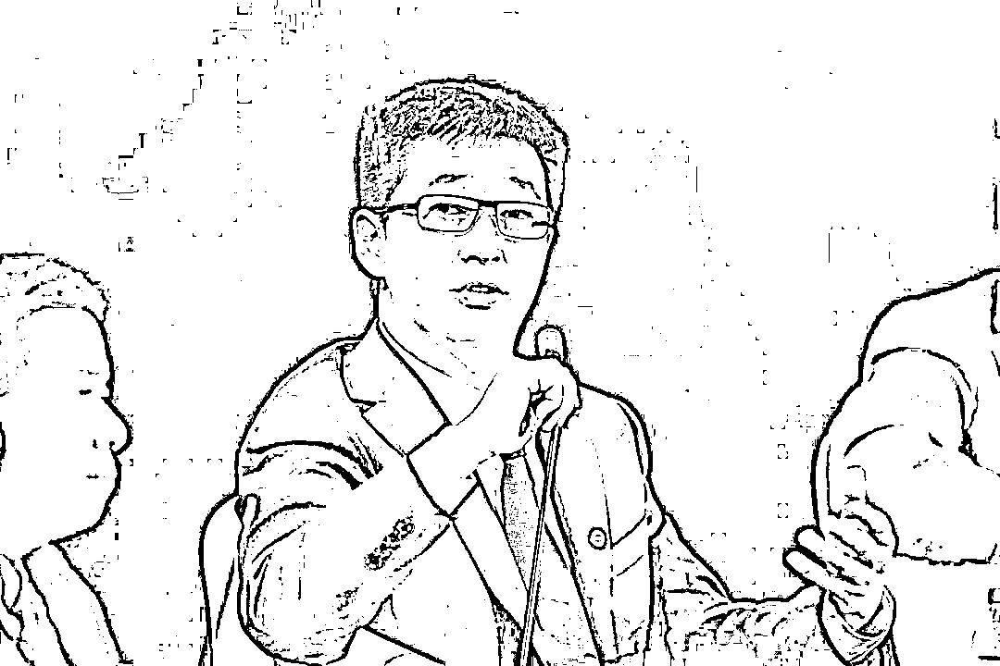
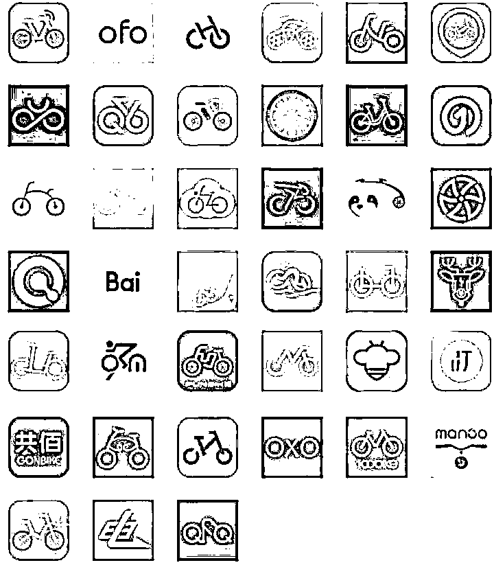

# ofo 这回真跑路了！欠款 20 亿，退押金等 500 年也没戏

> 原文：[`mp.weixin.qq.com/s?__biz=MzIyMDYwMTk0Mw==&mid=2247502077&idx=3&sn=8b751f090f7112ecb7371c0c481f301b&chksm=97cb03c5a0bc8ad34c18d9a7ed5e8962222891dedf507a5b40ec5b77278eca5d3e5ce9c97f4e&scene=27#wechat_redirect`](http://mp.weixin.qq.com/s?__biz=MzIyMDYwMTk0Mw==&mid=2247502077&idx=3&sn=8b751f090f7112ecb7371c0c481f301b&chksm=97cb03c5a0bc8ad34c18d9a7ed5e8962222891dedf507a5b40ec5b77278eca5d3e5ce9c97f4e&scene=27#wechat_redirect)

**点击上方蓝色字体免费订阅“灰产圈”**

****几乎在现有的一切公开渠道中，都无法再找到 ofo 的踪影。**** **据媒体报道，ofo 从官网、App、乃至公众号都切断了与外界的联系。其 App 上的机器人客服只会重复回复 “请您耐心等待”，拨打人工客服电话更是无法接通。****而 ofo 此前公开过的两个办公地址，一处早已人去楼空，另一处更是无人知晓其存在。**一夜之间，ofo 似乎人间蒸发了。******另一边，1500 万用户的十几亿押金、多个供应商的追缴债款，似乎也连同 ofo 的失踪，一起沉入海底，成为了一个秘密。******债务，成为人们关心 ofo 的唯一理由。********01**** ****ofo“消失”了******2017 年 12 月，ofo 资金链断裂、挪用用户押金的消息开始传出，创始人戴威紧急救火，回应称，“纯粹是造谣”、“ofo 不会动用任何一笔押金。”****但舆论的质疑没有平息，销售车身广告的举动被解读为“紧急自救”，ofo 8 个月得不到融资也被视为资本放弃的信号。****次年，ofo App 开始出现提不出押金的情况。**围绕着 ofo 小黄车，上千万人的讨债行动就此展开。**********据媒体报道，目前有用户退押金的排名已超过 1500 万位，即使按 99 元最低押金金额计算，**ofo 的该项债务已近 15 亿元。******有等待退款的用户调侃，2 天退款 90 人，等排到自己还要 572 年，往前翻的话那会儿还是明朝。******此外，时代周报新媒体记者发现，ofo 官方微博最近一次的发布时间停留在 2019 年 8 月 2 日。**内容为“针对小黄车被回收”的辟谣声明，底下评论区充斥着“还钱”、“退押金”的字样，而部分省市的公众号则早在 2018 年下旬就没有推送过任何信息。********来源：ofo 官方微信公众号******这些用户多想向天再要 500 年，可前提是****ofo 还有钱退，也不能申请破产！**为此，维权者们曾多次前往 ofo 公司北京总部，却扑了个空。****天眼查信息显示，ofo 关联公司东峡大通的注册地址为“北京市丰台区西三环南路 14 号院 1 号楼 620 室”。****而据此前媒体报道，北京市丰台区市场监督管理局曾将其列入经营异常名录，原因是**通过登记的住所或者经营场所无法联系，ofo 确实已经不知所踪。**********此前 ofo 办公大楼，北京理想国际大厦****除了用户，追缴货款的供应商也是无计可施。****如今，不少 ofo 的供应商纷纷表示，已放弃了追缴货款。“没意义，心里清楚拿不回钱了”，“还好金额不是特别大，只能自认倒霉”。**这些供应商中，尚未拿回的欠款金额从数千万元至 10 万元不等。******天眼查数据显示，截至 7 月 25 日，因未发现有可供执行的财产，ofo 的运营主体——东峡大通的终本案件（指被执行人没有可供执行的财产，法院裁定终止本次执行程序）为 227 起，未执行标的总金额约为 5.09 亿元。******也就是说，ofo 在超过 200 多次法院调查中，名下均无银行存款、车辆、房产等财产可供支付，它彻底没钱了。******而一份北京市昌平区人民法院 2020 年 5 月 9 日发布的执行裁定书则显示，其在 2020 年初对被执行人东峡大通予以线下查控及查找，**未找到被执行人，也未能发现被执行人可供执行的财产。******舆论一下炸开了锅，连法院都找不到 ofo 了，那么欠的 20 亿怎么办？******02********弹尽粮绝****的戴威******事实上，直到 2019 年夏天，戴威还在试图挽救 ofo。**只不过这一次，他真的是弹尽粮绝了。******相关信息显示，从 2018 年底开始，ofo 先后试水了虚拟货币、P2P、卖广告，甚至尝试借鉴蜂巢快递柜的模式，打造外卖保鲜柜，但这些项目不是倒闭亏钱，就是不了了之。********2017 年，戴威（左三）迎接苹果 CEO 库克** ****为了“加速”退款，ofo 摇身一变沦为购物返利平台。******正当用户欢心雀跃登上 App，想要领回吃灰的 99 元押金时，却发现 ofo 玩起了套路：想拿押金可以，但你要先在该平台上消费上万元......最终，在一片口水之中，其衍生物小鹿有货暗淡退场。******2019 年 6 月，戴威决定做最后一次努力，开始布局有桩单车的商业模式。**可上线不久，ofo 布局的数十个中西部城市，只有两个完成改造。****四个月后，员工王刚（化名）收到 ofo 城市区长的通知，“有桩失败了，公司不做共享单车了，但是资产要清算一下，车子需要变现，不能扔掉”。******核心业务停摆，这无疑宣告了 ofo 这家公司的死刑**，王刚心里百味陈杂。********回顾几个月前，创始人戴威还在 ofo4 周年公司庆典上，誓旦旦地说，**“欠用户的钱一定要还，就算到了别的公司，也要把电话号码都记下来。”******拖着整车的 ofo 单车，王刚来到废品厂，对方报价 25 元一辆。合同签好后，数十辆小黄车被当场拆卸成一个又一个零件，**而 ofo 投放时，每辆车的成本是 260 元。******在这之后，ofo 开始了大范围的裁员，创始团队也相继出走，办公室则越搬越小，越搬越隐蔽，以至于自家员工有时也找不到。****据公众号“豹变”报道称，目前 ofo 已无线下办公室，剩下的员工实行线上办公。**种种迹象表明，ofo 做完了最后的清场，起死回生彻底无望。******2020 年 1 月，创始人戴威退出法定代表人、执行董事和经理，由朱爱莲接任，独留一具 ofo 的空壳。2020 年 7 月，戴威第 35 次被法院限制消费，不得乘坐飞机高铁。****这个曾经意气风发的 90 后创业新秀，最终扔掉了所有包袱，选择了彻底消失，**仿佛在说，ofo 欠的钱，关我戴威什么事。********03**** ****共享经济，ofo 是先烈吗？******创办首家互联网打车 App 易道的周航，与戴威有相似之处。都是先驱者、也都是因为没处理好与资本的关系，逐渐掉队并离开舞台中央。****后来，周航在一本名为《重新理解创业》的书中，如此写道：****“回溯科技史，正是那些失败的产品成为革新的养料——失败的尝试也是历史中群星闪耀的时刻。”****可 ofo 是先烈吗？******不，它只是死得惨烈，甚至于没有给后人留下一丁点经验。************ofo 一诞生就戴上商业明星的光环，迅速被资本热捧。**在解决“最后一公里”的问题上，ofo 提出的共享单车模式是全球首创，也是为数不多成功推广到海外的商业模式。****2017 年，ofo 在半年之内拿下 76 亿元融资，公司急速扩张，戴威在理想国际大厦租下 4 个楼层，每一层的月租金不低于 200 万元。那曾是 ofo 的巅峰时刻。****可短短四年，ofo 就此以肉眼可见的速度崩塌，不少人想知道，ofo 为什么失败？**个中原因，身为创始人的戴威难辞其咎。**********ofo 共享单车创始人兼 CEO 戴威****AI 财经社曾在文章《戴威，官威依旧》如此评价他，“戴威，这个紧紧攥住手中的糖、不舍得放开的孩子，走到了众叛亲离的境地。”****为面子创业、在商不言商，既炒黄了本来与摩拜的合作，又因“押金账目不可视”，赶走了滴滴的收购团队。******戴维在资本与控制权方面没能做出取舍和平衡，导致不少投资人迅速撤离，资金链断裂。******另一方面，戴威虽率先引导出了共享经济的概念，但概念谁都可以复制，企业的盈利模式才是核心，这也是为何共享单车领域一顿乱斗后，只有支付宝与滴滴活得滋润。****事实上，在那个满大街都是各色共享单车的 2017 年，ofo 无疑是有先发权的，经过 8 轮融资，戴维拿到 150 亿。********2017 年，数十个共享单车品牌****可共享经济是个无底洞，需要的是持续烧钱供血，市场竞争又激烈，ofo 选择了疯狂扩产，比拼规模，比拼价格，比拼补贴，却迟迟找不到盈利点。****曾经有业内人士如此评价 ofo 的商业模式，“凭着投资者给打尼古丁续命，钱断一天就得死。”**没有持续盈利模式、更没法维系好融资关系，戴威是个理论家，而不是实干派。******2019 年 5 月，ofo 被立案调查，同时也标志着共享经济的深度洗牌。不依靠烧钱模式的共享，才是健康，可持续的市场。****ofo 这盘棋中没有赢家。上千万用户退不出押金，供应商拿不到欠款，员工树倒猢狲散，投资方的钱打了水漂，创始人一无所获，黯然离场。******残局之下，“讲信用”的戴威有打算把这大窟窿补上吗？******来源：时代周报（ID：timeweekly） 作者：草莓  凤凰财知道（icaizhidao）**************

**← 向右滑动与灰产圈互动交流 →**

********点击****阅读原文****加入灰产圈高端社群****