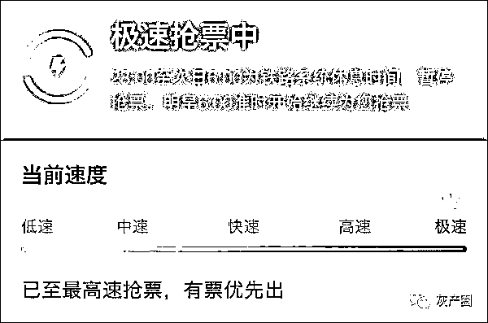
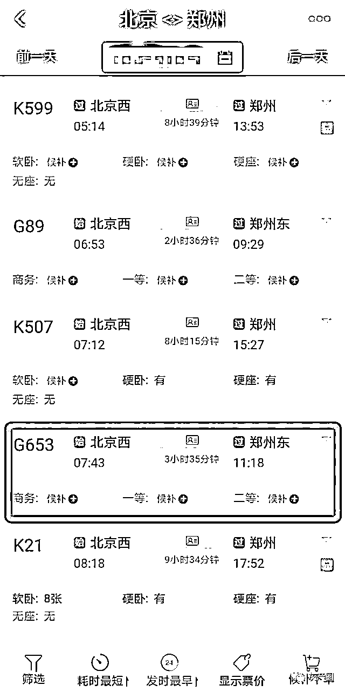
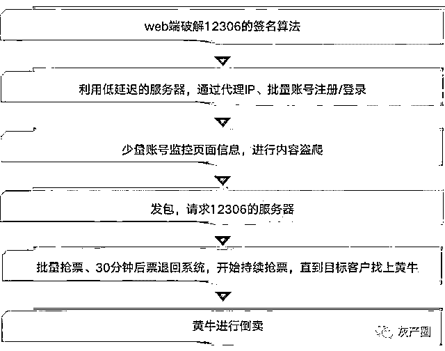
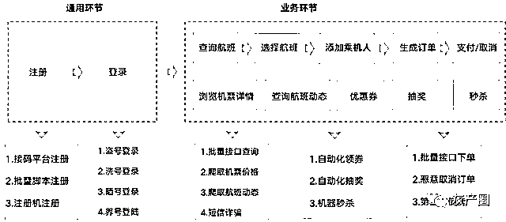

# 揭秘黑产：你的火车票是怎么被别人抢走的？！

> 原文：[`mp.weixin.qq.com/s?__biz=MzIyMDYwMTk0Mw==&mid=2247502077&idx=4&sn=68ab6092778c3b32befd54e910b26202&chksm=97cb03c5a0bc8ad3c670dafbc0cc616e1293bd281dc8f7c03bdb4b6dbb4dc8395c1882e8f64d&scene=27#wechat_redirect`](http://mp.weixin.qq.com/s?__biz=MzIyMDYwMTk0Mw==&mid=2247502077&idx=4&sn=68ab6092778c3b32befd54e910b26202&chksm=97cb03c5a0bc8ad3c670dafbc0cc616e1293bd281dc8f7c03bdb4b6dbb4dc8395c1882e8f64d&scene=27#wechat_redirect)

**点击上方蓝色字体免费订阅“灰产圈”**

“周四从北京飞郑州的机票又抢不到了，火车票也没了。”

无论是过年回家，还是假期探亲，每个人都会遇到类似“一票难求”的问题。为什么每次抢票会这么难？这些机票和火车票是真的没有了吗？随着假期时间的临近，抢票却一直在“加速中”，此时大多数人会开始找黄牛。

而这种结果也正中黄牛的下怀，当我们还挣扎在抢票加速的边缘时，黄牛却可以轻轻松松按照客户们的需求，抢下指定某时间段下的指定航班/车次，并收获一笔笔不菲的佣金。

为何黄牛能够轻松抢票？其实这背后反映出黑产非法盗爬访问和非法占座等恶劣行径。近年来，“提直降代”是民航业开展工作的重中之重，此前国资委要求国航、南航、东航等航空公司将机票直销比例提高至 50%。而直销比例的提高，约可大力改善航企营销模式并可助其节省高额分销费用。

但公开数据表明，黑产的非法盗爬访问和非法占座行为却给航空公司直接带来近 10 亿元的巨额损失。为了深入了解这些巨额损失背后的黑产“抢票”生态体系，数美黑产研究院的小赵（化名）首先瞄准了国内铁路交通业，开始了“入敌侦查”。

***为什么你总是抢不到票？***

1、上游非法盗爬

7 月 10 日，小方（黑产化名）先在 web 端破解 12306 的签名算法，然后注册登录少量账号，进行 12306 页面内容的非法盗爬和实时监控。主要目的是为了查看北京到郑州的各时段列车是否有票，以及具体的出行时间、列车座位。

“北京到郑州的火车票，12306 会在 7 月 13 日上午 10 点放票，小张（黑产化名）记得脚本设置为 10 点开始抢票。”小赵看到小方在群里发了这样的通知。

2、中游非法占座

小张的设定目标是要抢到 1 万张票，一个账号平均可以抢到十张票（一个账号可录入 10 个身份证号），所以小张就会利用 1 千个账号进行抢票。而黑产最不缺的就是账号、IP、身份证号等个人信息资源。

小张一收到通知，就将昨天通过“讯代理”购买的 4 千个 IP 账号和 4 万个身份证号，分成四个组合（组合 A、组合 B、组合 C、组合 D）。每个组合有 1 千个账号。由于要大批量抢号，小张使用的服务器延迟极低，然后通过打接口的方式来发包，请求访问 12306 的服务器。

7 月 13 日上午 10 点，12306 准时放票。小张通过组合 A 抢到 1 万张票后，不会立即付款，只会非法占座。12306 的可支付时间为 30 分钟，10：30，这 1 万张票再次返回系统。随后，小张开始用组合 B 的一千个账号进行二次抢票，重复组合 A 的占票步骤，依次循环......

3、下游黄牛倒卖

直到有客户小美找上黄牛小王，需要代买一张“10 月 1 日下午 3 点，北京到郑州的 G653 次列车，二等座”的票，佣金 50 元。

小王会登记小美的姓名、身份证号和手机号，然后发送给小张，小张便将小美的个人信息添加到他即将要在 11：00 抢票的组合 C 中。

帮助小美抢到票后，11：30 小张会继续开始第四波抢票，只要有客户再次上门买票，小张就会将客户的个人信息添加到下一波的抢票账号里。

与此同时，小张也会实时监控页面信息并盗爬。12306 发现上午发的票都被抢完了，很多人没有买到票，还在候补。就会定时 7 月 14 日上午 10 点继续放票，而小张会重复 7 月 13 日的抢票步骤，在 14 日上午进行再次操作。

为什么想买一张回家的票这么难？因为现在的抢票不再是拼手速、拼网速的问题了。同一张票，你需要抢过人工智能，很显然，这是不可能的。火车票是这样，机票亦是同理，通过黑产“抢票”的例子看，现在的黑产生态链已经完善优化到令人发指的地步了。

***黑产“抢票”惯性套路***

通过上文可知，黑产“抢票”拥有完整的上下游供应链。例如上游小方（负责非法盗爬访问、实时监控页面信息）、中游小张（负责大批量抢票、非法占座）、下游小王（兼职黄牛，对接客户赚佣金）。同时，黑产“抢票”拥有自己的“优势”：超低延迟的服务器，以及取之无尽的他人隐私数据资源。

1、火车票黑产作恶逻辑

以火车票为例，数美黑产研究院深入挖掘黑产主要的作恶逻辑，总结为以下几点：

首先，黑产需要在 web 端破解 12306 的签名算法；然后利用大量代理 IP、批量账号、低延迟的服务器，通过验证码来注册/登录；先登录少量账号监控页面信息，主要查看是否有票，以及出行时间；接着就是发包，请求访问 12306 的服务端；最后进行大量持续抢票、黄牛开始倒卖。

火车票场景下黑产作恶手段逻辑图

同样，与火车票的作恶手段类似，以某航空公司为例，数美黑产研究院发现，黑产从事内容盗爬活动，主要目的是借助程序自动化访问航空公司网站以获取需要的信息。

这些爬虫主要查询航司舱位、机票价格信息、航班动态信息等。黑产拿到这些信息后，往往会用于恶意占座、第三方平台的信息展示，甚至进行短信诈骗等违法行为。而航司查定比（查询下单比）高，主要原因也是爬虫。

细分来看，在航旅行业场景下，黑产的业务路径主要集中在通用环节和业务环节两个部分。如下图所示：

某航空公司黑产作恶手段逻辑图

显然，黑产在其中的作恶手段就集中在注册、登录、页面信息内容盗爬、营销活动欺诈和批量占座以及黄牛倒卖。同时，这些环节也是航空公司可有力防控黑产的重要途径。

***黑产“抢票”异常行为分析***

面对黑产在铁路交通/航空公司整个消费生态产业链的无孔不入，以及严重的数据盗爬与非法占座所造成的巨额损失，数美黑产研究院对黑产“抢票”的异常行为路径进行了全面分析。

**从黑产作恶路径上看，主要有以下四个方面：**

**1.**黑产在破解 12306/航空公司的验证码时，通常采用联众打码和机器学习的方式。而 web 端的设备指纹异常不稳定，对于是否伪造的辨识度要求较高。

**2.**黑产用批量代理 IP、账号等资源进行登录时，会出现大量 IP 的强聚集性。

**3.**由于黑产需要实时监控页面信息、查看票价的相关信息，所以会进行高频的账号请求访问。

**4.**在黑产开始大量抢票、进行倒卖的时候，会发生 IP 异常行为、资源离散等违规现象。

因此，对 web 端采取加固措施，可从“源头”对黑产进行拦截，不断提高黑产的成本。同时采用关联频度策略也可进行高效防控。

***应对黑产“抢票”风控策略***

对于航空公司而言，基础的风控措施必然可以起到一定的防控目的，但是如何精准识别并强有力打击这类黑产分子最为重要。因此，从技术手段到解决方案的并驾齐驱，服务架构和系统平台的优化迭代更为实用有效。

**数美黑产研究院发现，从异常行为的风控策略上看，主要涉及以下几个层面：**

**1.**在解决方案上，依据基础风控规则，为了确保数据安全性，可结合私有云架构来支持。如利用深度学习模型来搭建多种智能网络模型，并利用私有云定期更新黑产图像，从而不断提高和优化黑产异常行为识别率的精准度。

**2.**在实用价值上，针对特定风控场景，深入挖掘并制定灵活的风险策略。如取消订单团伙挖掘；恶意账号、设备、联系人、乘坐人挖掘；机器时序挖掘；事件缺失团伙挖掘；多实体时间间隔/事件序列/实体时序相似团伙挖掘；航司下单场景策略等。

**3.**在应用成本上，考虑资源预估与弹性扩容，避免风控管理流程冗余。尽量利用较少服务器来部署 Web 界面、接入模块、业务逻辑模块、决策引擎、基础引擎、统计引擎、元数据信息等，以此达到资源的充分利用，减少资源浪费。

**4.**在系统优化上，利用私有化的系统监控，来预防、巡检和预警各类异常风控现象。如主动调用 API 接口报警，及时同步相关业务人员异常信息的发生；运维人员定期调用并进行系统巡检；直接发现和报警访问量突增等异常行为。

来源：数美科技

← 向右滑动与灰产圈互动交流 →

**点击****阅读原文****加入灰产圈高端社群**

