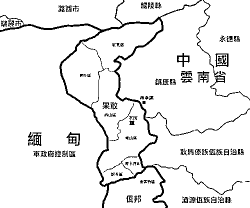
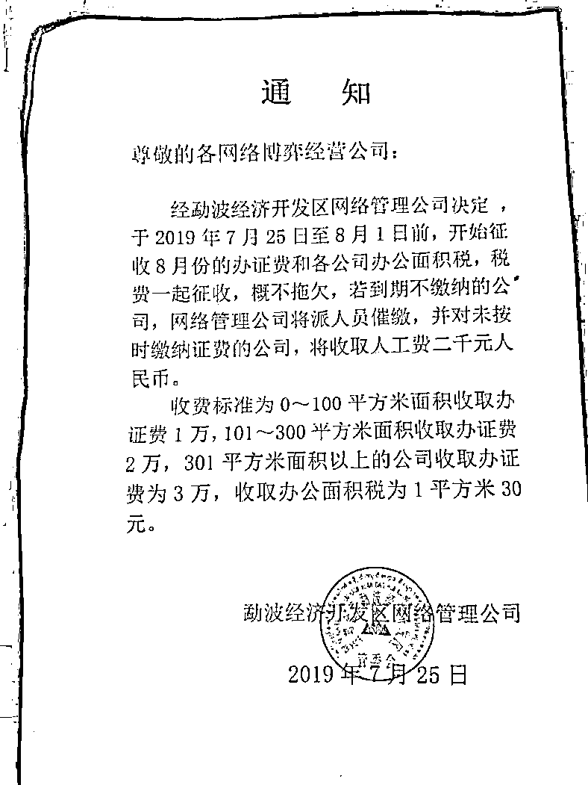
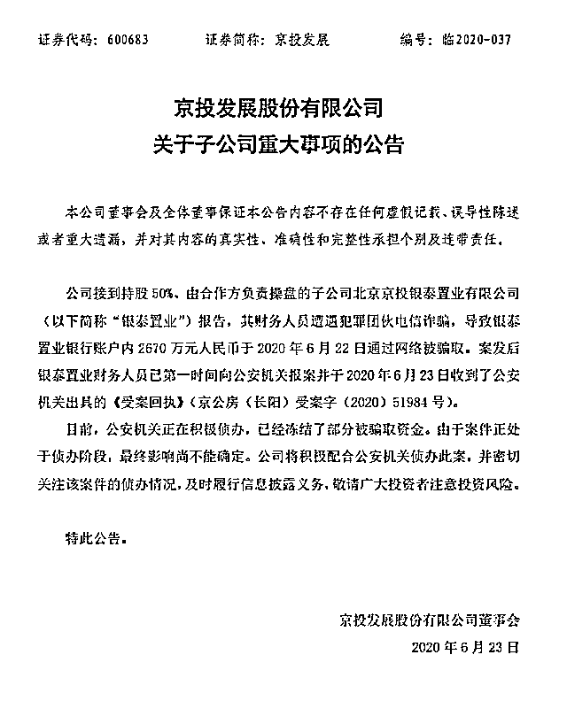

# 缅甸北部，10 万诈骗者的天堂：每年从中国卷走数万亿，势力盘根错节

> 原文：[`mp.weixin.qq.com/s?__biz=MzIyMDYwMTk0Mw==&mid=2247502105&idx=1&sn=8897d91fa418ecc500b5acda805ecfb0&chksm=97cb0221a0bc8b37902d4e2084cce4ff1f249a4abeffe7939cbe27c3c1ee922e2b07eddad55e&scene=27#wechat_redirect`](http://mp.weixin.qq.com/s?__biz=MzIyMDYwMTk0Mw==&mid=2247502105&idx=1&sn=8897d91fa418ecc500b5acda805ecfb0&chksm=97cb0221a0bc8b37902d4e2084cce4ff1f249a4abeffe7939cbe27c3c1ee922e2b07eddad55e&scene=27#wechat_redirect)

**点击上方蓝色字体免费订阅“灰产圈”**

> 尽管国人的防范意识不断提高，但架不住与时俱进的诈骗手段，无孔不入的套路轰炸，深谙人性弱点，防不胜防。

“带你兼职，日收入 300-500 元不是梦，努力一下就能轻松月入过万。”

“代办 1 万到 200 万大额信用卡，每 10 万(元)收取手续费 2000(元)，3 天到账。”

“您的账户已满 10000 积分，可兑换 10%现金，请登录 m.xxxxx.pw 查询兑换，逾期失效。”

生活中这类短信或电话司空见惯，每个月乃至每天都会收到若干，多数人一笑置之，很少有人注意到背后细思极恐的一连串问题。

**近年来，电信诈骗已成为新型犯罪的首要“毒瘤”。**仅仅 2019 年，我国共破获此类案件 20 万起，总金额高达数万亿，拘捕犯罪分子 16.3 万人。

眼看国内无法容身，骗子们又将触角伸到了国外。毗邻中国的东南亚成了出境首选，各种因素催化下，缅甸被视为犯罪成本最低的绝佳天堂。

据警方评估，诈骗中国群众的骗子，有 60%在东南亚，而其中又有近 10 万人在缅北，这个盛产骗子的地方，损失被挽回的几率几乎为零。

真的不是危言耸听。

01**“地利人和”的缅北，正成为诈骗者乐土**

6 月 25 日，云南西双版纳州澜沧江水域发生沉船事故，涉事船只为非法运营的缅甸籍客船，已获救的 17 名人员均为中国公民。

**冰山一角下，隐秘的中缅“双向”偷渡产业链渐渐浮出水面，动机并不陌生，而在这群庞大的偷渡客眼里，缅北才是终极目的地。**

缅北有着得天独厚的地理条件，四个城市直接与我国云南省接壤：云南普洱市对面是掸邦的第二特区佤邦，德宏州对面是木姐，临沧市对面是果敢，西双版纳州对面是掸邦第四特区小勐拉。

而 2000 多公里的中缅边境线，又是罕有的天然保护屏障。其间遍布田埂、小路和庄稼地，地势犬牙交错，蛇头们靠着这些“绿色通道”，带人穿越国境，来去自如，每次偷渡费用在 50～200 元不等。

另一方面，作为联邦制国家，缅甸常年局势动荡，其中尤以缅北政治形势最为复杂。政府军和地方武装力量常年冲突不断，却始终无法取得控制权，分身乏力，边境线管理自然形同虚设。

和其他东南亚国家不同，缅甸与中国渊源纠葛颇深。历史上，缅甸曾作为藩属国而存在，后随着明朝由盛转衰，缅人政权开始强大，逐渐不再受控，但在漫漫岁月长河里，两地群众语言习惯早已互相渗透，整体环境与中国内地相差无几。

更遑论新中国建交后，中国一直是缅甸第一投资大国。通讯上网靠的是移动、联通、电信三大运营商，交易使用的是人民币，微信、支付宝等第三方支付方式随处可见，汉语汉字更像是这里的官方语言，种种“利好”，为骗子们的猖獗大开方便之门，大量偷渡者疯狂涌入。

**2019 年，中缅边境的电信诈骗达到巅峰。**果敢、佤邦、小勐拉如火如荼地开发着，小勐拉科技园、佤邦孟平开发区科技楼、贺岛开发区智慧园拔地而起，昔日犹如过街老鼠的诈骗团伙，在缅北混得风生水起。

▲小勐拉

此前，缅北当地人的月收入平均在 1000 元左右，大量诈骗分子盘踞扎根后，物价接连飞涨，远高过国内一线城市，本土居民苦不堪言。

和国内坚决打击的强势态度不同，缅北将网络诈骗视为一种新型产业，支持其成为当地经济发展支柱，有意默许纵容一切犯罪行为。

为了巩固权力，增强财政，自然资源匮乏，又缺乏外部条件的缅北地方力量，正与急于求生的国内诈骗团伙一拍即合。

**诈骗团伙向缅北地方缴纳高额租金和管理费用，有一定规模的诈骗公司每年上交费用达数百万，缅北则负责通风报信，并提供武装保护。**

▲某经济开发区收取费用告示

有恃无恐之下，更多罪恶在滋生。有人专门提供技术服务、支付通道、网络推广；有人则钻起缅北没有独立银行，必须依靠人民币交易的空子，干起“背包客”的生意；有人专门提供四件套（银行卡、身份证、手机卡、盾），供诈骗窝点洗钱。

▲“背包客”身上查获的现金

臭名昭著的“e 租宝”实际控制人丁宁，就曾在佤邦花重金买了个“总司令”的头衔，还准备筹划成立东南亚联合银行，直到案发后，多名高管从该地区被带回。

从当年法院审理案件的报道中可知，仅在半年时间内，在丁宁的要求下，原钰诚集团多次组织、策划、安排偷渡多达 187 次，触目惊心。

▲如今，丁宁的银行成了废弃的空壳

2019 年 10 月，中缅边境大面积封停微信、支付宝，可见电信诈骗已到令人发指的地步，即便如此，依然无法阻挡丧心病狂的诈骗者们。

光照不到的地方，黑暗仍大量存在，虎视眈眈，不死不休。

02**跟着干日进斗金，“国人相残”不断上演**

**道高一尺，魔高一丈，尽管国人的防范意识不断提高，但架不住诈骗的手段也在与时俱进，无孔不入的套路轰炸，深谙人性弱点，防不胜防。**

时至今日，电信诈骗已然形成从信息买卖、实施诈骗、分赃销赃的完整分工链，甚至还有大数据和 AI 技术的辅助，各司其职，环环相扣，剧本越来越专业，对象越来越精准。

为了让“障眼法”更加到位，诈骗团伙会先通过电话、短信撒网筛选一轮目标客户，再通过添加社交账号，多轮“客服”沟通协作的方式，让数据尽量分散，单凭其中某一项，很难判断是否为诈骗，给取证工作造成很大滞碍。

利字当头，很多不可能也变作了可能。若说此前骚扰诈骗电话多以“400”、“800”、“1010”开头，而现在，以管理最严格、最稀缺著称的“95 号段”也成了诈骗集团的囊中物。

这类电话是工业和信息化部直接管理审批的号码资源，想要申请，公司必须有呼叫中心许可证，注册资金达到 1000 万元以上，每年还得参加年检。

但在形形色色的代办公司这里，所有的条件限制都是浮云。只要钱到位就能办，且不用担心号码被用户标记为“骚扰电话”而被手机软件拉入黑名单，代办公司另有渠道帮助解除处理，确保金主们“行骗无忧”。

诈骗分子们在大肆吸血的同时，也不忘给自身输血。当然，这种所谓的输血，同样是损人利己的勾当。

**为了保证“业务”的高速运转，诈骗公司会和国内的“黑中介”合作，在各类贴吧、QQ 群、以及劳务中介公司里，经常能看到这类精心包装过的“高薪招聘”广告。**

月工资通常以万起步，学历、工作经历基本没有要求，且包食宿、包税，业绩突出还可升级合伙人，早日实现财务自由，这对长期挣扎于工厂流水线的青年男女，以及涉世未深的大学毕业生，有着致命吸引力。

一旦踏入，等待这批“求职者”的非但没有想象中的康庄大道，而是噩梦连连。丧失自由只是最轻的处罚，辱骂、恐吓、鞭打则是家常便饭，全身而退无异于痴人说梦。

为了起到杀鸡儆猴的震慑效果，窝点的管理者会对最不服从管理的“刺儿头”进行示众，有人因此致残甚至丧命。

重压之下，无论是否自愿，大部分人只得沦为帮凶，不断设局骗人，越陷越深，从受害者沦为施害者。

这类“出国务工”酿成的悲剧案例不断上升。2017 年～2018 年间，云南警方曾动员全部出租车司机排查外地游客，只要得知是招工来的，一律劝返。

就在前几天，还有网友发出求助帖，称自己的朋友王先生与其他 5 位中国年轻人轻信“刷单赚钱”被骗至缅北，反抗后遭到囚禁，正等待解救。

▲王先生发出的求救微信

不仅个人会被引诱上当，就连财务转账有章可循的上市公司也难逃黑手。6 月 16 日，世龙实业发布公告称，公司因财务主管遭遇电信诈骗，导致银行账户内的 298 万元被盗取。

无独有偶，6 月 23 日晚间，京投发展发布公告，称子公司银泰置业的财务人员遭遇犯罪团伙电信诈骗，导致银行账户内 2670 万被通过网络手段转出。

这些藏身缅北的诈骗集团，黑白通吃，在国内布下天罗地网，只等猎物走入精心设计的圈套。

03**跨国抓捕阻力重重，背后势力盘根错节**

**“人在家中坐，骗从天上来”，为了捣毁诈骗组织，中国警方可谓费尽苦心。**

近年来，我国先后与泰国、越南、柬埔寨、菲律宾等国家会商，建立起联合打击电信诈骗的机制，但中国与缅甸之间，始终未能建立起相关制度。

缅北地形险要，又处于“军阀割据”的分裂状态，根本不听从于缅甸中央政府命令。再者，出于私心考虑，源源不断高额管理费的进账，使得缅北地方武装长期为诈骗团伙提供掩护，助纣为虐，得不到任何有效配合的情况下，中国警方的抓捕难度可想而知。

**尽管阻力重重，但国内对于打击犯罪的决心有增无减。**2020 年 1 月 4 日，全国打击治理电信网络新型违法犯罪工作电视电话会议在京召开。

4 月以来，杭州、云南、山东、湖南等地相继召开推进会议，部署打击整治中缅边境电信网络新型违法犯罪专项行动。5 月 31 日开始，我国对勐古、黑猛龙地区实施断电处理。

狡兔三窟，为了转移警方注意力，诈骗团伙会在国内大力发展“下线”，由这部分马前卒提供网络设备和电话卡，以及安装特殊 APP，为实施诈骗提供信息通道服务。

另一部分后方组织则负责收集社会闲散人员的身份证件资料，再到银行开通对公账户，提供给境外的电信诈骗集团进行转账提现。

讽刺的是，这些随时待命的“下线”在人赃并获后，竟全然不知“上线”在缅北的具体活动地址。

▲缅北某诈骗窝点内部情况，卧底偷拍

身为“亡命之徒”，诈骗团伙们通常有多处窝点，且保持相当密集的更换频率，行踪绝不轻易暴露。

2020 年 6 月 7 日，荆州警方沿着有限的线索，在公安部、湖北省公安厅的指挥协调下，抽调荆州市、县两级公安机关精干力量，奔赴云南边境开展追逃工作，通过云南警方和中缅警务协助，才得以成功将藏匿于缅甸的跨国电信网络诈骗案犯团伙头目严某抓获，并遣返回国，涉案金额高达 3000 万余元。

**尽管执法取得重大突破，但缅北问题依然棘手，大量犯罪分子仍逍遥法外，对国人的财产安全构成巨大威胁。**

截至目前，电信诈骗仍在以每年 30%的比例复合增长。暴利驱动下，不断有人选择铤而走险，远走异国，短暂的偃旗息鼓后，又以更复杂的诈骗形式卷土重来。

和恶龙缠斗注定任重而道远，而我们普通人要做的，就是在诱惑面前保持清醒，不留可趁之机，避免成为下一个“牺牲品”。

愿天下无贼，海晏河清的这天早日到来。

← 向右滑动与灰产圈互动交流 →

**点击****阅读原文****加入灰产圈高端社群**

