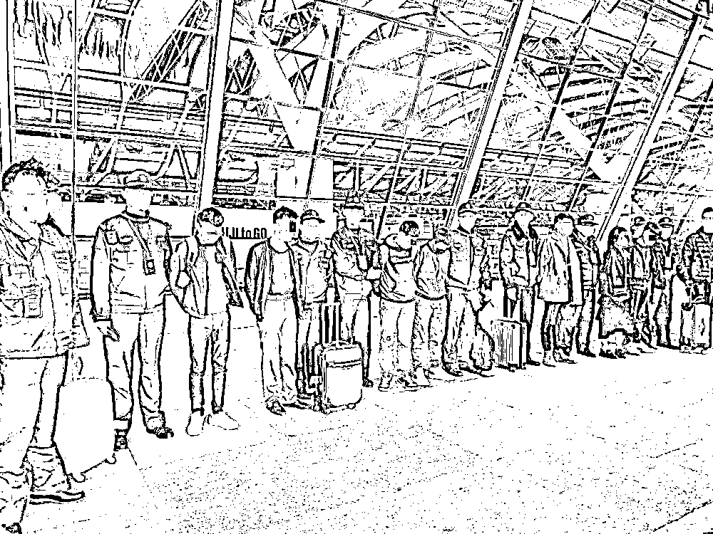
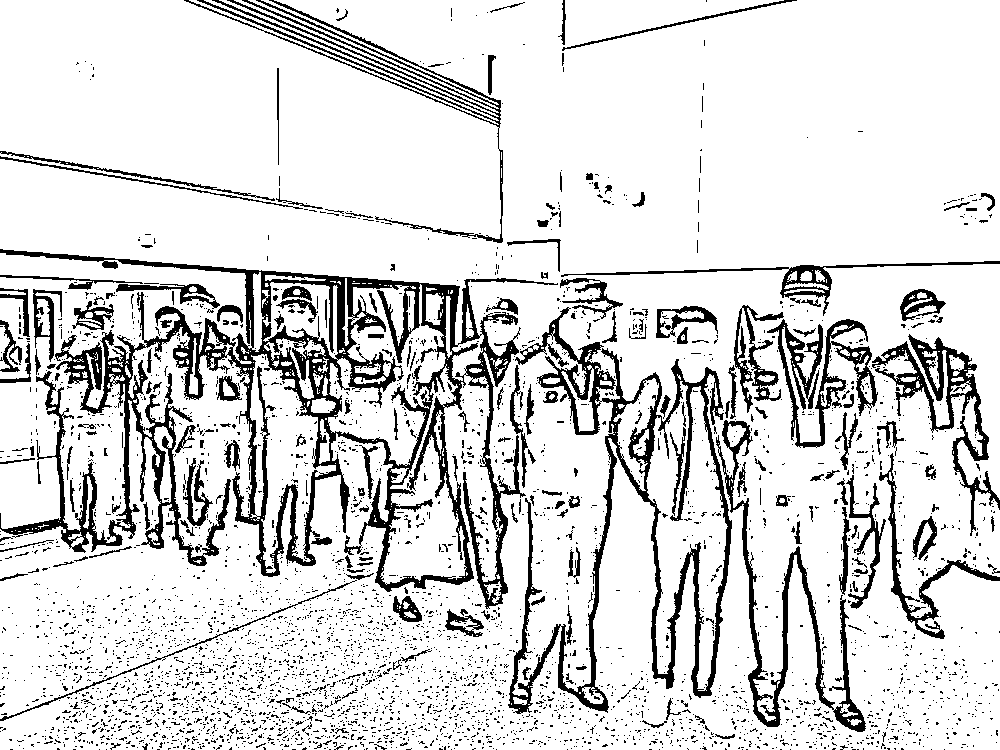
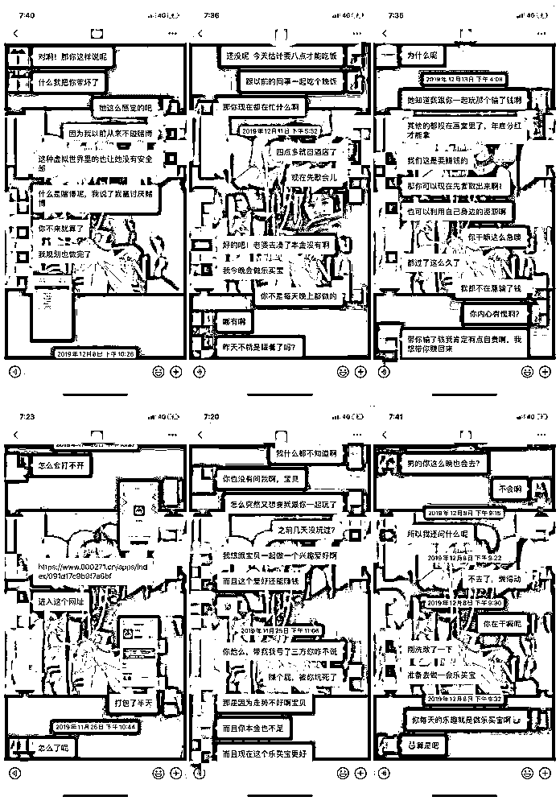

# 对话“杀猪盘”业务员：受监视、被殴打，在返回窝点的飞机上被捕

> 原文：[`mp.weixin.qq.com/s?__biz=MzIyMDYwMTk0Mw==&mid=2247502105&idx=3&sn=5da48cc722b5584f929b4bd4a0227927&chksm=97cb0221a0bc8b37eb82a8b69ed16fedf8f3fb1ab03da55dbef883bce719c06a00836f81d4f1&scene=27#wechat_redirect`](http://mp.weixin.qq.com/s?__biz=MzIyMDYwMTk0Mw==&mid=2247502105&idx=3&sn=5da48cc722b5584f929b4bd4a0227927&chksm=97cb0221a0bc8b37eb82a8b69ed16fedf8f3fb1ab03da55dbef883bce719c06a00836f81d4f1&scene=27#wechat_redirect)

**点击上方蓝色字体免费订阅“灰产圈”**

抓捕现场，上海警方供图

近日，上海普陀警方成功捣毁一个潜伏在境外，针对国内实施“杀猪盘”电信网络诈骗的犯罪团伙。

2019 年 11 月下旬，普陀警方在侦办案件过程中，意外获悉一起电信诈骗案件线索，分局刑侦支队会同市反诈中心、市局刑侦总队、网安总队迅速成立专案组。

随着调查的深入，侦察员逐步厘清了团伙的资金走向和人员架构。

**2020 年 3 月 4 日起至 6 月下旬，专案组先后赴福建厦门、上海等地抓捕犯罪嫌疑人共 42 人**。

经查，2019 年 8 月起，犯罪嫌疑人卢某镇伙同黄某庆、周某彬、周某强、刘某罗、江某龙等人，以介绍赴境外工作为名，主要以“老乡”为发展对象，免费代办签证、机票等出国手续，将人带至境外后开展所谓的业务培训，并逐步发展为团伙成员。

团伙通过网络交友，诱骗被害人参与境外博彩，最终实施“杀猪盘”电信网络诈骗。

已查证的案件共 20 余起，涉案金额达 500 余万元。

目前，42 名犯罪嫌疑人因涉嫌诈骗罪，已被普陀警方依法刑事拘留，案件正在进一步侦办中。

抓捕现场，上海警方供图

**专拖老乡下水，是这起“杀猪盘”诈骗案的特点。**

诈骗团伙中“中层”成员，以“底薪 6000、包吃包住”为噱头，将若干老乡诱惑至境外，强迫其参与诈骗。

**怀揣着挣钱美梦踏出国境的老乡们，本以为迎接自己的是一份高薪客服工作；**

**抵达当地后，却被没收护照、反复进行培训洗脑、接受军事化管理**。

被骗去国外的老乡，大多是 20 出头的男青年，他们在国内曾经是房产中介，餐厅职员，汽车美容师。

他们受金钱诱惑，声称被迫行骗；然而春节回国不久，却自愿接受诈骗团伙购买的机票，选择回到诈骗窝点。

近日，文汇报记者进入普陀看守所，与这起“杀猪盘”犯罪团伙中的三位“业务员”面对面对话，还原“杀猪盘”的诈骗过程，和他们在境外的“打工经历”。

上午九点多，记者坐在看守所某间房间内等候采访对象，雨声被隔音门挡在外面。

不多时，桂某、晏某、江某被依次带入，隔着厚厚的玻璃坐下。

他们都戴了口罩，很难看清表情，大多数时候眼睛都看向桌面，问答问题时很平静，鲜少有感情起伏。

**记者：这个公司是怎么骗人的？**

* * *

**桂某：**公司做了一个博彩 APP，培训的时候组长说这个 APP 的卖点是可以提前预测中奖名单。每个业务员会分到一个公司给的手机，还有一个设计好的身份，我们负责在网络社交平台上加女性聊天，聊的熟了就推荐她们下载公司的博彩 APP，让她们往里面充钱，先给一点甜头，等她们充一大笔就把钱划走。

**记者：你怎么进入这个诈骗团伙的？**

* * *

**桂某：**三年前我在老家做生意认识了一个朋友，2019 年他突然打电话给我，说要介绍我一份好工作，在国外做客服，底薪 6000 元，包吃包住，包来回机票，我没多想就答应去了。

**晏某：**和朋友吃饭时认识了朋友的朋友，大家都是老乡。这个人出手很大方，他说自己在国外一个月挣好几万块钱。我被他描述的工作吸引了，当他说介绍我去国外打工的时候我很快就答应了。

**江某：**我原本是做汽车美容的，有一天老乡联系我，介绍我去国外做博彩。他说自己一个月可以挣 2 到 3 万人民币，我就和 7、8 个同乡一起跟他去了国外。

**记者：去到国外以后宿舍、公司是什么样的，你每天都做什么？**

* * *

**桂某：**到国外以后，那个介绍人带着我们在当地逛了几天，我们住在一个高层公寓楼里，房间里是高低床，一个房间住 10 个人。没几天介绍人带我们去了公司，公司在很豪华的地段，但是装修很简单，就是一个空屋子，摆了几套桌椅。

**晏某：**住宿的地方有“督查”24 小时监视我们，到了睡觉时间会查房。宿舍距离公司很近，步行 5 分钟就到了。每天中午 12 点上班，半夜 12 点下班，傍晚 6 点时可以休息一个多小时。

**江某：**我们过去以后做的是“业务员”，其实就是拿手机在网上跟女性聊天。公司会发一些目标账号给我们，然后就按照公司给我们的剧本和话术去搭讪。诱导她们下载 APP。对方相信后，组长会把手机收走，由更高级别的人去和对方聊天。

**记者：你的身份设定是什么？**

* * *

**桂某：**我分到的身份是 30 多岁的老板，有房有车有公司，离异。公司会不时发一些豪车、出差、聚餐等等的图片和小视频给我们，我再把这些东西发给对面，博取她们信任。

**晏某：**我扮演的是一个叫做尹剑的老板，34 岁，做工程，有钱，很帅。经常发一些宝马、奔驰的照片给聊天对象。

**江某：**我的角色叫王立，是一个做进出口贸易的经理，浙江杭州人，开几百万的那种豪车。

“杀猪盘”业务员（左）与被害人（右）聊天记录。上海警方供图

**记者：公司有业绩要求吗？你的业绩怎么样？**

* * *

**桂某：**要求一天最少要和 3 到 5 个人聊天。我去做了一个多月，一共聊了 3 个女性，她们三个人都在 APP 里充过值。其中一个充了 20 元，但是她以前被骗过，看到赚钱以后就连本带利提走了。另一个充了 1000 元，她把这件事告诉了朋友，她朋友劝她不要玩，她也把钱提走了。所以这些都不算业绩，我没有挣到一分钱提成。

**晏某：**我去了 4 个月，一共骗了 6 个人，加起来骗了 2、3 万元，但是提成只拿到了几千块。业绩好的人一个月可以骗 8、9 个人。组长鼓励我们聊天的时候多讲一些暧昧的话，比如互相叫“老公”“老婆”。

**江某：**公司规定，如果一个月骗到的金额小于 5 万，业务员提成可以拿 5 个点，骗到 5 万到 10 万的话可以拿 7 个点。我干了 3 个月，最多的 1 个月底薪加绩效一共赚了 1 万元。

**记者：公司对员工的管得严吗？**

* * *

**桂某：**很严格。往来宿舍和公司都必须集体行动，每时每刻都有“督查”看着我们。督查每天会查手机。如果业绩不达标，督查会体罚我们做俯卧撑，要是还不提高业绩，就会把人关到“小黑屋”，过一阵子会有人进去跟他“谈心”。

**晏某：**在公司里，督查会看我们坐姿是不是端正，有没有通过手机聊不正常的东西，抽烟时间不能超过 5 分钟，不能和别人一起去。

**记者：你什么时候意识到这是在诈骗的？**

* * *

**桂某：**去了一个星期以后，有一天我刷抖音，看到短视频里警察抓捕了一个诈骗团伙，就在公司隔壁，我发现他们做的事情和我很像，从这时候起我开始觉得自己在骗人。

**晏某：**去了没多久我就意识到不对劲了，我问过组长，组长告诉我这在国外不违法，他向我保证不会出事。

**江某：**去之前我就知道是去做博彩，我想去赚钱。呆了一个星期后我想回来，但是公司告诉我如果我提前走了，要赔几万元的押金。

**记者：你想过要回国吗？**

* * *

**桂某：**想过，护照被公司收走了，我也没有挣钱，所以回不来。一直到过年之前，我跟公司说想回家看望老婆孩子，他们才买了机票放我走。

**江某：**想回来，但是人生地不熟，公司又看得严，不敢报警，也不知道该向谁求助。

**记者：意识到自己在骗人后，心里有没有觉得愧疚？**

* * *

**桂某：**我也不想骗人，但是公司会对我们洗脑，组长一直告诉我：“是她愿意聊的，赌输了也是她活该。”

晏某（唯独在这里，他沉默了很久，没有马上回答记者的问题，转而调整了一下坐姿，靠在椅背上）：**到了晚上，会觉得对不起这些女孩子。**

**记者：你说自己不想骗人，那么你们有没有团结起来反抗过？**

* * *

**桂某：**我们平时接触到的是督查和同层级的客服，大概是 30 个人左右，但是我们之间不怎么交流。

**晏某：**不听话的话，老板会叫 5、6 个督查一起把你打个半死。

**江某：**有过反抗情绪的人都被打了。之前有几个人在宿舍策划宁愿交赔款也要回国，他们很快被叫到公司，老板问：“是谁带的头？”有一个人站出来认了，督查当着所有人的面把他打出血。

**记者：家人知道你们在国外诈骗的事吗？**

* * *

**桂某：**老婆孩子知道我在国外，但是不知道我在诈骗。

**江某：**不敢说，骗他们在外地打工。

**记者：你原本已经顺利回国了，然后是节后在去往境外的飞机上被捕的，为什么还要再去？**

* * *

**桂某：**我押金还没赔完，他们让我过去帮忙做饭。

**晏某：**我不想干了，但是想过去那边玩一玩。

**江某：**不知道要干嘛，就打算再去看看。

来源：文汇报   作者：何易 周辰 编辑：王翔   责任编辑：顾一琼

← 向右滑动与灰产圈互动交流 →

**点击****阅读原文****加入灰产圈高端社群**

