# 这是一个从一条短信开始的骗局……

> 原文：[`mp.weixin.qq.com/s?__biz=MzIyMDYwMTk0Mw==&mid=2247502178&idx=1&sn=f31127582a179b1755e0bfc50b935cc3&chksm=97cb025aa0bc8b4c9304c118fecca1b564e29638ed867b2199e57b241cacb9179875b2dc8d69&scene=27#wechat_redirect`](http://mp.weixin.qq.com/s?__biz=MzIyMDYwMTk0Mw==&mid=2247502178&idx=1&sn=f31127582a179b1755e0bfc50b935cc3&chksm=97cb025aa0bc8b4c9304c118fecca1b564e29638ed867b2199e57b241cacb9179875b2dc8d69&scene=27#wechat_redirect)

**点击上方蓝色字体免费订阅“灰产圈”**

**今天**

**咱们来讲一件**

**从一条短信开始的骗局**

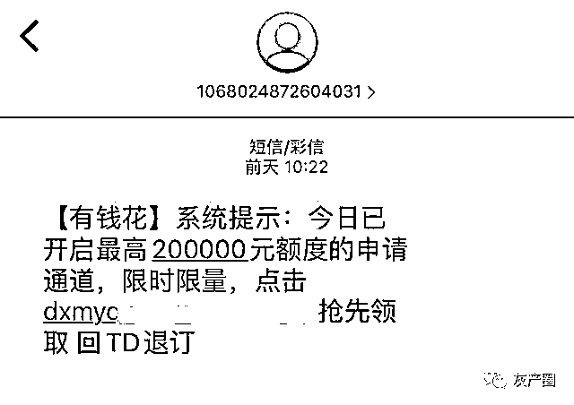

相信不少朋友也收到过此类内容的短信吧，大致内容为“某某网贷平台今日开启高额度申请渠道”然后附上一条链接，点开后会跳转 APP 下载页或者网页。而这就是冒充网络贷款诈骗的第一步“短信引流”。

冒充网络贷款诈骗的犯罪分子一般会采用冒充知名的贷款平台的方式，使用境外号码批量发送钓鱼短信。

看到这里大家会有疑问了，骗子怎么会得到我的手机号呢？我们用手机号注册的各大新闻客户端，浏览过里面插入的“贷款类”广告的用户，都会被大数据标记为“潜在客户”，从而给骗子提供精准的手机号名单。

**还真别说**

**骗子做的这个山寨页面和真的真像**

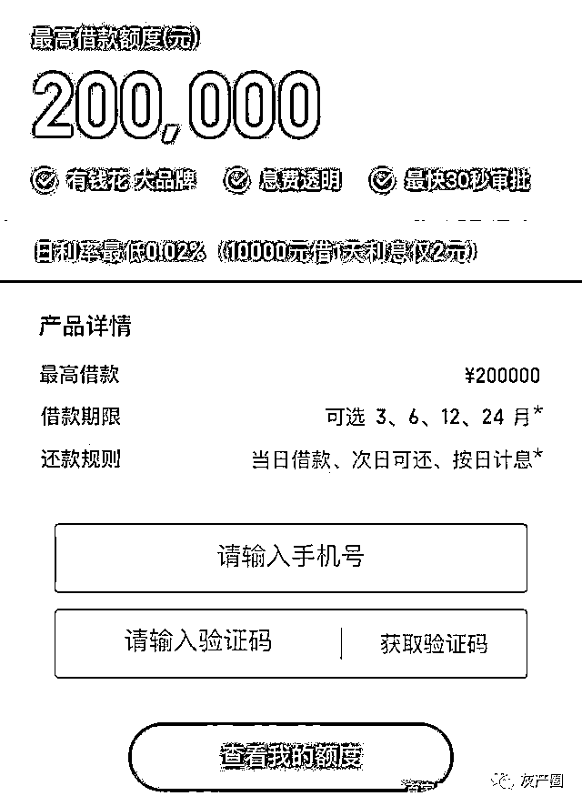

而如果恰巧碰上有资金需求的人，注册并下载了 APP 后，则会迈入骗子诈骗的第二步“下载 APP”。

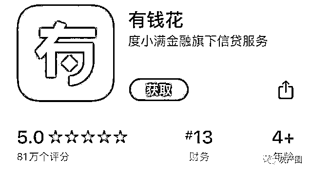

**APP 是由骗子制作的山寨 APP**

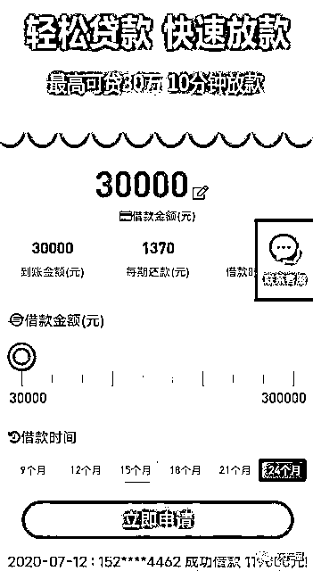

界面与大多数网络贷款 APP 大致相同，骗子可以通过后台数据修改仿冒各种网络贷款 APP。

而且还会时不时的从不知哪个显眼的位置弹出“某某用户成功借款多少多少钱”的信息，而且数额还都不少，这就是骗子再进一步设套引诱受害人的“鱼饵”。

看着别人一笔一笔的贷款申请的快又多，这时如果你心动点击“立即申请”，进入骗子套路的第三步“填写资料”。

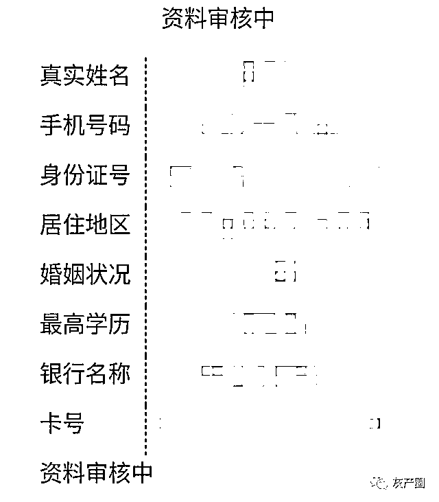

界面中会要求你填写一连串的个人隐私信息，包括姓名、手机号、身份证号等，有的还要求提供身份证照片或手持身份证照片。而这里，越是让你提供的资料具体，后续在威胁恐吓时骗子提供的手段越多。

当资料提交后，会有客服与你进行联系进入审核阶段，而不少案件中，在这个环节，骗子就开始对受害人下了“第一刀”，也就是第四步“交包装费”。

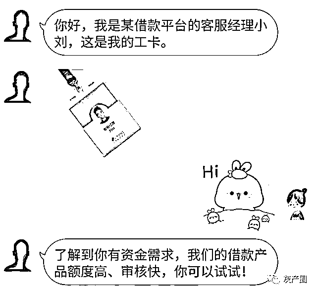

骗子客服会装模作样的询问一下你的借款用途、收入还款能力等等，并且极具耐心的回答你的各项咨询问题，态度相当的耐心友好。

然后借款人确实资质不那么理想的话，骗子还会贴心的提供所谓“信息包装服务”。既然是服务肯定不是免费的，骗子会要求提供一笔资金证明借款人的还款能力等。

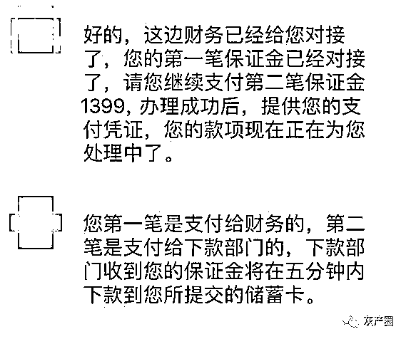

小小的宰了借款人一刀后，为了下更狠的刀，骗子会很快提示借款人审核成功，然后继续第五步“审核成功”，下更大的饵，让受害人更加深陷其中。

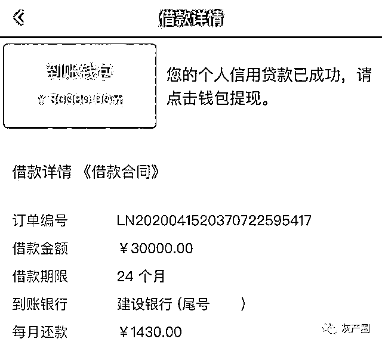

山寨 APP 里显示审核通过后，受害人都可以在 APP 的我的钱包中看到“到账款项”。

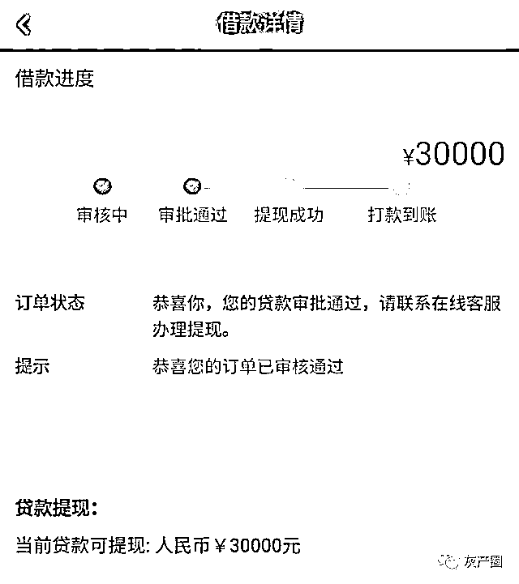

钱看着是到账了，但是这看着已经到账的钱如何能真的提现到自己的银行卡里就真的障碍重重了，而从这一步开始也就进入了骗子开始连环下刀的阶段了。我们将其归类为第六步“各种手续费”。

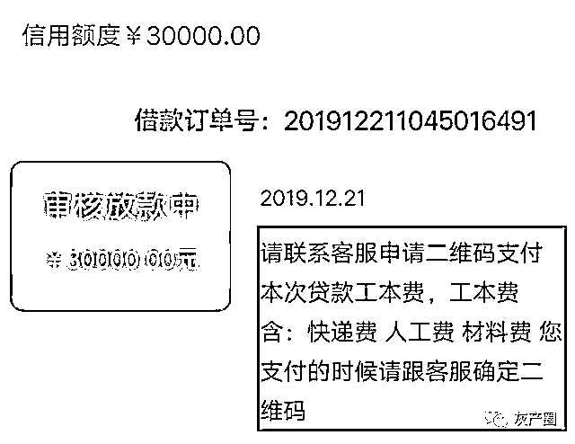

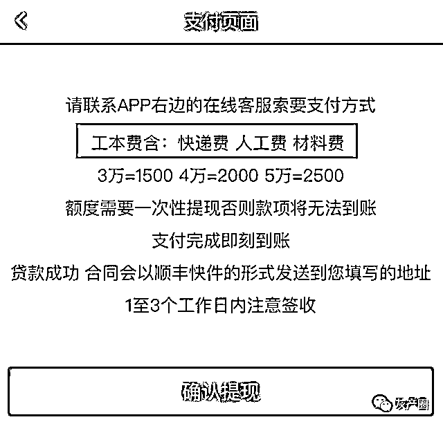

受害人按照 APP 的提示联系到客服，然后客服会按照提示，向受害人索要工本费、快递费、人工费、平台费、材料费等等。

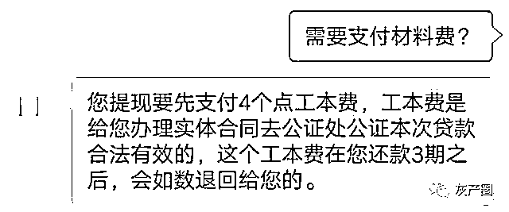

眼看着钱包里到账的钱却无法体现，而且翻看了提供的电子合同也怎么看怎么正规，不少受害人寻思既然钱都快到手了，总不能“到嘴的肥肉吃不到”吧，更何况一些受害人已经缴纳了包装费了，更不会在乎再出一部分“工本费”了。

爽快的交完“工本费”，然后开始填写银行卡号进行提现，但是受害人等了半天这提现的钱就是没有显示到账，为什么呢？那就是第七步“银行卡号错误”。

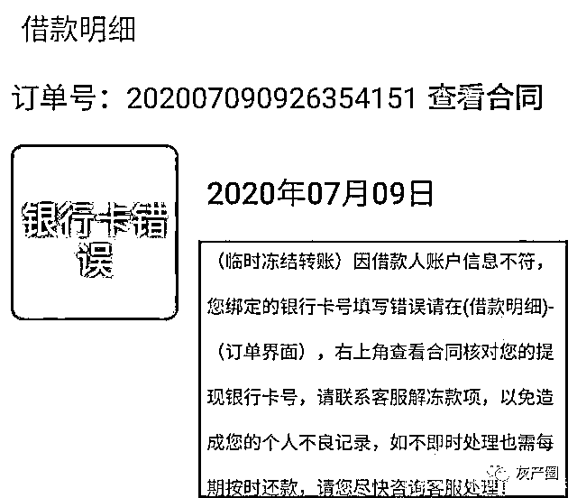

大家输入银行卡号肯定都是仔仔细细一个数字一个数字输入的，但是为什么在这个 APP 里这银行卡就死活输不对呢？

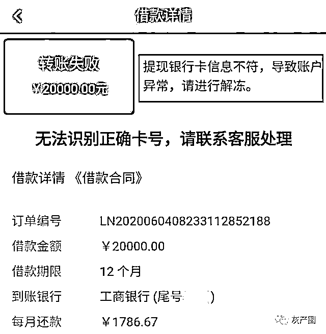

因为骗子的 APP 系统中，设置了特殊的修改程序，在点击“提交”按钮之后，卡号中的某一位数字，都会突然莫名其妙的变化。

这肯定就是怎么都输不对卡号了，钱在账户里转不出，再一看合同，已经成立贷款关系了，这钱没到账还需要按月还钱，这谁心里好受啊，找客服！而这时，骗子扮演的客服已经等待已久了。

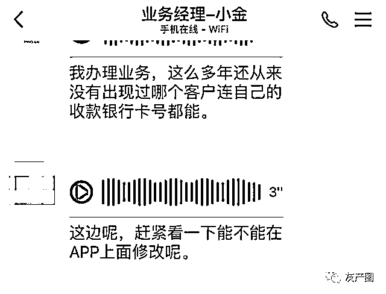

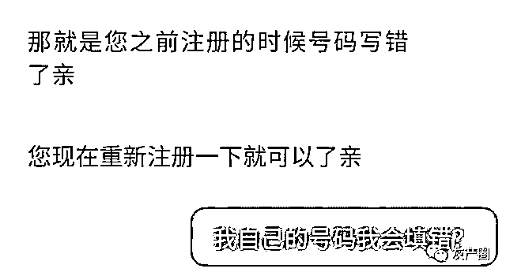

本来就不存在的钱当然无法提现了，况且是为了进一步去下刀骗钱，无论受害人如何再三核实，填写正确的银行卡号，都会出现输入错误的情况。随后，骗子告诉你，错误的次数太多了，账户被冻结了，里面的钱出不来了！

折腾了半天，到手的钱冻结了，而且还提前给了“包装费”“工本费”这搁谁谁心里都得有气啊，况且帐号冻结了按合同照样还得还钱，大多数受害人都会着急上火也顾不得分辨是不是有猫腻了，而这时就要进入诈骗的第八步“解冻账户”。

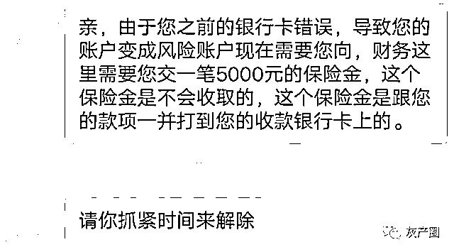

如果不继续缴纳解冻费，将会受到各种“威胁”……

1、必须按时还款

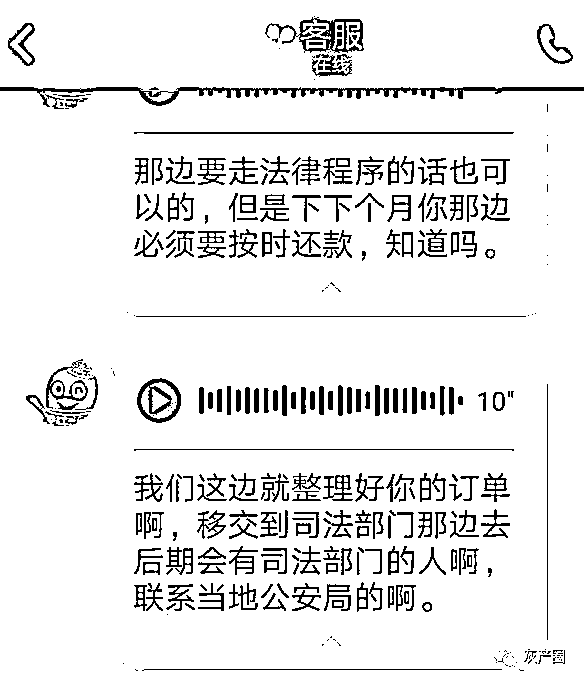

骗子说：钱已经到你名下，公司无权回收。

不管你解不解冻，都必须按时还款。这一条就引导贷款人做出了唯一选择：如果必须还款，那为什么不再博一把呢？

2、红头文件警告！

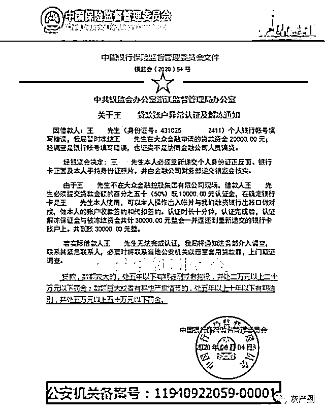

这种伪造公文的形式，来源于“冒充公检法”骗局中的《通缉令》，现在已经被移植到了贷款诈骗当中。

这种盖着大红章，顶着银保监会帽子来对贷款人进行恐吓，效果同样非常好。看看，样式是不是特别相同？

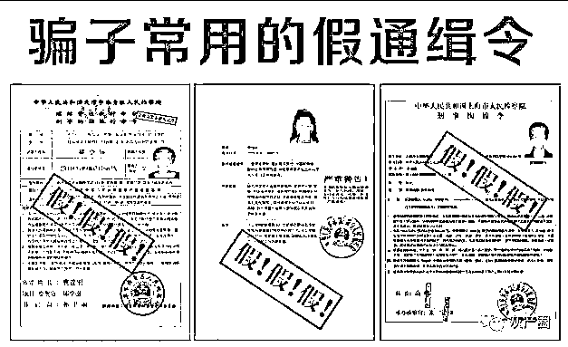

3、威胁要暴力催收

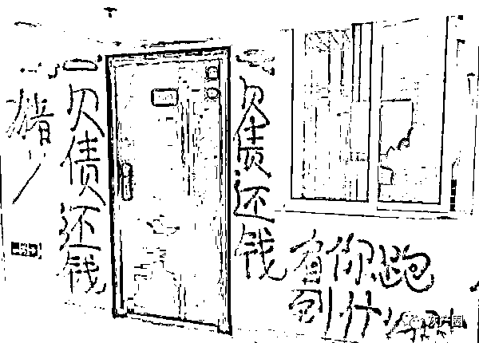

还记不记得开始填写申请信息时让你提供的详细个人信息？那就是为了这一步威胁而准备的。

交完解冻费，还有平台费，交完平台费，还有会员费......总之，这一步一步之后还有各种名头的费用继续等着受害人，而一旦受害人醒悟上当受骗，客服立马消失，这个山寨的 APP 受害人也再登不上去。

> **1、短信引流**
> 
> **2、下载 APP**
> 
> **3、填写资料**
> 
> **4、收取“包装费”（第一刀）**
> 
> **5、审核成功**
> 
> **6、“各种手续费”（第二刀）**
> 
> **7、银行卡号错误（磨刀霍霍）**
> 
> **8、解冻账户（连环出刀）**

这么多步骤下来，其实骗子根本就没钱借给你，也没打算贷款给你只会不断的编造理由找你要钱要钱要钱

友情提醒

**1.**贷款应当首选银行等合规金融机构，一定要走正规程序，银行等正规金融机构提供的贷款产品对借贷人有较高的要求，这些限制条件对借贷方有一定的保护。

**2.**不要轻信网络、电话和短信中的贷款广告，更不要轻易点击不明链接，办理贷款前应确认贷款机构的正规与合法性，只有网页和电话号码的，放款前收取费用的都是诈骗，所有正规的单位都不会在放贷前提前收取费用。

**3.**注意保护好个人信息和隐私，对网络上自称银行工作人员、贷款公司客服等身份推销贷款业务的人员，一定要万分警惕，正规的金融机构不会通过微信、QQ 等社交软件联系借贷人沟通办理借贷业务。

**凡是贷款前要缴纳各种费用的**

都是忽悠！

都是诈骗！！

都是陷阱！！！

骗子的诈骗手法繁多，

但万变不离其宗，

大家只要做到

不贪小便宜，不轻信，不盲从，

骗术终究会被识破。

来源：平安周口

← 向右滑动与灰产圈互动交流 →

**点击****阅读原文****加入灰产圈高端社群**

