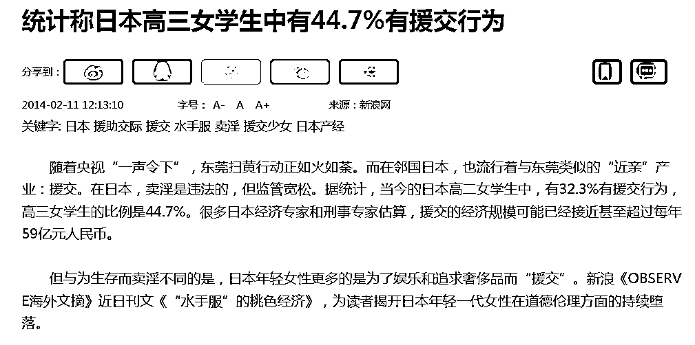
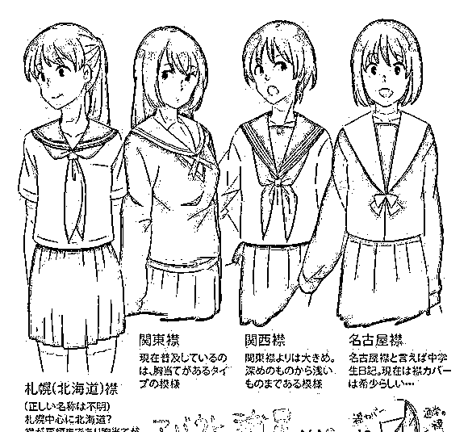
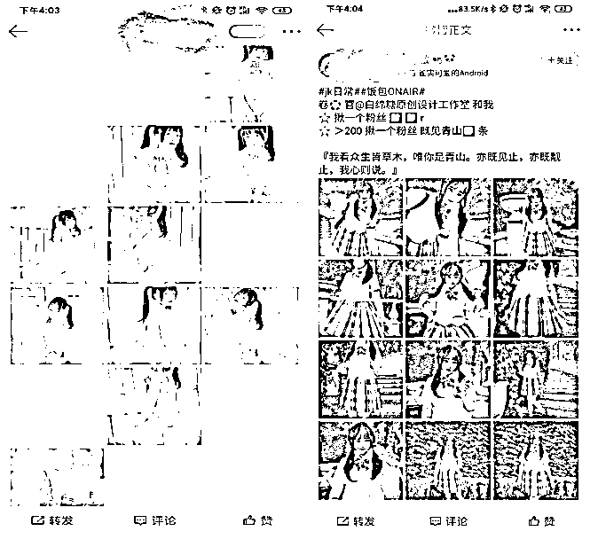

# 涉黄？暴露？软色情？为什么二次元的援交与福利姬是不可控的

> 原文：[`mp.weixin.qq.com/s?__biz=MzIyMDYwMTk0Mw==&mid=2247502178&idx=2&sn=952ccd3ce7b39b1be6b8a6b0400e37af&chksm=97cb025aa0bc8b4c31cf325bfdef4f4a90c206ff9a3b5d6390d3e242c3e3090e719a0c0a3b65&scene=27#wechat_redirect`](http://mp.weixin.qq.com/s?__biz=MzIyMDYwMTk0Mw==&mid=2247502178&idx=2&sn=952ccd3ce7b39b1be6b8a6b0400e37af&chksm=97cb025aa0bc8b4c31cf325bfdef4f4a90c206ff9a3b5d6390d3e242c3e3090e719a0c0a3b65&scene=27#wechat_redirect)

**点击上方蓝色字体免费订阅“灰产圈”**

一年一度的 ChinaJoy 又来了，不过自从 2016 年最严限制令出台后，展会上的模特早就包的严严实实，自然不会对参展的人们有什么“不良影响”。

但是二次元圈子也并未因此变成一朵白莲花。

最近先是某女生在漫展上做出不雅动作，受到大量二次元爱好者的激烈批评。然后是某漫展上女性穿 JK 被偷拍，又传出事主报案并宣布再也不穿 JK 的消息，这一系列事件让部分圈外的人也开始注意到二次元圈子的乱象。

不过我们用历史的眼光看，二次元和色情，甚至是性交易之间有密不可分的关系。

**01**

**色情本来就是二次元的一部分**

中国的二次元产业源于岛国日本。

二战以后，日本早期的动漫从业者诸如手冢治虫受到法国漫画和美国漫画的影响，开始创造了他们自身的动漫产业，经过近半个世纪的发展，已经成了日本最具有输出性的产业之一。

不过在岛国动漫产业中，有一个非常重要的产业分支，就是色情动漫，伴随动漫产业本身的兴旺发展起来。

在国内被称之为“里番”，俗称“本子”。

CNN 在 2014 年的一篇报道中，将日本称为“色情大国”，专门批评了日本的“儿童色情”漫画，这篇报道刊发之后在日本国内也引起了轩然大波。

实际上，日本主流社会中对色情动漫有着非常严格的限制，引起社会各界对二次元负面影响的是九十年代初的“宫崎勤”事件，此君在 1988 年至 1992 年期间连续诱拐杀害了多名女童，被捕后又装疯卖傻地辩称杀人的都是动漫人物，其家里充满了动漫、色情制品的“御宅族”身份被媒体曝光之后，引起整个社会对“御宅族”的评价走向负面。

宫崎勤房间的陈设是典型的沉迷于动漫、色情“御宅族”风格，也就是我们常说的宅男

此事件之后，日本文化产业部门开始加强对动漫制品的内容分级管控，尤其是涉及到裸露、暴力等内容的作品，会进行非常严格的分级划分，将其纳入到 15 禁、18 禁等限制级之内，这对于日本主流的动漫产业是非常严格的打击，但是对于色情动漫，实际上又没有什么本质的影响，因为这类色情产品本身就面向成年人，对于好奇的青少年来说，分级制度也不可能从根源上杜绝他们的接触。

即便如此，色情动漫的出产量依然非常大，根据日本机构的统计数据显示，日本的动漫产业每年可以达到 56 亿美元，其中色情、软色情的出版物、玩偶、服饰等下游产业能够达到三分之一甚至更多的金额。

**02**

**JK 制服和甜心爸爸，钱色交易的全球化**

日本的色情动漫产业屡禁不止当然受到国内外妇女儿童权益保护者的批评。2013 年美国国务院的一份报告将日本称为“生产和运输儿童色情制品的国际枢纽”。

有研究者认为，日本的色情、软色情产业鼓励了青少年女性进行性交易现象的泛滥，也就是所谓的“援助交际”。这是一个一个数额达到 50 亿日元的产业，日文片假名写作“えんじょこうさい わりきり” ，拼音为“Enjo-kosai”。

数年之后这一现象开始蔓延到韩国、香港和台湾。

援助交际，表面上看就是“钱色交易”，但是在日本的社会背景下，还有着更复杂发展过程。

随着日本经济在八十年代的逐渐兴旺，社会物质欲望繁盛，就有大量的年轻女孩想要通过肉体来换取金钱。

在早期的方式，援助交际等同于“收费恋爱”“租赁女友”，参与这种活动女孩子理直气壮的认为“因为我和你交往，请给我零用钱”。反而让钱色交易蒙上了一层清纯气息。

购买服务的男性，也乐于如此，因为相比于妓女的简单直接，他们更愿意在有青春气息的高中生身上花钱，获得性之外的情感抚慰和陪伴。

在 80 年代，一开始在东京流行一种名为“ko-gal 用品专卖店”，这种专卖店出售年轻学生的内衣、内裤、制服、卫生棉、甚至书包、头发、阴毛和排泄物等产品，其中以带味道的为“上品”，这也是国内二次元圈子常说的“原味内衣”“原味丝袜”的名词来源。

相比于打工的微薄薪资，出售这些无关紧要的东西可以迅速获得高收入，在高中女生中一时间非常流行。

然而人心不足蛇吞象，从出售衣服开始，很多女生往往会走上电话交友的服务，而这类服务公司往往通过交友的名义来做色情中介的勾当，参与的女生通过电话交友提供陪吃陪喝，唱歌、进一步就是发生性关系。

1999 年日本颁布了《儿童卖春、儿童色情禁止法》，这部法令的特色是禁止儿童的真人色情产品,但是并不禁止 13 岁以上的少女主动发生性关系，说白了为青少年女性和成年男性的性交易留下了一个口子。

参与援助交际女生的典型服饰，校园装，也就是所谓的 JK(jyoshi koukousei)

近些年来，因为日本政府的打击，原来的交友中介公司逐渐消失，取而代之的是所谓的“少女陪伴业务”，比如中年男性客户可以购买女生陪他们一起“散步”“唱 KTV”等等，其实依然是换汤不换药。

参与“援助交际”的少女所穿的校园制服，也通过这种行为蒙上了一层桃色色彩。

也让加上 JK 制服大量的在二次元产品中出现，让 JK 制服在校园之外成了带有性意味非常强烈的服饰。

当然，这种情况在欧美也非常普遍。

2000 年以后美国大学生通过在线交友网站寻找金主提供服务来换取大学学费或者购买奢侈品的钱越来越成为主流。

Suger Dad 就是这种向年轻女性提供经济支持换取性陪伴男性的专有名词。而提供性服务的女生就叫做 Suger Baby。

调查显示日本高二女学生中有 32.3%有援助交际行为，高三女学生更高达 44.7%，此风气蔓延到台湾之后，台湾励馨基金会于 2001 年的调查显示有 2.1%的女生承认曾经参加过援助交际，不过考虑到台湾的传统儒家文化贞操观的影响，参与这类活动的女生比例应该更高。

基于这个数据，我们基本可以认为青少年性服务正在全球化，也没有问题。

穿着 JK 的女生也是各种动漫中的常客

**03**

**作为亚文化的二次元需要规范，但是也不应该成为替罪羊**

总而言之，二次元传入国内之后，类似的软色情文化也进入了国内的市场中，同时诞生了一个色情和软色情为核心的灰色产业链。

所谓福利姬可以说是“援交女孩”的弱化版，主要是通过网络售卖色情自拍图片和视频，也会根据客户的需求做一些定制的内容，当然也有大量的“福利姬”也从事线下性交易的行为。

福利姬的分布程度目前尚没有权威的统计数据，不过从目前的媒体反馈和一些文章来看，福利姬的分布比我们现象中的广泛，年龄跨度也比想象中的更广。

福利姬的通常操作是通过社交媒体，比如微博，先发送一些带擦边球的常规图片吸引观众，然后让有需求的人购买更昂贵的“写真本”或者加入“会员群”，这种会员群通常会定期推送色情图片和视频。

也有福利姬长期活跃一些软件上，比如陌陌类的陌生人交友，hello 之类的语音交友，以及 ins 类的图片分享工具。简单说，只要软件有聊天和展示功能，就可以成为福利姬的阵地。当然，多阵地协同作战肯定收益更好。

微博上常见的发送这类图片的账号，目前有很多专业工作室也进入这个行业内

当然就像某些主播会给榜一线下见面的甜头，部分福利姬会为会员提供线下见面机会，当然按次收费的某些活动也在所难免。

而且这些从事线上或者线下交易的福利姬多多少少都会打着二次元的旗号，COSPLAY、JK 是必不可少的元素。

这也是近年来，二次元圈子越来越被援交、福利等概念等起来，导致部分只是单纯喜欢二次元文化的群体非常愤怒。

正如 JK 制服早期传入国内被部分爱好者当做一种漂亮的校服替代品而已，然而只需要一套福利姬的 JK 服饰就可以让这种服装爱好在外界眼中瞬间变得色情起来。

而与此相关的产业体系中，还有偷拍、色情等产业的参与者掺杂其中，这也是为什么最近漫展事件，当人们知道被批判行为不雅的 JK 女孩是被偷拍的时候，人们会迅速的将枪口调转向偷拍者。

漫展越来越色情化了吗？其实是不仅是二次元这个产业，任何一个文化类产业都会与软色情甚至纯色情有一定的关联，一个产业就像蜡烛，如果部分爱好 JK 审美风格的女孩是中间的一部分，必然会诞生阴影之中从事着色情活动的 JK 女孩。

这样无奈的结果，让部分爱好者确被捆绑其中，在寻找着社会的认同，试图发生扭转人们对这个圈子的看法，但是依然难以抵挡这个圈子的社会标签正在越来越恶化。

归根结底，二次元的援交和福利姬行为的不可控，问题的根源是“女性意识的扭曲”，二次元只不过是其中的一个载体，即使没有动漫的存在，类似的现象也会在汉服、演艺、甚至任何一个圈子出现。

要理解这个现象，我们还是要回到初中政治课本。

马克思讲过，“资本主义对人的物化”，早期是资本主义通过生产控制人们，晚期的资本主义则是通过消费文化捆绑人们，尤其是让女性沉迷于物质。交换的代价呢？就是身体。

女性物化有两种故事，一种符合主流社会舆论的，女性被强迫被欺骗出于无奈出卖自己。

另外一种，是女性自身也乐在其中，因为她们上了消费主义的当。

台湾的一项有 1232 份国中生抽样调查分析显示，认同援交是一种打工方式的占 29%；认同援交是一种赚钱好方法的占 26%；认同援交是利用自己的本钱来赚钱者更高达 64%。

美国有一个上百亿美元的产业——芭比娃娃，这个玩具向女孩传达的就是，训练一个听话、顺从、金发碧眼的尤物。

我们看看这首 90 后往上基本都听过的神曲，叫作《barbie girl》，是基于西方最流行的芭比娃娃所创作的一首歌，部分歌词如下：

you can brush my hair, undress me everywhere

你可以梳我的头发，随时脱掉我的衣服

kiss me here, touch me there, hanky panky

你可以亲我这里，摸我那里，下流的搞我

I'm a blond bimbo girl, in the fantasy world

我是一个在虚幻世界里的金发的蠢妞

Dress me up, make it tight, I'm your dolly

打扮我，给我穿紧身衣服，我是你的娃娃

以芭比娃娃，或者动漫为代表的这一整套产业，在向女孩从小灌输什么，我们能看清楚，并摆脱吗？

← 向右滑动与灰产圈互动交流 →

**点击****阅读原文****加入灰产圈高端社群**

