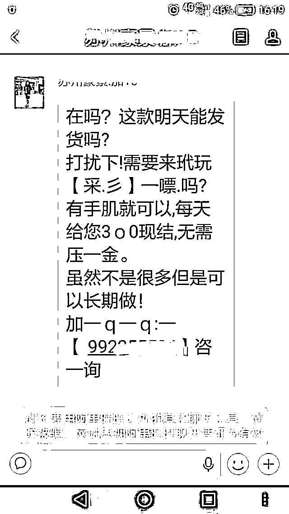
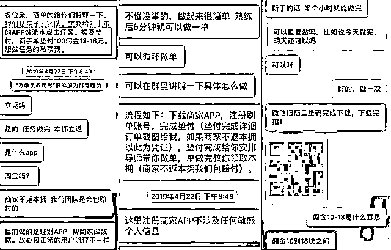
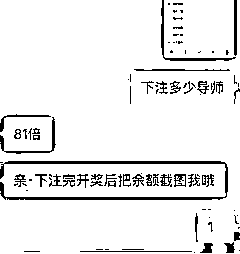
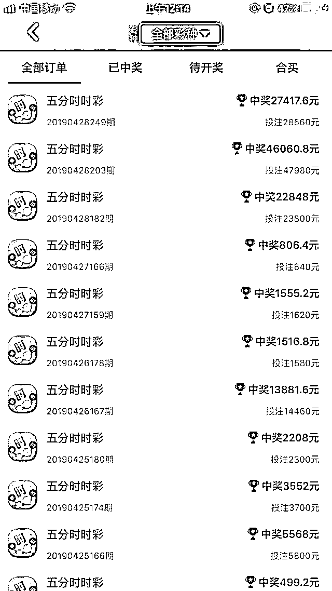
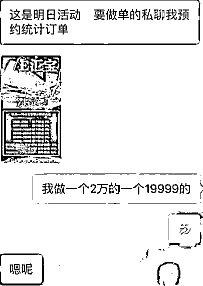
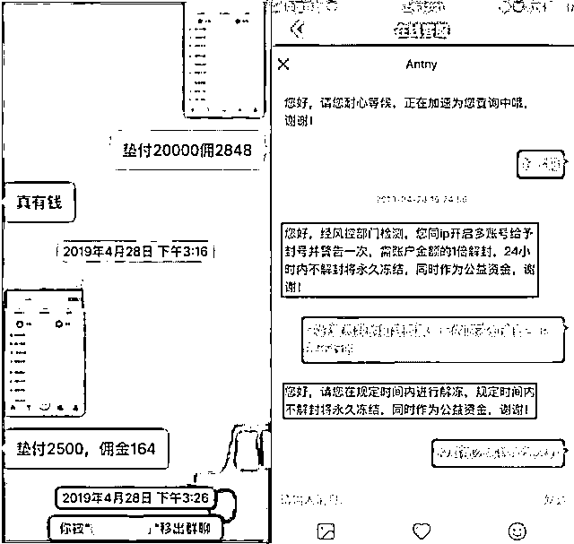
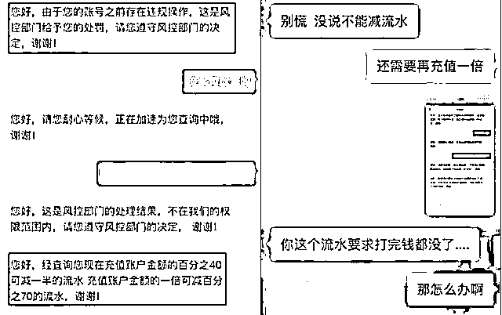
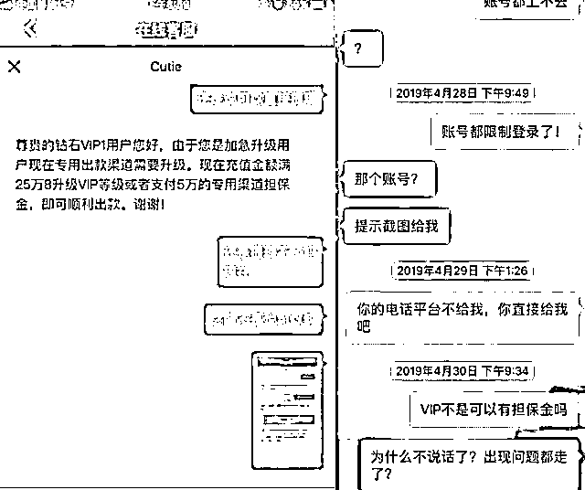
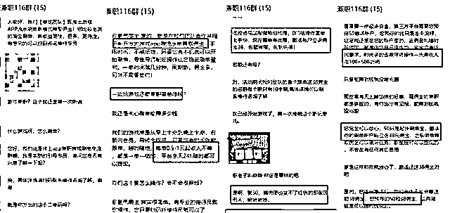

# 当刷单遇上时时彩：兼职？or 赌博？

> 原文：[`mp.weixin.qq.com/s?__biz=MzIyMDYwMTk0Mw==&mid=2247502178&idx=3&sn=bd1163268663060aed2b2df33fa229f6&chksm=97cb025aa0bc8b4c7ec836d1cc21e3eecaafdd8322657d6becba7569ec0c6664694f3b7badb4&scene=27#wechat_redirect`](http://mp.weixin.qq.com/s?__biz=MzIyMDYwMTk0Mw==&mid=2247502178&idx=3&sn=bd1163268663060aed2b2df33fa229f6&chksm=97cb025aa0bc8b4c7ec836d1cc21e3eecaafdd8322657d6becba7569ec0c6664694f3b7badb4&scene=27#wechat_redirect)

**点击上方蓝色字体免费订阅“灰产圈”**

**只要你有手机！**

**动动手指就能轻松躺赚！**

**足不出户就能日进斗金！**

这个有点漫长的暑假，针对放假学生的各类刷单招聘信息更是满天飞。最近，有种不同以往的刷单广告遍布旺旺和手机短信，这种刷单可日赚 800 元，刷的单却是在非法网赌平台，一不小心，钱就被骗了个精光！

**受害人汪某就是信了这个广告**

**一步步陷入刷单骗局**

**损失了十几万！**

刚进刷单群，就看见群主发布了好多刷单指引的广告，其中比较吸引我的是“刷单垫付 100 元可以得佣金 16-18 元，每天还可以循环重复做”。受害人汪某一开始以为刷单就是群里说的为上市公司 app 刷流水点击任务，但是没想到这个 app 其实是非法网络赌博平台，佣金就是投注之后中奖获得的金额。

在所谓“一对一导师”的引导下汪某完成了一系列任务，任务是往下载的 app 里充值并根据“导师”的指引投注，操作了 5 天，汪某通过垫付 1 万元赚了大概 1000 块的佣金。

赚钱竟然这么容易？看到这满眼的中奖信息，汪某贪念大起，想着如果用 2 个号操作不就可以赚到更多钱？于是私下开多了一个账号开始刷单。没过几天，派单员在派单群里说最近搞活动，预充值 XX 元就可以多送 XX 元的彩金（就是平台送的红包）。汪某毫不犹豫，赶紧借了 2 万加注想着接下来赚更多的佣金，顺便薅一下平台的羊毛。

就在受害人汪某为可以赚到更多外快感到开心的同时，骗子们精心准备的雷也已经在路上了。突然，汪某无法像往常一样提现，并且被派单员移出了派单群。联系平台客服，客服表示是因为汪某私下用 2 个账号在他们平台“刷单”触发了风控预警，账号被暂时冻结。一瞬间像被雷击中一样，受害人汪某竟真的以为是因为开了 2 个号才被冻结！骗子们看出了心虚，开始发起疯狂的进攻，以至于接下来受害人更加被一步步死死套住。**平台客服给出的解冻条件是需要再充值账户金额的 1 倍，如果 24 小时内不完成解冻操作就会被永久冻结，账户里的钱都会被拿去做公益资金。**

可怕的是，受害人还被告知，账号在平台的流水不够，不能下注！如果想要下注，必须凑够 200 多万的流水才能提现！也就是说，想要提现要么凑够 200 多万的流水，就是要再充值现在账户金额的 2 倍，也就是 9 万 2 千多。

对于这么夸张的霸王条款，受害人竟然还没意识到是骗局，又一次找到各种借钱 app 借到 9 万 2 千多并且成功充值。还是无法提现！客服这次找到的理由是，因为账户里钱太多，而账户等级太低，想要顺利提现必须升级账户登记。并给出了 2 种解决方案：1 种是充值到 25 万，1 种是再补交 5 万元保证金成为更高级别的 VIP。连续三次被索要大额充值，受害人汪某终于意识到被骗！但为时已晚，短短 1 天内，被套走了 13 万多。

**第一步，**利用刷单赚佣金来降低你的心理防线，获取你的信任度，等你完全进入他们布置好的网中。**第二步，****诈骗份子有时候会注册一个空壳公司，有时候连空壳公司都不注册，直接找个技术团队开发一款 APP。这些 APP 应用市场上是无法通过的，一般都是通过二维码下载。开发的网站一般也是用的境外的服务器，境内追查难度系数很高。每隔一段时间 app 就会换名字，俗称“换马甲”。因为名字一换，就算有之前的受害者在网上爆光 app 的名字，也不会受到丝毫影响，负面信息永远沾不到边。****第三步，**等你被忽悠了下载了他们的 app，进了他们的微信群，一群演员等着你的到来，也许十几个也许几十个账号陪你演戏，目的只有一个，忽悠你充值！**第四步，**等你开始了刷单任务，他们在后台操控各种游戏规则，通过制定设置各种乱七八糟的规则来限制你提现，找理由冻结账户金额。你想要解冻，那么你就要继续投入更多的钱。在你没有意识到这是骗局之前，你都会因为不舍沉没成本，而被骗子牵着鼻子走。

无论是刷单还是私彩都是违法行为赚钱的方式有千千万好逸恶劳 贪心不足永远是骗子最喜欢的目标特征**不相信天上掉的馅饼才是最重要的**

**点赞、在看、转发，都可以帮助他人远离诈骗！**

  来源：河南反诈中心,反诈骗先锋

← 向右滑动与灰产圈互动交流 →

**点击****阅读原文****加入灰产圈高端社群**

