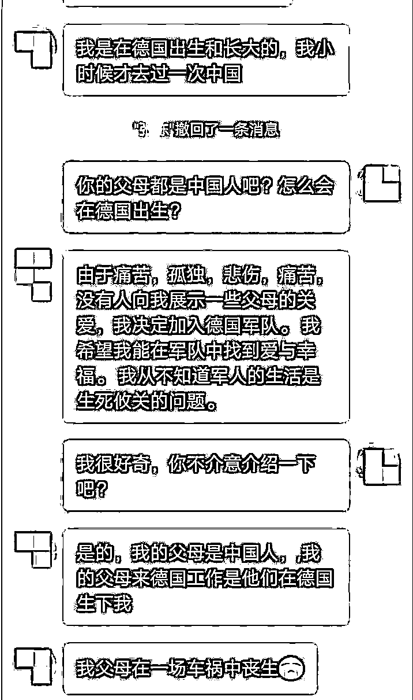
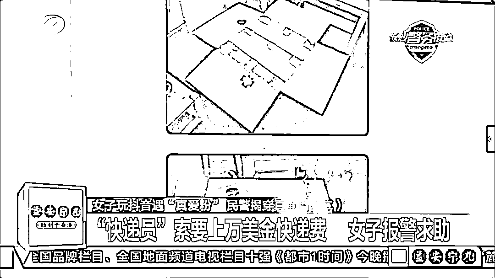
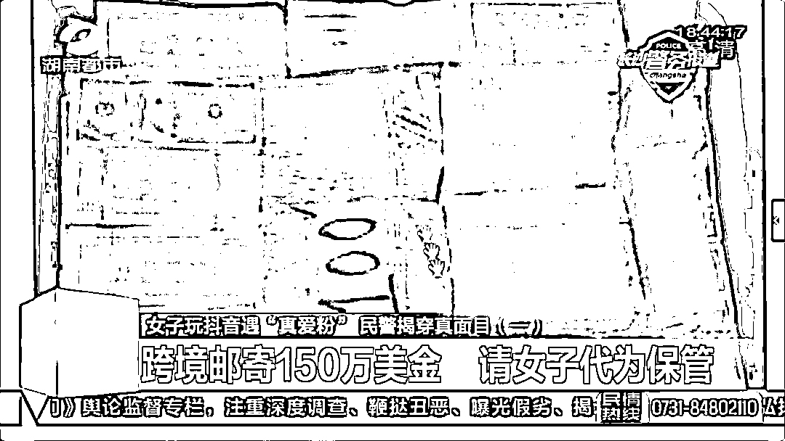
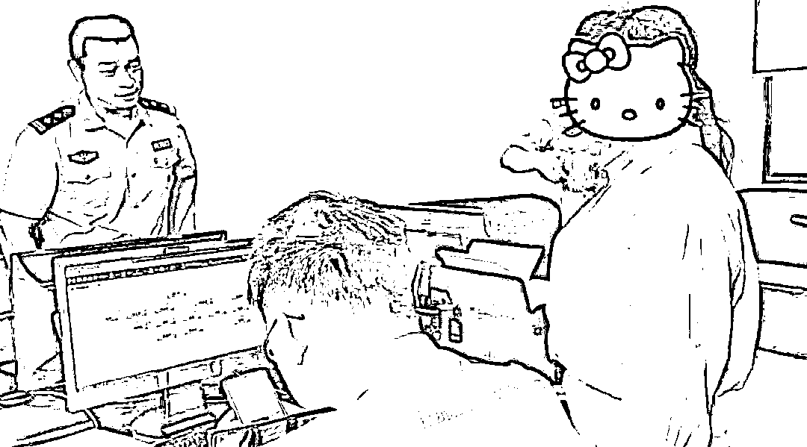

# “我”在抖音遇到“真爱粉”，自称德国“将军”，要给“我”150 万美元……

> 原文：[`mp.weixin.qq.com/s?__biz=MzIyMDYwMTk0Mw==&mid=2247502204&idx=1&sn=feb95ff003e2917523d1bcdbce694005&chksm=97cb0244a0bc8b52341afcaf9812663a2bbe6932d4b90c7d09d0f4a70519d5a37edd6a99bc33&scene=27#wechat_redirect`](http://mp.weixin.qq.com/s?__biz=MzIyMDYwMTk0Mw==&mid=2247502204&idx=1&sn=feb95ff003e2917523d1bcdbce694005&chksm=97cb0244a0bc8b52341afcaf9812663a2bbe6932d4b90c7d09d0f4a70519d5a37edd6a99bc33&scene=27#wechat_redirect)

**点击上方蓝色字体免费订阅“灰产圈”**

长沙一女子抖音发布视频引来“真爱粉”

身世凄惨博同情

自称德国“将军”执行危险任务

跨境邮寄 150 万美金

请女子代为保管

长沙市民陈女士在抖音上有一位“真爱粉”，这位“粉丝”自称身世离奇，让陈女士深感同情。

最近，该“粉丝”突然提出来，要给陈女士邮寄 150 万美元，但前提是让陈女士先付 1 万美元的快递费。

陈女士犹豫不决，于是报警求助。7 月 28 日，记者从望城公安分局获悉，民警接警后，随即揭穿了“真爱粉”的骗局，阻止了陈女士汇款。

家住望城区乔口镇某村居民陈女士，平时喜欢刷刷抖音，并录制一些小视频发在平台上。

最近，一名叫张某的男子总在第一时间为陈女士的视频点赞，而且关注了她的账号，这位“真爱粉”从此引起了陈女士的注意。一来二去，两人就互关并添加了微信好友。于是，“故事”发生了。

骗子给自己编造了一个离奇的身世。通讯员 供图

张某称，他是在德国出生的中国人，父母在车祸中丧生，他和已故妻子从小在孤儿院长大，目前在德国参军。张某的身世让陈女士深感同情和怜悯。

“**德国陆军退休处和联合国支付给我 150 万元美金，但这些钱放在军事基地不安全。**

我没有亲人，你是这个世界上我唯一相信的人，你能帮我吗……”在获得了陈女士的信任后，张某说，他需要完成最后一次危险救援任务才能摆脱德国兵役的束缚，想把这笔钱寄给陈女士代为保管，陈女士欣然同意帮助。

**随后，张某表示已将 150 万元美金邮寄给陈女士**，但是邮寄时快递方未告知邮寄包裹需先付款，所以包裹是货到付款，**需要陈女士先支付一万余美元的快递费。**

此时，陈女士想起之前社区民警在入户走访时发给自己的防诈骗宣传单，民警还特别强调，只要涉及到转账的都是诈骗！

陈女士顿时意识到自己可能被骗了，立即赶到望城公安分局乔口派出所报案。

陈女士到派出所报案。通讯员供图

接到陈女士的报案后，民警详细了解了案件经过，并当即识破诈骗分子设计的骗局。原来，所谓的热心“粉丝”正是利用“感情牌”博取了陈女士的怜悯之心，使用虚假身份对其实施诈骗行为。

为避免陈女士再次受骗上当，民警将各种电信诈骗的真实案例反复讲解，经过民警苦口婆心地一番解说，及时阻止了这起转账汇款网络诈骗，使陈女士免受财产损失。

**警方提醒**

市民添加微信、QQ 好友要谨慎，不要被对方的花言巧语所迷惑，遇到对方以各种理由要求转账汇款的，市民一定要提高警惕，捂好自己的“钱袋子”。

[`v.qq.com/iframe/preview.html?vid=z3127r27lc7&auto=0`](https://v.qq.com/iframe/preview.html?vid=z3127r27lc7&auto=0)

《女子玩抖音遇“真爱粉” 身世凄惨博同情 长沙警方揭穿真面目》

来源 ：长沙晚报全媒体记者 邓艳红 通讯员 唐采苓 综合芒果都市

← 向右滑动与灰产圈互动交流 →

**点击****阅读原文****加入灰产圈高端社群**

