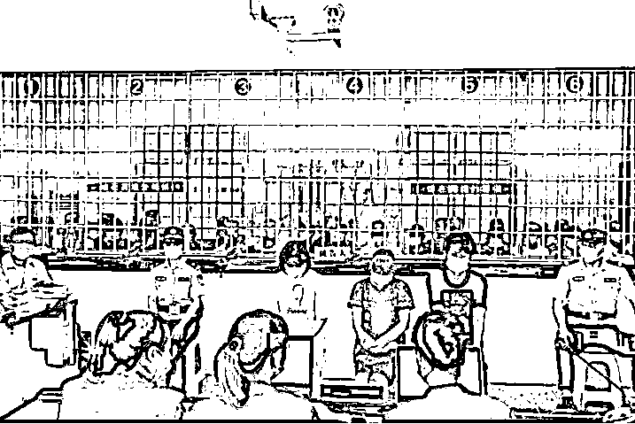
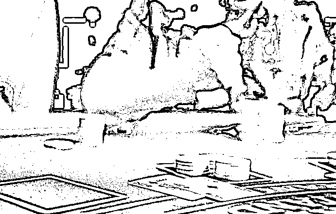
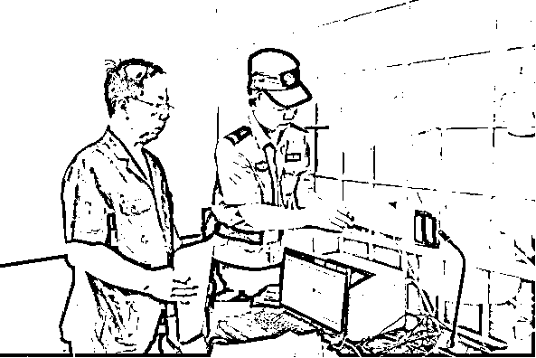
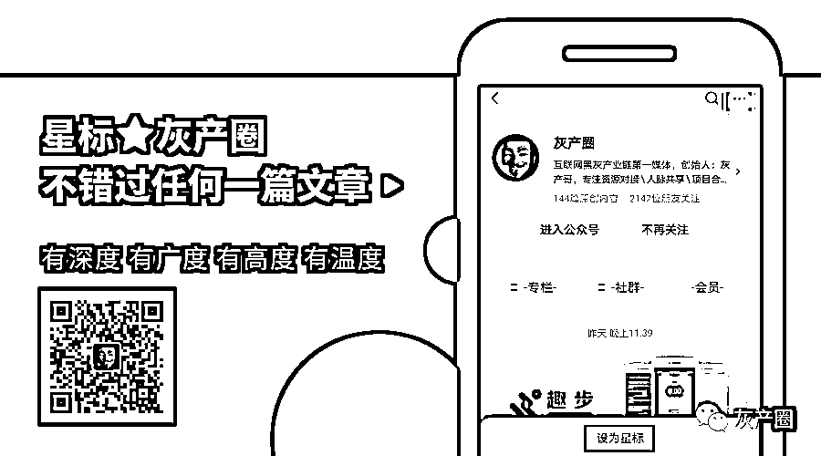

# “富二代”求助扫黑办：我输了六千万

> 原文：[`mp.weixin.qq.com/s?__biz=MzIyMDYwMTk0Mw==&mid=2247502204&idx=2&sn=3f4bcf90a0db66078a08ec3da23e4f15&chksm=97cb0244a0bc8b52a9216809f9709815684cbe6bd9905a6a58818ffcbfcbda9555987f7699f9&scene=27#wechat_redirect`](http://mp.weixin.qq.com/s?__biz=MzIyMDYwMTk0Mw==&mid=2247502204&idx=2&sn=3f4bcf90a0db66078a08ec3da23e4f15&chksm=97cb0244a0bc8b52a9216809f9709815684cbe6bd9905a6a58818ffcbfcbda9555987f7699f9&scene=27#wechat_redirect)

**点击上方蓝色字体免费订阅“灰产圈”**

“平时衣冠楚楚，实际就是个江湖骗子！” 一个并无产业的所谓“老板”，长期租住高档酒店，吹嘘能“摆平法院”，靠与领导合影实施诈骗，还开设赌场、非法拘禁、忽悠一帮打手横行无忌……2020 年 7 月 15 日，随着湖南省湘潭县人民法院对周靖凯等 19 人涉恶案件公开进行一审宣判，他们所犯的累累罪行也被公之于众——

> **“不帮你儿子还钱，让你不得安宁！”**

**“陷入赌博这个深渊，不仅害了我自己也拖累了家人，要想解脱只有与过去决裂……”**2018 年 3 月底，为期三年的扫黑除恶专项斗争刚启动不久，湖南湘潭市公安局扫黑办就收到了一封“悔过求助书”。写这封信的人叫莫某东，是某著名企业董事长莫某军的独子。“因为赌博，我已经输掉家里 6000 多万元，还欠下将近千万的债务。”莫某东说，**部分讨债人胁迫他还债，使他有家不能归，老婆也吓得和他离了婚，催债人还骚扰他父母不得安宁。**“仅凭我个人和家人的力量，不能彻底斩断与过去赌博圈的关系。因此，我在悔过的同时，也特别向人民公安求助。”此后不久，莫某军也亲手向市扫黑办递交了一封请求信，信中表达了对儿子深陷赌博的痛心疾首，也痛斥了网络赌博、高利贷等违法行为的“可恶”。“希望公安机关在扫黑除恶专项斗争中把打击网络赌博、高利贷、地下钱庄作为重要内容，彻底铲除各种赌博恶习。”莫某军在信中写道。**然而，就在警方开展前期调查的时候，莫某军一家却受到了催债人变本加厉的骚扰。**2018 年 5 月 12 日，莫某军所住别墅遭三名男子闯入，他们威胁称：“不帮你儿子还钱，我们就天天来，让你不得安宁！”随后几天，这伙人天天上门，叫嚣要去莫某军的公司闹事，把他的名声搞臭，把公司搞垮。2018 年 5 月 17 日晚 7 时许，莫某军在小区草坪散步时，被一伙催债人拦截纠缠，在推搡拉扯中摔倒在地。**讨债人有意将这一过程拍下发给了其子莫某东。**2018 年 6 月 5 日 8 时许，莫某军准备驾车外出参加会议时被一伙催债人拦截，待警察赶到后才摆脱纠缠，致会议延迟半小时召开。……此后一年中，莫某军一家先后受到**言语威胁、当众哄闹、推搡拉扯、拦车闹事、高声滋扰、深夜敲门、非法侵入住宅、到公司制造影响等各种骚扰数十次。**在此期间，莫某东还频繁收到含人身威胁、暴力血腥的图片与文字信息。警方立案侦查后，甚至从莫某军的轿车下面，**发现了犯罪嫌疑人安装的具有跟踪定位功能的追踪器。**

> **犯罪团伙浮出水面**

根据扫黑除恶专项斗争需要，此案由湘潭县公安局侦查。随着侦查的深入，一个以周靖凯为纠集者，王令、马小龙、陈俊颖、段彪、郭海涛、杨阳和阳熙为成员的恶势力犯罪团伙及累累罪行逐渐浮出水面——2011 年，“富家公子”莫某东已经深陷赌博泥潭，尽管已输掉千万身家、负债累累，但仍然不愿收手，幻想着“下一次有好运气”，把一切都赢回来。**开赌场的周靖凯与放高利贷的王令、卜文辉探问到莫家家底深厚，便盯上了莫某东这只“肥羊”，屡屡撺掇莫某东下“大手笔”赌博。**至 2018 年，莫某东在周靖凯处前后输掉 500 万现金，还欠下 500 万元赌债。为了让非法的赌债合法化，**心思缜密的周靖凯逼迫莫某东签订了一份虚构的《投资协议合同》，并打了一张 500 万元的借条。**与此同时，为了让莫某东持续有钱赌博，王令、卜文辉可谓绞尽脑汁。**他们以房产抵押贷款、信用卡透支等方式筹来 100 余万元，以月息 5 分至一角的高利借给莫某东赌博。**当意识到从莫某东身上再也榨不出油水后，王令、卜文辉就指使魏建新、彭梦洁、张珈源、周径舟等人，采取反复骚扰的“软暴力”手段逼莫某军父偿子债。

> **“平时衣冠楚楚，实际就是江湖骗子！”**

“周靖凯以前在银行给领导当司机，离开银行后，又做过矿石生意，开过信贷公司。”虽然几经“折腾”，但周靖凯所获不多，再加上自己好赌，早已负债累累。正规生意“赚不到钱”，他便打起了歪门邪道的主意。“平时衣冠楚楚，长期租住在高档酒店，实际上就是个江湖骗子。”据专案组蒋警官介绍，**周靖凯做派高调，喜欢吹嘘自己认识领导、大老板。为了打造自己“人脉广泛、能平事”的形象，他甚至不惜血本。**一次，一名开设赌场的违法人员被法院判处 2 万元罚金，周靖凯为了显示自己有能耐，吹牛说可以帮忙要回来。不久，他自掏腰包 2 万元给了对方，谎称是“法院退回来的”。**他还有一个爱好——与领导合影。**逮着机会，他便上去蹭拍几张。这些照片能帮他“抬高身价”，也成了他实施诈骗的道具。2017 年 5 月，以承包建筑工程为业的李某明经人介绍，认识了周靖凯，被他“社会资源丰富，政界、商界人脉众多”的吹嘘迷惑，托他牵线搭桥承接工程。随后，李某明找周靖凯帮忙承揽湘潭县妇幼保健院搬迁工程，周靖凯谎称要给“省领导”送 100 万才能搞定。李某明筹集来 60 万港币，谁想直接进了周靖凯腰包。数月之后，因未能承包到工程，李某明向周靖凯要账，但周靖凯始终拒绝归还。

> **作恶多端！他纠集残疾人违法犯罪**

通过精心营造的光环，周靖凯笼络了一批社会闲杂人员在自己身边，这些人“尊称”周靖凯为“老板”或“凯哥”。王令、卜文辉分别是国网湘潭公司的退休与在职职工。他们为周靖凯的赌场拉来业务，同时向参赌人员放高利贷。马小龙、陈俊颖、段彪、郭海涛、杨洋、阳熙等人均为前科劣迹人员。作为周靖凯恶势力团伙成员，他们主要负责讨债，并充当“打手”角色。为拉拢手下的核心“马仔”阳熙，周靖凯多次带其到澳门赌博，两人共欠下 500 万港币赌债。周靖凯作为老大主动包揽下来，却被澳门赌场派人到湘潭“驻点”追债。**周靖凯一伙还无视社会公序良俗，利用残疾人为其从事违法犯罪活动——**2018 年 3、4 月间，周靖凯与某家装公司发生合同纠纷。为了逼对方退钱，他纠集一帮残疾人到家装公司闹事。2018 年 6 月，周靖凯与人合伙租用一茶楼开设赌场。为了逃避公安机关查处打击，也为了免掉一些税收费用，他们把茶楼挂在一名残疾人名下，并冠名“湘潭市残疾人康复活动中心”。**“周靖凯此人异常狡猾，在实施大部分犯罪行为时，很少亲自出面，而是躲在幕后遥控指挥。很多受害人到最后也不知道，真正的幕后黑手另有其人。”**多行不义必自毙。经过一年多时间，该犯罪团伙成员被一一抓捕归案。被告人在判决书上进行签字确认经查明，2015 年至 2018 年间，周靖凯恶势力犯罪团伙经常纠集在一起，以暴力、威胁、软暴力等手段为非作歹、欺压百姓，先后实施开设赌场 2 起、非法拘禁 1 起、寻衅滋事 4 起，另周靖凯实施诈骗 2 起、信用卡诈骗 1 起，陈靖宇实施危险驾驶行为 1 起，严重扰乱社会生活秩序，造成了恶劣的影响。2020 年 7 月 15 日，湘潭县人民法院对周靖凯等 19 人涉恶案件公开进行一审宣判，依法认定 7 名被告人构成恶势力犯罪团伙。**主犯周靖凯被以开设赌场罪、非法拘禁罪、寻衅滋事罪、诈骗罪和信用卡诈骗罪五项罪名，共判处有期徒刑 24 年，合并执行有期徒刑 20 年，并处罚金 38 万元。**其余 18 名被告人分别获刑四年至六个月不等。编辑：单镜宇  责任编辑：马涛 来源：中央政法委长安剑

← 向右滑动与灰产圈互动交流 →

**点击****阅读原文****加入灰产圈高端社群**

# 原文：[`mp.weixin.qq.com/s?__biz=MzIyMDYwMTk0Mw==&mid=2247502204&idx=3&sn=aefebd372c17b672251c157e68bc7e2f&chksm=97cb0244a0bc8b520fd2bedd49c25a933fbf8c3fde1a8c2dc96ffda83571e0de40d52bf9fd9c&scene=27#wechat_redirect`](http://mp.weixin.qq.com/s?__biz=MzIyMDYwMTk0Mw==&mid=2247502204&idx=3&sn=aefebd372c17b672251c157e68bc7e2f&chksm=97cb0244a0bc8b520fd2bedd49c25a933fbf8c3fde1a8c2dc96ffda83571e0de40d52bf9fd9c&scene=27#wechat_redirect)