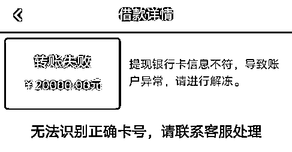
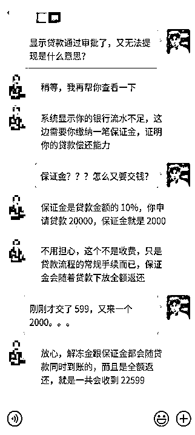
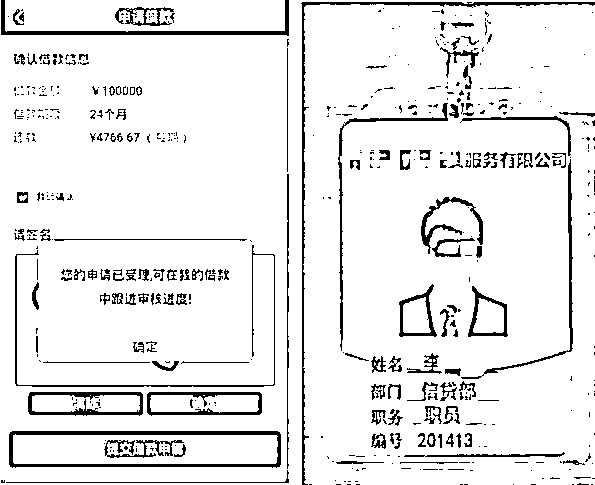

# 先交钱，再借贷？必有诈！

> 原文：[`mp.weixin.qq.com/s?__biz=MzIyMDYwMTk0Mw==&mid=2247502283&idx=3&sn=f15e95c415733bb6b2306d4ff2818a8e&chksm=97cb02f3a0bc8be5cf78388c2a67f222d0729b74bf0f7d01aa120e96baf55d3bd3df1d1d118d&scene=27#wechat_redirect`](http://mp.weixin.qq.com/s?__biz=MzIyMDYwMTk0Mw==&mid=2247502283&idx=3&sn=f15e95c415733bb6b2306d4ff2818a8e&chksm=97cb02f3a0bc8be5cf78388c2a67f222d0729b74bf0f7d01aa120e96baf55d3bd3df1d1d118d&scene=27#wechat_redirect)

**点击上方蓝色字体免费订阅“灰产圈”**

大学生小刘，最近满脸愁容。 

新学期马上开始了，

但家里状况不好，左借右借都凑不齐学费。

这天，他看到一个小额贷款广告，

**「到账快、利息低，学生还有专门折扣」**

简直就是天降救命稻草！

小刘马上加了对方微信，

却没想到……

[`v.qq.com/iframe/preview.html?width=500&height=375&auto=0&vid=y31267y74hg`](https://v.qq.com/iframe/preview.html?width=500&height=375&auto=0&vid=y31267y74hg)

01

**贷款手续费：2599，放款金额：0 **

小刘的经历并不是孤例，大学生阿杰也有类似的遭遇。一天，他收到某个理财平台贷款专员的微信好友申请，说可以协助申请无息贷款。

因为想买新电脑、又不好意思向爸妈要钱，阿杰决定试一试。在对方的指引下，他下载了一款理财 APP，账户显示，他的可贷款额度为 20000 元。

阿杰满心欢喜，但在贷款申请提交后，却收到系统告知银行卡号有误，账户异常已被冻结。

贷款专员表示，需要支付 599 元解冻金，再重新提交贷款申请。阿杰支付后，APP 显示该笔贷款已通过审批，但仍无法提现。 

贷款专员又称，这是因为阿杰的银行流水不足，需要缴纳一笔保证金。

各种话术引导，未贷先收费

掏空了自己的钱包，还问室友借了 500 元后，阿杰交上了保证金。然后，他再也找不到这位贷款专员了。

02**先交钱再放款？一定有诈**

无需担保抵押、手续简单、到账快、利息低……你看到了这样的广告，以为自己捡到了大便宜，实际上，你正一步步掉进骗子的圈套！

贷款诈骗总是以各种噱头来「钓鱼」，找到急需资金周转、征信记录较差的受害者，再以不同手法和名目进行「杀鱼」宰割。

无缘无故交了几千手续费、欠债上万？这还只是基本操作。如果你在不自觉间，向骗子提供银行验证码等操作，可能会造成银行卡盗刷。钱财尽失，甚至个人征信也受到伤害。

***贷款诈骗常见套路***

1.  以无抵押、放款快、利息低等噱头吸引注意

2.  A. 引导下载虚假贷款 APP 借款     

    B. 假扮贷款平台的「业务经理」  

    C. 用个人公众号假冒正规贷款机构公众号，再假扮「客服」

3.  以解冻费、保证金、工本费、会员费、冲刷流水、验证还款能力等理由进行钱财诈骗

骗子的话术一般通过精心设计，一方面基于受害者借款的迫切心理进行诱导，另一方面，还利用了各种金融术语和名目，让部分对银行贷款业务不了解的受害者受骗。

为了骗取信任，打消疑虑

一些骗子甚至「晒」出工作证、身份证 

03**坚决打击，切勿以身试法**

微信坚决打击仿冒欺诈等违规行为，并持续深入清理。广大网友切记通过银行等国家正规金融机构申请贷款。不要轻信任何网友、网站、手机应用发布的贷款广告，不扫描、不点击任何来源不明的二维码和链接，避免让坏人趁“需”而入。

此外，银行和正规贷款公司都不会要求借款人预先支付手续费等各类费用。任何要求事先支付资金的都是骗子，切勿上当。

同时广大公众也要擦亮双眼，一旦发现仿冒帐号，可以通过公众号的右上角的功能键“…”里的“投诉”按键，及时向微信投诉，共同维护安全网络环境。

**上海市反电信网络诈骗中心****与守护者计划、微信安全中心、腾讯 110 共同提醒：**

切记通过银行等国家正规金融机构申请贷款，降低贷款风险。任何要求事先支付资金的都是骗子，切勿上当。

如果不慎被骗资金遭受损失，请尽快拨打 110 向当地公安机关报案，尝试追回资金。腾讯公司会依法配合执法部门、司法机关调查。同时欢迎广大用户通过客户端和小程序腾讯 110 进行举报，核查情况属实我们会对相关帐号进行相应处罚。

来源：守护者计划

← 向右滑动与灰产圈互动交流 →

**点击****阅读原文****加入灰产圈高端社群**

