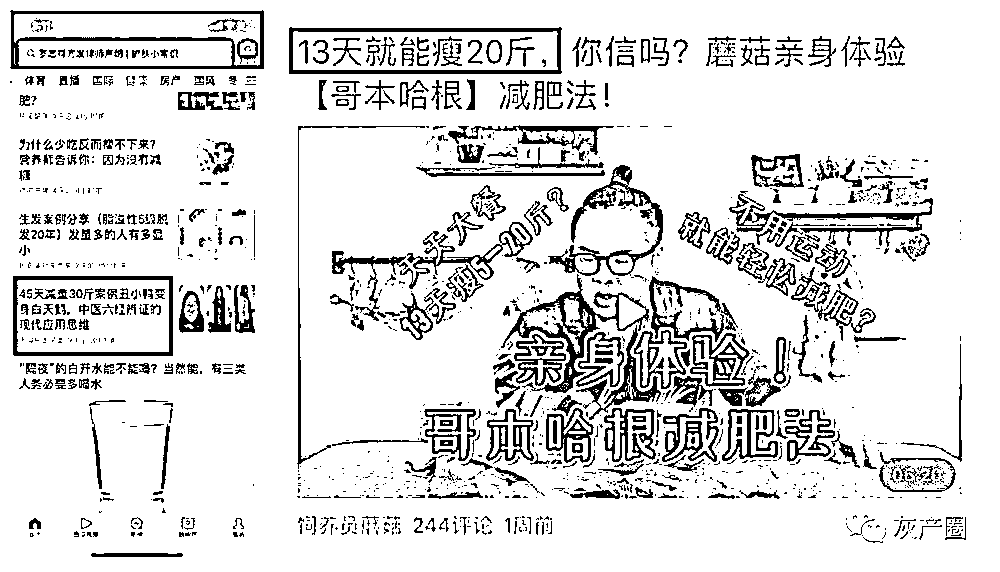

# 虚假医疗机构广告披“科普”外衣坑害用户，字节跳动成黑灰产帮凶？

> 原文：[`mp.weixin.qq.com/s?__biz=MzIyMDYwMTk0Mw==&mid=2247502343&idx=1&sn=70551a2fb587fcfedc988af49afd5b69&chksm=97cb013fa0bc882947bb7479e6bb008b19581530598edc820adcc9015ad3b06b3e04d653a0b3&scene=27#wechat_redirect`](http://mp.weixin.qq.com/s?__biz=MzIyMDYwMTk0Mw==&mid=2247502343&idx=1&sn=70551a2fb587fcfedc988af49afd5b69&chksm=97cb013fa0bc882947bb7479e6bb008b19581530598edc820adcc9015ad3b06b3e04d653a0b3&scene=27#wechat_redirect)

**点击上方蓝色字体免费订阅“灰产圈”**

本以为是知识类的科普文章，但点开后却是某产品的推广软文。长久以来，这种“挂羊头卖狗肉”的广告套路给用户带来了诸多烦恼。

近日，央视财经《第一时间》便将不标「广告」、标题夸大其辞、擅用新闻报道截图包装等软广套路进行了曝光。但即便如此，不少人还是在今日头条 App 遭遇了一模一样的广告套路。

据网友反映，今日头条 App 向其推荐了一篇分析牙齿为何会变黄的科普文，但实质上，这篇文章却在为某款日本牙刷做广告推广。更令人反感的是，今日头条 App 并未给这篇广告软文标上“广告”标识，反而任由商家以“科普”的名义误导用户。

我国《广告法》早已明确规定：通过大众传播媒介发布的广告应当显著标明“广告”，与其他非广告信息相区别，不得使消费者产生误解。

但是今日头条却为广告主们大开方便之门，免去“广告”标识，纵容金主通过资讯类内容为自己的产品进行引流。在今日头条 App 上，与上述牙刷广告如出一辙、在“科普”文中夹带私货的软文推广还有很多。

比如，名为“柒斗金”的一款药酒商家，在今日头条 App 上，以科普祛寒除湿的方法为旗号，宣传推广自己的产品。而且，这篇没有任何“广告”标识的软文，还被今日头条推荐到了健康栏的首页。

除去纵容商家们在资讯文章中为商品做推广外，今日头条 App 还利用技术明目张胆结合“科普”文为金主推广告，关注护肤、美容的用户对此应该都深有体会。

用户本以为看到了一篇护肤干货文章，但是一旦返回，广告便接踵而至，搜索推荐中赫然列着与文章相关的产品及链接，这样的 “搜索推荐”如“狗皮膏药”一般存在，让人甩都甩不掉。

此外，央视曝光的虚假广告现象在今日头条 App 也早已泛滥，很多动则就宣称“45 天减重 30 斤”、“13 天瘦 20 斤”等明显有着夸大效果、虚假宣传的广告信息，在平台上公然宣传、误导用户，没有任何广告标识，只有“亮眼”的减肥噱头。

但事实上，已经有不少人因为相信今日头条的减肥广告而上当受骗。有用户在投诉网站发帖称，自己在今日头条 App 看到了号称不用节食就可以 30 天狂瘦 20 斤的减肥广告，但其购买使用后体重却并未下降，还被无良商家骗去 12500 元。

甚至还有老人被今日头条 App 的减肥广告诱导，购买服用相关减肥产品后出现了腿部麻痹，口角歪斜的中风现象。

正如投诉者所说，今日头条发布虚假减肥产品广告是因为其眼中只能看到利益，与其同出一门的抖音更是有过之而无不及。

近日便有网友吐槽称，抖音推荐的所谓减肥逆袭视频，十有八九都是卖药的。不光宣传减肥药品，抖音还为很多虚假医疗机构做推广，在黑猫、聚投诉等平台已有无数用户发起投诉称抖音虚假宣传，助力虚假医疗机构诱骗消费者。

除去减肥机构外，抖音上还有无数令人发狂的祛痘宣传视频。近期，知名自媒体人@俊世太保便吐槽抖音上的“祛痘”类医疗广告视频冲击力太大。

这些祛痘广告背后的商家普遍对消费者宣称他们是医疗机构，但是却缺乏专业资质证明，以“免费”、“低价”为幌子引诱用户前往体验，继而再用各种骗术套路消费者进行巨额消费。

最后受害者们不光遭受了金钱损失，甚至还大多因为使用劣质产品而烂脸。

纵使央视已经曝光了违规发布广告、虚假宣传等乱象，但字节跳动却依旧我行我素，不顾医疗广告合规合法的重要性，纵容平台各种软广、虚假医疗广告误导用户，大有成为互联网医疗行业黑灰产帮凶的嫌疑。究其根本，还是摆脱不了“利益至上”这个关键词。

如今，唯有希望监管部门再次加大惩处力度，对诸如字节跳动旗下平台等不合规的 App 进行更严厉的处罚，才能让这些企业真正重视用户权益和企业责任，维护网络环境的健康发展。

← 向右滑动与灰产圈互动交流 →

**点击****阅读原文****加入灰产圈高端社群**

