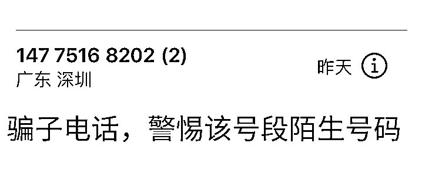
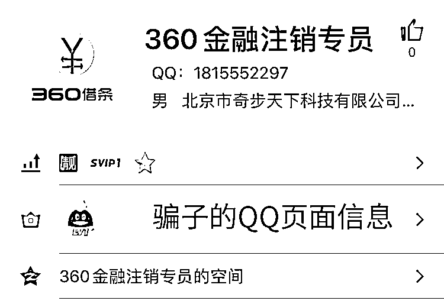
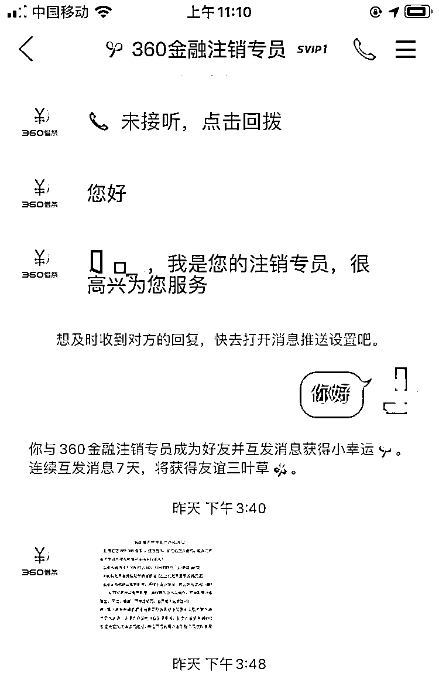
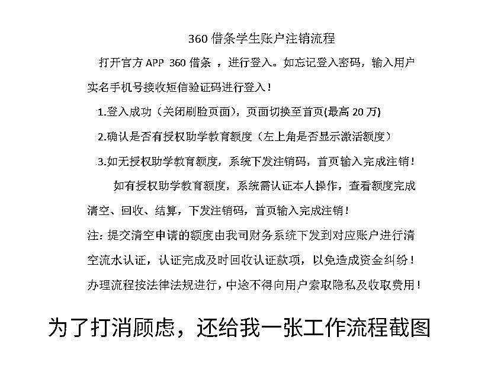
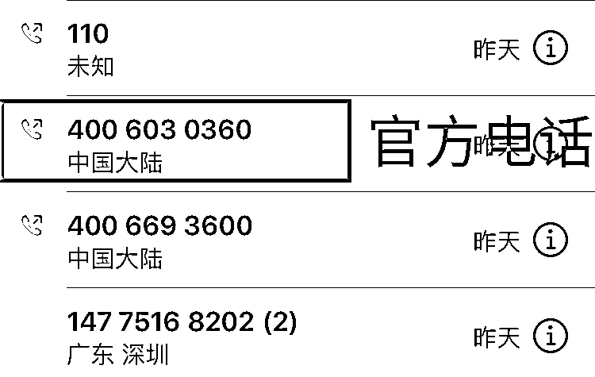
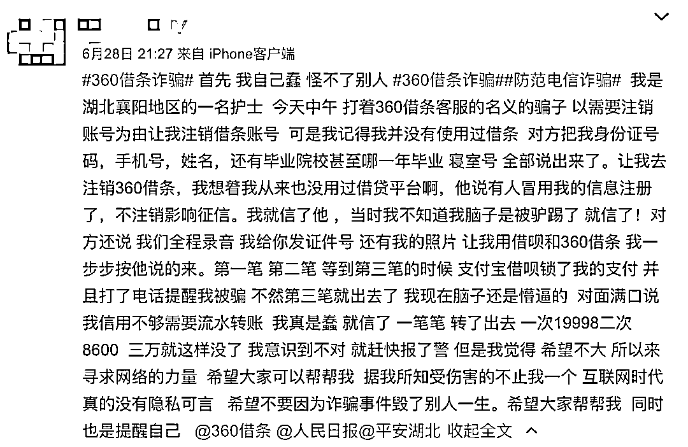
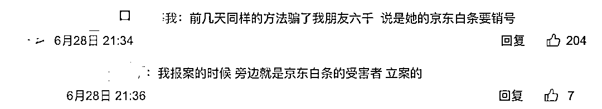
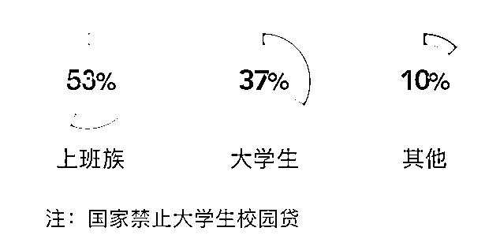
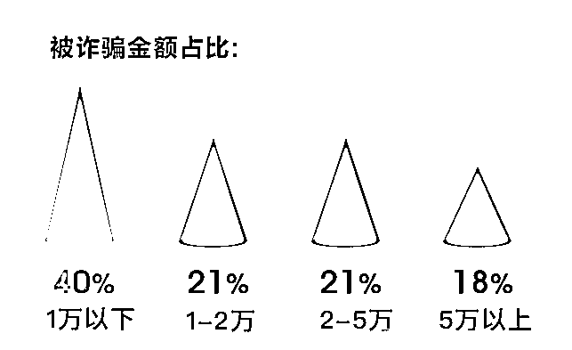

# 新的诈骗套路！已经有很多人被骗了！

> 原文：[`mp.weixin.qq.com/s?__biz=MzIyMDYwMTk0Mw==&mid=2247502343&idx=2&sn=8df7c79a1ebeb51cf17de41f04faaa2d&chksm=97cb013fa0bc882961ffc040cb20fdc7f5a512bc73390655c1ebf18710af0f2655aed86d0005&scene=27#wechat_redirect`](http://mp.weixin.qq.com/s?__biz=MzIyMDYwMTk0Mw==&mid=2247502343&idx=2&sn=8df7c79a1ebeb51cf17de41f04faaa2d&chksm=97cb013fa0bc882961ffc040cb20fdc7f5a512bc73390655c1ebf18710af0f2655aed86d0005&scene=27#wechat_redirect)

**点击上方蓝色字体免费订阅“灰产圈”**

小编天天研究各种黑灰产业，尤其是对各种电信诈骗案例格外敏感，想来网上各种诈骗套路都已经烂熟于心，每每看到有人被骗都会异常惊讶并深感惋惜：“这种一眼就看穿的套路，真不知道怎么会有这么多人上当”。万万没想到的是骗子找上门来了，还差点成功了。

这是一个悠闲而又自在的周日下午，小编正在家里吹着空调刷着剧，就在此时来了一个广东深圳的电话，第一句话是请问是 XXX 吗？（准确的知道我的姓名，防备心理降低了 10%）我以为是推广的，准备挂电话的时候，他说自己是 360 借条的员工，查到我在 XXX 学校（准确知道我的学籍信息，防备心理降低 20%）就读的时候注册过 360 借贷的账户（我完全不记得了，那个时候 360 借条什么的广告活动很多，保不齐我在某个活动中因为红包注册过...）您当时绑定的银行卡是民生银行 XXX 开头的（我确实有一张民生银行卡）

我：“你有什么事情？”

骗子：“由于国家监管，我们这边正在注销校园贷账户，如果不注销的话，怕以后会影响到您的征信。”

我：“怎么注销？”

骗子：“很简单的，您到 APP 商店下载 360 借条客户端，然后按照我们的提示进行注销就行了。”

在 360 借条官方 APP 里面操作风险应该不大...防备进一步降低，但是涉及到金融的相关业务，心里防备是没有那么容易被打消的...**于是我发出了第一次质疑：“你不会是诈骗吧？你们为什么要用手机号拨打电话？”**

骗子没有被我问住，而是非常熟练并且淡定的说：“我们这个并不是手机号，而是公司统一配备的电话系统，实际上是公司的座机，我们每天几千个电话，肯定不会是用手机打的。”我们公司好像也有座机使用的是手机号的，他这么解释虽然我没有多么觉得靠谱，但是也没有特别的怀疑。

紧接着他再次强调：“这次注销是因为国家在整顿校园贷，我们的业务要下架整改，如果您不注销的话很有可能会影响您的征信。”

我：“就是我自己去下载 360 借条 APP 注销就行了吧？”

骗子：“注销需要我们的工作人员帮助您完成，您需要添加一个 QQ，我们的工作人员会跟你进行一个语音通话，您根据语音通话的提示完成就可以了，我们的 QQ 语音通话是会全程录音的，结束之后我们也会发送录音邮件给到您的邮箱作为一个注销凭证。”

于是我添加了这个所谓的客服 QQ，QQ 的名称是 360 金融注销专员，还是个 SVIP。（骗子细节做得非常好，为了博取大家的信任，还冲个会员）然后紧接着语音电话就打过来了，说是金融注销专员，让我去 APP store 下载 360 借条。

这里有个非常关键的陷阱点就是操作是在 360 借条官方 APP 里面进行，并不是在一些小公司或者他们提供的 APP 里面进行操作，这就大大降低我的心里防备。

下载完成 360 借条之后，就是常规的手机号登录，人脸识别，然后是绑定银行卡...此时我就觉得非常不耐烦了，因为身份证和银行卡都在我身边，并且涉及绑定银行卡，一个危险的信号就在我的脑海响起来了。**于是我发出了二次质疑：“注销为什么需要绑定银行卡？你们不会是电信诈骗吧。”**

想来他们经过精心的话术编排，非常的沉稳：“是这样的，您很久没有登录过账户，需要您这边进行一个二次验证，我们验证成功之后才能够进行注销操作。您放心，您的信息我们这边都可以看到的，不存在泄漏信息的问题。”

真的是高明得很，于此同时我还是觉得不太对劲儿，这完全就是在进行一个注册操作，哪里有注销操作是这么进行的。

骗子：“您进行到第几步了呢？”他那边对我进行到第几步很关心。

我：“绑定银行卡啊，我找不到银行卡，需要绑定你说的那张民生银行的银行卡么？”（民生银行卡我很久不用了，也不知道放到哪里去了，并且我也不想绑定还在使用的银行卡）

骗子：“您绑定任何一张银行卡，我们做一个身份校验就可以的”

我：“还可以绑定别的银行卡？那你怎么校验？”

**我感觉越发有问题，于是我对他发起了第三次质疑：“你先等等吧，我拨打 360 官方客服电话咨询一下，有没有你们说的这个事情。”**

骗子：“我们就是专门负责注销业务的，我们每天有大量的注销业务需要完成，不止您一个，并且我们的 QQ 语音都是有录音的，您完全可以放心的”。（我也不懂为啥他要强调这个 QQ 录音，他录音跟我有什么关系...所以他这个点完全没有打动我）

“你稍等一下吧，我拨打官方电话咨询一下，如果真的有这个注销账户的业务，我到时候 QQ 再联系你。”听我这么说，骗子也没有过多的纠缠，而是表现出了一副你去问也没关系，我们是真的的态度，对我说：“好的，您去咨询一下再过来吧。”

我在这个时候其实并没有觉得他是骗子，三次质疑都没有慌张，我说要打电话咨询也表现得非常正常，我打官方电话就是想确认一下，打消疑虑。网上搜到 360 借条的官方电话，客服人员表示“360 借条不会让客户注销，这是没有的事情，应该是遇到骗子了”。

我问客服在他们官方 APP 里面的操作他们想诈骗什么呢？客服还是有些经验，说可能是让我申请贷款，然后通过一些操作将这笔贷款转给他们。

真是一个话术准备齐全，诈骗人员心理素质强大，流程清晰的圈套！

于是我赶紧给 360 客服提供了电话和 QQ，又回到 QQ 问那个骗子，骗子已经不回消息了，于是我举报了他，并拨打 110 提供了电话和 QQ 号码。因为这是一个诈骗团伙，在接听 QQ 语音电话的时候，我清楚的听到还有其他的骗子在拨打其他人的电话，而话术和骗我的人说的一模一样。他们一天会拨打很多个电话，而其中就有被骗的受害者。

小编在网上搜了一下，果然有很多受害者。6 月 28 日一位用户在微博发博讲述了骗子的后续操作，让她用 360 借条、支付宝借呗贷款（贷款的名称是虚拟认证金）给骗子转钱过去。在转到第三笔的时候，支付宝借呗锁定了支付，并电话提醒该用户被骗了，才及时制止了损失，但是总计被骗走 3W 元。 

而在此条微博的下面很多评论都声称自己被该套路骗了，全部是以金融借贷平台的校园贷注销为理由。借口平台最多的是 360 借条还有包括京东金融、小米金融等等。 

360 在今年 7 月份发表了《2020 上半年注销网贷账户电信诈骗分析报告》，报告显示 2020 上半年注销网贷账户骗局激增（可见这是诈骗团伙的一个新套路），**4 月环比增长 178%**。其中上班族占比最大：

被骗金额数量不等，其中 5 万元以上有 18% 的人数，可以说诈骗金额数量不小。

电话是一个 147 开头的号码，网上说很有可能是虚拟的号码，查可能也查不出什么东西来。QQ 号则更是了，这种虚拟的账号想要查到其背后的人，尤其这种刻意在网络中抹去线索的人很难。而上文提到的被诈骗的博主，在报警之后，骗子仍然非常嚣张的打电话辱骂该博主。

网络博主谈典看法认为“注销校园贷”维权的难度很大，**一方面是破案需要时间，但是平台的钱是必须要还的，由于破案周期长，受害者的损失能不能追回以及能追回多少都是未知数。另一方面如果不能及时还钱，还有可能影响受害者的征信。**其实我还是有些后怕的，因为如果被骗，那很有可能就是几万甚至十几万的钱不翼而飞，我不知道自己怎么承担下这个损失。

我也咨询了极验的安全专家，技术上有没有什么识别电信诈骗的方法，他表示目前我们也在尝试用深度学习和 GCN 的方法来进行电信诈骗的识别，当然只是在实验阶段，想要打击电信诈骗还需要多方努力，可以用技术进行协助，但是单纯靠技术是行不通的。

关于金融平台也应该重视此事，在加强宣传的同时，也能够在借贷的时候增加多一层的审核机制。不良的诈骗信息对平台的声誉也有严重的损坏。

最后更加重要的一点是我们自己要提高自身的鉴别能力，其实当我回过头再来看这个诈骗电话，会发现这真是漏洞百出，首先电话是非官方电话，我们就应该第一时间拨打官方电话确认信息，其次是用 QQ 号指导操作这是很少见的。那么面对拿到你准确信息的骗子时，我们都应该坚守以下三个原则，如此能够大大降低被骗的概率：

**1\. 凡是涉及金融、银行卡、钱财等事情，提高警惕，保持戒备。****2. 拨打官方电话确认，只要是涉及钱财的问题都在网上找到总部官方电话，咨询确认信息。****3\. 涉及金额数量较大，比如超过 1W，不要自己一个人脑子一热做决定，咨询一下亲人朋友。****希望可以通过此文可以扩散让更多人看到，让大家都能了解这个套路，那么骗子这个套路就玩不下去了。**来源：极验

← 向右滑动与灰产圈互动交流 →

**点击****阅读原文****加入灰产圈高端社群**

