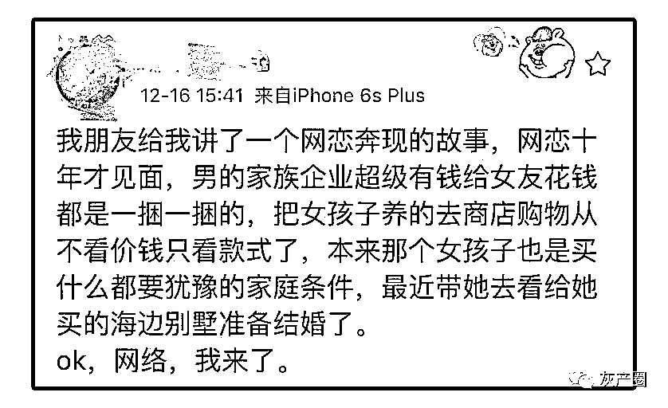

# 告诉我：看完这个你还敢网恋吗

> 原文：[`mp.weixin.qq.com/s?__biz=MzIyMDYwMTk0Mw==&mid=2247502343&idx=3&sn=f4d62028f2bcb46faf66f2c4d560789b&chksm=97cb013fa0bc882990ee29bcefc8cb391a94041f6eccfeede81ed938984fa253718c73ac6939&scene=27#wechat_redirect`](http://mp.weixin.qq.com/s?__biz=MzIyMDYwMTk0Mw==&mid=2247502343&idx=3&sn=f4d62028f2bcb46faf66f2c4d560789b&chksm=97cb013fa0bc882990ee29bcefc8cb391a94041f6eccfeede81ed938984fa253718c73ac6939&scene=27#wechat_redirect)

**点击上方蓝色字体免费订阅“灰产圈”**

现在生活节奏越来越快

想要在现实中找到喜欢的人真的很难

于是，越来越多的人开始选择网恋

最近有个“网恋奔现”的故事在微博上被大量转发

↓↓↓

连小狮子看完都心动了呢

上网不网恋，简直浪费电

吃鸡没情缘，简直浪费钱

肥水不流外人田，

恋爱选我我超甜！

然而，网恋并不一定都是甜蜜的。

有人正在为天上掉下来的“女朋友”感到高兴时，

没想到悲剧也跟着来了。

嘉兴市嘉善县惠民派出所接到报案，一名小伙子称他的“女朋友”不见了。

原来在月初，闲得无聊的小龚通过微信“摇一摇”，认识了一个微信名为“不知何去”的女孩，女孩说自己是新疆和田人。

慢慢地聊天接触之后，单身的小龚觉得这个女孩挺适合自己的，两人开始谈起了恋爱。

“我没有钱充电话费了。”

“我快要生日了，你给我买件衣服吧。”

……

在谈恋爱的过程中，女孩时不时地以各种名义向小龚要钱，小龚为了讨女孩子开心，也都一一应允，把钱通过微信红包转了过去。

“亲爱的，我想来嘉善看看你。”

一天，女孩给小龚发来微信，小龚喜出望外。

“但是我身边钱不够，新疆过来车票有点贵，要好几百。”

小龚一听，爽快地又给她转去了钱。第二天，女孩给小龚发来了一张火车票的照片，并告诉他自己已坐上了火车。

没过几个小时，女孩又发来了消息：“我刚才肚子痛急着上厕所，跑得太急撞了别人，把别人的苹果手机摔坏了，对方要我赔钱。”

一心急着见女朋友，小龚也没多想，又把钱转了过去。

然而这之后，“女朋友”就联系不到了，电话不接微信不回。小龚以为她出了什么意外，立马赶到惠民派出所报警。

有经验的办案民警一听，就意识到这个单纯的小伙子是被骗了。

这应该是一起非常典型的以谈恋爱为幌子的诈骗案件。

截至报案时，小龚被骗走了 1660 元。

然而，事情并没有这么简单。

小龚心目中他的女朋友是这样的

▼

……

可事实上

他的“女朋友”是这样的

▼

办案民警发现“不知何去”在接收到小龚的钱款后，将钱转入另外一个账号上，而且在 3 个月的时间内，陆续有 50 多个不同的微信账号将钱打给这个账号，涉及的金额超过 50 万元。

通过串并相似案件，办案民警发现：

小龚遭遇的并不是个案，对方是个有组织的犯罪团伙！

凌晨，内蒙古包头市，近 300 名民警在 10 多个小区先后行动，对 22 个犯罪嫌疑人藏匿窝点进行突击抓捕。

此次行动，共抓获涉嫌电信网络诈骗犯罪嫌疑人 226 名，现场缴获作案手机 300 余部、银行卡 100 余张，冻结涉案资金 225 万元。

至此，一个涉及上海、浙江、广东、福建、新疆等全国十多个省、市、自治区，涉案金额千余万元的特大诈骗团伙被彻底摧毁。

经过调查审讯，这是一个借微信交友为名进行诈骗的犯罪，团伙竟然还是由传销组织演变而来的，组织性极强。

在这 22 个窝点中，共 4 个经理，下设 18 个组，每组六七人至 10 多人，且均配有 1 至 2 名女性成员，用来和被害人进行视频聊天、发送照片等，通过微信"摇一摇"、"漂流瓶"等方式猎寻"猎物"，以"网恋"手段取得受害人信任。

← 向右滑动与灰产圈互动交流 →

**点击****阅读原文****加入灰产圈高端社群**

