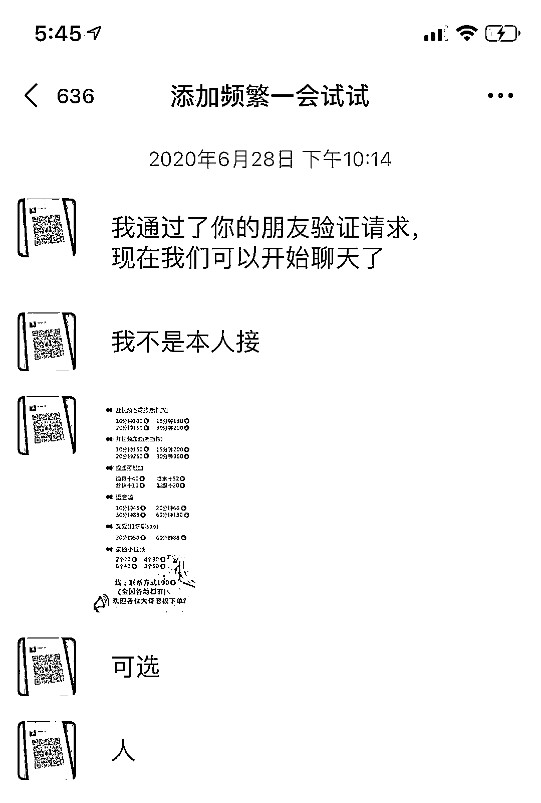

# 眼红职场新角色“网游陪玩”？当心“黄”“赌”陷阱！

> 原文：[`mp.weixin.qq.com/s?__biz=MzIyMDYwMTk0Mw==&mid=2247502343&idx=4&sn=12603a492c7f8a4767ce49af215a07da&chksm=97cb013fa0bc8829ac68000266792e759730a5b8c167e0cc3be2b0816212b3823737a9b5ec1e&scene=27#wechat_redirect`](http://mp.weixin.qq.com/s?__biz=MzIyMDYwMTk0Mw==&mid=2247502343&idx=4&sn=12603a492c7f8a4767ce49af215a07da&chksm=97cb013fa0bc8829ac68000266792e759730a5b8c167e0cc3be2b0816212b3823737a9b5ec1e&scene=27#wechat_redirect)

**点击上方蓝色字体免费订阅“灰产圈”**

“既能玩游戏，又能赚到钱，还能交朋友，以后还可能当工作。”哈尔滨某大学会计专业的大三学生小杨告诉记者，她和几个朋友近来正从事“网游陪玩”，有不少同学投身其中。

日前国家发改委等多部门发文表示，支持线上多样化社交有序发展，引导线上服务新方式规范健康发展。据人社部中国就业培训技术指导中心数据，未来 5 年，我国电子竞技员岗位需求将达近 200 万。

专家认为，受此影响，与之相关的“网游陪玩”产业规模可能快速扩大。新华社记者发现，当前“陪玩者”与消费者大都是年轻人，相关岗位主要通过网络平台发布成交，但部分平台存在涉黄、涉赌等问题。

*****从业者：*****

*****门槛低、钱好赚 消费者：或为“玩”或为“陪”*****

****业内人士介绍，“网游陪玩”是在互联网上为网游玩家提供陪伴游玩服务，并以此获取报酬。近年来，我国电子竞技行业发展迅速，刺激了“陪玩”产业发展。第三方机构数据显示，2018 年我国“陪玩”产业市场规模已达约 4 亿元，未来或超百亿。****

****据记者了解，当前市场上以“比心”“小鹿”等为代表的网游陪玩平台数量已超百款。陪玩游戏主要是王者荣耀、和平精英等热门手游。“网游陪玩”颇有吸引力，让不少年轻人投身其中。****

****“收入不错的。”小杨告诉记者，自己在平台上定价为：陪玩 1 局游戏 9 元；语音聊天半小时 10 元。平台抽取总收入的 20%，其余归自己。兼职 10 天，小杨已赚到 500 多元。记者在多家陪玩平台发现，部分陪玩服务价格高达每局 60 元。“一般来说，游戏技术越好，收费越高。”小杨说。****

****4 月，比心 APP 报告称，平台全职陪玩平均月收入 7857 元，兼职平均月收入 2929 元。****

****“陪玩门槛低，我们农村学生做起来也方便。”家住贵州兴义的大二学生小乐已兼职陪玩一年多，她告诉记者，目前月收入稳定在千元以上，是她生活费的主要来源。“在老家找兼职，工作难找、又脏又累，工资也不比这多。”****

****记者采访了解到，依消费者需求，陪玩类型有所不同。一类是“技术流”，他们主要服务看重提升游戏段位和水平的玩家，其中不乏专业电子竞技员；另一类则是“社交流”，以社交陪伴为主，更多服务看重休闲体验，对聊天音质、交流技巧有更高要求的玩家。****

****记者测试发现，在平台注册陪玩需上传身份证进行实名验证。记者还发现，一些陪玩平台上有人提供情感咨询、哄睡等非游戏服务。****

********

*********部分陪玩平台涉黄涉赌*********

******“网游陪玩”人气高、潜力大，但其中问题不容忽视。记者在部分陪玩 APP 上发现，其名为“交友”“情感”等版块涉嫌色情交易等违法行为。******

******在某陪玩 APP“情感”版块中的虚拟房间里，记者见到其中有主持人和 8 名嘉宾。嘉宾中 7 名是被称为“美女嘉宾”的注册“陪玩师”，另一名则为“老板”。消费者可以通过刷够一定金额礼物成为“老板”，之后有权在听完“美女嘉宾”的自我介绍后，任意挑选一位进行私聊。******

******一位内部人士向记者透露，慑于监管压力，相关违法交易往往通过“暗语”进行。记者以“老板”身份发布“暗语”后，即有人通过平台私聊向记者表示可提供色情服务。记者在对方发来的价目表上看到，涉及裸聊等多项违法违规行为，价格在几十元到数百元不等。还有人引诱记者进行线下违法交易。******

******记者还发现，此类情况在多款陪玩 APP 上存在，违法交易“暗语”也可通用。******

******“千万别碰‘开礼盒’，平台就靠这个赚钱，我亏了 30 几万”“听说能兑现金，我用家里给的 16000 元学费参加‘刀锋电竞’陪玩平台抽奖，全亏完了也没中奖”……多名玩家反映，部分平台的“网络抽奖”或涉嫌“网络赌博”。******

******记者见到，多款陪玩平台都设有“转转盘”“开宝箱”等博彩性质活动——用户利用现金购买抽奖次数，抽中礼物即可通过一定方式在缴纳手续费后提现。“假设中奖礼物面值 100 元，扣除平台手续费后可到手 63 元。”某平台注册陪玩师怂恿记者称“抽奖次数越多，越容易中奖。”******

******记者发现，该陪玩平台单次抽奖费用约 4 元，绝大多数消费者抽中的礼物价值低于 2 元，有的甚至不足 0.1 元，如扣除提现手续费，价值更低。******

******中国人民公安大学法学院副教授李怀胜认为，此类行为涉及金额巨大，已明显超出正常娱乐范畴，涉嫌网络赌博。如证实相关活动由网络平台组织或平台明知并允许他人组织，平台则可能承担组织赌博的相关法律责任。******

************

*********专家：应加强引导，规范管理*********

******据比心 APP 数据，该平台 2700 多万网游陪玩用户中，“95 后”有 1800 多万人，占 67.73%。业内人士分析，“网游陪玩”呈现典型的低龄化特点，为确保产业积极健康发展，既要压紧压实网络平台责任，避免行业受到违法违规行为“毒害”，更要引导规模庞大的年轻人群体全面、理性地认识该行业的特性与价值。******

******北京师范大学网络法治国际中心高级研究员臧雷建议，平台应加强技术防范，对相关暗语进行屏蔽，对多次发布暗语及多次出现问题的用户采取注销账户、屏蔽 IP 等措施。对于违法违规行为可能线上转线下的风险，平台应尽到合理提示义务，提醒用户不得违规违法，注意个人信息及人身财产安全，并配合有关部门实施监管。******

******李怀胜表示，治理网络赌博目前主要依靠刑法、有关司法解释以及治安管理处罚法等。当前应进一步细化完善网络赌博的治理规范，采取提高网络赌博犯罪行为的法定刑等措施，提升法治治理效能。******

******清华大学新闻与传播学院教授沈阳认为，“网游陪玩”是互联网时代背景下的新兴产业，它的发展有一定积极社会意义，如满足现实社交需求、扩大青年就业及增收路径等。但当下也呈现出一些隐患：产业总体仍然稚嫩，岗位需求不够稳定、职业前景不够明朗，从业人员淘汰率高、“吃青春饭”特点明显。因此，各方面应提供充足信息，积极引导年轻人辩证地认识利弊，避免“扎堆跟风”盲目投入。******

******来源：新华社 戒赌吧  记者吴剑锋******

************************************

******← 向右滑动与灰产圈互动交流 →******

********************点击****阅读原文****加入灰产圈高端社群********

************