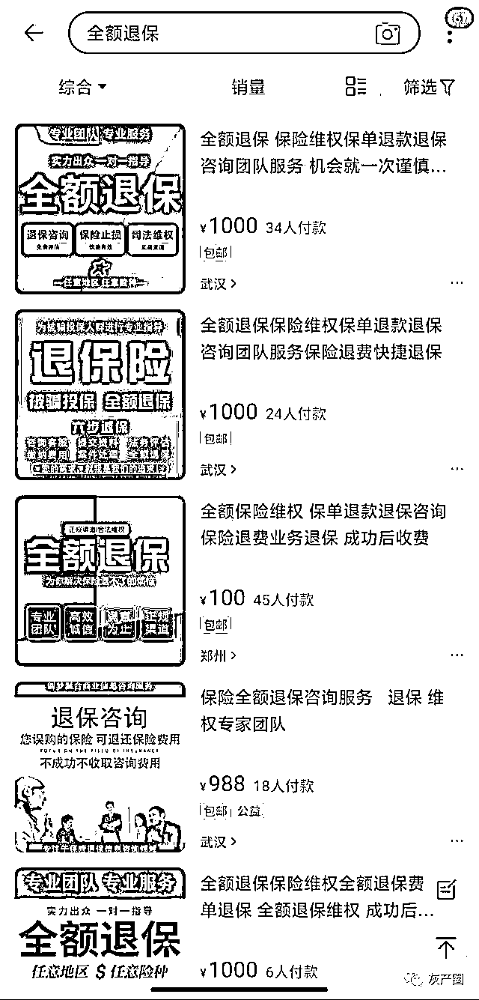
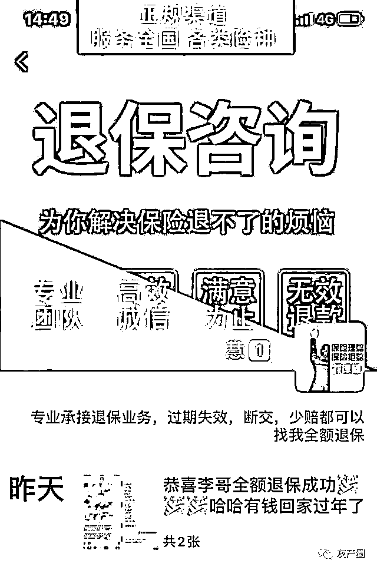
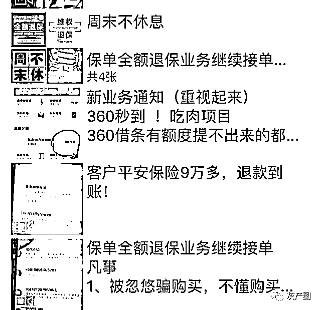
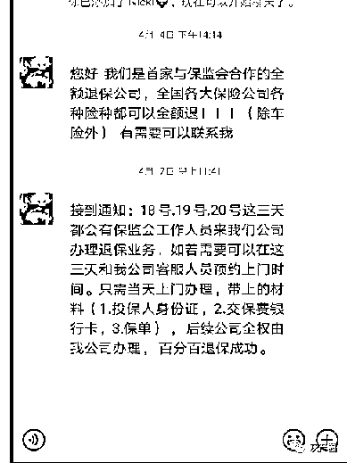
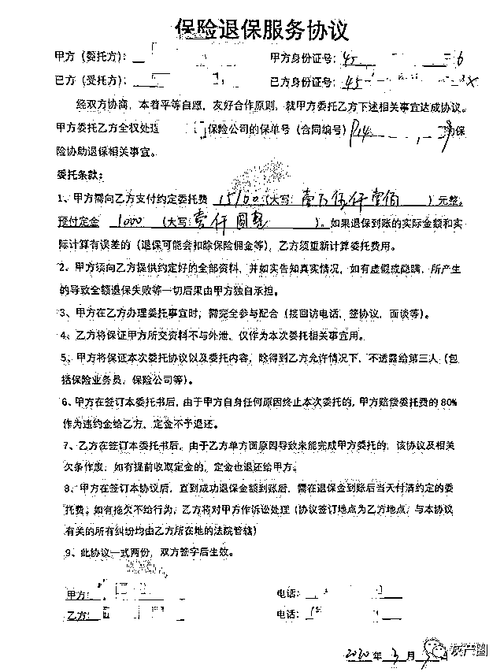

# 揭秘“全额退保”背后的黑色江湖

> 原文：[`mp.weixin.qq.com/s?__biz=MzIyMDYwMTk0Mw==&mid=2247502489&idx=5&sn=4ffb820d4b3417bda9f685c279284e3b&chksm=97cb01a1a0bc88b7da11fa161b1638c1c0f01be13fc6b20657059ce64479dee859cc53e92f1e&scene=27#wechat_redirect`](http://mp.weixin.qq.com/s?__biz=MzIyMDYwMTk0Mw==&mid=2247502489&idx=5&sn=4ffb820d4b3417bda9f685c279284e3b&chksm=97cb01a1a0bc88b7da11fa161b1638c1c0f01be13fc6b20657059ce64479dee859cc53e92f1e&scene=27#wechat_redirect)

**点击上方蓝色字体免费订阅“灰产圈”**

导语

5 月份被确诊为乳腺癌后，邱玲（化名）后悔得不行。

去年，一名退保代理人“指导”她不断向监管部门投诉，最终她全额退掉了几年前购买的一款附加重疾险的寿险产品，代理则抽取了退保金额的 30%作为手续费。

然而，此后邱玲却不幸被查出乳腺癌。失去了保险保障，她不得不自费支付高昂的治疗费用。邱玲的遭遇十分典型：“全额退保代理”愈演愈烈之下，保险消费者以恶意投诉方式进行全额退保，却损害了自身利益。

记者调查发现，本是对消费者合法权益进行保护的“全额退保”，却成了部分人牟利的空子。从获取客户信息，到怂恿客户投诉、代客投诉，再到向监管部门和银行保险机构施压，目前恶意投诉已经形成完整产业链，并呈全国蔓延的趋势。

记者独家获得的监管部门权威数据显示，2019 年，这一现象已波及全国多个省份、一半以上寿险公司。

据不完全统计，过去三年寿险公司疑似收到恶意投诉举报 1.8 万余件，涉及保单金额 3.4 亿元，并呈现运作模式产业化、宣传方式网络化、蔓延态势扩散化的特征。

**退保代理**

设话术“碰瓷”保险公司，退保成功收五成手续费

根据保险法规定，在投保初期，消费者有一段时间的“犹豫期”，在此期间退保，保险公司才需要退全款；一旦超过犹豫期，只退返保单约定的“现金价值”部分，往往只有本金的一半左右。

然而，近年来，一些个人或组织，打着帮客户维权的幌子，通过“恶意投诉”逼保险公司进行非正常退保，以达到全额退保的目的。

记者在淘宝、闲鱼等电商平台发现有不少标注“保险维权”“退保咨询”的店铺；在抖音、快手等直播平台，各类“全额退保”教程层出不穷。

以“退保”为由，记者联系了多名“全额退保”代理。

“不管你在全国任何地区、买了任何保险公司的任意险种，都能无条件全额退保”“安全快速，100%退单成功”“退保只有一次机会，专业的事交给专业的人”。

几乎每一个代理人都采用相似的话术，强调自己“全额退保”的能力。

公开分享成功案例是他们吸引顾客的常见方式。

“客户 9 万多元退款到账”“又有一客户成功全额退保 96500 元。”代理小高的朋友圈每天都刷屏退款到账的截图和保单。

而一旦前去咨询，投保人就落入了更深的陷阱。

“产品不好，应该趁早退保。”看过记者出示的保单，小高团队中所谓“专业保险规划师”给出退保建议。在确认退保后，小高让记者尽快提供身份证、保单、手机号、地址等信息。

调查中，有代理人要求记者签署“保险咨询服务协议书”或“居间服务协议书”，同时支付 1000 至 5000 元不等的押金。

此外，小高告诉记者，一般收取退保金额的 30%至 50%作为手续费。

记者算了一笔账，以一款年缴 2 万元，已交 10 年的保障型保险为例，其现金价值为约 6 万元，这是正常流程下可以拿回的退款额；而“代理退保人”通过恶意投诉，若成功退回 20 万元全额保费，要收取 6 万元至 10 万元的手续费。

不过，要实现全额退保，关键要拿到保险公司存在过错的“证据”。小高启发记者：“回忆下当初买的时候，销售人员有没有给你返点、送礼物？” 

他随后透露，一旦成为他们的客户，团队会派出“专业人士”，传授“钓鱼取证”的技巧。“总之就是找出保险公司的问题，我们还可以教你怎么让他们犯错误。”

当记者提出有难度时，小高进一步“指导”：“钓鱼不成功也没关系，我们可以提供投诉模板，写投诉信寄给监管部门‘碰瓷’，保险公司最怕投诉了。”

和小高相比，还有收费更高的代理团队。

“我们来写投诉信、寄信，替你和公司‘过招’，如果监管部门或者保险公司找你，直接挂电话就行。”退保代理业务员告诉记者，完全授权给他们处理可以提升全额退保成功率。

“因为保险公司最怕投诉，会想方设法说服客户撤掉投诉，而代理人员训练有素，不接受‘讨价还价’。”只要死磕全额退款，大多数保险公司都会妥协。

广东一家保险公司负责人透露，对于保险公司来说，若大量案件未在一定时间内撤诉，将进入监管调查阶段，保险监管部门将投入大量人力物力进行处理。

保险公司在较大的投诉考核压力之下，有时会无奈选择全额退保。退保代理人可谓抓住痛点、精准“狙击”。

**保险公司**

被黑产分子“卧底”，半年受损逾 1.2 亿元

“初步估算，广东几家大型的保险公司今年以来遭遇的恶意退保案件超过 3800 件，涉及金额超过 1.2 亿元。”广东一家寿险公司高管蒋平（化名）对记者透露。

广东是全国最大的保险市场，今年以来，各家保险公司接收监管正式转办的涉嫌“恶意投诉”案件激增，某保险公司负责人告诉记者，以该公司广东分公司为例，今年二季度，此类案件增长了 5 倍。

记者从广东省地方金融风险监测防控中心获悉，该中心对“恶意退保”进行监控后发现，“退保代理”于 2018 年在长三角有过短暂的活跃期，经监管部门定向打击后归于沉寂。

但广东一家保险公司的监控情况显示，2019 年下半年，“代理退保”自江浙沪向粤桂琼一带扩张，部分地区正向三四线城市下沉。“今年前 5 个月 55%的投诉信件来自广、深两地。”蒋平告诉记者。

广东省地方金融风险监测防控中心的监控数据佐证了此点。

根据该中心的大数据监控，今年 5—6 月，“代理退保”在网络上进入高峰期，监控数据显示，广、深是退保黑产信息发布的主要地区。

记者调查发现，目前“代理退保”已经形成完整产业链，从单兵作战转向公司化运营，呈现手法专业化、渠道扩展化、组织集团化、目的利益化等特征。

蒋平发现，黑产分子甚至开始上演“无间道”的戏码。为缩短获利周期，他们开始安排人“卧底”。

“‘退保代理’有预谋地安排人轮流入职各大保险公司，在销售过程中故意预留证据，赚取一波佣金后离职，接着再联系鼓动客户全额退保，通过收取代理退保费二次获利。”蒋平告诉记者，这样“卧底”甚至一批多达十几个人。

除了“卧底”，部分“代理退保”团队还假借监管部门及保险公司名义揽客。

“一名退保代理团队核心人员无意中透露，他的成员藏匿在广州郊区，已有 200 余人，通过非法买卖公司客户信息，分配给手下具有较强销售能力者，假借公司售后服务人员的身份上门，非法误导客户购买新单以牟取佣金。”

蒋平告诉记者，“代理退保”团队内部分工明确，有人专门负责物色、招揽业务高手；小组长负责提供名单、追踪佣金业绩；远程外呼人员负责邀约客户上门拜访、派发任务；上门人员负责上门诱导客户退旧投新等。不同岗位佣金分成已经形成行规，比如小组长一般分成 30%，上门人员一般分成 40%。

在保险业内看来，“代理退保”产业化的恶劣影响在于借助网络大肆宣传退保利益，诋毁保险产品和寿险功用，营造客户与保险公司的紧张氛围，误导大众产生抵触误会情绪。

同时，为获取非法利益，诱导正常承保的保单客户进行投诉退保，引发大量不合理投诉，严重影响了保险行业的正常经营秩序。

**消费者**

被骗费骗贷骗隐私遭遇收割“连环套”

事实上，恶意全额退保最终损害了消费者合法权益。记者调查发现，“代理退保”已经逐渐演化出收取高额手续费、退旧换新赚取佣金、出卖个人信息、利用信息骗贷等连环“收割”陷阱，消费者甚至无法自行中止业务。

“退保后身体出了问题，没法再次正常投保了。”在最需要保险时失去了风险保障，李先生为他去年的“机智操作”后悔不已。

去年 8 月，在“代理退保”业务员的鼓动下，李先生以受到营销误导为由向保险公司投诉，最终退还购买 6 年的纯保障型保单保费 32.04 万元，并向代理人支付了 8 万元的手续费。

然而，去年 12 月，李先生想重新购买保险时却被检查出健康问题，保险公司随之拒保。

对此，保险公司负责人提醒，按保险合同规定，退保除了会使消费者面临经济损失，还会丧失原有保险保障、再投保时保费提高、再投保时保险权益受限制，甚至拒保等风险。

记者了解到，多家保险公司为了防止恶意退保，升级保险风控措施，消费者恶意投诉获得全额退保后，可能被列入黑名单，导致后续“无险可投”。 

失去保障之外，消费者启动“代理退保”，往往会遭受资金损失和陷入诈骗风险中。

记者调查发现，目前“代理退保”分阶段收费，但会要求消费者预先支付各种名目的其他费用。

今年，朱先生缴纳保证金 1000 元和材料费 100 元，办理“100%退保”业务后，代理人员却借故一再拖延，此后更是拒接电话，微信拉黑，朱先生的钱也打了水漂。

一位退保代理中介对记者表示，委托全额退保，需要先交定金。

但该公司开始“证据分析和取证”后，消费者放弃诉求，定金将不会退还，而在“法律材料的整理、撰写、顾问指导”阶段后，无论消费者是否主动放弃诉求、费用按照合同约定收取。

令消费者进退两难的不仅仅是已经缴纳的费用。

在调查中，记者发现，代理退保从业人员，往往和消费者签署《服务协议》，并收取定金、身份证、保单等作为抵押，让消费者骑虎难下，也让保险公司难以介入。

“代理退保”一旦启动，消费者甚至无法自行中止，广西的梁先生就有此遭遇。受广告诱惑，他找到一家退保代理开始全额退保。

但后来由于希望终止退保申请，却遭遇代理人通过电话、上门等方式骚扰恐吓。出于对人身安全的考虑，梁先生最终还是被迫办理了全额退保并向其交纳 12500 元的高额手续费。

此外，更大的风险存在于信息泄露后。记者通过联系“退保专家”，其列举的退保客户询问问题高达 26 个，包括各类敏感信息。

佛山的陈先生就是因为办理“全额退保”，导致信息泄露，被人冒名进行贷款。

陈先生告诉记者，今年 5 月他先后收到多家借贷机构的还款通知。经过一番调查，陈先生发现问题出在为自己代办“全额退保”的人员黄某。因为退保，他向黄某提供了大量的个人信息，这些信息被黄某恶意用于借款。

有保险业从业人员向记者表示，保险代理人可通过获取的信息向保险公司验证，掌握更多客户其他保单及业务的信息，使得消费者信息完全暴露。

有保险行业人士透露，利用掌握的身份证、银行卡等信息，黑产分子可以截留消费者退保资金。不少黑产分子在代理退保之外，往往也从事信用卡套现、小额贷款业务，消费者个人信息资料被泄露后，往往成为套现的工具。

记者：陈颖 张艳 黎华联 来源：南方日报

← 向右滑动与灰产圈互动交流 →

