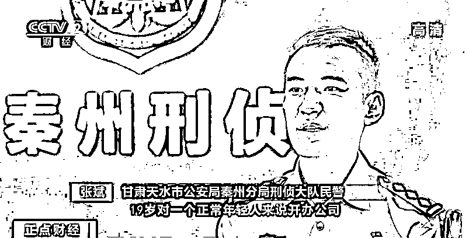

# 19 岁开 5 家公司，每笔进账百万千万！背后真相惊人

> 原文：[`mp.weixin.qq.com/s?__biz=MzIyMDYwMTk0Mw==&mid=2247502489&idx=6&sn=fb6b50ec60f3a42d094133faddc3bf86&chksm=97cb01a1a0bc88b703162558d0c5d88bda3a3d8161bc4da4a55ce9e5e112e79e88bc4a513b0c&scene=27#wechat_redirect`](http://mp.weixin.qq.com/s?__biz=MzIyMDYwMTk0Mw==&mid=2247502489&idx=6&sn=fb6b50ec60f3a42d094133faddc3bf86&chksm=97cb01a1a0bc88b703162558d0c5d88bda3a3d8161bc4da4a55ce9e5e112e79e88bc4a513b0c&scene=27#wechat_redirect)

**点击上方蓝色字体免费订阅“灰产圈”**

******仅靠一张身份证、签个字、银行露下脸，没有任何门槛就可以当“公司老板”，并且收入丰厚。这样“天上掉馅饼”的好事真的存在吗？背后又隐藏着怎样的秘密呢？******

******  ******

******01******

********转入保证金后对方销声匿迹********

 ******[`mp.weixin.qq.com/mp/readtemplate?t=pages/video_player_tmpl&action=mpvideo&auto=0&vid=wxv_1532644253972103170`](https://mp.weixin.qq.com/mp/readtemplate?t=pages/video_player_tmpl&action=mpvideo&auto=0&vid=wxv_1532644253972103170)****** 

******2020 年 4 月，家住甘肃省天水市秦安区的宋先生在网上购买了机票后，接到了这样一条投保航班延误险的短信。******

************ 

******甘肃天水市公安局秦州分局刑侦大队反电诈中队中队长霍涌：我们接到辖区居民宋某的报案，称其在网络购买机票的时候因为天气原因航班延误，可以退机票的 300%票款。******

 ******宋先生看到短信中承诺的赔付比例，为了保险起见决定进行投保。这时对方说了，由于首次投保，需要缴纳保证金作为个人信用的担保。就在宋先生向对方所提供的银行账号汇入五千余元保证金后，对方就销声匿迹了。******

************

******警方立刻意识到这是一起典型的电信网络诈骗案件，就在对宋先生转入资金的账户进行深挖，希望可以找到突破点的时候，警方遇到了一些困难。******

 ******甘肃天水市公安局秦州分局刑侦大队反电诈中队中队长霍涌：通过一级涉案资金账户查下去，发现所有的流转账户全是对公企业账户，没有个人名下的银行帐户。侦查过程中，发现有一张本地的对公银行帐户卡是甘肃某商贸有限公司。******

 ******根据线索警方立即对这家公司进行了调查，侦查后发现了令人匪夷所思的事情，公司法定代表人赵某仅仅只有 19 岁。警方发现该涉案公司不仅法定代表人年龄较小，而且资金流巨大，这更加引起了警方的怀疑。******

************ 

******甘肃天水市公安局秦州分局刑侦大队民警 张斌：对一个正常年轻人来说，19 岁开办公司，而且每笔进账均为大笔金额，成百万、上千万，是不符合逻辑的。******

 ******查询过程中发现，公司法定代表人赵某名下的公司不止一家，而是五家。******

 ******甘肃天水市公安局秦州分局刑侦大队反电诈中队中队长霍涌：注册的地址都是在天水，我们把这些地址统一跑了一遍，没有所说的地址上有这个公司。******

******02******

********涉案公司都是空壳公司******** 

********登记地址不存在********

 ******[`mp.weixin.qq.com/mp/readtemplate?t=pages/video_player_tmpl&action=mpvideo&auto=0&vid=wxv_1532768835940974592`](https://mp.weixin.qq.com/mp/readtemplate?t=pages/video_player_tmpl&action=mpvideo&auto=0&vid=wxv_1532768835940974592)****** 

******这个 19 岁的赵某年纪轻轻，刚刚步入社会就能担任多个公司的法定代表人，究竟是年少有为还是另有隐情？经过警方调查，赵某家庭条件一般，也没有工作，那么他是如何注册了如此多的公司？公司账户每日流转的大额资金又是哪里来的呢？******

************

******经民警实地查证，这些公司无一例外，全部是空壳公司，登记地址根本不存在。******

 ******甘肃天水市公安局秦州分局刑侦大队民警张斌：我们对股东和法定代表人名下的所有公司进行了银行调证工作，发现他公司的名下都办有对公银行账户，而且都绑定了电话卡、办理了 U 盾和单位结算卡。我们也调取了他们近一年的银行流水，发现一年之中这些对公银行账户每天都在发生大笔的交易，而且数量巨多，更有甚者，一天的交易金额达千万。******

 ******办案民警细致研判和摸排后的信息让警方感觉到，这些公司并不只是“空壳”这么简单，天水警方决定立即成立专案组对此深挖彻查。******

************ 

******警方确定了侦查方向后，第一时间对赵某等人进行了控制，但是在进行讯问的过程中，包括赵某在内的嫌疑人对公司背后的诈骗等违法犯罪活动居然一无所知。******

 ******据其供述，一切仅仅源于自己在网上看到的一则兼职广告：“招募电商伙伴”“三天赚几千，包吃住”“无本买卖，专人指导，操作简单，稳赚不赔”。在这些关键词诱导下，他联系到了发布广告的兼职负责人。******

************ 

******甘肃天水市公安局秦州分局刑侦大队民警张斌：高额的回报、高利润，不用做什么担保，也不用交押金。******

 ******对方表示，应聘者只需要等电话，按照电话指示携带身份证与相关人员见面。见面后，相关人员会带应聘者去银行和工商局办理一些手续，一切都只需听指挥即可，配合度高或者介绍其他应聘者还会有相应提成和奖励。******

 ******这种披着兼职外衣的犯罪行为慢慢地形成了黑灰色产业链，在这条“产业链”背后，办过卡的无业闲散人员在尝过“甜头”之后，也开始寻找下线，寻找身边的“潜在客户”，或者通过网络渠道隐秘发布信息，以此招募和吸引有意向者来到身边。******

******03******

********“上线”浮出水面******** 

********警方查明其活动轨迹********

 ******[`mp.weixin.qq.com/mp/readtemplate?t=pages/video_player_tmpl&action=mpvideo&auto=0&vid=wxv_1532677670965149697`](https://mp.weixin.qq.com/mp/readtemplate?t=pages/video_player_tmpl&action=mpvideo&auto=0&vid=wxv_1532677670965149697)****** 

******面对庞大的信息流，警方根据目前掌握的银行卡信息赶往多个对应的开户行进行调查，并对嫌疑人身份及轨迹进行分析，很快警方查询到了一个以陈某、兰某等人为首的犯罪团伙，并逐步掌握了他们的活动轨迹。****** 

************ 

******甘肃天水市公安局秦州分局刑侦大队副大队长王富民：前期我们根据侦查研判，初步掌握了这个犯罪团伙的组织架构。******

************ 

******专案组民警根据前期调查的相关信息，分成多个侦查小组，先后前往广东等地对对公账户买卖和使用等基本情况进行调查、固定证据。天水市公安局刑警支队组成五个抓捕小组分赴四川、湖南、广东等 5 个省 17 市对全链条犯罪嫌疑人进行了统一布控。******

************

******甘肃天水市公安局秦州分局刑侦大队反电诈中队指导员 刘艳和：在 509 宿舍发现了兰某，他收拾完东西正准备下楼跑的时候，发现我们上楼了，他没办法躲了。后期通过近一个星期的工作，把吴某等其他四人全部抓获。******

************ 

******截至 2020 年 6 月 23 日，共抓捕犯罪嫌疑人 25 人，经查，该案中上线卡商 4 人，中介财务代办人员 6 人，办卡人员及出卖对公账户嫌疑人 15 人，冻结资金账户 26 个，现场缴获涉案手机 31 部，对公银行“5 件套”6 套，公章、营业执照等作案工具 70 余件。 ******

******来源:央视财经******

************

******← 向右滑动与灰产圈互动交流 →******

************