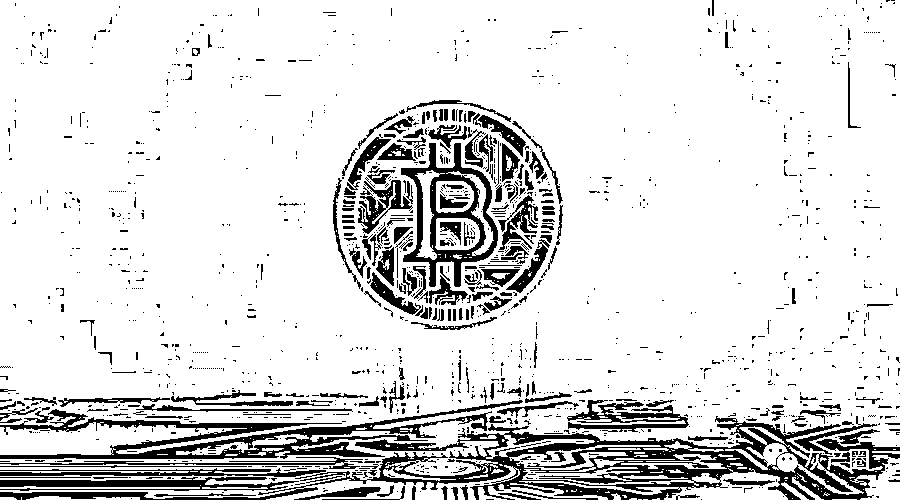
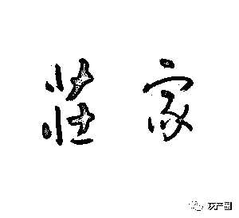
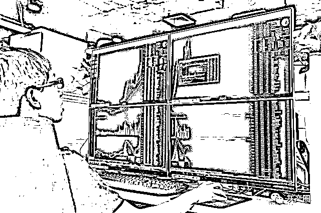
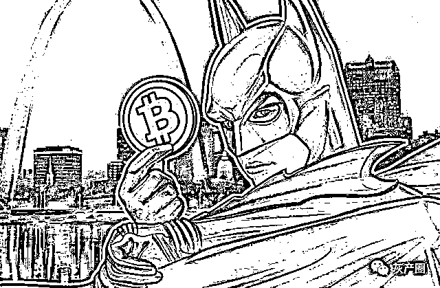

# 币圈庄家操盘指南

> 原文：[`mp.weixin.qq.com/s?__biz=MzIyMDYwMTk0Mw==&mid=2247502535&idx=1&sn=4e874027c84698b823712b31c9d0ec74&chksm=97cb01ffa0bc88e995a39ba0ef65586a05c6ffda9304f9dbd28b15a1489d343b08fff8d3aff0&scene=27#wechat_redirect`](http://mp.weixin.qq.com/s?__biz=MzIyMDYwMTk0Mw==&mid=2247502535&idx=1&sn=4e874027c84698b823712b31c9d0ec74&chksm=97cb01ffa0bc88e995a39ba0ef65586a05c6ffda9304f9dbd28b15a1489d343b08fff8d3aff0&scene=27#wechat_redirect)

**点击上方蓝色字体免费订阅“灰产圈”**

**导语**

币圈市场和股票市场的定律是一样的，均是一赢两平七亏，意思是 70%以上的人都会亏损，那散户如何才能站到赢利的 10%人的群体中？我认为机构为了赚散户的钱，不断在研究散户的心里和行为学，我们散户不妨反过来，把自己当成机构投资者，也来研究一下机构的心里和行为学，这样才能在这个充满陷阱，欺诈，骗术和谣言的市场里立于不败之地。 

****一、假如我是一个庄家，****

****我会怎么做？****

****

**同样的，我会边托边砸，这样一来我就会得到更多价格更低的筹码。当 跌到很低位时，基本上就没人和我抢筹码了，因为在这个下跌途中，我通过不断的高抛低吸，不断的大幅度振荡，将大部分抄底的，抢反弹的都套在下跌途中，或者 将他们亏损怠尽，使其不敢在来涉足这个币种，这时候我的目的就达到了。散户恐惧惊慌，高位筹码就会不断的掉落，我就可 以在底部横盘当中不断的高抛低吸来收集筹码，这个可能需要较长时间，关键看顶部筹码掉落程度而定， 如果高位筹码长时间的不松动，那我就不会去拉这只币种。**

****

**当筹码收集足够多时，因为在我收集筹码当中，技术团队出一些利好，在配合整体行情，这时候我拉起来毫不费力，也无需多大成本。当这个市场里其他人看到这个币连续涨几天，必然跟风者众，我就在这这当中逐步减仓。** 

**该技术对团队配合我们他有什么好处，其实很简单，我将这个币拉到高位，他们自己所持有的币子也能卖个好价钱；在低位时，他们同样可以购入自己的币子，还能挣得名声，这样一来收益会相当可观，何乐而不为？**

**这当然要和大盘走势相同，在这中间，散户该知道怎么办了吧。**

****当然，如果我做庄，还必需考虑很多问题：****

**第一：是法律上面，目前虚拟货币这一块还没有一个具体的法律法规来约束，所以大资金炒币，应该没有什么大问题。**

**第二：要考虑资本的问题，如果我们拉的时候，他们看到利润可观，结果大量抛出筹码,那我们就惨了，必然会亏本出局，在做之前就必需先和他们沟通好，而且还要了解他们手上的流通盘是多少，抛售意向如何,这就是大小非问题。**

**第三：要考虑的是老庄，如果这个币没有被老庄放弃，那我是尽量不会去碰的，因为一但被老庄反做,那你死得就惨了，就像中国联通套游资一样，那死得是非常惨的,所以,选币非常重要。

第四：就是大盘状况， 跟风的多不多，社会上的存量资金足不足，就像现在这样，大部分散户或者大户都被大宰一刀，这时候就不适宜做币，人心溃散，大盘多次腰斩，完全是熊市，你拉，别人出货，就把自己套在里面。那现在 最适宜的就是砸币子。一般人都有个心态，20 元买的币，跌到 15 元不卖，跌到 10 元不卖，跌到 5 元仍然没多少会人卖，但是你要跌到 2 元再拉回 4 元，不少人 一看翻倍基本上都会割肉的，特别是长时间的向下或者横盘。

如 果这些问题都解决了，砸盘就要开始。砸多少为适宜？根据大盘状况，每天操盘必需跟着大盘走，当大盘大跌时，你必需深砸下去，这时候成本很低，只要用少量筹 码将关键点位砸开即可，会有止损盘帮你接着砸下去。但是尾盘必需进一些筹码，防止第二天大盘走低或者走高，有一定量筹码就好灵活掌握，也就是说，要在操盘 时盯着龙头币种（比特币就是龙头）。** 

****为什么要盯着龙头币子去做？****

**关键就在于成本，随着大盘波动，你的成本最低，比特币跌时，你也跌，所用砸盘筹码量最少，因为没有多少人敢买，可以深砸。当大盘涨时你去拉，同样无须买多 少，只要将关键点位的筹码买掉即可，有人会将股价推上去，到一定高点，你还可以将低位进的筹码出掉一些，这样可以腾出一点资金做一点差价。

所以，我们看到的币圈局面就是要涨一起涨，要跌大家都去跌。

在币圈中的人分好几种：趋势投资者，套牢后不理不睬者，技术派，基本面派，长线客，短线炒家等等。

我要在这个币子里做庄，这些人我都要面对，尽量的让他们在我控制的这个币子里少赚或者割肉而去，这时候我就要用很多办法来对付，因为他们赚多了，意味着我就赚少了，他们不割肉，我就赚不到钱。

对趋势投资者，我没什么好办法，只能将他们看做锁仓的一员；但对其他人，我平时的吃喝玩乐就全靠他们了。

我一般最喜欢套牢后不理不睬的，这些人把钱交给我后帮我锁定了大部分筹码，使我在底位有充足的资金纵横驰骋。

基本面派也是我喜欢的第二位，因为当我将币价拉高后他们基本就接手了，利好一出，他们就接盘了，等他们接完后，开个什么会议，他们在低位就将筹码再还给我。

技 术派一般短线较多，喜欢做波段，这里的人有自认为技术高明的，什么 KDJ 金叉、死叉，什么 MACD、CR、量价关系，什么费波纳奇黄金分割位，什么艾略特 的波浪理论，还有江恩曲线等等，等等，但我做币子一般不看这个，我一般只盯着今天我下多少单， 在某些价位进来多少单，大一些的户头在什么价位进出。这个对 我来说非常关键，因为这决定了第二天该如何操作，有时候需要对他们安抚，让他们帮忙将币子在手上多留几天，以使活动筹码减少。

但有时候就必须让他们出局，特别是短线客，当今天发现短线游资进来多了，第二天不管怎样都要将他们杀出局，哪怕逆大盘而动。** 

**回过头来看，呵呵，真搞笑，K 线走的还真符合某些技术指标特点。偶然乎，必然乎。**

**这里解释一下我为什么要猛杀游资。**

**其实这关乎自己的短期收益,因为短线客和游资的钱最好赚,他们持筹码的时间短,可以使我非常短的时间里获利。**

**例如套牢盘，你只能一次性的赚他一下，他然后就不动了，你就拿他一点办法都没有，这中间有时候长达几年，在这几年里我可是要吃要喝的；本面派也使我获利不多，因为他们的利润我还要和公司均分。**

**但短线客和游资就不同了，我在一个波段中就可以获利丰厚。**

****那怎么做呢？****

**第 一是是逐步拉升，这时候技术指标就开始走好，技术派的人一看技术指标，一般都容易被诱惑进来,这中间我就边拉边卖，需要控制的就是在顶背离之前将筹码交他 们手中，使他们看上去技术指标仍然没有到顶，币价还可以涨得更高,这时候第二天来个冲高回落，然后第三天猛然下跌，他们基本上就开始交枪了，不用我来，币价就下去了，这中间自然我设定好价位来捡果实，对游资更是这样，上半段我来拉，游资一看币价看涨，立即蜂拥而来，那下半段我就将部分筹码交给他们，第二天 我来个低开低走，游资一看势头不对，立即出逃，这时候我就要看出逃数量，并计算自己的成果，如果出逃数量足够多，那我下午就拉起，因为大部分短线客都走 了，我就不需要支付多少利润出去，很容易将币价拉起来，而我在这两天来回的差价最少是赚交易额的 3%左右。**

**但发现没有走多少时那我就继续向下做。**

**这就是不少散户疑问的，为什么我一卖就涨，一买就跌啊？因为你跟大部分人的行为是一致的，呵呵。**

****二、坐庄的风险是什么？****

**一是操作这个币的不会是我一个庄，一般都是邀请几个人来联手，就像大草原上的猎狗一样，采用群体战术才能更容易获得成功。要是一个人，第一不一定有这个实力，第二就是太容易被人抓住把柄，搞不好打不到狐狸还惹一身骚，所以，邀请朋友来合作是肯定的，就谁主谁次的问题了。**

**既然是合作，风险也是明显的，当市场出现波动时，其中一个朋友立马放水，这时候你就栽了，很长时间的辛苦都会打水漂。**

**还有一个问题是，当市场趋势向下时，自己却没发现，因为筹码还在自己手中，就想硬扛，这时候同样会完蛋，前几次大牛市结束后不少庄家摔跟头就在这上面。**

**那 么，应该如何应对风险，这就是，第一注意比特币的动向，因为坐庄的人对大盘指数动向非常敏感，当比特币向上，而一些主力控制的次要币却滞涨，或者有掉头迹 象，那我就要先于比特币下跌之前想办法将手里的筹码尽量的都交到散户手里去，尽量的腾出现金，只要手上有充足现金，是涨是跌我都不怕。涨了，我手上剩余的筹 码完全可以将其打下来；要是跌了，那就可以购买更多的筹码。**

**当大盘到底准备反转时，也同样会痕迹明显。** 

****三、谈谈顶和底的问题****

**现 在不少人都在关心大盘跌到什么位置才是底，13000、11000、8000？说老实话，我不知道，我不但不知道大盘会跌到什么点位为底，我会连自己坐庄的币种能跌到什么价格为底都不知道，怎么能测算大盘。有人说，20 元跌到 5 元行不行？到底了吗？我说不行，也许跌到 1—2 元，也许会到 8 元就算到底了，在币市 里没什么顶和底之说，真正起作用的就是供求关系，当跌到供求平衡时，底自然就到了。**

**例如我的币子，我每天都在让它波动，涨涨跌跌，但某一天我发现，我卖出去的币，用这些钱买不回来更多或者同样多的币了，这时候我就不可能再向下做了，这里就应该是它的底了。也许是 5 元的位置，也许 1 元的位置还不到，又有谁知道在哪个位置能达平衡呢，只能不断的测试。
   顶部也一样，我向上拉，却没了跟风的，那我高价买来的股票又能派发给谁？当然，我拉高给你看价格却又是一码事，底部也一样。
   在指数里，同样如此，如果进出资金能达到平衡，那指数就到底了；如果不能，一直要跌到平衡为止。** 

****四、庄家在下跌中是****

****如何赚钱的？****

 ****

**不 少人有时候不理解，庄家的成本是 20 元，他将股价打到 10 元或者 15 元，他不 也亏了吗？这真是傻庄，其实散户是不明白的，庄家赚钱的手段很多时候是和散户 不同的。当买但低于卖单时，庄家手里拿的是币，只有变成钱了，才是真金白银，他不跌下来自己出货，难道等散户出货，这也是最近很多币子一个腰斩，再来一个，之后还来一个，目前大多数币子跌了 80%，1 万成了 2000 块了！！！** 

**其实不是这种情况，不砸盘出货，散户也会跟着出；而承接盘有限，机构的货是出不掉的，慢慢的下跌机构损失会更惨，并且你由于价格没有吸引力，找不到对手盘，那就成了钝刀子割肉，痛苦只有自知。

采 用了猛砸跌停的办法，市场的目光就会集中到那上面来，当跌到一半时，有庄家开始巨量吃单，因为在这几天的跌停中市场的关注度非常高，而出现巨 单吃货了，这说明这时的股价应该反弹了，技术上超卖出现，币价腰斩，怎么着都要反弹个百分之十几到二十，所以散户、大户一哄而上，庄家卖单被哄抢。

但现实情况并不是散户和大户们所想象的，在熊市中放巨量的往往都是出货，看似大单扫货，其实就是庄家们设的陷阱，然后利益分享。

再举个股 票上的的例子， 南车：上市价超过发行价 60%以上，5 个机构席位齐刷刷的排在购买的前 5 名，这些机构傻了吗？非要溢价 60%来接盘，特别在熊市中，还怕买 不到筹码？如果等几天再买，也许到发行价都有可能。其实，机构们一点不傻，这不过是机构之间穿连裆裤的表演，那些获得 60%以上溢价的会给这些接盘的机构 分配一定利润的，而且这些机构买入的也并不多，更多的筹码是溢价交给了其他人，包括大量散户手中了。对接入大部分高溢价筹码的这部分人，那些获利者就不用 考虑什么了。**

**所以，我操作的币子我就希望它能跌下来，尽量的低。**

**举 个例子，在 20 元到 18 元区间，我出掉了手中的 20%币，在 18 到 16 区间我又出掉 18%的币，后面我就要回补，因为在这种下跌的情况下，不少止损盘 开始涌现，还有些人要补仓，这时候我就要根据筹码情况做反弹，为什么要做反弹呢？主要是吸引抄底盘进来，当然，如果抄底盘巨多，第二天我就再反手做空。**

**一般情况下第一天的反弹抄底的是不多的，只要进行两天，散户一看，这个币怎么天天涨，特别是割肉盘和补仓盘，他们一般都会追进来，而高位的一看涨了几天，不卖算了，等几天也许还能赚点。这时候我再反手做空，将他们套住。**

**这中间我赚多少？因为拉的当中还要派发利润，所以，每一段的下跌可以保持一定的利润。**

**那 我为什么希望我坐庄的币价尽量低？你想想，你如果开个商场，你是希望你经营的货物便宜还是贵？自然是便宜的好，因为这样一来所用资金量就少。10 元加 1 元，人家就嫌贵了；如果 1 元加 1 角，不显山露水的，没人和你计较，而和 10 元和 1 元所赚比例却是一样的。股票也一样，1 元股票涨到 1。5 元，没多少人感觉 什么；但 10 元涨到 15 元呢？**

**这就是币圈市场牛短熊长的根本原因，庄没几个希望股价很高来增加自己的成本。**

**来源：资金盘排行，利箭在行动**

****

**← 向右滑动与灰产圈互动交流 →**

****

 **# 

> 原文：[`mp.weixin.qq.com/s?__biz=MzIyMDYwMTk0Mw==&mid=2247502535&idx=2&sn=a8437b459198c98c5e1129f4ccffb431&chksm=97cb01ffa0bc88e9e713840edaea9d471fca18fbf910e80837585a2dba58fdb37d52b43ee0ab&scene=27#wechat_redirect`](http://mp.weixin.qq.com/s?__biz=MzIyMDYwMTk0Mw==&mid=2247502535&idx=2&sn=a8437b459198c98c5e1129f4ccffb431&chksm=97cb01ffa0bc88e9e713840edaea9d471fca18fbf910e80837585a2dba58fdb37d52b43ee0ab&scene=27#wechat_redirect)**