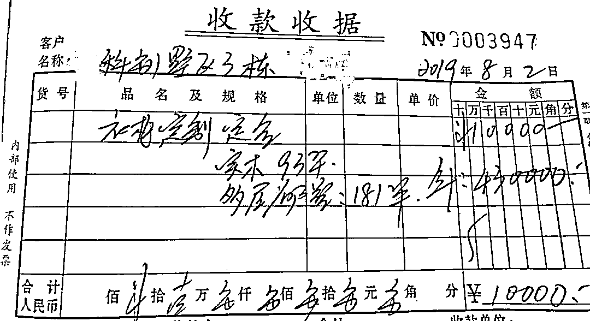

# 涉案千万！女子沉迷赌博，调查发现身份不简单...

> 原文：[`mp.weixin.qq.com/s?__biz=MzIyMDYwMTk0Mw==&mid=2247502535&idx=6&sn=f78e310049e7b6f14ce749d684d47bc9&chksm=97cb01ffa0bc88e918d6048ae97f8226e35e63abc7fa6ba66f7334fb9a0c0eafde747be4d828&scene=27#wechat_redirect`](http://mp.weixin.qq.com/s?__biz=MzIyMDYwMTk0Mw==&mid=2247502535&idx=6&sn=f78e310049e7b6f14ce749d684d47bc9&chksm=97cb01ffa0bc88e918d6048ae97f8226e35e63abc7fa6ba66f7334fb9a0c0eafde747be4d828&scene=27#wechat_redirect)

**点击上方蓝色字体免费订阅“灰产圈”**

网络配图

**导语**37 岁的陈某，做家具生意，衣食无忧，但自从她进一个赌博微信群后，生活发生了改变。**从此她沉溺赌博，无法自拔**……拼命想赢钱，但她却越输越多。

**视频**

[`mp.weixin.qq.com/mp/readtemplate?t=pages/video_player_tmpl&action=mpvideo&auto=0&vid=wxv_1497535101423910914`](https://mp.weixin.qq.com/mp/readtemplate?t=pages/video_player_tmpl&action=mpvideo&auto=0&vid=wxv_1497535101423910914)

**视频**

[`mp.weixin.qq.com/mp/readtemplate?t=pages/video_player_tmpl&action=mpvideo&auto=0&vid=wxv_1536990315625119746`](https://mp.weixin.qq.com/mp/readtemplate?t=pages/video_player_tmpl&action=mpvideo&auto=0&vid=wxv_1536990315625119746)

网络配图

无计可施的陈某为了有钱赌博起了歪念头，利用家具生意**诈骗亲友近千万元**该案近日已移送检察院审查起诉。

**视频**

[`mp.weixin.qq.com/mp/readtemplate?t=pages/video_player_tmpl&action=mpvideo&auto=0&vid=wxv_1536995422341234688`](https://mp.weixin.qq.com/mp/readtemplate?t=pages/video_player_tmpl&action=mpvideo&auto=0&vid=wxv_1536995422341234688)

**陈某是怎么**

**编造理由行骗的呢？**

**2019 年 3 月份开始**陈某跟陈某冬商定好合作做某市全屋定制项目，由陈某冬出钱，陈某拉客户上门安装，收入所得按比例分成。4 月中旬，陈某以客户预付定金的方式让陈某冬转钱，期间，陈某为了不让陈某冬起疑心，每周会伪造单据作为“客户家具交付的款项”给陈某冬。（伪造的单据）2020 年 4 月 20 日，陈某冬发现被骗。此时陈某诈骗金额超 849 万元。

**2020 年 4 月份**

赖某于 20 年 4 月 11 日至 4 月 20 日期间，先后七次往陈某提供的转账**超 58 万元。**

**2020 年 4 月份**

陈某以合作酒水生意为名诈骗杨某华。

杨某华于 2020 年 4 月 14 日至 4 月 21 日期间，先后往陈某提供的**转账超 29 万元。**

**2020 年 4 月份**

陈某以合作家具生意为名诈骗陈某英。

陈某英于 2020 年 4 月 10 日到 4 月 18 日期间，先后往陈某的微信及陈某慧提供的转账超 42 万元。

**遇到钱财交易**

**一定要多留个心眼**

**提高自己的防范意识**

**避免受骗上当！**

来源丨 i 听厦门、厦门广电、网络 戒赌吧

← 向右滑动与灰产圈互动交流 →

