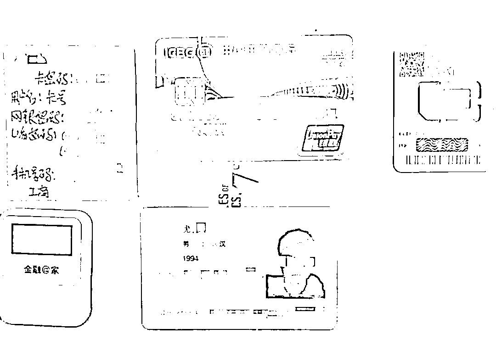
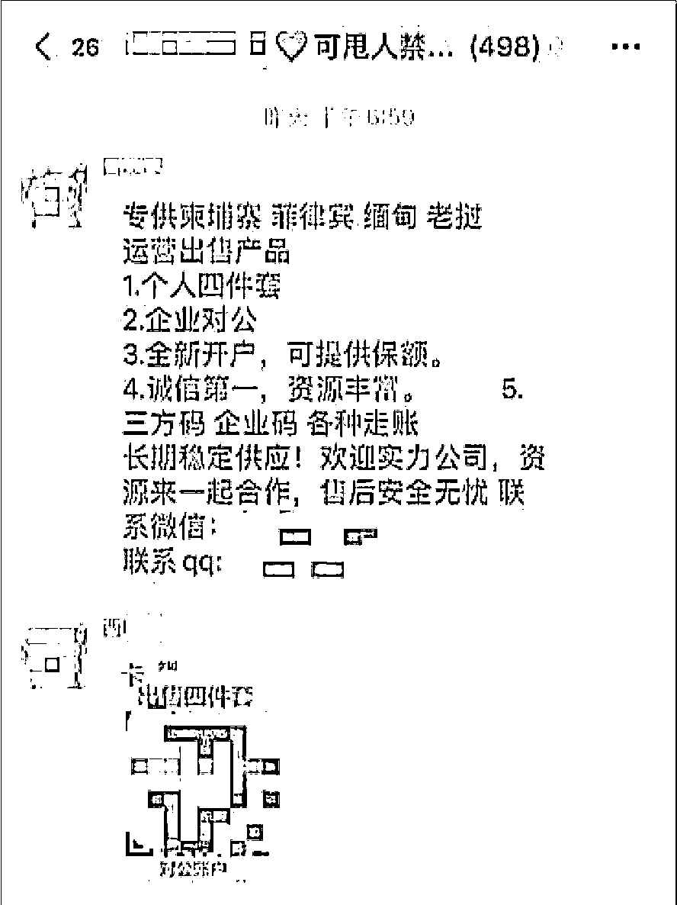
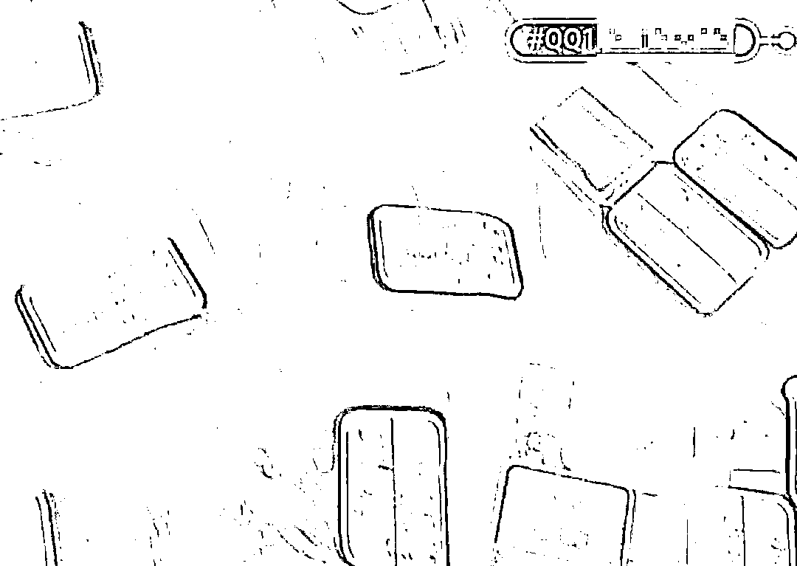
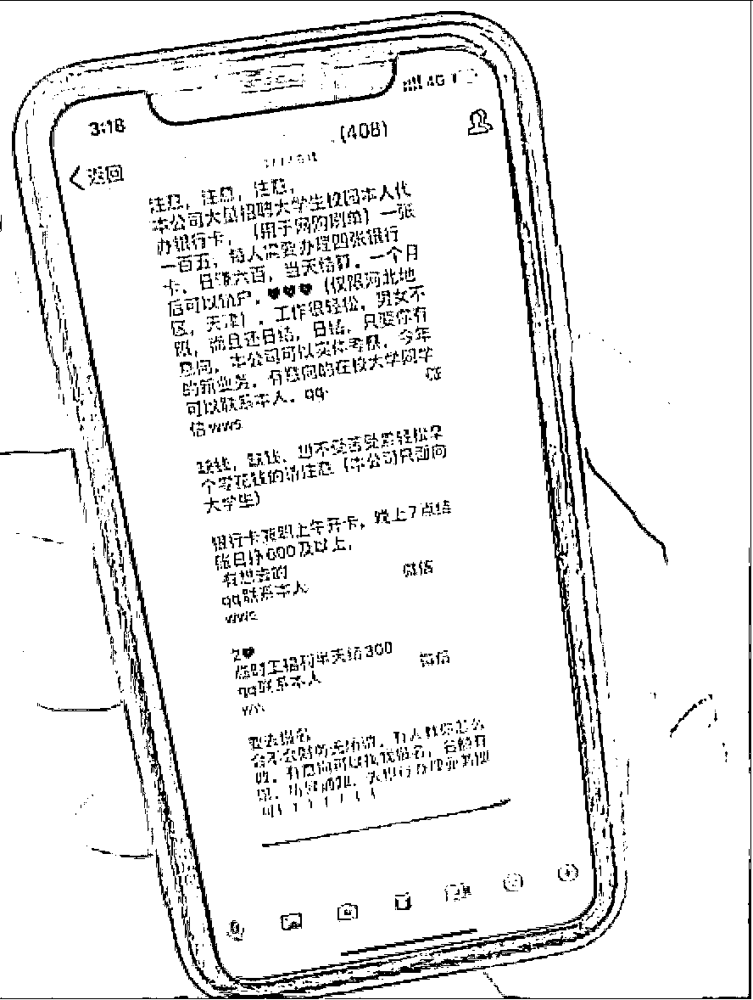

# 你卖掉的银行卡正在沦为洗钱工具......

> 原文：[`mp.weixin.qq.com/s?__biz=MzIyMDYwMTk0Mw==&mid=2247502658&idx=3&sn=21bf696a6fc5fe44972f9f17ded37582&chksm=97cb007aa0bc896c38834f8ee29a02d4084271b8de87e4d81e7e751638e994a6d895cdbba1bb&scene=27#wechat_redirect`](http://mp.weixin.qq.com/s?__biz=MzIyMDYwMTk0Mw==&mid=2247502658&idx=3&sn=21bf696a6fc5fe44972f9f17ded37582&chksm=97cb007aa0bc896c38834f8ee29a02d4084271b8de87e4d81e7e751638e994a6d895cdbba1bb&scene=27#wechat_redirect)

**点击上方蓝色字体免费订阅“灰产圈”**

一位熟悉黑产的人士介绍，银行卡四件套的主要买家为赌博网站的运营方和电信诈骗团伙。“ 这些银行卡四件套往往被他们用来制作收款接口和洗钱。” 

▲银行卡贩子快递过来的银行卡四件套。

“个人四件套，企业对公账户，长期稳定供应。”元旦后的第三天，银行卡贩子张辽（化名）开工了。1 月 4 日下午，他在一个博彩行业的微信群里打出了这则广告。

一位熟悉黑产的人士告诉记者，张辽提及的“银行卡四件套”，即他人的银行卡、对应绑定的手机卡、身份证和 U 盾。银行卡四件套的主要买家为赌博网站的运营方和电信诈骗团伙。“这些银行卡四件套往往被他们（赌博网站运营方和电信诈骗团伙）用来制作收款接口和洗钱。”

记者调查发现，银行卡四件套的贩卖黑产链条已十分“成熟”，多呈团队化运作。闲鱼、QQ、微信甚至抖音，多个平台中均暗藏银行卡贩卖信息。在暗网中，记者更看到了密集罗列的广告。有银行贩子透露，可能卖至数千元的银行卡套装成本只有 500 元。此外，处于运输环节的部分快递公司也存在内部监管漏洞。去年 8 月底，记者曾收到一位银行卡卖家快递过来的银行卡四件套。

近年来，公安系统持续整治辖区内黑灰产犯罪。据记者统计，2019 年，有包括公安部及湖南、深圳、厦门等多省市在内的警方通报过贩卖银行卡和企业对公账户相关案件破获情况，抓获涉案犯罪嫌疑人总计超过 600 人，缴获银行卡超万张。

******多平台藏银行卡买卖：一套 800 至上千元**

**张辽并非唯一一个银行卡卖家。关于银行卡出售的广告，在张辽所在的这个 499 人的微信群中，每天都会弹出很多条。**

**据群内另一名银行卡贩子凯里（微信昵称）发布的消息，他手中有大量“四大行”的银行卡出售。为了招揽顾客，凯里标注：“支持货到付款。”**

****

**▲一个微信群中黑产人士发布的出售信息。**

**除银行卡外，凯里还涉及多项“业务”。在广告文末，凯里写道：“精准 BC、QP，支持小额测试。”一位熟悉黑产的人士透露，黑产人员往往会用首字母来替代博彩、棋牌等关键词，躲避监管。“例如银行卡会被用‘YHK’来代替，普通人根本不知道这些字母是什么意思，也能起到一个筛选顾客的作用。”**

**一位熟悉黑产的人士介绍，银行卡四件套的主要买家为赌博网站的运营方和电信诈骗团伙。“这些银行卡四件套往往被他们用来制作收款接口和洗钱。”**

**王娜（化名）曾经陷入网络赌博之中，面对满屏的催债短信时，其中一个细节浮现在她的脑海中，“它（赌博网站）的收款账户经常变更，且均为私人账户。”她所不知道的是，赌博网站就是通过购买银行卡四件套用来制作收款接口和洗钱。她只知道，自己因为赌博欠下高额网贷，打算卖掉一套房。**

**不止微信，记者调查发现，在 QQ、闲鱼等平台，均存在银行卡贩子为招揽顾客发布的广告信息。**

**“卡商出售卡盾、四件套。”闲鱼用户张迪（化名）发布的消息称。去年 8 月下旬，记者为暗访曾按照其在闲鱼上留下的信息添加其微信。“800 一套，绝对可靠。身份证均带有芯片，POS 机可以刷，ATM 机可以取。国内国外均可发货，四大行居多。”在微信中，张迪这样介绍。**

**还有的贩子试图蹭上短视频时代的红利。一名银行卡贩子直接将“银行卡四件套”作为抖音昵称，通过性感女性视频来吸引顾客。在抖音留言区，记者发现多条诸如“多少钱一套？”“收卡吗？”的评论。在其签名处，留有一个供联系的 QQ 号，在该 QQ 用户的主页，记者发现多张银行卡的照片。**

**另一名银行卡贩子甚至直接将邮寄银行卡的途中录制的视频发布到抖音上。视频中，多个包裹其中的一个透明包装袋可以看到一张中国建设银行卡。包装袋旁边，散落着多张快递邮寄单，均为顺丰速运。视频下方留有其微信号。**

**在暗网这个隐蔽在互联网深处的庞大市场中，包含身份证买卖的交易信息几乎随处可见。记者在暗网上的一家担保交易市场中，发现存在大量与证件买卖有关的信息。该市场的实体物品中一则交易帖显示，“银行卡四件套，欢迎老板前来长期合作”。**

**据多则交易帖显示的价格，“四件套”价位由 800 元至 1600 元不等。为了凸显卖家“诚意”，交易帖中普遍包含多项售后规定。一则交易帖中的“关于售后”一栏显示，所售产品售后服务期为两个月，以客户签收（银行）卡开始。一个月内无条件质保，两个月内尽全力协助，超过两个月不做任何主观承诺。**

****

**▲某网络平台上一名用户发布的出售银行卡信息，展示了大量“银行卡四件套”。**

************农村青年、大学生被盯上，号称开卡日赚 600****

******之前的一段时间，闲鱼上的银行卡贩子张迪（化名）称他的生意“很红火”。记者为调查尝试提出购买要求时，张迪查验了一下库存后表示：“今晚不够发了。我们一般手里就二三十套在这流动，最近半个月很奇怪，不够发。”******

******一直以来，倒卖银行卡被明令禁止。《银行卡业务管理办法》规定：银行卡及其账户只限经发卡银行批准的持卡人本人使用，不得出租和转借。不过，张迪仍在贩卖，这项黑产已逐渐演变为团队化运作。******

******张迪透露，他只是一个银行卡贩卖团伙中的一员。“我兄弟在外地负责收卡，而我负责核对密码、打包发货。”这些银行卡来自何处？张迪说，“联系好人之后，我们会带着去办理手机卡和银行卡。一般一套给他们五百，后面他们之间也会相互推荐去开户。”******

******最早被张迪一伙盯上的，是劳务市场上随时待命的务工人员。不过，弊端很快显露出来。“有事情了的话开卡的这个人不好找到。”此时，法律意识较为淡薄的“农村青年”进入张迪一伙的视野。“农村里的年轻人最好，毕竟家在那里，他们有了可以赚钱的门路也会去拉同村的。”******

******张迪强调，出售的四件套的使用期限为三个月。“800 元是保三个月的，三个月后这边会让他们去注销重新开办。”张迪说，“只要你那边别搞得司法冻结这些，我这边资源可以说是循环的。只要有一定的人去开卡，我这边就有钱赚。”******

******通过张迪，记者购得了一套银行卡四件套。在张迪表示银行卡四件套已发出的五天后，记者收到对方通过顺丰速运邮递的银行卡四件套，付款方式为到付。快递信封内包含一名尤姓男子的工商银行卡、配套 U 盾、绑定手机号和该男子身份证。卡片和设备没有丝毫人为使用的磨损痕迹，手机卡未从卡托中抠出。这是一套崭新的证件。******

******信封之中，还有一张对方留下的纸条，上面记录有“四件套”户主姓名、银行卡密码、网银用户名、网银密码、U 盾密码、手机号码等信息。为测试，记者根据四件套信息，成功登录了这位尤姓男子的网银。******

******1 月 6 日下午，记者将快递收货地址等相关信息提交给顺丰速运。就此问题，顺丰速运有关工作人员回复记者称：将会进行客观、认真的调查。如发现个别人有违章违纪行为，公司将采取零容忍态度，坚决制止。******

******记者在调查过程中注意到，银行卡黑产团伙的触手也在伸向高校。******

******披着“用于网购刷单”、“日赚六百当天结算”的宣传话语，他们正在大学校园里寻觅猎物，有的还抛出了“只面向大学生”的说法。******

******“开个卡就能赚 500 元，何乐而不为？”北京某高校的程磊（化名）曾想过做这门生意，不过因课程紧张作罢。对于程磊这样的年轻人，五百元钱具有一定的诱惑力。******

******“缺钱，想不受苦受累轻松拿个零花钱的请注意，银行卡兼职上午开卡，晚上 7 点结账，日赚 600 以上。有想去的，联系本人。”在拥有 400 多位群成员的河北某高校学员总群中，一位名为“翩翩公子”的用户发布的信息这样显示。不过，记者尝试添加其 QQ 号未获通过。******

************

******▲某高校群中发布的兼职信息，实为拉大学生开卡。******

******************有银行卡贩子称与快递员有“合作关系”******

******被引诱去开银行卡的这些人或许并不清楚，他们交到卡贩子手上的银行卡，在黑市另一端的价格动辄上千。******

******记者注意到，在四川省巴州区公安分局破获的一起妨害信用卡管理案中，犯罪嫌疑人承认，以自己和他人名义申请办理银行卡、购买手机号并绑定某信、某宝，开通银行 U 盾，以每套 4500-6000 元的价格，出售给全国 12 个省市 100 余人甚至境外用于非法交易，共从中获利 500 余万元。******

******另据公安部去年 7 月披露的特大贩卖银行卡和企业对公账户案中，银行卡“四件套”包括身份证件、银行卡、手机卡、U 盾，一般每套 500 至 1000 元，经层层转卖加价，最高可以卖到每套 3000 元。企业对公账户相关材料包括对公银行卡、U 盾、法定代表人身份证、公司营业执照、对公账户银行申请表、公司公章、法人印章、公司章程等，每套 8000 至 15000 元。******

******“企业对公账户所需的这八件材料，又被称为‘银行卡八件套’。”上述熟悉黑产人士告诉记者。******

******暴利背后，相比其他可以在线交易的黑产，银行卡贩卖产业有一个重要环节颇令张迪头疼——如何将这些银行卡安全邮寄到客户手中。“有时候查到就会被扣住，风声紧的话还不敢发货。”张迪说。至于如何知道风声紧，张迪坦言：“都是通过快递。”******

******快递“内鬼”并不是第一次进入公众视野。据媒体此前报道，在深圳一起银行卡贩卖案件中，犯罪团伙通过微信、QQ 等互联网聊天工具，借助物流快递渠道长期从事非法银行卡“四件套”的贩卖交易，购卡人是分布在全国 13 个电信网络诈骗重点地区及东南亚、欧洲等境外的电信网络诈骗犯罪分子。******

******犯罪链条涉及“卡贩”“卡总”、快递“内鬼”、制假证、诈骗等多个环节，已成为一条完整的非法买卖银行卡、个人信息的黑灰产业链条。在各个环环相扣的黑产链条之中，“快递内鬼”团伙负责寄递银行卡“四件套”。报道称，该团伙利用快递行业内部监管漏洞，将“卡总”交寄的“四件套”寄往全国各地，并代收货款。******

******与之类似，张迪透露，他和快递公司业务员同样存在“合作关系”。“寄一套一般会给快递员 30 元，有什么风声他（快递员）也会告诉我。”张迪说。******

******至于交易账款的交接，张迪十分谨慎，“有一个小号专门转账，我们都很小心，怕被查。”除此之外，他不愿过多透露其他信息。******

******据张迪介绍，因不少赌博网站运营方均在境外，他特意为此开辟了出境的渠道。记者卧底上文提及的博彩行业交流群发现，称可以提供出境邮递服务的信息同样并不少见。******

******“广州到菲律宾、柬埔寨、泰国海运、陆运、空运，双清关派送到门（时效稳定，诚信经营）。”去年 10 月 30 日凌晨三点，一名昵称为“柬埔寨东南亚物流专线”的用户发布到群里的广告这样描述其主要业务，并在广告下方附有联系电话。其表示，香烟、四件套等敏感货物均可承运。******

******当天下午，记者拨打了对方留下的手机号码，电话另一端是一位操南方口音的男士。“现在广州渠道查得严，四件套做不了。”不过，其表示可以走广西的渠道将货物送出境。“每公斤 35 元，160 件四件套大概就 200 多块钱。都是空运。”******

******“四件套一直在走（发货），安全性你可以放心。”至于如何规避监管，以及将银行卡四件套运送出境的具体方法，对方以这是其“商业机密”为由拒绝透露。******

******“银行卡四件套因具有真实性，并非非法伪造的证件，所以不在禁止邮寄名录之列。目前从法律规定层面来看，是可以邮寄的。”北京盈科（上海）律师事务所高级合伙人陈晓薇说，“但因为贩卖银行卡四件套的行为已经发展为一条产业链，其中最重要的一个环节就是“邮寄”。邮寄因为成本低，效率高，成为银行卡四件套贩卖黑产的推动器。”******

******陈晓薇认为，只有从邮寄环节进行规范限制，才能从根本上打击银行卡四件套的贩卖黑产业务。“有关部门应当尽快出台《禁止邮寄物品指导目录》的补充修订，将证件、银行卡等涉及个人隐私的物品列入。同时也应考虑到社会经济发展的需求，在法律法规中进行补充，即上述证件、银行卡等的邮寄，需经本人签字确认。再结合《中华人民共和国邮政法》第二十五条规定：邮政企业应当依法建立并执行邮件收寄验视制度。对信件以外的邮件，邮政企业收寄时应当当场验视内件。用户拒绝验视的，邮政企业不予收寄。各邮政企业应该对邮寄物品进行验视，发现有身份证、银行卡、U 盾等，必须本人签名确认后，才可收寄。否则，不予邮寄。邮政企业需要承担法律规定的验视义务。”******

******************被用于电信诈骗、洗钱，银行应严查异常开户******

******在近几年查获的电信诈骗案中，拥有大量的银行卡成为犯罪嫌疑人的“必备品”。******

******2018 年 12 月至 2019 年 5 月，历时 5 个半月，四川大英县公安局专案组将犯罪嫌疑人杨某华等 11 名团伙骨干抓获归案。警方查明，该犯罪团伙通过办理、贩卖银行卡套件，为网络赌博、诈骗、洗钱等犯罪活动提供帮助。在查实的 879 套银行卡中，有 400 余套涉及全国各地电信诈骗案 1000 余件，涉及金额 1.65 亿元。******

******除了电信诈骗，银行卡买卖的背后还指向洗钱、行贿、受贿、非法所得的财产转移等不法行为。为防止洗钱等犯罪活动，监管层在近年先后颁布了多项政策。******

******2016 年 3 月，银监会发布《关于银行业打击治理电信网络新型违法犯罪有关工作事项的通知》，严格限制开卡数量，同一商业银行为同一客户开立借记卡原则上不得超过 4 张；同年 12 月，银行个人账户分类管理启动，每个人在一个银行只能开立一个Ⅰ类户，已有Ⅰ类户的，再开户时，只能是Ⅱ、Ⅲ类账户。根据规定，Ⅱ类账户消费和缴费、向非绑定账户转出资金、取出现金日累计限额合计为 1 万元，年累计限额合计为 20 万元。Ⅲ类账户限额上调后也仅为 2000 元。******

******“银行给用户开卡时都会提醒本人使用，密码不要透露给别人，不过还是有人不在意。而且在这种倒卖关系中，一般是买方给开卡人一些好处费，开卡人会觉得自己没有资金在卡里，开卡还有钱赚，所以没风险。”一位股份行人士告诉记者，用户来开卡，银行是不能拒绝的，多数时候在开卡环节也很难判断账户使用用途。******

******另一位股份行人士也表示，开卡都凭用户个人意愿，银行拦不住，也不知道他的用途。“之前碰到过一位用户来办卡并开 U 盾，称第二天就要去美国，但是行色匆忙，说话也前言不搭后语。碰到这种情况，支行可以先预留信息上报分行，7 天后再予办理。”******

******央行此前明确，银行要严格审查异常开户情形，必要时应当拒绝开户。可以拒绝开户的情形包括：不配合客户身份识别、有组织同时或分批开户、开户理由不合理、开立业务与客户身份不相符、有明显理由怀疑客户开立账户存在开卡倒卖或从事违法犯罪活动等。******

******对账户资金异常变动，银行有其监测手段。受访人士称，该行设有反洗钱部门，如果一个账户出现异常大额或高频进出款，在上报央行的同时，银行也会采取“强制备注”手段，被强制备注的账户需要本人到银行去“解绑”。******

******“之前我国一人数折现象很普遍，导致一些闲置账户被不法分子挪用。个人账户分类管理启动后，银行排查起来相对容易很多。如果账户被强制备注也没有解除，那意味着之后都只能在这家银行开Ⅱ、Ⅲ类账户，可用功能和额度会减少很多。”一位银行人士称。******

******一位接近银行人士直言，银行卡贩卖产业链条折射出目前存在发卡银行对持卡人身份识别和尽职调查工作不充分，客户身份资料和交易记录保存不够合理，大额和可疑交易甄别不到位等多个问题。“银行应加强对客户的甄别能力和对银行卡的管理水平。”******

******一位警方内部人士则向记者分析，银行卡的非法买卖活动多在网络上进行，是银行卡贩卖屡禁不止的重要原因。“贴吧、论坛、微博以及各种各样的社交平台都存在这种信息，他们没有固定办公地点，也不可能和顾客当面交易，这对案件侦破来说是一个不小的挑战。”******

******广强律师事务所律师曾杰表示，从法律风险来看，提供自己的银行卡给他人使用，如果主观上明知他人用于非法买卖外汇、诈骗等行为就有可能构成共犯。如果主观上不明知他人使用银行卡的用途，那造成的后果可能就是个人的征信会受到影响，给生活造成不必要的麻烦，甚至引发一些诉讼风险。******

******中闻律师事务所合伙人李亚认为，银行卡被倒卖用来从事诈骗、洗钱、逃税、网络赌博、虚假刷信誉等非法活动，给银行卡所有人带来法律风险。倒卖银行卡的行为，违反了《银行卡业务管理办法》中关于银行卡及其账户只限经发卡银行批准的持卡人本人使用，不得出租和转借的相关规定，违反该规定的发卡银行应当责令其改正并加以处罚。为倒卖者提供原始材料的用户，也可能构成犯罪分子的帮助犯。因此，对于涉及个人信息的银行卡等，应妥善保管，绝不轻易外借他人，更不能因蝇头小利而出售。一旦卡片丢失，应及时挂失补办，不给犯罪分子可乘之机。******

******来源：新京报******

************

******← 向右滑动与灰产圈互动交流 →******

************