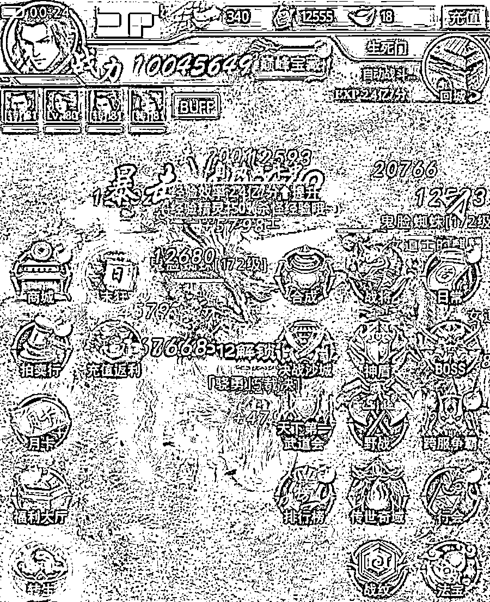

# 央视曝光！化身杀猪盘的“网游陪玩”骗走上千人 200 万！

> 原文：[`mp.weixin.qq.com/s?__biz=MzIyMDYwMTk0Mw==&mid=2247502658&idx=4&sn=758a3296753a2d1c9dd0d0e05a493b4c&chksm=97cb007aa0bc896c232091bbc891a764b79575b980cf88dc2e4c3d6540715734152af9677171&scene=27#wechat_redirect`](http://mp.weixin.qq.com/s?__biz=MzIyMDYwMTk0Mw==&mid=2247502658&idx=4&sn=758a3296753a2d1c9dd0d0e05a493b4c&chksm=97cb007aa0bc896c232091bbc891a764b79575b980cf88dc2e4c3d6540715734152af9677171&scene=27#wechat_redirect)

**点击上方蓝色字体免费订阅“灰产圈”**

00

首先为大家带来了两段语音：

长夜漫漫，当你感到孤独，玩游戏时遇见声音甜美的“**萌妹子**”这样撒娇，是不是**心都要化了呢？** 再一看到“她”主页上这样的照片！ 

会不会心想：“**如假包换**“的萌妹子终于来到了我身边！ 等等！先克制住激动的心情，“**可盐可甜**”的萌妹子背后可能藏有你想不到的猫腻。其实这两个声音都是拥有浑厚男低音的利用网络上的变声器转换出来的“萝莉音”。不得不说现在科技的发达与便捷，已经能够让在网络上**化身为各种风格的“萌妹子”**，仿佛开启了一扇新世界的大门。同时，也嗅到了一股诈骗的味道。

01

**“游戏陪玩”化身杀猪盘**

**上千人被同样手法诈骗 200 万**在网络上，“变声术”被广泛运用在**游戏、社交、直播**等领域，有的人或出于寻找乐趣、成为焦点的目的，或出于对自己的声音不够自信，想要“包装一下”塑造形象的目的，而一些别有用心的人则运用在了**诈骗**领域，与杀猪盘结合设下骗局，在“**网游陪玩**”中更是极为常见。近日，央视新闻曝光了一起“网游陪玩”的骗局，江苏盐城的小曹在上网时结识了一名“女网友”妍妍，两人相谈甚欢。在小曹眼里，**妍妍善解人意，长相清纯，对生活也充满了乐观**，每次跟她交流都让自己感觉到很舒心，双方聊天也越来越频繁。两人的感情迅速升温，也确定了恋爱的关系。据小曹了解，妍妍是个游戏达人，平时闲暇时喜欢玩网络游戏，于是在妍妍的邀请下，小曹就陪同妍妍一起玩了某款游戏。

在游戏中，妍妍开启了麦克风方便交流，那**甜美的声音、可爱的语气**让小曹心猿意马，更加确定了妍妍就是自己的理想女友。在游戏过程中妍妍告诉小曹，自己看中了几款游戏皮肤，希望小曹能够送给自己，小曹立马答应了便进行充值。接下来的日子里，妍妍开始不断怂恿小曹往游戏里充值，一会儿买装备，一会儿买坐骑，甚至还提出了在游戏里结婚。这个做工粗糙、画质模糊、体验感极差的游戏里的道具价格却极其昂贵，短短一个星期，小曹就往游戏里充值了**近万元**。妍妍的多次请求，让经济本就不宽裕的小曹倍感压力，在小曹表示已经没有多余的钱再充值游戏后，妍妍的态度便发生了转变，开始对小曹爱搭不理，直到被删除拉黑后，小曹才反应过来自己上当受骗了，随后报警。

接到报案后，江苏盐城警方顺藤摸瓜，一举捣毁了 6 个以同样手段实施诈骗的窝点，共抓获 61 名犯罪嫌疑人。**涉案金额达 200 多万元，涉及受害人 1000 多名**。

02

**“变声术”、“PS 术”齐上阵**

**“游戏托”诈骗剧本浮出水面**据犯罪嫌疑人交代，所谓的清纯的女孩照片、甜美或性感的声音几乎都是运用了“**PS**”、“**变声器**”等软件制作出来的，**诈骗剧本**也基本类似。**第一步：伪造女性身份主动添加受害者**不法分子利用网图、PS、变声器在各类交友软件上注册女性账号或伪装成女性身份，主动添加受害者。**第二步：邀请受害者参与游戏**添加受害者后，不法分子塑造“温柔体贴”、“善解人意”的形象获取受害者的信任，以特定话术布下“甜蜜陷阱”，在两人的关系迅速升温后，再邀请受害者玩某款指定的游戏。**第三步：诱导受害者不断充值**待受害者开始游戏后，不法分子再以**送花、结婚、冲榜单、购买游戏皮肤和装备**等理由，要求受害者不断充值或赠予。这类游戏里的道具价格往往奇贵无比，游戏质量也参差不齐。不法分子与游戏运营商勾结，拉取的受害者充值的钱也就按比例流入游戏运营商和不法分子的口袋。 **第四步：谎称游戏可以回购账户**当受害者心生疑虑表示要退游时，不法分子又会声称可以回收受害者的账户，并不会让受害者承担游戏充值费用打水漂的风险，要求受害者继续充值，达到回购标准。**第五步：“榨干”受害者钱财后直接拉黑**

受害者继续耗费大量金钱充值游戏，当不法分子判断受害者的金钱已经几乎“山穷水尽”时，就干脆将受害者拉黑，转向下一个目标继续进行诈骗。

03

**不法分子分工明确**

**“各司其职”设陷阱**这类犯罪团伙的**组织架构十分清晰**。犯罪团伙与多家游戏工作室都有着密不可分的联系，通过成立游戏推广工作室来招募成员，制定严格的规章制度，内设**引流组、游戏组、人事组**等部门，各组之间分工明确，以便在短期内获得巨大收益。 

****>>>引流组：犯罪团伙的“基础”****负责账号的购买生产与游戏推广，对账号进行包装，并且梳理诈骗剧本，然后选取合适的目标推荐给游戏组。****>>>游戏组：犯罪团伙的“核心”****负责对接受害者，运用特定的话术、图片、声音取得受害者信任，再邀请由引流组推荐来的受害者参与游戏，并诱导其不断充值。****>>>人事组：犯罪团伙的“新鲜血液”****负责招募组织成员，并对招募的成员均进行系统培训，分发相关话术，并及时对话术进行修改、升级。 最后，提醒大家，在日常网络社交中，务必记住以下几点，提高警惕： ****1、不要轻信网络上的陌生人，对突然出现的异性，更应该提高警惕，不要轻易被对方的照片和声音所迷惑，有可能都是虚假的“照骗”与“声骗”；********2、网络交友一旦涉及到资金、转账，务必谨慎；********3、玩任何游戏量力而行，切忌过度充值，更不可因此去贷款。********

**← 向右滑动与灰产圈互动交流 →**

****