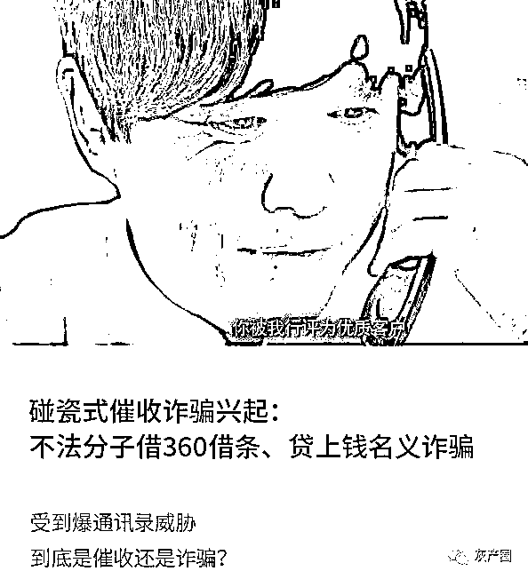
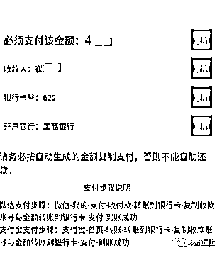

# 碰瓷式催收诈骗兴起：不法分子借 360 借条、贷上钱名义诈骗

> 原文：[`mp.weixin.qq.com/s?__biz=MzIyMDYwMTk0Mw==&mid=2247502658&idx=5&sn=23942ff7b1d5096586107c893c555570&chksm=97cb007aa0bc896c7fa4e16209c9d4f92b6d0e1c5ea8dd2d61db54f7d15a7c6248959a904f51&scene=27#wechat_redirect`](http://mp.weixin.qq.com/s?__biz=MzIyMDYwMTk0Mw==&mid=2247502658&idx=5&sn=23942ff7b1d5096586107c893c555570&chksm=97cb007aa0bc896c7fa4e16209c9d4f92b6d0e1c5ea8dd2d61db54f7d15a7c6248959a904f51&scene=27#wechat_redirect)

**点击上方蓝色字体免费订阅“灰产圈”**

近几年，随着网贷兴起，无数人深陷在债务泥潭中无法自拔。

他们中的大多数举债无数，到头来，可能自己都不记得“撸”了哪些平台。

这也给一些居心叵测的人，留下诈骗的空间。

这些诈骗团伙冒充催收人员，通过威逼利诱的手段，向借款人催债。

事实上，这种诈骗方式并不新鲜。

但随着疫情缓解，催收行业复工，这些打着催收名义诈骗的团伙也开始“浑水摸鱼”，泛滥起来。

相关报道显示，这些诈骗团伙中还有一部分成员，曾经是真正的催收人员。

到目前为止，已经有很多借款人上当受骗。

**碰瓷式诈骗**

爆通讯录，是网贷催收中最常用也是最有效的手段之一。

而现在，爆通讯录同样也成为以催收名义进行诈骗的团伙最常用的武器。

近几个月来，有多名借款人反应，自己遭遇了诈骗。

我们总结发现，诈骗人员以催收的名义向借款人拨打电话，并以“爆通讯录”威胁，要求借款人“还款”。

“说我借了无优花，下午四点前必须还清，不然就要爆通讯录。”借款人小吴表示。

在骗子的指导下，小吴添加了骗子的 QQ，并下载了骗子要求下载的 APP。

让小吴惊讶的是，下载的 APP 里真的有自己的借款 3000 元的信息。

那么借款 APP 中，为何会出现小吴的借款信息呢？

4 月 23 日，江苏省连云港市赣榆区检察院受理的一起 47 人组成的犯罪团伙冒充网贷平台催收人员诈骗案件中提到：

**诈骗人员登录查询平台后台录入被害人的姓名、手机号码、欠款金额等信息**，然后再把链接通过微信发送给被害人，被害人打开链接输入自己的手机号码就能查询到相关的欠款记录。

但幸运的是，小吴核对自己的银行账单后，发现没有收到过这笔款项，很快就反应过来自己是遇到诈骗了。

据统计，这些团伙还曾以易顺花、优惠花、无忧虾借、易分期、随你花等名义实施诈骗，贷上钱、360 借条等知名平台也曾成为他们冒充的对象。

不同于小吴遭遇的诈骗团伙，其他团伙的诈骗成本更低。

**他们没有仿冒的 APP，会要求借款人通过链接或财务微信“还款”。**

“他说由于平台收费过高，被银监会下架了，导致信息封存在 App 里。” 另一位借款人表示，**诈骗团伙会以各种理由拒绝借款人自己登陆 App 查看。**

有借款人提供的截图显示，点击诈骗团伙提供的链接后，会显示收款人的名称和账号。**支付步骤显示，借款人可以通过“微信”或“支付宝”转账还款。**

事实上，除了“威逼”外，“利诱”也是这些诈骗团伙常用的伎俩。

受到疫情影响，很多借款人收入状况不良，出现协商还款的需求，也让诈骗团伙钻了空子。

他们打着平台催收人员的名号，**以“利息减免”、“本金分期”等优惠，诱导借款人按照他们的要求“还款”到私人账户中。**

“还款肯定是还到银行或者贷款公司的对公账户里。”一家催收公司的合伙人柳林说。

另一位负责银行信用卡催收的催收从业者余白也表示，“还款是还到债务人本人名下信用卡，一债一卡。”

这种通过私人账户还款的诈骗方式，看起来漏洞百出，但仍然成功骗到很多人。

**其中一个主要原因，是因为诈骗足够“精确”。**

首先在诈骗对象选取上，他们只选择曾经有过借款行为的借款人，并通过各种渠道收集借款数据，进行诈骗。

其次在诈骗方式上，会借用催收常用的手段，并模仿催收人员“恶劣”、“蛮横”的态度让借款人信以为真。

即使这两个步骤没有“诈”到借款人，他们还会有后招，会采用短信验证码轰炸等方式让借款人“投降”。

事实上，这些诈骗团伙之所以能做到以假乱真，让借款人信服，或许与部分诈骗团伙的成员是由真正的催收人员“转行”而来有关。

**催收人员转型做催收诈骗？**

“早些年的时候，我在外地做过正规催收，有了一些从业经验。”上述赣榆区检察院受理的诈骗案件中诈骗集团的头目刘某甲说。

他表示，由于觉得自己带人能够赚得更多，就通过在网上购买一些网贷人员的信息，组织几个人开始冒充网贷平台委托的催收人员进行诈骗。

一般情况下，委外催收后，银行或贷款公司会向合作的催收公司提供借款人信息，而**这些借款人信息又会被分配到具体的催收员手上。**

“银行或者贷款公司会提供借款人预留的所有信息。”柳林告诉我们。

他举例道，催收公司能接触到的信息包括借款人的身份证信息、手机号、住址、工作单位、紧急联系人等。

另一方面，**相对于其他行业，催收行业的人员流动性较大。**

柳林说，基层员工能做满一年的不到 20%，管理层会长久一些。

另一位催收从业者余白也持有相同的观点，他表示，这是由于催收人员需要掌握的东西多，对综合谈话技巧有一定的要求，“压力普遍较大。”

掌握了充分借款人信息，再加上人员流动性高，是否就增加催收人员转型诈骗团伙的可能性？

对于这种看法，上述两位催收从业者都给出否定的观点。

“催收人员就算诈骗也骗不到多少钱，他的犯罪成本高于收益。”柳林说，也是因为如此，催收公司内的员工去诈骗，基本上是极少数的“个例”。

**为了杜绝借款人信息外泄的，催收公司内部也会采取相应的防范措施。**

“办公区域严禁带手机相机等拍照录像设备，网络为内部局域网，计算机所有外接接口禁用，办公室 24 小时无死角监控。”余白告诉我们。

柳林说，催收公司有专门的作业系统，员工只能一个一个案件去看并在系统内操作，不能批量导出和拷贝。

事实上，对于催收人员诈骗事件，所有的公司都在“严防死守”。

柳林说，一旦这样的事件出现，对相应的项目可能会有“灭顶之灾”的风险。

有从业者认为，所有信息不对称的行业都会有诈骗，上述诈骗团伙成员中，真正从催收行业转型的并不多，他们只是借用“催收人员”的名义而已。

红河自治州公安局网络安全保卫支队在相关的宣传文章中提到，假冒贷款平台的催收人员能准确说出用户身份信息，是因为：

**一般这些人以前都是做催收工作，不做以后偷走一部分借款人资料；也有人从不法渠道获取借款人信息，从而实施诈骗。**

综合多地警方和媒体对相关诈骗案件的梳理发现，诈骗团伙成员真正从催收行业转型的并不多，更多的是从非法渠道获取借款人信息后实施诈骗。

也就是说，和其他电信精准诈骗并无二致，催收诈骗的根源依然在于“信息泄露”。

**信息泄露何时休？**

360 互联网安全中心反诈骗专家曾表示，至少有 50%以上的诈骗案件跟个人信息泄露有关。

他指出，犯罪分子利用个人信息进行精准诈骗，普通人在多数情况下无法自我保护。

我们了解到，目前信息泄露的源头一般有三个：

**一**是网站漏洞，这是黑市上流通的个人信息的主要来源；

**二**是针对个人用户的木马病毒、钓鱼网站和伪基站；

**三**是无良商家的“内鬼”和技术黑客。

但现实情况是，在精准电信诈骗案例中，追溯信息泄露源头并不是一件易事。

以上述催收诈骗为例，被诈骗的借款人分布在全国各地，他们接听到的诈骗电话归属地也较为分散。

不仅如此，他们中的大多数在多个贷款平台都曾留下过个人信息，因此很难确定信息泄露的源头。

相比于其他行业，**出于风控的需要，金融行业会掌握的用户信息更加“全面”。**

除此之外，贷款软件违规收集个人信息的现象更是屡禁不止。

当然，借款人信息泄露的源头甚至可能不是网贷平台，有些信息可能在借款人点击链接“测额度”、“测信用”的时候就已经泄露出去了。

例如曾经盛行一时的信贷经理抢单软件，就会通过测贷款额度的短信链接收集用户信息后，付费推送给信贷经理。

在用户信息交易暗网中，这些贷款信息也相当值钱。

有调查发现，根据新旧程度不同，贷款超市和现金贷互相倒卖的数据，每条价格最高能达到 3 元。

这也为诈骗团伙实施诈骗，提供了更加“精准”的可能性。

自疫情以来，针对网贷老哥们的收割一波接着一波。

先是反催收联盟、协商还款，紧接着是大数据查询软件，而现在这些催收诈骗

也将目光锁定在借款老哥们身上。

这些深陷债务泥潭无法自拔的老哥们，如今成为多方抢夺的“肥肉”。

在这场游戏里，不知道到底谁“撸”了谁。

← 向右滑动与灰产圈互动交流 →

