# 触目惊心！一部手机丢失后有多可怕？

> 原文：[`mp.weixin.qq.com/s?__biz=MzIyMDYwMTk0Mw==&mid=2247502750&idx=1&sn=8f3a963af5534b6932ca6c207d9ee87b&chksm=97cb00a6a0bc89b0eb5d1da497964b00d257f6adf4350f426e46c9d67c6b021de92673f1725e&scene=27#wechat_redirect`](http://mp.weixin.qq.com/s?__biz=MzIyMDYwMTk0Mw==&mid=2247502750&idx=1&sn=8f3a963af5534b6932ca6c207d9ee87b&chksm=97cb00a6a0bc89b0eb5d1da497964b00d257f6adf4350f426e46c9d67c6b021de92673f1725e&scene=27#wechat_redirect)

**点击上方蓝色字体免费订阅“灰产圈”**

**导读：**互联网资金在多个环节都面临风险，一场手机丢失后的资金攻防战备受关注。

近日，一篇一个月前的旧文——《一部手机失窃而揭露的窃取个人信息实现资金盗取的黑色产业链》，突然在朋友圈重新出现且刷屏。到底怎么回事？

***一部手机丢失后有多可怕？***

***多平台中招，支付宝紧急回应***

“当时不知道我怎么想的，觉得可能还有机会能找回，没有未立即挂失手机卡，设置了华为找回手机的上线通知（这个不果断的决定，导致了后续悲剧的发生）。”该文作者“老骆驼”在文中称，9 月 4 日，手机被偷了，用其他手机拨打，但对方接通后关机。

**该文作者“老骆驼”自称信息安全专家，自述因手机失窃、SIM 卡挂失失败遭遇手机黑产，在支付宝、美团、京东、财付通、苏宁金融、百度等多个平台被伪冒开户的经历。**据分析，该案件中，由于该用户没有及时挂失 SIM 卡，犯罪分子在偷盗手机后，将手机中的 SIM 卡取出来后专门用于接收各类平台发送的短信验证码。此外，犯罪分子通过其他平台非法盗取用户信息，并在多个平台上伪冒开户实施盗刷。

**其实早在当时，支付宝相关部门人士已经回应称，黑产没有在支付宝里套到任何钱和信息，也并未突破人脸验证。**

 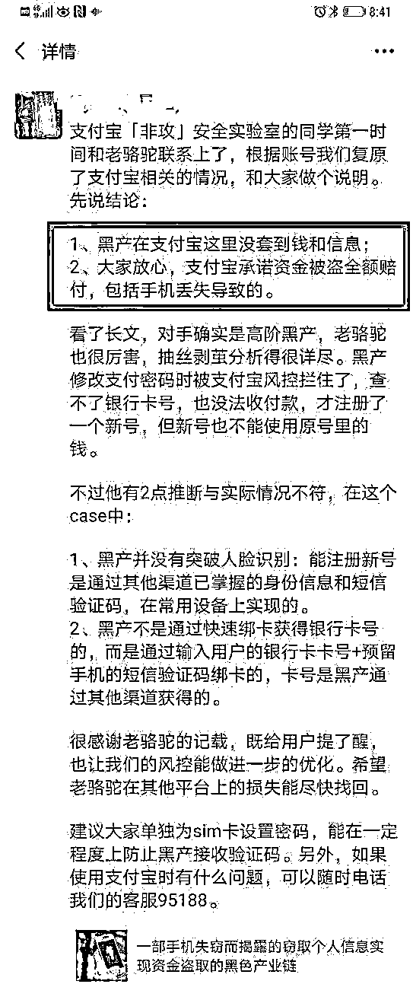

9 月 11 日，“老骆驼”再次发文《盗窃手机盗刷银行卡黑色产业链案件之后续进展》。

在该文中，他说：“在今天下午，事件中涉及的几家支付公司都积极联系到我，美团的贷款记录消除了，苏宁金融把我们损失的几千都赔付了。由于美团贷款的记录消除，实际上还导致苏宁金融赔付金融比他造成的损失多了 300 元，已经联系苏宁金融进行退款。银联云闪付的赔付也已打电话通知取消。对于赔付金额，该还我们的一分都不能少，但多的我们也一分不多要。”

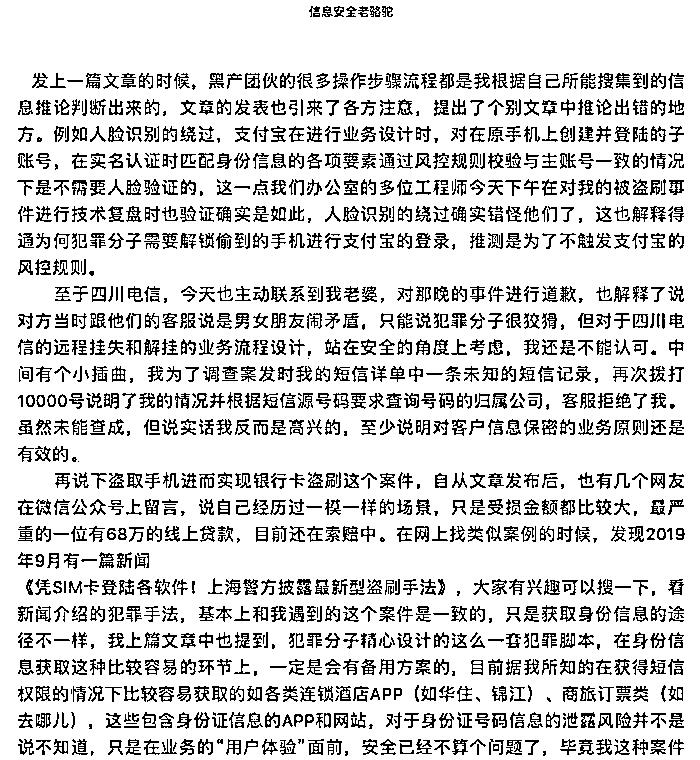

***注意两大关键点***

**关键 1：四川电信称 1 天仅能解除挂失一次**

**回溯“老骆驼”与黑产分子斗争的整个流程，不难看出互联网资金在多个环节都面临风险。**

**第一步，黑产分子如何获得了失主的关键信息？**

**“老骆驼”指出四川电信的远程挂失和解挂的业务流程设存在问题，导致黑产分子通过某政务 APP 的短信验证功能获得了失主的姓名、手机号码、身份证号、银行卡号。**

****原来，“老骆驼”通过四川电信客服挂失手机号后，对方通过联系电信客服进行了“解除挂失”的操作。****

****一旦手机号被解除挂失，这意味着，使用各大 APP 时所需的身份认证环节，极有可能被对方利用短信验证码服务通过验证。****

**因此，“老骆驼”与黑产分子就手机号的挂失与解挂斗争了整晚，“来来回回几十次。”四川电信事后致歉“老骆驼”称，被黑产以“男女朋友闹矛盾”哄骗，导致反复挂失与解挂。**

****记者 10 月 10 日从四川电信客服处了解到，如需解除挂失，可以联系客服提供登录电信网上营业厅的密码或者机主姓名和身份证号码+上月拨打的三个通话号码进行操作。****

**不过，上述客服表示，目前挂失业务办理后，针对线上渠道，解除挂失业务 24 小时内仅能办理一次，有特殊情况需要本人持有效证件到营业厅解除挂失。**

****关键 2：黑产分子是否绕过了人脸识别？****

**获得个人信息后，黑产分子如何进行的贷款申请？**

**“老骆驼”发现，对方利用手机号及身份信息等注册了支付宝等软件的新账号，在苏宁金融、美团等平台进行贷款申请、资金转移，ETC 信用卡产生各类买卡、充值等消费记录。**

**针对“老骆驼”质疑支付宝快捷绑卡的安全性，支付宝方面回应称，黑产分子没有通过快速绑卡获得银行卡号，而是通过输入用户的银行卡卡号+预留手机的短信验证码绑卡的，卡号则是对方通过其他渠道获得。**

**在支付宝内是否可以查询到完整的银行卡号？记者从支付宝客服处获悉，可点击所绑定的银行卡，进入“卡管理”页面，查看卡号可通过两种途径，一是通过人脸识别认证，二则是输入支付密码。**

****在长文中，“老骆驼”推测，支付宝实名认证的人脸识别已被黑产分子绕过，即用图片处理技术来绕过活体人脸识别验证。****

****对此，支付宝的回应中否认称，黑产分子并没有突破人脸识别，能注册新号是通过其他渠道已掌握的身份信息和短信验证码，在常用设备上实现的。这是由于对方修改支付密码时被支付宝风控拦住，查不了银行卡号，也没法收付款，才注册了新号，但新号也不能使用原号里的钱。****

**据“老骆驼”的说法，黑产分子在美团的“生活费”业务中进行了贷款，而其与美团联系时询问“为何只是简单验证了身份证就放款了”，对方回应称“这种贷款产品很多其他公司也有的”。**

**记者从美团 APP 上看到，当前开通“生活费”贷款业务，在填写个人相关信息后，需要进行人脸识别认证。美团客服表示，如需开启该业务一直都需要人脸识别认证。黑产分子是否绕过了人脸识别？是如何获得贷款的？美团方面回应称，正在了解相关情况。**

**“老骆驼”在后续中透露，其他被点名的平台已作出相应行动，美团消除了其贷款记录，苏宁金融赔付了相关损失。**

**支付宝方面建议，用户单独为 SIM 卡设置密码，能在一定程度上防止黑产分子接收验证码。**

**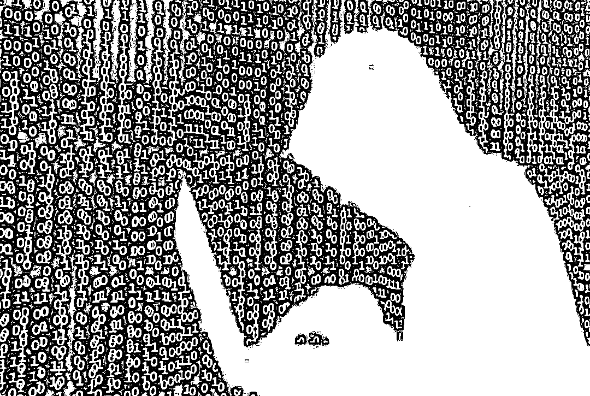**

**图/新华社** 

*****云闪付已建立立体防控方案，*****

*****安全专家：丢手机应立即挂失 SIM 卡*****

**在第一篇文章中，作者如此评价银联云闪付：**

**“和其他支付公司一样，都存在绑卡验证不严的问题。但是，人家态度是好的啊，凌晨 3、4 点，客服人员都能用极好的态度和我们沟通，让我们放宽心。第二天有专员联系我们，告诉我们昨晚报的损失少报了，他们查出来我们还有其他损失，并给了详细的指引告诉我们怎么去申请理赔，第二天他们内部调查有新的进展也都第一时间联系并告知我们。”**

**10 月 10 日，继支付宝后，云闪付方面回复 21 世纪经济报道记者称，**云闪付已建立有一套完善的应对防控手机盗刷黑产措施：覆盖“前防”TOKEN 技术防真实卡号信息泄露，“中控”智能风控系统监测与识别风险账户并分级处置，“后偿”如用户无过错则全额赔付。****

**云闪付方面表示，在前防环节，云闪付 APP 采用了 TOKEN 技术，通过一串特有的数字标记代替了真实的银行卡号，大大降低了欺诈分子盗取用户真实银行卡卡号进行跨平台绑卡实施盗刷的风险，极大保护了用户的个人信息安全。在中控阶段，云闪付建立有实时监测风险开户操作体系，实时触发增强验证流程，本案例中取了相应的防范措施。**

**云闪付方面还称，云闪付建立的“后偿”机制，对于用户确定无过错的，建立了快速的赔付流程，这也是该用户在其所写原文中所说，云闪付客服在凌晨三四点第一时间耐心协助用户解决问题，第二天就安排了专人主动联系用户了解案件详情的背后原因。**

**云闪付安全专家也提醒广大用户，平时要注意保管好短信验证码等个人信息，如出现手机遗失、手机被盗等情况，应第一时间联系三大运营商挂失手机 SIM 卡，联系银行冻结银行卡，并尽快完成补换卡。**

****附原文：一部手机失窃引发的惊心动魄的战争****

**来源：信息安全老骆驼** 

**9 月 4 日 ——****7:30：正带着大娃在理发店理发，老婆过来告诉我，她在小区门口推着二娃蹲下买水果时婴儿车袋子里的手机被偷了。这时看到 P40 pro 上市，一年一度的换机季又到来了。说是丢失后就用其他手机拨打，但对方接通后关机。当时不知道我怎么想的，觉得可能还有机会能找回，**没有未立即挂失手机卡，设置了华为找回手机的上线通知（这个不果断的决定，导致了后续悲剧的发生）。******8:51：对方把卡取出来插在其他手机开机，后面通过查询通话和短信详单才知道，才一个小时多点的时间，对方从高新区直奔成华区，以周五成都高峰期的交通状况，算是比较极限了。****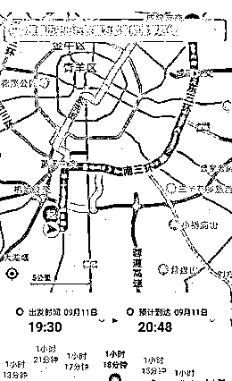****9:24：家人发现被偷手机可以拨通，但我这边“查找我的手机”显示还未上线，但没两分钟我的手机收到提示手机在成华区上线了，**瞬间再看找回手机界面，设备被解绑了，**突然有种不好的感觉，一般的小偷不会这么快这么熟练的干这些。******立刻致电 10000 号挂失手机卡，但此时电信服务密码已经不正确了，**通过验证身份证号码加提供上个月联系过的三个电话号码进行了挂失。开始采取紧急措施，登录手机银行把可立即赎回的理财全部赎回，活期余额全部转我账上，联系多家银行冻结信用卡，把支付宝、微信上的资金转走，绑定的信用卡全删掉，考虑到部分储蓄卡余额为 0，且对方不知道我的卡号，就没去挂失。****9:48：家人说电话还可以打通，立马致电 10000 号，询问为什么还可以拨通，回复说卡是正常状态，继续挂失。****9:55：越想越不对劲，又致电 10000 号，问之前挂失失败的原因是什么。得到答复，**第一次挂失是成功了的，但后面又被解挂了。******还有这种操作，打电话解除挂失，我是第一次知道，常识性认为我挂失了就应该是带上身份证去营业厅解除挂失，包括后面去报案，民警听说挂失后还可以电话解挂，也是很惊讶。****但明显对方是有备而来，后期分析时我认为连偷手机的时间都是事先定好的，对方把电信的业务流程已经掌握得很清楚了，这也导致我后期的补救措施变得很被动。****根据云闪付上的绑卡信息，继续给银行电话，挨个冻结储蓄卡，建行 etc 信用卡因为已经解绑了，且第二天要出行上高速，就没去管了。****这期间还漏掉一个老婆 10 多年前办的一张建行卡，一张工商银行卡，又埋雷了。****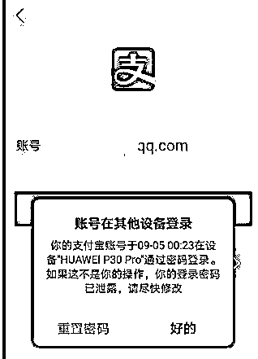****00:23 时：**发现支付宝、微信接连被挤下线，**重要的是登录的设备和丢失的手机设备型号一致！完了，遇上高手了，**华为的锁屏密码被解开了。******立马申请冻结（后面发现，已经晚了，对方的操作很迅速，此时支付宝已经被更换了手机号码，怀疑是多人在并发操作的。）、同时申请冻结微信，马上登陆京东，苏宁、国美等常用的 APP，更换关联手机号码。没过一会，我的手机就收到一条京东的短信验证码，感觉后面几个 APP 应该是保住了（蜜汁自信，最后还是被打脸），喘一口气休息下。****分析对方意图，觉得所有银行卡和支付余额里偷不到钱的话可能会用老婆的信息申请贷款，但同时想到放款只能是放到本人银行卡，要想转出去得有银行卡密码（长期以来自己支付密码和银行卡密码一致，连自己都忘了这两个密码不是一个东西，后面追查时才发现，对方用了一个神招，什么银行卡密码、支付密码根本影响不到对方），应该问题不大，加上期间紧张于电信手机卡“挂失”、“解挂”阵地抢占，又有张成都银行社保金融卡漏下了。******后面的一晚上就是循环的我挂失、对方解挂，**在 10000 号上来来回回几十次。至于为什么要坚持，因为觉得虽然自己已经把重要的 APP 和银行账户都保住了但还是看不透对方想干什么，不过既然对方这么执着的解挂我的手机卡，肯定是有其迫切的原因。抱着凡是敌人想要的，就坚决不能给的信念，一晚上通宵坚持下来了。****这期间我们是很被动的，因为不知道他什么时候解挂，只能躺床上不停打被偷的电话，一拨通立马再打 10000 号挂失。****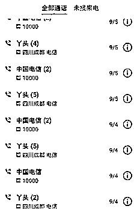****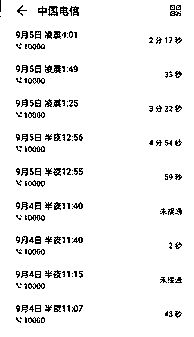****中间多次请求 10000 号客服，告知手机被偷，犯罪分子正在解挂手机卡用于实施犯罪，请求他们通知领导获得审批后冻结手机卡等明早去营业厅补卡，**都被拒绝。******由于一晚上几十次的业务办理，甚至还被客服说“你们自己的私事，不要占用公共资源”，我都不知道对方是怎么忽悠客服的。询问还有没有其他途径自助办理挂失，回答无。只能继续坚持，最后不知道是不是客服自己都受不了我们了，10000 发短信告诉我可以在网厅自助办理，登录电信网厅，尝试用软件自动挂失，无奈网厅的一些安全限制导致无法用软件实训自动化的挂失办理，继续手动操作。****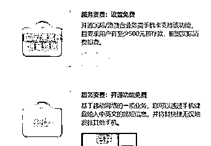****5:00：发现才注意到网厅有关闭短信的业务，想着如果对方是高手，我关闭后也可能对方会立马发现，但也可能对方只是流水线的犯罪脚本操作工人，可以赌一赌，反正对我没损失，对他们还增加开通短信的步骤。******（后面查短信详单时发现，正是关闭短信功能这个操作，中断了他们后续的犯罪行为，不然损失肯定更严重）****

**熬到 9 月 5 日 9 点：开车送老婆蹲守营业厅开门，9 点 8 分完成补卡，丈母娘来电话说老婆电话打通了，但接电话的是个男的，我回答说可能是营业厅的营业员接的。几分钟后老婆办卡归来，问到刚才丈母娘电话什么情况， 她说没接到电话啊，手机一直在自己手上。看了下确实没有通话记录，手机外拨也是正常的，短信发送接收也正常。继续打 10000 号，询问手机是否被开通了呼叫转移，得到确认的答复，验证身份证后关闭业务。关闭之前从话务员那边问到被转移的电话号码（准备后续万一要报警就提交过去）。**

**开始收复阵地，检查损失。找回支付宝、微信、云闪付，发现除了支付宝手机号被改了，但由于账户本身冻结状态，就没管了。从云闪付上管理的银行卡里交易记录基本没什么异常，**只有一张工商银行卡多了 280 元（诡异吧），**一看是从一个钱袋宝转过来的， 觉得蹊跷下了个 APP 想用手机号码登录钱袋宝看下：APP 异常，登录不上，暂时就没管了。 ****约了朋友一起峨眉山泡温泉，喝下一瓶乐虎、一瓶红牛、一瓶咖啡，出发去峨眉山，途中继续检查了了下各个支付账户，好像没什么异常。下午到了峨眉山，在温泉池子里休息，恢复体力。准备晚上从电信营业厅查下详单，看对方都干了什么。******晚上查详单前老婆登录支付宝结果习惯性输入手机号码，发现密码错误，** 赶紧用手机找回，突然想起自己支付宝账号不是手机号，一看才发现是对方新建的支付宝账号，还绑定了那张被我们遗忘的建行卡，以及一张建行 ETC 信用卡（办好 etc 后就一直在抽屉里吃灰），而且账单里有充值消费记录，以及被支付宝风控阻断后的充值退回记录，这时候才发现这张原本绑在云闪付上的信用卡被对方从云闪付解绑了，所以我们才没发现异常。****登陆建行网银，发现 9 月 5 日 4 点多时美团转进 5000 元的记录，跪了，**再看 etc 信用卡有各种买卡、充值 的记录 几大千，银联转账记录几大千，最坏的情况还是发生了。******下载了短信和通话详单，开始分析通话和短信记录，挨个查询，基本上通话的都是各家银行、银联，短信记录能查的到源号码的也就是 社保局、华为、腾讯、银联、翼支付、微信、支付宝，其他 106 开头的服务号不知道是哪个机构的，分析没什么结果。****两人开始回忆从头到尾的细节，开始逐个分析，一个资深渗透测试工程师的优势这时候展示体现出来了。**

*   ****对方第一次上线时已经把卡拔出来插到其他手机，从短信发送记录上看是给一个手机发了条短信，获取到本机手机号码。****

*   ****然后联系电信改了服务密码，用手机号码配合短信验证码改了华为密码，把原设备上的账号注销了。****

*   ****然后解锁了华为锁屏密码，进入了手机。****

**这中间有几个说不通的地方：**

**1\. 修改电信服务密码需要身份证号码**

**2\. 有华为密码从网站上也没有解锁锁屏密码的功能。**

**第一个我想的是可能从社工库查到了身份证号码，第二个根据百度结果说是华为老版本的 emui 账号登录后可以远程锁机，设置一个新密码，然后用新密码解锁屏幕进入手机（这个操作未实际验证） 。**

*   ****然后对方还修改了支付宝登录和支付密码、微信密码，****

*   ****中间还修改了支付宝手机号码（为什么这么操作到 9 月 7 日晚上的分析才知道），****

*   ****并且绑定了被我们遗漏的银行卡至支付平台账号上进行消费。****

**这里又有说不通的地方：****1、支付绑卡需要银行完整的卡号，如何得到的？一开始以为打银行客服就可以问到，后面试了下是不行的；****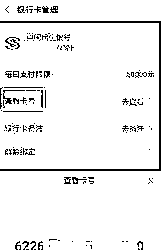****但当我查看支付宝的银行卡管理功能时，发现有支付密码的话，可以用支付宝自带的查看卡号功能获取银行卡完整卡号，太长时间没用这个功能了。**

**但这样的话就还有个说不通的：**

**2、支付密码的重置需要的条件（人脸 、短信+安全问题 、短信+银行卡信息、银行卡+安全问题），没照片的情况下，人脸应该不行，我们设置的安全问题基本上不会被猜到，那只有短信加银行卡了****（实际上最后发现，对方既可以人脸验证，也可以短信加银行卡验证，甚至连支付宝都是自己新建了一个，支付密码也是自己设置的）。****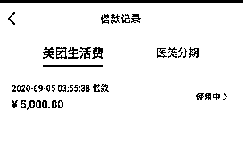****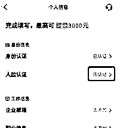****然后剩下的步骤就比较清晰了，**

*   ****通过绑了卡的美团，申请贷款，放款到建行储蓄卡****

*   ****再通过支付 APP 之前的绑卡结果，通过购买虚拟卡和网络充值消费掉。****

**剩下就是苏宁金融的信用卡消费了，还是抱着怀疑的态度，他们如何搞到我的信用卡 cvv 的，这一点我们是比较肯定的，etc 信用卡从申请下来就没离开过抽屉。从银行客服那边能获取到的最多也就是信用卡有效期。******（后面才发现支付公司现在绑信用卡根本不验证有效日期和 CVV，都是简单粗暴的身份信息+卡号+预留手机号码，甚至有些连预留手机号都不用）。****

**整理完所有的情况后，就准备联系各个支付公司，准备讨要说法了。一圈下来后，得出的结果是：**

*   **银联云闪付态度极好，说第二天会有专人联系 ；**

*   **财付通 联系不上 ；**

*   **美团借贷 态度模糊 ，问他为何只是简单验证了身份证就放款了，只说这种贷款产品很多其他公司也有的，嗯好像很有道理，大家都做的就是正确的。**

*   **苏宁金融未回应。**

**准备好一些材料，包括通话、短信记录、银行账单，以及其他零散资料，准备赶回去报警。毕竟事情发生在小区门口，而且团伙作案，极有可能还会再犯，把事情整理下发到业主群，让大家小心防范，提醒大家设置好 sim 卡密码。大家也都被震惊了，但一致对于怎么获取身份证号码、银行卡号表示疑惑。中间手机陆续还收到几条财付通的支付验证码，但登陆自己账号，没发现有绑卡，留着疑惑后面再处理，反正不给验证码也付不出去。 ****思路理清楚了，已经凌晨 4 点多了。一早赶紧往成都赶。路上云闪付主动联系我们，让我们报警后提供报案回执单等一些材料提交过去，看样子有可能要赔付。美团也打电话过来了，想推卸责任，但还是让我们提供证据资料提交给他们。******派出所民警听说了我们的遭遇都表示惊奇，说之前从没遇到过这种偷手机的。**我应该是第一个来报这种案件的 。老婆进去做笔录，耗时几个小时， 出来后说了里面的情况，警察大叔们都表示“这不可能”、“肯定是你手机里放银行卡信息泄露了”、“你是不是放身份证照片在手机里了”，做完笔录竟然又要我们去打印银行流水，跑了几家建行都是关门的，只能等第二天再来取报案回执单了。 ****晚上回去两口子在电脑前继续回想所有细节，把整个过程串一遍，必要时用我的各种 APP 和账号进行实验，验证自己的分析判断。虽然补了手机卡， 银行卡都冻结了，带支付功能的软件都找回来各种修改密码了，但总觉得哪里就是不对劲。****突然又收到了财付通的支付验证码请求，再关联起前面的几个可疑点，一下子想通了。**他用其他支付账号绑了我们的银行卡，** 包括之前用手机号登陆苏宁时发现登陆的是别人新创建的苏宁账号、包括支付宝也是新建的，至于他们新建的的账号怎么通过的人脸实名认证，这个留在后面讨论。****说明除了这些 APP，肯定还在其他一大堆 APP 上用我的信息新建了账号，绑了银行卡、通过了实名认证，并自己设置了支付密码。****挨个 APP 检查，** 发现用我们的手机号码新建了支付宝、苏宁、京东且包含有消费记录，这个操作隐蔽性强，**如果我们没发现的话，解冻了银行卡，他们还可以用自己创建的支付账号进行消费。****问题又来了，他们用我的手机号新建的账号 我们可以挨个试出来， 但用其他手机号新建的账号我们猜不到，比如云闪付、财付通、苏宁金融 ，这几个从银行流水里查到有转账消费记录，但我们没找到对应的账号。**

**再回到上面有疑惑的几个问题上：**

*   **要在支付宝上查看我绑定的银行卡信息或者绑新的卡，需要支付密码而支付密码的重置，需要短信+一张银行卡信息的验证；**

*   **一开始整个环节的起点，都需要我的身份证号码，起初我判断是通过社工库，但这一番操作分析下来，整个黑产团队的手法，基本都是利用的各个银行、支付公司的正常业务流程来处理的，那么身份证的获取大概率也不会采用社工库去查询；**

*   **部分支付 APP 新建账号后的实名认证，需要活体人脸验证，这个如果可以从手机自拍照或者华为云里之前存过的照片，用技术处理手段处理照片绕过人脸识别（参考 2020 年的新闻《利用照片伪造动画头像“骗过”支付宝人脸识别，一犯罪团伙薅支付宝“羊毛”超 4 万元》） **

**总结下来就是，需要有一个地方，通过手机号码和接收到的短信验证码， 能获取到姓名、身份证号码、以及一张银行卡的卡号。****感觉这几天自己都有点病态了，遇到这种盗刷的倒霉事，不愤怒、不沮丧、不慌乱，而是出奇的亢奋，几天下来没睡几个小时，不停的研究和分析，快把对方的运作模式研究出来了，把 IT 男追根刨底的特质发挥的淋漓尽致。****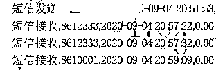****来，继续冷静分析，手头能跟犯罪分子行为步骤关联最紧密的就是电信营业厅获取的短信和电话记录了。翻出短信记录，除了第一条犯罪分子发给自己手机号的记录，紧接着就是收到两条 12333 社保局的短信。最开始两天都没注意到，以为是老婆公司给缴纳的社保的通知短信，但再仔细分析就发现不对劲了。****一是短信发送时间可疑，非工作时间内发送社保缴纳通知是不正常的，连发两条也是不正常的，那突破点就是它了，社保系统里肯定是有身份证信息。****打开四川省人社厅的网站，看到一个四川人社的 APP 下载二维码，下载打开 APP 的瞬间就明白了， “快捷登录”、“短信验证码”、“电子社保卡”  这几个关键字明晃晃的扎我眼。****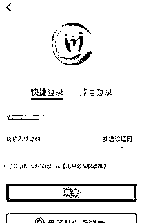****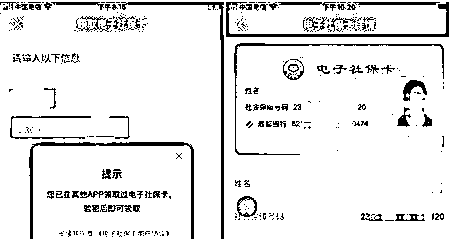****发送短信验证码，登录进去。点开 “电子社保卡”，发现需要社保密码，继续忘记社保密码，短信验证码重置社保密码，这一切刚好是两条 12333 的短信验证码，随后展示在眼前的内容，直接解释了上面三条疑惑。******身份证信息、证件照片、社保金融卡的银行卡信息，有了这些东西，干啥都一路畅通了。******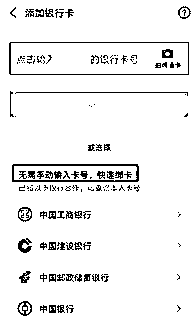****再返回去之前的支付宝绑卡流程，**“无需手动输入卡号，快速绑卡”，几年没用绑卡功能，现在都这么高端了。******选一家银行点进去后，该银行下我的所有银行卡列表直接出来了，选上信用卡，绑卡。CVV 、有效期 这些都是浮云，人家就一个简单的短信验证码验证，这样的话通过支付宝查看你所有银行卡的卡号就简单了。**

****最后我们再来总结分析一波，这条黑产链的全貌如下：****

**1、一线扒手特定时间选定目标：年轻人、移动支付频率高，在对方注意力分散的情况下出手，运营商营业厅下班后，失主没法当晚立即补卡，给团队预留了一晚上的作案时间；**

**2、拿到手机后迅速送到团队窝点，迅速完成身份证信息获取、电信服务密码、手机厂商服务登录密码修改，一下子让受害者陷入被动；**

**3、获取所有银行卡信息，使用技术手段绕过活体人脸识别验证，在各个平台上创建新账号，绑定受害者银行卡。**

**4、选好几家风控不严的支付公司，开始申请在线贷款，贷款到账后通过虚拟卡充值、购买虚拟卡以及银联转账，将钱转走。**

 **5、保留新建的支付账号权限， 如果未被发现，后期还可以继续窃取资金。**

**在这一系列过程中，对方有几点还是让我比较服的：****1、**全程用的都是正常的业务操作，**只是把各个机构的“弱验证”的相关业务链接起来，形成巨大的破坏；****2、**应该是使用了技术手段通过的人脸验证，**用图片处理技术来绕过活体人脸识别验证；****3、**团队分工协作能力太强，**在处理过程中我感觉自己已经用了最快的速度，但总还是晚一步；****4、**注重隐蔽，留好后路，**包括删掉我云闪付上的一些卡来防止我查明细，通过新建账号的方式，如果我没发现，贸然去解冻银行卡，后续还有第二波的攻击；包括赶在我补卡后改服务密码前，设置了呼叫转移。****分析完犯罪分子，再来看下整个过程中参与的机构都有什么“问题”，实际上这个环节里的每一个点，放在对应的业务节点里都不是什么大问题，但手机丢失后，把所有这些点串起来，问题就大了：******1、四川电信：**我认为整个过程责任最大的就是它了，这挂失、解挂的风骚业务规则简直让我无语，既然都挂失了，不应该考虑到手机已经不在失主身上了，解挂不应该有个时间限制或者要求营业厅办理么？就算前面的过错无视了，同一个手机号码在深夜来来回回挂失解挂几十次，包括机主几次在电话中告知话务员自己正在遭受银行卡盗刷犯罪，要求停止解挂行为，话务员还是拿着业务话术来敷衍客户“对不起，我们的挂失解挂有固定的业务流程，只要对方能提供服务密码，正常就是可以解挂的”。我们全家人就这样抱着电话陪犯罪分子熬了一夜，到最后还是造成了经济损失。对于四川电信，后续该投诉投诉。** ****2、四川人社：**它所起到的作用，大家也都看得懂。两条短信验证码，关键的资料全泄露出去了，但我不好说他有什么罪，毕竟他们本身也不是金融机构， 对个人信息的保护要做成什么样也没个标准。****但这个事情没那么简单，把四川人社换成 XX 人社或者四川 XX，也可能是一样的结果，这个黑产链设计的时候身份证号码的获取途径可以是多处的，至少我随便在网上下载几个地方社保 APP，都能找到和四川人社一样登录和密码找回使用手机短信验证的。  ****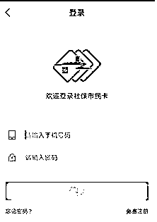****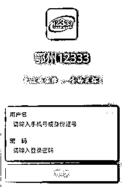******3\. 华为：**其实把华为换成小米，结果也是一样。我只能说密码找回这个业务的验证太简单了。****还有就是网上说的用 emui 5.0 的手机，可以远程解锁屏幕锁屏密码，这个我没验证过， 但从我支付宝被挤下线时提示对方使用的手机型号来判断，大概率是可以的。******4\. 支付宝：**先不说为啥同一个身份信息，可以注册两个账号，你的快捷绑卡，是加快了绑卡的便捷性， 但考虑过安全性么？当然，支付宝的风控是强，确实识别到了异常交易，也追回了资金。****但实名认证的人脸识别被绕过，也是事实。******5\. 美团：**你要发展业务，放宽贷款限制，这我不关心，但你能否做好该有的贷款审批风险控制，凌晨 4 点的贷款行为，这正常么？******6\. 苏宁金融：**所有参与这个过程的支付机构中态度最恶劣的一家，出现案件，接到用户报案后第一时间想到的是推卸责任。“报案了么？如果警方有需要，我们会做好配合工作！哦你的经济损失啊，那只能你自己承担了”，中间来过两次电话，基本腔调就是这样。同样是支付公司， 支付宝的风控能识别异常盗刷，苏宁金融就一点察觉都没有，一个新注册的账号，凌晨三四点绑卡，然后购买各种虚拟卡、充值话费这些不容易被追查的商品，这不算高风险异常行为么？******7\. 银联云闪付:** 和其他支付公司一样， 都存在绑卡验证不严的问题。但是，人家态度是好的啊，凌晨 3、4 点，客服人员都能用极好的态度和我们沟通，让我们放宽心。第二天有专员联系我们，告诉我们昨晚报的损失少报了，他们查出来我们还有其他损失，并给了详细的指引告诉我们怎么去申请理赔，第二天他们内部调查有新的进展也都第一时间联系并告知我们。******8\. 财付通：**人工客服太难找了，不过风控也还是有效的，这两天在没有通知我们的情况下，陆陆续续追回了几笔交易金额。******9\. 京东：**不想说了，反正就是“交易已经发生了，损失你自己承担”，但还好就一笔 100 元的游戏充值卡。******10\. 百度：**对方刚好操作到它的时候短信功能已经被我关了，对方也只是绑定了银行卡，还没来得及消费，就不用找它理论了。****多数支付机构基本都有一个现象：**

*   ****允许用不同的手机号码注册相同实名认证的支付账号，****

*   ****允许两个账号绑定相同的银行卡，****

*   ****实名认证有人脸活体识别技术的都被绕过了。****

**支付机构都在推“快捷绑卡”，是快捷了，点几下鼠标就绑卡了。除了短信验证码，支付宝的快捷绑卡还验证了下支付密码，但好像意义也不大，比如我这种情况，支付账号都是别人用我的信息新建的，支付密码也是他设置的。****说完他们，最后再来说说咱们吧。****通过这几天的经历，不管中间情节有多少起伏，我作为一个有 10 多年信息安全从业经验的老骆驼，都要被折腾成这样，我实在是不想让大家有跟我相同的经历。提个我认为我们个人能做的最简单最有效的防护措施：******给自己的手机卡上个密码，给手机设置个屏幕锁。这样手机丢了也不用担心别人拔下卡插其他手机里继续使用。******以华为手机为例：设置-安全-更多安全设置-加密和凭据-设置卡锁 ， 选定手机卡，启用密码（此时使用的为默认密码 1234 或者 0000），再选择修改密码，输入原密码 1234，再输入两次新密码，完成 sim 卡的密码设置。****同时，如果有遇到和我一样情况的，除了冻结所有银行卡后，还需要把银行卡的预留手机号码全换掉；****同时可以通过登陆网银或者手机银行，**用快捷支付管理功能，查看都绑了那些支付公司，**然后可以尝试用自己的手机号码去登陆那些 APP，有可能还会有意外收获，万一支付公司不给理赔，还能自己追回一点。****比如我就在对方注册的苏宁账号上找到还没来得及消费的购物卡。  ****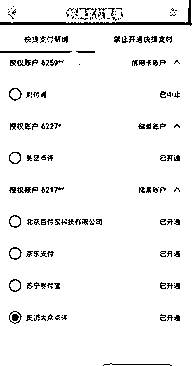****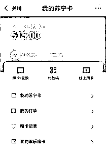****然后这个事情是不是就这样结束了？也不一定哈，9 月 5 日我们补办完手机卡时我就和我老婆说了，后面这段时间内要小心陌生的电话和短信、微信。对方快吃进嘴的肉被硬扯下去一大块，手里又有你的一些信息，肯定不会甘心的，要小心后续的网络钓鱼、和电话诈骗。这两天她手机就开始收到有可疑的短信了，什么套路也懒得去猜了，反正不理会就是了。****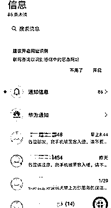****我所经历的这个案件，其实和前两年新闻上报道过的钱包丢失，对方用偷到的身份证去营业厅补了卡，然后导致银行账户损失其实是差不多的，目标都是手机卡。移动互联网的发展给我们的生活带来了巨大的改变，手机的地位也越来越高，希望大家吸取我的这次经验教训，提前做好防范，出事别学我，第一时间挂失手机卡、所有银行卡。******后续进展******9 月 9 日——****在经历了与一个专业黑产团伙的几天对抗之后，新建了这个微信公众号，根据自己搜集整理分析的结果发表了《一部手机失窃而揭露的窃取个人信息实现资金盗取的黑色产业链》一文，这篇文章发表后引起的轰动效果，完全超出了我的预期。不想原本只是写给小区业主群的案件记录分析结果一夜间成了网络热文，也答应过网友，事件有了新的进展就汇报给大家。****在今天（9 月 11 日）下午，事件中涉及的几家支付公司都积极联系到我，**美团的贷款记录消除了，苏宁金融把我们损失的几千都赔付了。**由于美团贷款的记录消除，实际上还导致苏宁金融赔付金融比他造成的损失多了 300 元，已经联系苏宁金融进行退款。银联云闪付的赔付也已打电话通知取消。对于赔付金额，该还我们的一分都不能少，但多的我们也一分不多要。****发上一篇文章的时候，黑产团伙的很多操作步骤流程都是我根据自己所能搜集到的信息推论判断出来的，文章的发表也引来了各方注意，提出了个别文章中推论出错的地方。****例如人脸识别的绕过，支付宝在进行业务设计时，对在原手机上创建并登陆的子账号，在实名认证时，**匹配身份信息的各项要素通过风控规则校验与主账号一致的情况下是不需要人脸验证的，**这一点我们办公室的多位工程师今天下午在对我的被盗刷事件进行技术复盘时也验证确实是如此，人脸识别的绕过确实错怪他们了，这也解释得通为何犯罪分子需要解锁偷到的手机进行支付宝的登录，推测是为了不触发支付宝的风控规则。******至于四川电信，今天也主动联系到我老婆，对那晚的事件进行道歉**，也解释了说对方当时跟他们的客服说是男女朋友闹矛盾，只能说犯罪分子很狡猾，但对于四川电信的远程挂失和解挂的业务流程设计，站在安全的角度上考虑，我还是不能认可。中间有个小插曲，我为了调查案发时我的短信详单中一条未知的短信记录，再次拨打 10000 号说明了我的情况并根据短信源号码要求查询号码的归属公司，客服拒绝了我。虽然未能查成，但说实话我反而是高兴的，**至少说明对客户信息保密的业务原则还是有效的。******再说下盗取手机进而实现银行卡盗刷这个案件，自从文章发布后，也有几个网友在微信公众号上留言，说自己经历过一模一样的场景，**只是受损金额都比较大，最严重的一位有 68 万的线上贷款，目前还在索赔中。******在网上找类似案例的时候，发现 2019 年 9 月有一篇新闻——《凭 SIM 卡登陆各软件！上海警方披露最新型盗刷手法》，大家有兴趣可以搜一下，看新闻介绍的犯罪手法，基本上和我遇到的这个案件是一致的，只是获取身份信息的途径不一样。****前面也提到，犯罪分子精心设计的这么一套犯罪脚本，在身份信息获取这种比较容易的环节上，一定是会有备用方案的，**目前据我所知的在获得短信权限的情况下比较容易获取的如各类连锁酒店 APP（如华住、锦江）、商旅订票类（如去哪儿），**这些包含身份证信息的 APP 和网站，对于身份证号码信息的泄露风险并不是说不知道，只是在业务的“用户体验”面前，安全已经不算个问题了，毕竟我这种案件的数量还是不多。以去哪儿为例，在常用旅客列表中，对身份证信息进行了屏蔽显示，但点击进入信息编辑界面时就明文展示了：****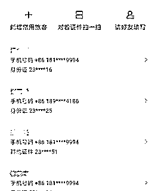****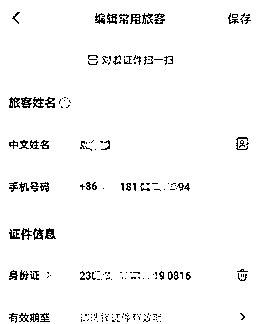****对敏感数据加个保护的实现技术有难度么？再看看携程的处理方式：****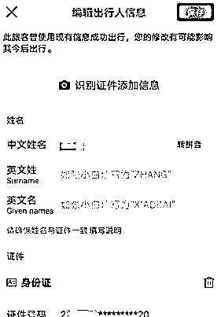****我不知道在编辑界面明文展示身份证号码能提升多少百分比的用户使用体验友好度，但安全性的差别就是 0%和 100%。****今天在朋友圈看到一篇文章《央行科技司司长李伟：金融科技发展应重视个人信息保护》，我的案子刚好与文章里提到的部分内容应景。李司长在 9 月 8 日的发布会上提了三块内容：**

*   **一是重视个人信息保护，善用数据要素价值。**
*   **二是重视数字鸿沟问题，践行数字普惠金融。**
*   **三是重视监管科技应用，增强数字化监管能力。**

**其中第三部分提到：部分机构在利用技术创新业务模式、提升服务效率、改善用户体验的同时，一定程度上简化了业务流程、削弱了风控强度、掩盖了业务本质，这给金融监管提出新挑战。****回看现在各大支付 APP 热推的”快捷绑卡”业务，相比之前的银行卡绑定流程，是简单快捷了一些，但金融业务，是越简单快捷越好么？昨天我的文章火了后，很多邻居说忘记了自己在哪家银行开过银行卡，想找出来注销掉，问有什么办法。****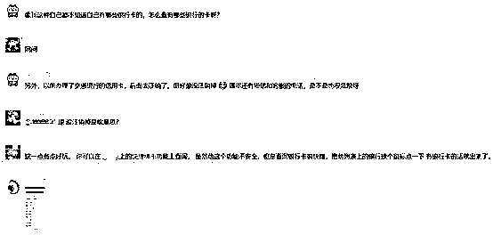****最后再谈下我上篇文章中提到的让大家设置手机 SIM 卡密码，主要有几点考虑： **

*   ****手机锁屏状态下对方无法使用短信功能；****
*   ****如果更换手机卡至新手机则需要输入 SIM 卡密码；****
*   ****要解锁 SIM，需要从运营商获取 PUK 码；****
*   ****要获取 PUK 码，需要提供身份信息进行验证；****
*   ****未解锁手机的情况下加上 SIM 卡加锁，对方无法知道你的手机号码，这样断了获取身份信息的路。****

**当然，这样一个安全闭环里也还是有些风险，例如利用 GSM 中间人攻击获取到号码，但这类一般人遇不到，对普通民众来说可以不用考虑。第一时间挂失手机卡，这一点还是必要的行动，也希望运营商在我这个案件之后，会作出相应的改变。****俗话说“靠人人跑，靠树树倒”，还是靠自己靠谱些，按现在移动金融业务的发展趋势，将来会面临更加严峻的安全挑战；而且金融业务用到的部分关键要素信息，如手机号码、身份证号码在常规移动互联网业务中的交叉使用，数据泄露的风险将越来越大。虽然部分金融机构都给出了被盗刷后的赔付承诺，案件发生在自己身上后你能否符合赔付的标准条件不好说，耗费大量时间精力在这件事上面，也是很心累的。****此外，上篇文章中我按我自己手机的操作流程步骤作为 SIM 卡设置密码的例子，后来发现很多网友可能由于手机品牌型号差异导致操作失误而锁住 SIM 卡，对此给大家造成的不便给大家道个歉，考虑不周啊。**大家还是在网上搜索自己的手机对应品牌的 SIM 卡密码设置然后按照详细教程一步一步操作，**如遇到 SIM 卡密码验证失败后出现 PUK 码输入要求，可联系运营商获取 PUK 码。请一定小心谨慎，必要时可到运营商营业厅设置。**

**自己长期从事金融行业信息系统的安全漏洞检测，也曾多次被自己发现的可直接影响账户资金安全的漏洞而震惊，但经历了这次盗刷事件之后我才发现，相比黑客利用各种高深的技术漏洞攻击金融信息系统，更可怕的是这种把每一项看似没问题的问题组合而成的犯罪，让人防不胜防。也希望今后在工作之余，能有时间把自己在金融信息安全行业的专业知识，用大家都能看得懂的方式写出来，提高大家的安全防范意识。**

**来   源 21 世纪经济报道、信息安全老骆驼**

****

**← 向右滑动与灰产圈互动交流 →**

********点击****阅读原文****加入灰产圈高端社群****

****

 **# 原文：[`mp.weixin.qq.com/s?__biz=MzIyMDYwMTk0Mw==&mid=2247502750&idx=2&sn=e921c0e3f56342caddd8f0eb822ff4e4&chksm=97cb00a6a0bc89b00ebe57180e589738cb3b75534f46c288c46ec12830d25eae0567cc8d840c&scene=27#wechat_redirect`](http://mp.weixin.qq.com/s?__biz=MzIyMDYwMTk0Mw==&mid=2247502750&idx=2&sn=e921c0e3f56342caddd8f0eb822ff4e4&chksm=97cb00a6a0bc89b00ebe57180e589738cb3b75534f46c288c46ec12830d25eae0567cc8d840c&scene=27#wechat_redirect)**