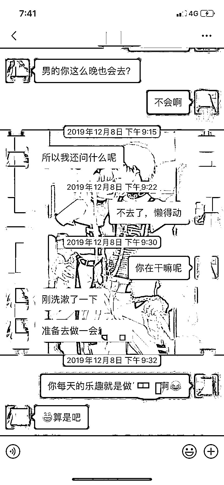
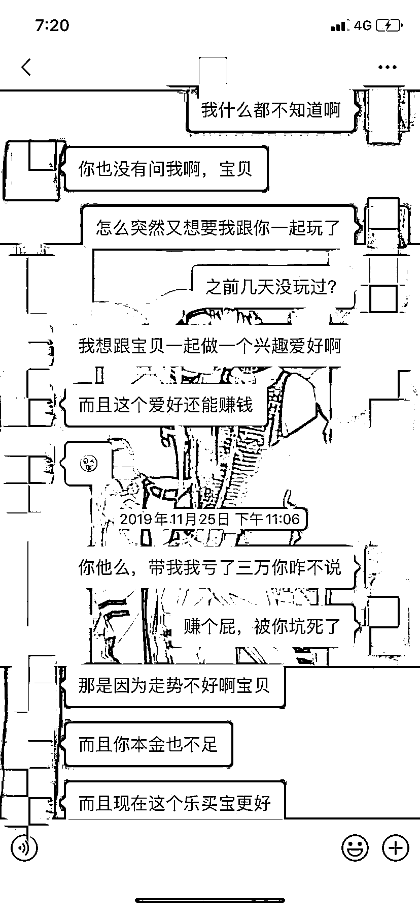
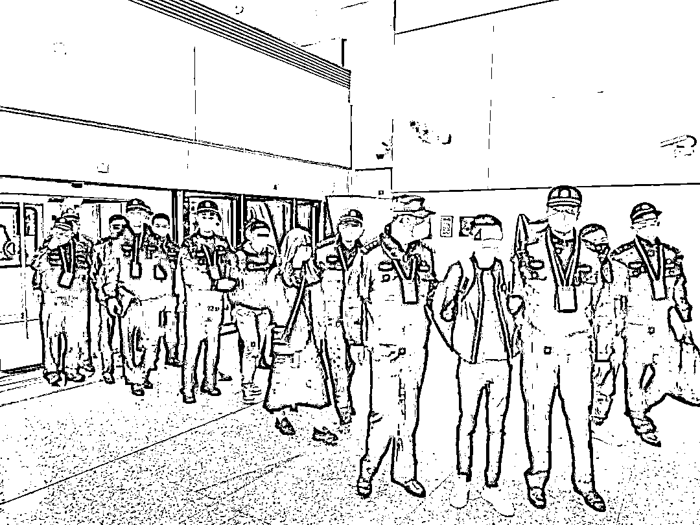
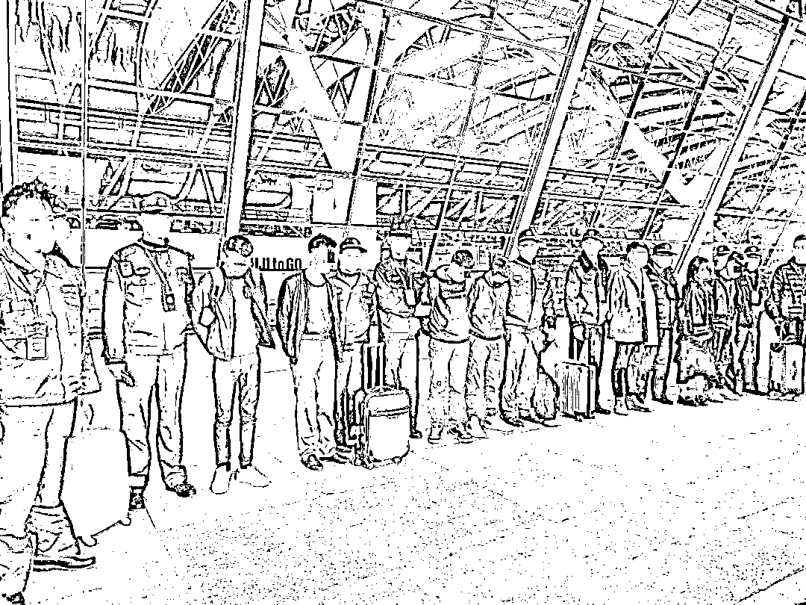

# 被老乡骗到东南亚的“杀猪盘”业务员亲历：逃跑被抓遭打至满脸出血

> 原文：[`mp.weixin.qq.com/s?__biz=MzIyMDYwMTk0Mw==&mid=2247502750&idx=3&sn=6ab93c696ab2543a0d6e79f8f6a4d5a5&chksm=97cb00a6a0bc89b0086eb2060c314f5717b0f203f020882551ec642bc27aacdabd9c15428aac&scene=27#wechat_redirect`](http://mp.weixin.qq.com/s?__biz=MzIyMDYwMTk0Mw==&mid=2247502750&idx=3&sn=6ab93c696ab2543a0d6e79f8f6a4d5a5&chksm=97cb00a6a0bc89b0086eb2060c314f5717b0f203f020882551ec642bc27aacdabd9c15428aac&scene=27#wechat_redirect)

**点击上方蓝色字体免费订阅“灰产圈”**

**导语**

22 岁的江澄（化名）和 24 岁的晏鸿（化名）既是参与“杀猪盘”诈骗的犯罪嫌疑人，某种程度上也是“被害人”。

经过半年多的缜密侦查，上海市公安局普陀分局于今年 3 月起至 6 月，在福建厦门、上海等地，成功抓获在境外从事“杀猪盘”型电信网络诈骗的 42 名犯罪嫌疑人。目前，警方已查证该团伙作案 20 余起，涉案金额超过 500 万元。

案件的侦破，揭开了部分电信网络诈骗团伙招揽底层业务员的内幕。据警方介绍，这一团伙将诈骗窝点设在东南亚某国，核心成员在国内以高薪招聘做幌子，诱骗在外打工的同乡青年到国外工作，随后通过威胁、暴力等手段强迫他们参与诈骗。江澄和晏鸿就是这样入伙的。

人性比想象的更复杂。原本被迫骗人博彩的两名青年，脱离魔掌后，却又再次登上了通往罪恶之城的航班。 

他们究竟经历了什么？ 

**网站客服变“骗人博彩”**

“我也不想骗人，他们逼得太狠了。”说起在东南亚某国“工作”的日子，身在看守所的江澄很是愤懑。

16 岁就到上海打工，做过服务员、外卖小哥，出国前，江澄在一家汽修厂做汽车美容工人。找一份轻松的工作，多赚点钱，是这个山区青年朴素的理想。 

改变人生的“机会”不期而至。“去年夏天，一个老乡突然联系我，介绍我去国外做游戏网站的推广。”江澄说，老乡自称在国外一个月可以挣两三万元人民币，起码是他当时三个月的工资，这让他很心动。

老乡的描述中，这份工作试用期仅两个月，底薪 6000 元，转正后升至 7000 元，还能拿到高额提成，并且包吃包住，包来回机票。江澄觉得，这是个难得的机会，不如去试一试。

老乡很快把一切“安排妥当”。才过了一周左右，签证、机票都送到了江澄手里。

出发那天，在机场，江澄才知道老乡还带了另外七八个同乡人，一起登上前往东南亚某国的飞机。那是江澄第一次坐飞机，也是第一次出国。怀揣对新生活的憧憬，一路上他抑制不住的兴奋，不停跟邻座同事讨论着即将落地的城市，还相约去当地最受游客欢迎的大排档美餐一顿。“去之前，我在抖音上关注了当地生活的华人，那个大排档最诱人。”

落地之后，梦碎了。跟着接他们的人出机场、搭汽车、办入职、办入住，护照以代办劳动签证的名义被收走。 

宿舍在一幢高层公寓楼里，房间里都是高低床，一个房间住 10 个人。公司离宿舍很近，在当地算是黄金地段，但内部装修很简陋，“就是一个空屋子，里面摆着成套的办公桌椅。”彼时，江澄并不在乎工作和生活的环境，一心想着多赚点钱。

很快，就有人来“指导”他工作了。上班期间，所有人的手机要统一上交，每人拿到一本几十页的培训手册。江澄不记得具体内容，“是跟人聊天的话术”。 

然后，他被分到一个小组，组长负责工作管理，另一个负责生活管理的人被称为“督导”。朝夕共处半年多，江澄还不知道组长和督导姓什么，“大家都不知道，也不想知道。” 

江澄感觉很懵。“不是做‘游戏推广’吗，但培训的内容却是教我们怎么跟人谈情说爱，让别人下载博彩 APP，我感觉不对劲。” 

办公室的氛围跟空调里吹出的风一样冷。同事要么抱着手机，要么对着电脑，熬到半夜 12 点下班，一回到宿舍，江澄就掏出手机。当在抖音刷到防范“杀猪盘”的宣传提示短片时，他忽然明白过来了：这些诈骗步骤，和公司培训的内容如出一辙。 

但他知道得太晚了。此时，人已在国外，护照被扣押，周围都是公司安排“照顾”他们的保安。 

**“你不骗，别人也在骗”**

两台手机、一台电脑，这是公司发给业务员的工具——在他们眼里是用来工作的，实质是犯罪工具。透过一块块发烫的屏幕，那一边的现实世界，正有不明真相的人深陷“爱情”童话与赚钱美梦中。 

江澄和同事们的聊天对象都是女性，是公司高层筛选过的待宰“肥猪”。虚岁才 22 岁的江澄被要求佯装成“成熟男人”，和各个年龄段的女人“恋爱调情”。 

“我扮演的角色叫王立，是一个做进出口贸易的经理，浙江杭州人，开几百万的那种豪车。”微信账号、朋友圈内容都是组长提供的，每天 12 小时，江澄要在屏幕后维持这个“人设”。时间长了，有时晚上做梦会梦到自己变成了头像上那张脸，开着豪车，吃着大餐，“感觉很分裂”。 

这样的人物包装，已经成为交友类电信网络诈骗的标准模板，其核心原则千篇一律——完美情人。 

“男的身材健壮，女的温柔善良，感情专一、收入稳定，最好还会做菜……”长期从事电信网络诈骗犯罪打击和防范工作的上海公安刑侦总队探长范华说，这在业内被称为“个人磁场”，是犯罪团伙吸引目标猎物的基本配置。“现实中难觅的完美情人，寄托了被害人对感情的幻想和期待。这类案件中，女性已经成为犯罪嫌疑人的主要目标。他们利用女性戒备心低、渴望情感等特点，实施诈骗。” 

有了基本“人设”还不够，还要有励志而不失温度的“个人故事”，情节设计不仅涵盖性格、生活习惯，还涉及婚姻、家庭情况。江澄的同事、24 岁的晏鸿告诉记者，组长会细心指导大家，“很多女人更爱有故事的男人，而不是黄毛小子”，情节设计可以是“单身丧偶”，也可以是“被发妻后抛弃发愤图强发家致富的男总裁”。 

公司严格规定，业务员绝不可以删除聊天记录。“老婆亲一个”“我给你暖被窝”……对话框里，不乏这样的“私密内容”。江澄说，所有业务员的聊天内容要随时接受组长、主管的检查，“看我们聊天方式、聊天进度有没有问题”。 

被害人与业务员的聊天记录，不乏暧昧语言，目的是骗人博彩

每天，每个业务员要和 3 到 5 个客户聊天。短则几天、长则半个月，江澄、晏鸿们就会与客户培养出“感情”，称呼也变成了“宝宝”、“老婆”“亲爱的”。接下来，就会邀请猎物参与网络博彩，实现从“谈情”到“谈钱”的转变，在业内被称为“切客户”。 

到了这一步，江澄和晏鸿的任务就完成了。“只要对方成功下载了 APP，组长会把我们的手机收走，由更高级别的人去和对方继续聊天。” 

跟江澄不同，晏鸿打从一开始就知道出国干的工作是“博彩推广”。到国外才发现，所谓“推广”其实就是“骗人”。“我原以为是给那些本身想参与网络赌博的男人服务，没想到真正做的是骗女人的钱。”但他还是照做了。 

他们说不清具体拿到了多少工资，但都表示确实赚到了些钱。 

工资由底薪和绩效组成。据办案民警介绍，这个团伙制定的绩效规则是：如果一个月骗到的金额小于 5 万元，业务员提成 5%，骗到 5 到 10 万元，可提成 7%。 

“我干了 6 个多月，从来没有完成过业绩。”江澄说，对于他这样业绩不达标的业务员，组长会不断进行“洗脑”，大致内容是：来国外打工就是为了赚钱，不吃苦不努力怎么能叫男人；好女人不会上网交友，上网交友的都不是好女人，活该被骗；你不骗，别人也在骗……通过“道德松绑”，解开年轻业务员的心结，激励他们冲业绩。 

**有人逃跑被抓，**

**遭保安打到满脸是血**

如今，江澄们从事的“杀猪盘”套路，已经成为电信网络诈骗的主要作案手法——骗子会佯装在网上与你邂逅，隔着屏幕陪你聊天、倾诉、培养感情，待获取充分信任后，再引你投入大笔金钱参与博彩。 

被骗的受害者投入了真感情，也散尽了真金白银，甚至背上高额债务，精神崩溃。而对于屏幕后的大多数诈骗人员来说，这只是稀松平常的“工作”，没有太多心理负担。 

初时，江澄非常不适应，打算不干了。“督导”告诉他，可以辞职，但机票、签证、接送、住宿、餐饮在内的全部费用，都要赔偿给公司。“算起来要 3 万多元，我拿不出那么多钱。” 

怕家人担心，江澄从没跟父母说过，他其实已经离开了上海，在国外“工作”。 

在那个位于东南亚某国的海滨城市，他的生活轨迹就是宿舍和办公室，24 小时被人监视。极少的放风时间，也只能到宿舍楼下便利店买条烟，买两瓶酒。出国前就种草的大排档，尽管离宿舍只有几条街的距离，却从没有机会踏足。 

公司管理越来越严苛。上班时间从 10 小时变成 12 小时，休息从每月 4 天变成 1 天，底薪从 7000 元变成 6000 元，每月还要扣 1000 抵押金。“到后来，每天中午 12 时上班，半夜 12 时下班，傍晚 6 时左右可以吃饭加休息半小时。” 

公司给江澄这样的“员工”，指明了一条回国之路：只要干满半年，自己出机票钱就能回国。“我只能憋着一口气继续留下来，想着做满半年拿回护照赚到买机票的钱就回家。”江澄说。 

在那里没有朋友，只有同事。白天，大家穷尽所能施展骗术，晚上即使围坐吃饭，对彼此也是半信半疑。“怕有人向公司告密，在一起不敢说真话。” 

江澄也想过，要不要偷跑回国。但流传在同事间的恐怖故事和亲眼所见的血腥事件，令他彻底打消了这个想法。 

“比我们先去的人说，想逃跑的人会被关小黑屋，用电棍打，被人绑上石头扔到海里也没人知道……”他也的确目睹过，一个跟主管争吵、意欲离开的“同事”，被五六个身形彪悍的保安，拉到办公室的角落，一顿拳打脚踢，浑身淤青、满脸是血…… 

后来，因为业绩表现差，江澄也被“督导”体罚过。“罚我们做俯卧撑，一直到他们喊停为止。”江澄说，严苛又暴力的管理手段确实让大家都老实了，也渐渐适应了。 

对于屏幕那头的人，江澄和晏鸿毫无疑问是加害者。“我去了 4 个月，一共骗了 6 个人，加起来骗了二三万元，提成拿到了几千块。”晏鸿低头沉默了几秒钟：“有时晚上睡觉前，会觉得对不起这些女孩子。” 

今年春节前，在公司统一安排下，江澄和晏鸿终于回国了。他们尽管都称主观意愿上不想骗人，对那边的生活也不乏怨恨，之后却又一次踏上了前往东南亚的飞机。这次，他们被上海警方抓获。 

“我押金还没赔完，他们让我过去帮忙做饭。”江澄这样说。 

“不知道在国内要干嘛，就打算再去看看。”这是晏鸿的说法。

**斩断电信诈骗上下游产业链**

近年来，很多电信网络诈骗团伙将窝点转移至境外，团伙成员仍以中国人为主。跟本案的情况一样，一些团伙以招工为名，不断从国内诱骗人员到境外参与诈骗活动。过程中，团伙成员还会勾结旅行社，为赴境外工作人员办理签证、协助过关。这一趋势值得引起关注。 

“针对境外诈骗窝点的跨境执法打击，受不同国家的法律制度差异及执法合作机制的影响，存在一定难度。”一名资深反诈刑警表示，随着公安部不断推动跨境警务合作机制的建立，上海警方正不断加强与境外警方共享信息、协同破案，力图摧毁那些在境外野蛮生长的“毒瘤”。 

他同时指出，斩断涉及电信诈骗犯罪的上下游产业链，也是警方打击此类犯罪的重要切入口。“比如为电信诈骗团伙招募人员提供支持的相关渠道，为团伙提供资金转移、洗白服务的‘水房’团伙等……这些电信网络诈骗犯罪的上下游产业链，多在国内设置窝点，是我们目前的打击重点。” 

数据显示，今年 1 月至 6 月，上海警方接报电信网络诈骗既遂案件同比下降 11.2%、案损同比下降 3.6%。破案同比上升 64.4%、抓获嫌疑人同比上升 32%。针对这类严重侵害人民财产安全的犯罪行为，上海警方将依托科技赋能，持续加大打击和防范劝阻力度。

本文来源：上观新闻

← 向右滑动与灰产圈互动交流 →

**点击****阅读原文****加入灰产圈高端社群**

