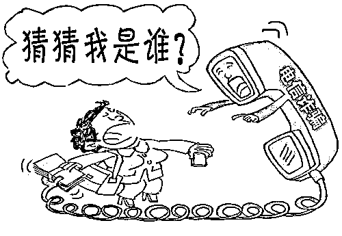

# 电信网络诈骗，就在你身边！

> 原文：[`mp.weixin.qq.com/s?__biz=MzIyMDYwMTk0Mw==&mid=2247502750&idx=4&sn=779f82355db62ad3312ddeb0e246e965&chksm=97cb00a6a0bc89b05f690084badac6509185a5ff916c539a8f0c622dc77a88a6cf36ff560af2&scene=27#wechat_redirect`](http://mp.weixin.qq.com/s?__biz=MzIyMDYwMTk0Mw==&mid=2247502750&idx=4&sn=779f82355db62ad3312ddeb0e246e965&chksm=97cb00a6a0bc89b05f690084badac6509185a5ff916c539a8f0c622dc77a88a6cf36ff560af2&scene=27#wechat_redirect)

**点击上方蓝色字体免费订阅“灰产圈”**

近年来

电信网络诈骗的受害人群

从老年人、受教育程度较低的群体

**逐渐转向更多高收入高学历的群体**

更可怕的是

在低成本与高收益的诱惑下

诈骗手段逐渐从群发式行骗

发展为靶向性精准行骗

**而电信诈骗通常以远程网络化实施**

**这就面临着举证难追赃更难的诸多问题**

公安机关对近年来的真实电信诈骗案例进行了调研统计，总结出了常见的 5 种诈骗类型，一起来学习吧！

注：本篇文章作为昨天发布《[我们做了个调查，写了这篇文章](http://mp.weixin.qq.com/s?__biz=MzIyMDYwMTk0Mw==&mid=2247502658&idx=1&sn=451c2f7eb5f7f3f9a3c46690208746c2&chksm=97cb007aa0bc896c0da366ee0b6f0bb532aee389a5afc381bacb70c612d9ff0d1e3f37de39f1&scene=21#wechat_redirect)》的补充

***虚假消息类***

案例一

小王同学手机收到一条短信，内容是：“尊敬的商户您好！由于购物平台网络系统升级，请您及时点击以下网址认证账号信息，www.meituanrenzheng.com 以免影响正常接单！回复 T 退订”随后小王点开了短信内容中的网址，进入该网站之后按照提示输入账号和密码，随后一步步操作之后，银行卡内余额被洗劫一空。

01 网络平台抽奖扫码诈骗

犯罪分子通过短信、电子邮件等，假冒娱乐节目或知名企业向受害人发送虚假巨额中奖通知，并以“**个人所得税”、“手续费”、“保证金”**等为借口进一步实施连环诈骗。

02 引诱汇款诈骗

犯罪分子以群发短信的方式直接要求对方向某个银行帐户汇入存款，由于受害人正准备汇款，因此**收到此类汇款诈骗信息后，往往不经仔细核实**，就直接把钱款打入骗子账户。

03 引诱贷款诈骗

犯罪分子通过群发信息，称其可为资金短缺者提供小额短期贷款，月息低，无需担保。一旦事主信以为真，**对方即以“预付利息”、“保证金”等名义**实施诈骗。

04 售卖考试真题诈骗

这类诈骗方式成本低、风险小，犯罪分子在各大网站留下联系方式，称能提供考题或答案，**不少考生急于求成，事先交纳预付款至指定账户**，发现被骗也由于理由不正当而不敢选择报警。

05

伪基站诈骗

犯罪分子利用伪基站向广大群众发送网银升级、10086 移动商城兑换现金等虚假链接，一旦受害人点击后便在其手机上植入获取银行账号、密码和手机号的木马，从而进一步实施犯罪。

***警告通报类***

**案例二**

某大学生小王接到自称社保局的工作人员电话，称小王的医保卡使用异常已经被锁卡，如有疑问请拨 9 转人工服务，因涉及切身利益，小王半信半疑的按下了数字键 9，一分钟后，对方回复称小王的医保卡“因使用异常被锁卡”，并要求小王提供姓名、身份证号、医保卡账户等信息，所幸因小王警惕性较高，要求提供其具体办公地址时，诈骗对方察觉挂断了电话。

01 假冒公检法等电话诈骗

犯罪分子冒充公检法工作人员拨打受害人电话，**以事主身份信息被盗用涉嫌洗钱等理由**，要求将其资金转入国家账户配合调查。

02 医保、社保诈骗

犯罪分子冒充医保、社保中心エ作人员，谎称受害人系统出现异常，可能被他人冒用、透支，渉嫌洗钱、制贩毒等犯罪条例，之后冒充司法机关工作人员以公正凋査，便于核査为由，**诱骗受害人向所渭的“安全账户”汇款实施诈骗。**

03 补助、救助、助学金诈骗

犯罪分子冒充民政、残联等単位工作人员，向残疾人员、困难群众、学生家长打电话，**谎称可以领取补助金、教助金、助学金，要其提供银行卡号**，然后以资金到账查询为由，指令其在自动取款机上进入英文界面操作，将钱转走。

04 包裹藏毒诈骗

犯罪分子以事主包裹内被查出毒品为由，**称其涉嫌洗钱犯罪要求事主将钱转到国家安全账户**以便公正调查，从而实施诈骗。

05 虚构绑架诈骗

犯罪分子虚构事主亲友被绑架，如要解救人质需**立即打款到指定账户并不能报警，否则撕票**。当事人往往因情况紧急，不知所措，按照嫌疑人指示将钱款打入账户。

***消费陷阱类***

**案例三**

某女大学生小雪，接到电话称其淘宝账号被盗，已被锁定冻结，需要联系淘宝客服办理激活或解冻，并给出了联系电话，小雪拨打了电话，并按照“工作人员”要求告知了账号、密码、支付密码等信息，后银行卡中的 3000 余元生活费被一扫而空。

01

低价代购诈骗

犯罪分子在微信朋友圈假冒正规微商，以优惠、打折、海外代购等为诱饵，待买家付款后,又以“**商品被海关扣下，要加缴关税**”等为由要求加付款项，一旦获取购货款则失去联系。

02 购物平台退款诈骗

犯罪分子冒充淘宝等购物平台客服**拨打电话或者发送短信谎称受害人拍下的货品缺货，需要退款**，要求购买者提供银行卡号、密码等信息，进而实施诈骗。

03 虚假购物网站诈骗

犯罪分子开设虚假购物网站或淘宝店铺,一旦事主下单购买商品，**便称系统故障，订单出现问题，需要重新激活**。随后，通过 QQ 发送虚假激活网址,受害人填写好淘宝账号、银行卡号、密码及验证码后，卡上金额即被划走。

04

机票改签诈骗

犯罪分子冒充航空公司客服以**“航班取消，提供退票、改签服务”为由**，诱骗购票人员多次进行汇款操作，实施连环诈骗。

05

钓鱼网站诈骗

犯罪分子以银行网银升级为由，要求事主登陆假冒银行的钓鱼网站，进而获取事主银行账户、网银密码及手机交易码等信息实施诈骗。

***情感爱心类***

**案例四**

某高校学生小姚的父母，接到来自小姚同学的 QQ 消息，称小姚因车祸受伤，现在急需手术处理，快转 3000 元手术费过来。小姚父母因爱子心切，就按照要求马上转账，转账过后电话联系小姚发现该生正在上课，原来是 QQ 号被人盗取。

01

冒充 QQ、微信好友诈骗

利用木马程序盗取对方 QQ 密码，截取对方聊天视频资料，熟悉对方情况后，冒充该 QQ 账号主人对其 QQ 好友**以“患重病、出事故”等急需用钱的紧急事情**为由实施诈骗。

02

交友平台伪装身份诈骗

犯罪分子利用各类交友平台“附近的人”功能查看周围朋友情况，伪装成“高富帅”或“白富美”，加好友骗取感情和信任后，**随即以资金紧张、家人有难等各种理由骗取钱财**。

03

虚构交通事故诈骗

犯罪分子虚构受害人亲属或朋友遭遇车祸，**需要紧急处理交通事故为由，要求对方立即转账**。当事人因情况紧急便按照嫌疑人指示将钱款打入指定账户。

04

虚假药品、保健品诈骗

犯罪嫌疑人通过冒充名医、专家在电视、报纸、电话、互联网推广营造“诊疔权威”假象，**在骗取信任后，虚构、夸大受害人病情，高价推荐“三无”药品、保健品**，进而实施诈骗。

05

“猜猜我是谁”诈骗

犯罪分子获取受害者的电话号码和机主姓名后，打电话给受害者，让其“猜猜我是谁”，随后根据受害者所述冒充熟人身份，并声称要来看望受害者。随后，**编造其被“治安拘留”、“交通肇事”等理由，向受害者借钱**，一些受害人没有仔细核实就把钱打入犯罪分子提供的银行卡内。

***收益回报类***

**案例五**

某高校大学生小王看到有一则招聘网络兼职人员信息，即给商家刷信誉的工作，非常清闲，无需押金，并承诺每天至少可赚百元。小王信以为真，便开始刷单，期初每日都能得到返还的本金及佣金，但是从第三单开始，客服就用各种理由推托返现，并要求小王持续刷单。为了拿回本金，小王只能继续刷单，最后刷单金额共计 10000 余元，而此时客服人员也消失的无影无踪。

01

高薪招聘诈骗

犯罪分子通过群发信息，以月工资数万元的高薪招聘某类专业人士为幌子，要求事主到指定地点面试，**随后以培训费、服装费、保证金等名义实施诈骗**。

02

兼职刷单诈骗

诈骗分子首先给应聘者下发两个比较小额的刷单任务，“按照约定”返还本金和佣金，充分赢得应聘者的信任。随后逐渐加大刷单任务的数量和金额，**同时利用“必须刷满 3 单以上才能结算”等理由**，来诱骗应聘者继续投入本金。

03

金融交易诈骗

犯罪分子以某某证券公司名义通过互联网、电话、短信等方式散布虚假个股内幕信息及走势，获取事主信任后，又引导其**在自身的搭建虚假交易平台上购买期货、现货**，从而骗取事主资金。

以上就是蜀黍今天讲的 5 个常见的诈骗类型

希望你们能够认真学习

骗子的最终目的就是为了骗钱

所有涉及到转账的事情时

一定要三思而后行

**时刻做到不听！不信！不转账！**

**#转发给身边的朋友吧#**

来源：天天防诈骗、深圳市反电信网络诈骗中心，深圳罗湖公安

← 向右滑动与灰产圈互动交流 →

**点击****阅读原文****加入灰产圈高端社群**

