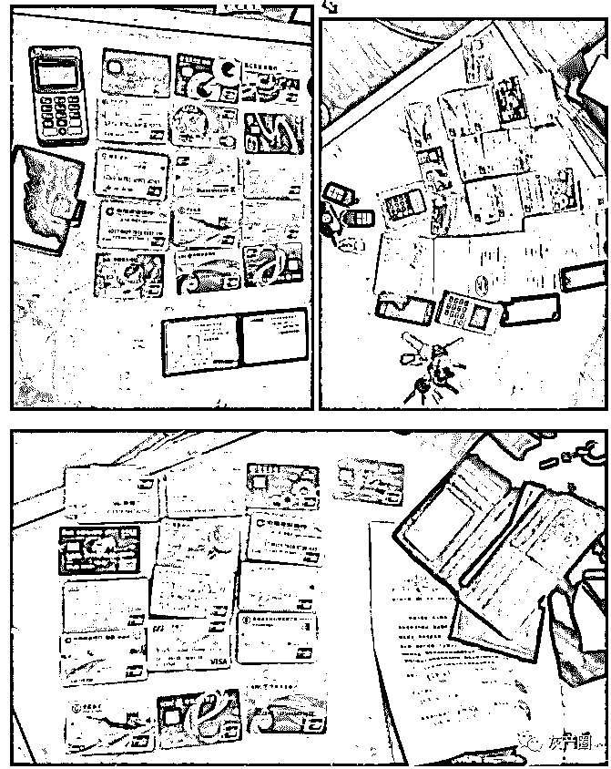

# 特大跨境“杀猪盘”遭严打！涉案 2 亿！有股民血亏超百万！

> 原文：[`mp.weixin.qq.com/s?__biz=MzIyMDYwMTk0Mw==&mid=2247502859&idx=1&sn=db87fb63ddc04f4f5a6850beca44650d&chksm=97cb0733a0bc8e25a53ae3bc55eb225731f1dfbe0348104c4836b711eec459d5ff4b5c0f4ec2&scene=27#wechat_redirect`](http://mp.weixin.qq.com/s?__biz=MzIyMDYwMTk0Mw==&mid=2247502859&idx=1&sn=db87fb63ddc04f4f5a6850beca44650d&chksm=97cb0733a0bc8e25a53ae3bc55eb225731f1dfbe0348104c4836b711eec459d5ff4b5c0f4ec2&scene=27#wechat_redirect)

**导语**

“杀猪盘”事件屡屡上演，部分投资者可谓深受其害。近日，贵阳警方便破获一起涉案金额超 2 亿的跨境诈骗案！

贵阳市公安局白云分局 10 日披露，贵阳市、区两级公安机关，成功对一“杀猪盘”类跨国特大电信网络诈骗犯罪团伙进行了全链条打击，该案涉案金额超 2 亿元。截至目前，警方先后抓获 70 名团伙犯罪嫌疑人。

**特大跨境“杀猪盘”遭严打！**

**涉案金额超 2 亿元**

电信网络诈骗一直让老百姓防不胜防！无意中就会中了骗子的圈套上当受骗。与此同时 ，电信网络诈骗方式层出不穷，使得打击难度大，案件侦查难度高。但，犯我百姓者虽远必诛！白云公安分局于近期成功全链条打掉一电信网络诈骗团伙，破获涉案金额超过 2 亿的部督案件。

2020 年 6 月 28 日，白云公安分局接到报警人鲜某某报称：2020 年 5 月中旬，其朋友周某邀请其进入一个微信股票群（群昵称：知行合一 1**2），群里面有老师讲解金融知识，后该老师便叫大家操作购买 A 股，大概半个月左右，该老师便带领大家操作港股。

6 月 22 日股票开盘，其发现购买的纵横游控股 0***9（港股）这支股票暴跌，其账户里面的钱元全部赔完，06 月 24 日其发现股票平台不能进入，发现被骗报警。

港股纵横游控股行情走势图显示，平时波动极小，且成交相当稀少，2020 年 6 月之前的一段时间单日成交甚至不足 10 万港元，但是自 6 月中旬开始，成交量开始明显放大，股价也有一定上涨。但 6 月 22 日当天开盘后不久，股价短时间内出现闪崩，盘中跌幅一度接近 50%，截至当天收盘，股价仍下跌 20.39%，之前几个交易日追高的投资者在这一天损失惨重。

**窝点隐藏较深**

**分布在多个省份**

贵阳警方认定该线索警情重大、案情特殊,立即抽调精干警力成立专案组,全力开展案件攻坚。专案组民警通过侦查发现一条完整的“杀猪盘”电信诈骗犯罪链条,其团伙成员分布在中国多地,从用于实施电信诈骗的电子平台、话务员到话术剧本和洗钱的整个流程,分工明确,人员众多。

抓捕现场

押解回筑

2020 年 7 月 20 日，抓捕行动由白云分局党委亲自挂帅指挥在河南郑州、湖南长沙、湖南岳阳、陕西西安、深圳，五地联动、同步收网抓获犯罪嫌疑人 12 人。

8 月 10 日专案组成员又在广东广州、宁夏银川抓捕犯罪嫌疑人 53 人。

在抓获的犯罪嫌疑人中,含 3 名缅甸窝点入境的犯罪嫌疑人。

在捣毁的 7 个作案窝点中,警方收缴作案电脑 60 余台、作案手机 130 余部、作案手机电话卡上千张及大量话术剧本等作案工具,冻结涉案资金 200 余万元。

2020 年 7 月 20 日至今，在分局党委的指挥调度下，联合贵阳市公安局侦防分中心、网安支队、多警种多部门，多地联动一举捣毁位于河南郑州、湖南长沙、湖南岳阳、陕西西安、深圳、宁夏银川、广东广州的七个“杀猪盘”类电信网络诈骗犯罪窝点。

据犯罪嫌疑人交代，其为非法获取巨额经济利益，租赁办公场所并组织招募多名人员组建诈骗窝点实施网络投资诈骗。

抓获实施“杀猪盘”类犯罪编程搭建平台的犯罪嫌疑人 10 名，实施电信网络诈骗犯罪洗钱组犯罪嫌疑人 5 名，实施“杀猪盘”类犯罪的“养猪”话务窝点犯罪嫌疑人 40 名，已对这 55 名犯罪嫌疑人采取强制措施，捣毁作案窝点 7 个，共收缴作案电脑 60 余台、作案手机 130 余部、作案手机电话卡上千张，以及大量话术剧本等作案工具，冻结涉案资金 200 余万元。

后又在中山、抚顺、大连等地陆续抓获涉嫌盗卖 QQ、微信、受害人个人信息的犯罪嫌疑人 5 名。已抓获人员中，缅甸窝点入境人员 3 名。涉案金额高达 2 亿多元人民币，串并破获相关案件 200 余起。

**骗子“话术本”曝光**

以下是警方曝光一下的传说中的骗子“话术本”（只限“曝光”，不准模仿！！！）

**警方提醒：**

1、网络世界是虚拟的，对方是否是“白富美”“高富帅”很难甄别，望广大市民树立正确的婚恋观。

2、接到自称是“投资专家”“投资平台工作人员”等加好友拉你进入股票、虚拟货币等平台转账投资的均是诈骗。

3、请广大市民保持清醒头脑，“牛市”“微投入高收入”都是犯罪分子设计好的骗局，“炒股群”“虚拟货币投资群”群内除了被害人，其他全都是诈骗分子。

不要轻信陌生网友口中的“投资理财稳赚不赔”，如遇诈骗，一定要及时报警。

**近期 A 股出现多次杀猪盘**

9 月 28 日，中路股份低开并迅速跌停，随后打开跌停板，不过在小幅反弹后，又再次跌停，全天收报 10.06 元/股，仍有 1.68 万手封单牢牢封死在跌停板上。

值得注意的是，上一个交易日（9 月 25 日），中路股份股价在 11:28 突然异动，直线拉升，当日盘中最高涨幅超过 6%。在 9 月 25 日最高点买入的投资者，最高损失将达 16%以上。有投资者表示遭遇“杀猪盘”。

在股吧，有投资者反应这是一起杀猪盘。

上市公司珠江实业也出现“杀猪盘”。公司 9 月 28 日发布公告表示，市场上存在有人利用社交媒体推荐买入公司股票的情况，公司、控股股东等与该事件无任何关联关系。

股吧里，部分投资者表示，是被一个叫李文彬的人骗了。

今年 9 月 21 日，有不少投资者在股吧上反映，疑似遭遇“杀猪盘”，涉及抖音上一个名为“安民”的播主。行情数据显示，当天 13:30 分左右开始，日内表现平稳的我乐家居股价急速跳水，在仅约 10 分钟的时间里被打至跌停。

此外，嘉美包装、泰嘉股份、中源家居、松霖科技等多只股票也疑似出现“杀猪盘”。比如泰嘉股份就在公告中明确提及，公司收到多位投资者反映，市场上存在有人利用微信群等方式向股民推荐买入本公司股票的情形。

在 9 月 18 日证监会新闻发布会上，证监会表示已部署开展专项整治行动，严厉打击“股市黑嘴”“非法荐股”“场外配资”及相关“黑群”“黑 APP”。

证监会称，“股市黑嘴”“非法荐股”“场外配资”等违法活动是资本市场的“毒瘤”，严重扰乱证券市场秩序，损害投资者合法权益，证监会对此始终保持“零容忍”态度，坚决持续予以打击。近期，舆论反映上述违法活动开始抬头，依托“黑群”“黑 APP”展业，手段不断翻新，形式更加隐蔽，投资者容易上当受骗。针对上述问题，证监会部署派出机构启动了为期三个月的专项整治行动，对相关黑色产业链重拳出击。

其中，“非法荐股”和“黑群”“黑 APP”均为重点打击的违法活动。

“非法荐股”：是指无资格机构和个人向投资者或客户提供证券投资分析、预测或建议等直接或间接有偿咨询服务的活动。行为模式主要包括网络直播荐股、微博微信荐股、软件荐股、培训荐股等。根据《证券法》规定，上述行为涉嫌非法经营证券业务。

“黑群”“黑 APP”：不法分子为开展上述违法活动，借助微信、QQ、微博等工具创建群聊，或开发上线 APP 等，用于宣传、引流或招揽客户，甚至直接从事相关违法活动。根据《证券法》规定，“黑群”“黑 APP”等传播媒介也可能涉嫌编造传播虚假信息或者误导性信息，扰乱证券市场等。

来源：中国基金报

← 向右滑动与灰产圈互动交流 →

