# 揭秘游戏账号交易诈骗灰产：冒充客服换绑拉黑 游戏公司躺枪

> 原文：[`mp.weixin.qq.com/s?__biz=MzIyMDYwMTk0Mw==&mid=2247502859&idx=3&sn=8f3e3c7aac659f79ea549c3eef40a76d&chksm=97cb0733a0bc8e25957596ef77c905b3e0c5991976aef7f1b67bc05105d71660fe9da526ee98&scene=27#wechat_redirect`](http://mp.weixin.qq.com/s?__biz=MzIyMDYwMTk0Mw==&mid=2247502859&idx=3&sn=8f3e3c7aac659f79ea549c3eef40a76d&chksm=97cb0733a0bc8e25957596ef77c905b3e0c5991976aef7f1b67bc05105d71660fe9da526ee98&scene=27#wechat_redirect)

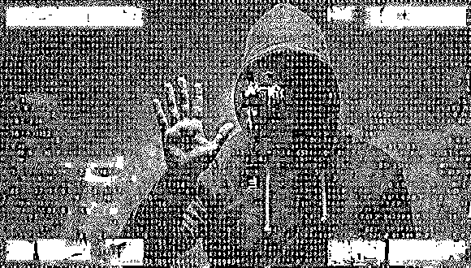虽然游戏账号不是传统的有形财产，但是它会因其稀有性和特殊性产生交易需求和市场需求，属于虚拟的消费品，有一定的市场价值，因此游戏账号也属于个人的虚拟财产。

"高价购买游戏账号中招被骗数万"、"男子出售游戏账号收款后恶意找回"，近一段时间，有关游戏账号交易的诈骗案件频繁出现。

随着网络游戏产业的发展，一些新玩家为了尽快升级、得到装备，不惜直接氪金购买成熟的游戏账号；另有已在其中投入大量时间精力的老玩家，期待将自己的账号卖出高价。

据媒体报道，目前的游戏账号交易主要依赖三种方式：以网易藏宝阁为代表的官方线上交易平台、以交易猫、淘手游等为代表的第三方线上交易平台和私下交易。然而官方平台数量不多，且会收取手续费，因此大多数交易会在第三方平台中进行。

由此催生出大量不法分子，借口买卖账号，完成交易后进行账号的换绑、找回从而实施网络诈骗。更有甚者借助"客服"进行团伙作案，将交易对象诱导至社交平台，并在骗得所谓的押金和过户费后一走了之。

北京市中闻律师事务所律师罗卿认为，游戏账号属于个人的虚拟财产，"买家"是以非法占有为目的，以"买"为名骗取了游戏账号，并没有支付相应的市场对价，属于典型的诈骗行为。对于有交易需求的人来说，建议选择正规交易平台，并在交易过程中保存好沟通的聊天记录、交易过程的文字、录音等相关证据，一旦不慎遭遇诈骗可以选择报案。

**虚假客服在线诈骗**

游戏账号交易已形成较大的市场。

7 月 30 日，中国音数协游戏工委(GPC)与中国游戏产业研究院联合发布的《中国游戏产业报告》显示，2020 年上半年，中国游戏市场实际销售收入达到 1394.93 亿元，同比增长 22.34%。其中手游的实际销售收入达到了 1046.73 亿元，同比增长 35.81%。

对于在游戏中投入过大量金钱和时间的玩家来说，一旦对游戏失去了兴趣，亦或是因工作或生活原因无法再在其中投入时间，去进行游戏账号的交易便成为了一个较为普遍的选择。

据淘手游的公开数据，2019 年 12 月仅王者荣耀的账号交易额就达到 765 万元，订单数量超 1 万笔。而账号的价值也高低错落，在交易猫平台中梦幻西游的一个账号最高售价为 12 万，王者荣耀更是存在数个标价 100 万的账号。

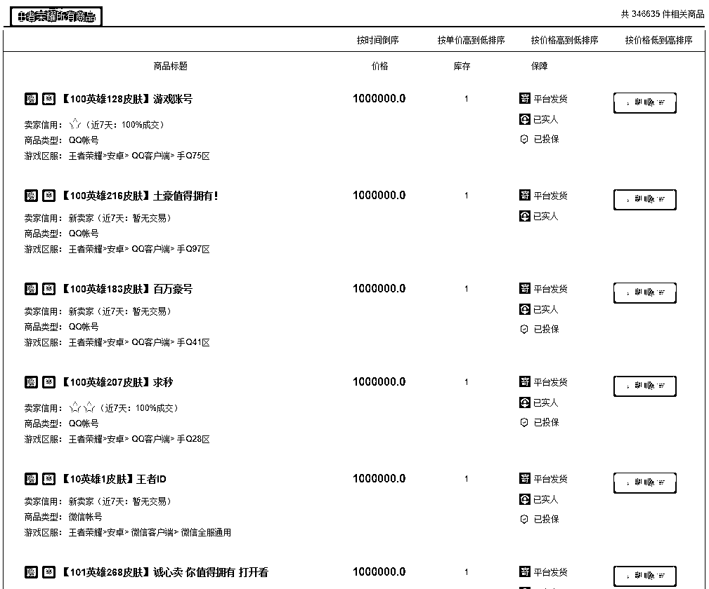

骗子已瞄准账号交易市场。

"如果是在交易猫平台上的话还好处理，因为有记录，这种私下骗子连人家是谁都不知道，现在也追不回了。"小王在接受雷达财经采访时感叹道。

小王在交易猫平台中出售自己的账号，对方谎称是购买者，要求小王转至 QQ 平台进行交易。后在 QQ 对话的过程中，对方向小王发送了一个链接，并表示会有客服人员和小王接洽。

"客服"称，进行游戏账号交易需要缴纳"安全过户费"，防止小王在交易途中恶意找回账号，还表示这是官方规定的交易流程。正当小王答应提交过户费时，客服再次提出，还需要缴纳押金，办理安全包赔业务，并称确保安全交易后的 5-10 分钟内系统会将出售账号所得费用+安全过户费+押金全数退还。

"钱打过去就被拉黑了，交易猫上的订单交易都没显示成功。一开始本来不想给钱的，后来对方一直催就给过去了，现在这钱是没了。"

通过小王提供的信息，雷达财经找到了"阴阳师防骗主页"的微博，其中以图片的形式详细给出了一位卖家与"客服"沟通的全过程。

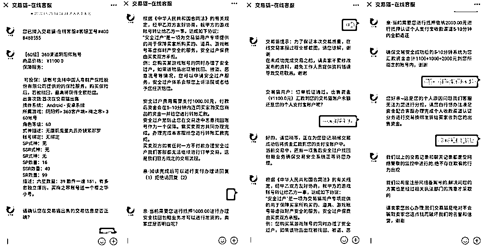

值得一提的是，通过微信查找转账记录后，其显示的到账商户名称为北京畅游时代数码技术有限公司。天眼查显示，该公司成立于 2007 年，注册资本 1000 万人民币，隶属搜狐旗下，曾开发出"天龙八部"、"刀剑斗神传"等游戏。

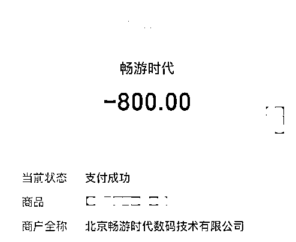

雷达财经以受害者身份致电北京畅游时代数码技术有限公司，工作人员回应称此事与公司无关。

"你可能是遇到了电信诈骗，骗子的常用手段就是在交易猫或者其他的第三方平台上把客户诱导到私域进行交易，随后提供链接，并要求对方出示验证码等信息，之后钱可能就被划走了。"该工作人员表示。

对此罗卿律师表示，依据上述案情分析，应是行骗者假意卖自己的账号，以交易平台客服的名义骗取受害者的信任，受害者误以为转账的对象是交易平台或者卖账号的人，将款汇入了对方提供的指定账号中。因网游公司并不知情，故不需要承担诈骗罪的刑事责任。

"但网游公司还是应当在游戏中尽到合理的提示义务，比如在注册账号的合同条款、游戏中设置提醒等，未尽到适度管理和提示义务的，受骗者也可以要求涉事公司承担一定的民事责任。"

除了微信等社交平台，骗子还可能直接利用短信为"客服"导流。

小陈于今年 8 月将自己的梦幻西游账号挂在"交易猫"上，售价 2999 元。没过多久，便有买家来咨询，还不断进行压价。"这个骗子通过还价，让我感觉他是个正常买家"，小陈称。

两人对话过程中，对方向小陈索要了手机号，随后发信息说自己已经将账号拍下来了，与此同时小陈收到了一条短信。

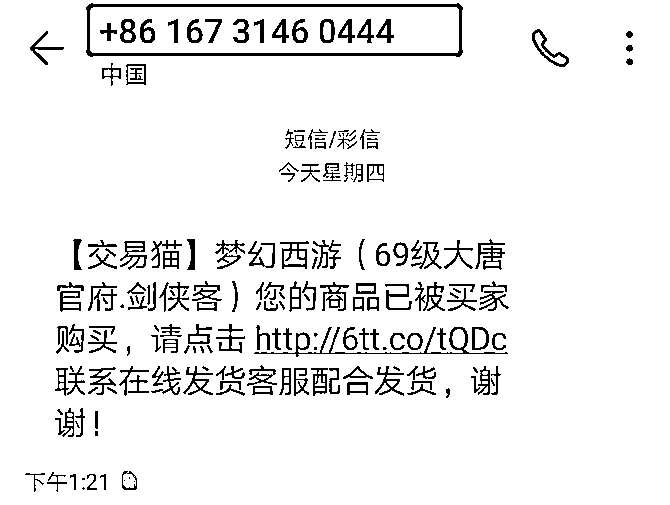

小陈提供的图片显示，该短信并非由游戏账号交易平台官方发送。然而急于卖掉账号的小陈一时并没注意到这一点。"我当时想去找客服，但交易猫这个软件人工的入口非常难找，再加上骗子一直催我发货，就直接去点了短信里的链接"。

点击进入链接后，自称为"猫猫"的"客服人员"开始向小陈索要账号密码、短信验证码，在小陈发出"这些信息之前不是填过吗"的疑问后，"客服"表示这是为了确认本人在操作。

确认信息后，"客服"让小陈下架商品避免第二次被买走，小陈翻看 App 后发现并无任何交易痕迹，而后注意到了短信发件人的情况，此时才意识到自己上当了。

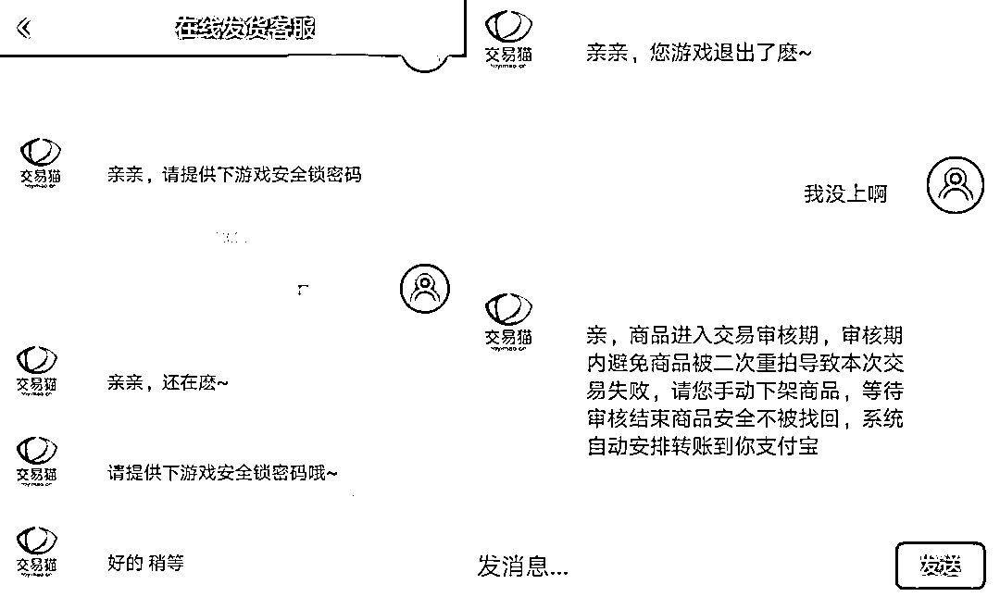

再去登陆账户的时候，小陈发现自己的密码已经被修改，不得已联系游戏客服走上了申诉之路。

"我当时在看股市，对卖号心不在焉，想赶紧解决，再加上对交易猫平台确实不熟悉，一系列的巧合之下就把自己坑了进去。"小陈遗憾地说。

**换绑找回一键拉黑**

而在账号交易诈骗中，另一大手法是利用账号找回功能进行诈骗。

9 月 11 日，江苏省靖江市人民检察院公布了一封刑事判决书。经查，被告人孙有文于 2020 年 1 月 19 日通过"交易猫"游戏交易平台假意出售其绑定"和平精英"等游戏账号的微信号，待收到对方交易资金后，利用微信账号找回功能获取上述账号等方式，实施网络诈骗，骗得顾某 10500 元。

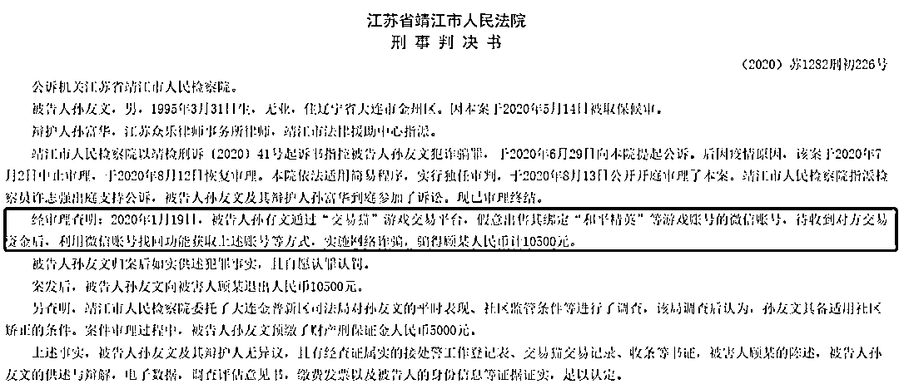

无独有偶，9 月 7 日河北省张家口市万全区人民法院经审理查明，被告人王森波于今年 1 月底以 9000 元的价格在"交易猫"平台出售自己的梦幻西游账号给阎某，交易完毕后阎某将游戏账号变更为自己的手机号码。

然而几天后的 2 月 3 日，王森波却以游戏账号被盗为由，向 OPPO 平台申诉，并于当日将卖给阎某的游戏账号找回。在修改了绑定的手机号和密码后，王森波将阎某的微信拉黑，致使阎某无法再正常使用其游戏账号。

最终，孙有文被判有期徒刑 8 个月，缓刑一年，并处罚金 5000 元人民币；王森波被判有期徒刑 6 个月，缓刑一年，并处罚金 2000 元人民币。

游戏账号绑定手机号或微信号登陆的特殊性，给了不法分子可乘之机，除买家外，卖家亦会在交易的过程中面临风险。

在另一起案件中，彭某与侯某在交易猫中相识。二人商议后决定彭某将以 23000 元的价格购买侯某手中的 CF 穿越火线账号。

但此后彭某却利用自己在百度贴吧中获取的他人身份证明视频发给侯某，骗取侯某信任。最终，顺利拿到账号的彭某并未履行此前与侯某约定的 23000 元交易，而是直接将侯某的 QQ 号删除。

经法院审理决定，判处彭某有期徒刑一年，缓刑一年零六个月，并处罚金 20000 元。

**投诉高企客服难觅**

在发生诈骗后，平台是受害者最后的保障，然而受害者很难联系到平台。

公开资料显示，交易猫是阿里互娱旗下游戏交易平台，隶属于广州交易猫信息技术有限公司。2013 年 7 月 6 日正式上线运营后主要给热门手机网游提供游戏币、装备、账号等游戏交易服务，可交易涵盖国内 IOS，Android 等主流手机操作系统以及 UC、360 和 91 等多个游戏渠道登陆账号。

目前，交易猫在黑猫投诉平台和聚投诉平台中的投诉量已分别达 35305、7904 个，相较而言，同为第三方游戏账号交易平台的淘手游在两个平台中的投诉量仅为 7602、2137 个，而 5173 的投诉量则是 1425、614。

在黑猫投诉的红黑榜上，交易猫已登上周榜的第二位。值得一提的是，前八位中的淘宝、天猫、闲鱼、天猫超市和飞猪，包括交易猫，均为阿里系产品。

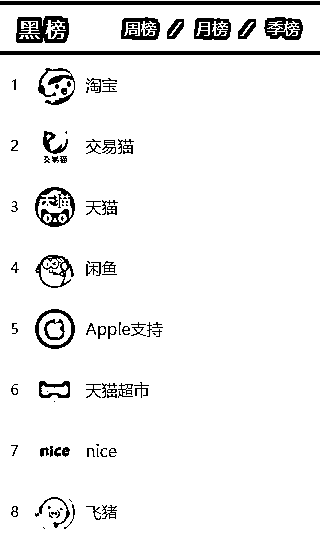

此外，雷达财经以"交易猫"为关键词在中国裁判文书网中进行搜索，共检索到 151 篇文书，时间跨度由 2015 年至今，遍布河北、山西、江苏等逾十个省份。其中除 17 起撤诉和 12 起因管辖范围错误进行案件转移外，其余多数纠纷、诈骗案件均以交易猫平台为基点展开。

除了诈骗问题外，客服亦是交易猫问题的重灾区。

据黑猫投诉用户反映，客服的拖延和失踪令他们无法忍受。"有仲裁客服说是两天接受，实际上足足等了七天"、"22 个小时前买的账号一直待发货，客服联系不上也没处理这事，点击联系还一直出错"、"客服对提供的证据无视"、"永远找不到人工客服"……

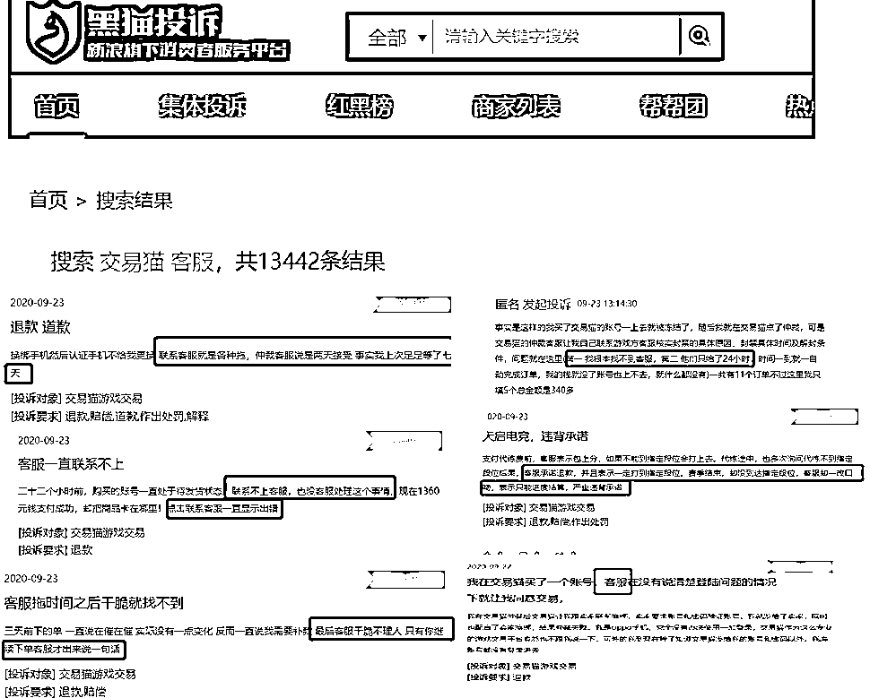

雷达财经注意到，交易猫 App 中的客服以自助为主，即使点击在线客服后，帮助中心也只能根据用户打出的关键词回复相应词条。而输入"人工"或"人工客服"等关键字并不能直接呼唤出真正的人工客服，系统会第一时间弹出有订单/无订单的选择框，接下来无论怎么选择最后都只会跳到固定回答。

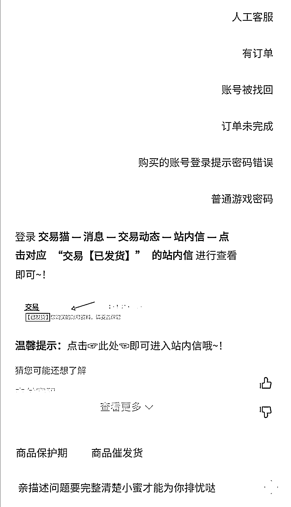

而在交易猫的官网中，"联系我们"只显示了在线客服、商务合作的邮箱和友情链接的 QQ 三种联系方式，其中在线客服与 App 中的情况完全一致。

雷达财经在天眼查中找到了广州交易猫信息技术有限公司的电话号码，但与该公司电话相同的企业竟有 39 家。尝试拨打后，该电话拨通后的智能语音却在介绍 UC 产品的咨询渠道，几番周转后仍屡次显示分机号码无人应答。据股权穿透图，该公司的实控人疑似为何小鹏，现小鹏汽车董事长，UC 联合创始人。

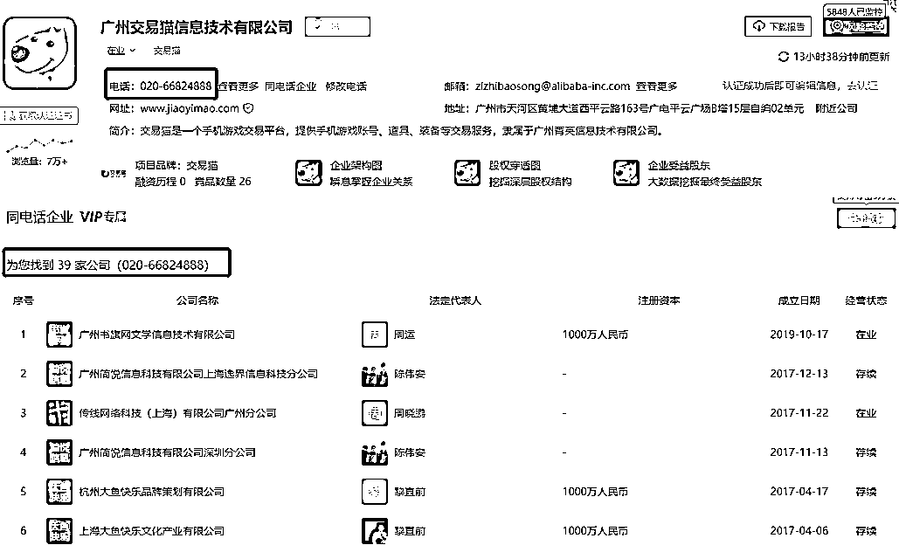

**律师：以"买"为名骗取游戏账号 属于典型诈骗行为**

游戏账号是否属于财产？对此，罗卿律师向雷达财经表示，虽然游戏账号不是传统的有形财产，但是它会因其稀有性和特殊性产生交易需求和市场需求，属于虚拟的消费品，有一定的市场价值，因此游戏账号也属于个人的虚拟财产。

卖家出售游戏账号，相当于把账号内所包含的权益和继续使用该账号的权利出让给了买家，买家对此应当支付相应的市场对价。但上述案件中的"买家"是以非法占有为目的，以"买"为名骗取了游戏账号，并没有支付相应的市场对价，属于典型的诈骗行为。

罗卿还称，目前游戏玩家选择在交易平台上或私下交易都是合法的。但对于交易双方而言，首先要选择正规交易平台，第二是可以在交易过程中保存好沟通的聊天记录、交易过程的文字、录音等相关证据，一旦不慎遭遇诈骗可以选择报案。

以北京为例，诈骗财物损失 5000 元就达到刑事立案标准，可能构成犯罪。如果不足 5000 元的，可以根据《治安管理处罚法》来处罚，处 5 日以上 15 日以下拘留，可以并处 500-1000 元罚款。

← 向右滑动与灰产圈互动交流 →

