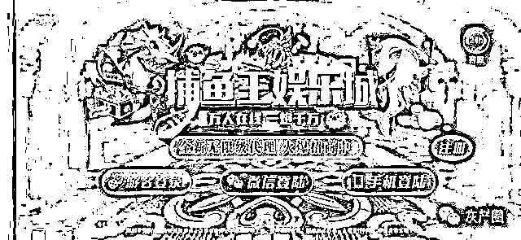
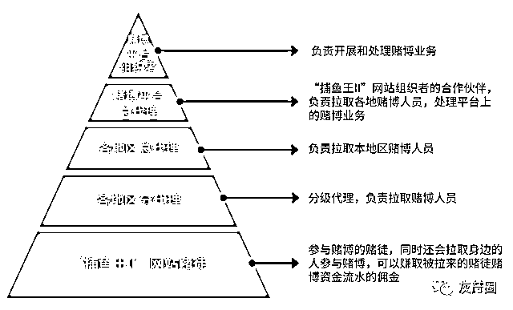
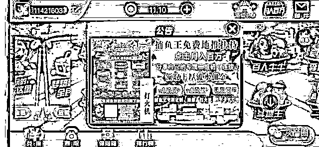
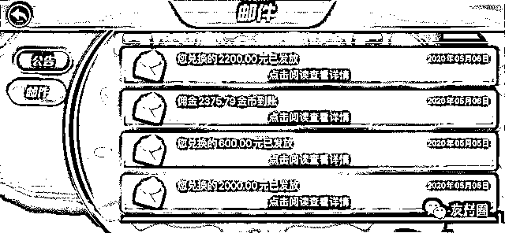
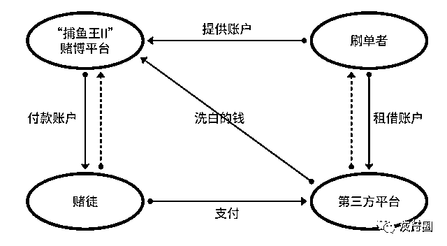
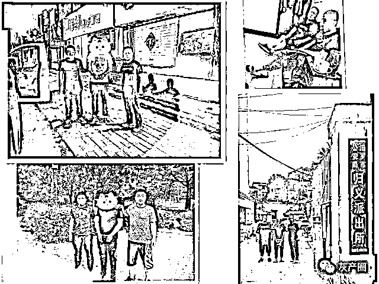
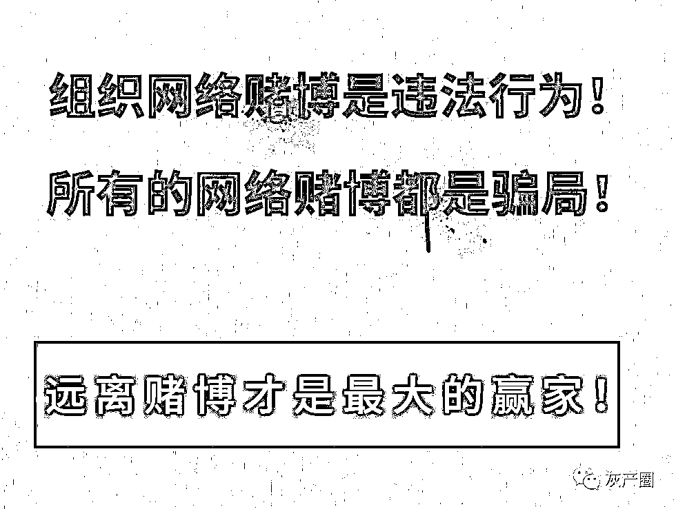

# 捕鱼游戏涉赌案告破！佣金诱饵刺浮，财尽途毁囹圄！

> 原文：[`mp.weixin.qq.com/s?__biz=MzIyMDYwMTk0Mw==&mid=2247502859&idx=5&sn=d30b050437597f4304c5fe845b04f4bb&chksm=97cb0733a0bc8e259b3253f4ea66476ee0ecd0eb76bb291604c66535a20a249fdcaed7e19c5a&scene=27#wechat_redirect`](http://mp.weixin.qq.com/s?__biz=MzIyMDYwMTk0Mw==&mid=2247502859&idx=5&sn=d30b050437597f4304c5fe845b04f4bb&chksm=97cb0733a0bc8e259b3253f4ea66476ee0ecd0eb76bb291604c66535a20a249fdcaed7e19c5a&scene=27#wechat_redirect)

点击上方**灰产圈**关注我们

**导语**

近日，衡水市公安局滨湖新区分局成功打掉一网上开设赌场的特大团伙，该团伙仅衡水涉案网络账户就达 1000 余个，山东临沂涉案网络账户达 5900 余个。公安机关已经依法对 16 名涉案犯罪嫌疑人依法执行刑事拘留，并进一步侦查该案涉及的洗钱、上级代理、平台组织者等违法犯罪情况。

据查，参与赌博的人员中除了个别组织者借此非法获利外，多数玩家输钱，更有不少玩家因此负债累累甚至倾家荡产、亲友离散，社会影响极其恶劣。随着民警的深入侦查和部分犯罪嫌疑人的到案，逐渐揭开了这个赌博网站的神秘面纱。

**平台伪装引诱，贪利蠢蠢试水**

据了解，该赌博网站名为“捕鱼王Ⅱ”，为了吸引更多的人员参与赌博和发展各级代理，该网站采取传销拉人模式。

“捕鱼王 II”代理模式。

一旦注册成该赌博平台的会员后，绝大多数人都会抱着试试手气的想法赌上几把，小赌获利后赌注渐大，结果十赌九输。当你开始输钱后，发展你成为会员的上线就会告诉你：

"如果继续推广发展更多的会员，你所发展的会员参与赌博产生资金流水，你可以拿到佣金。而且你的下线发展下线，只要是你的下线，不管几级，参与赌博产生的资金流水，你都会分得相应的佣金提成。你的下线参赌人越多，产生的资金流水越多，你挣的佣金就越多。"

就这样，“捕鱼王Ⅱ”赌博平台上的会员呈金字塔式增长，并且不少人每天在游戏界面上通报挣取佣金的排名，多的每天可以挣取佣金 20 余万元，借此吸引更多的人冒着违法犯罪的风险加入其中。

衡水总代理张某从 2019 年 12 月底到今年案发，仅几个月的时间，就发展 1000 余人，而张某从中牟利 24 万余元；山东临沂刘某是张某的”上线“，在不到半年时间内发展会员 5900 余人，从中牟利 26 万余元。这二人仅仅是两个地级市的代理。

**花式刺激玩家，期取高额流水**

平台为了刺激玩家参与赌博，产生高额资金流水，平台经常鼓励各级代理，将一些爱赌、有钱的玩家拉进一个群，并且经常请这些大玩家吃喝，以刺激玩家。

代理宁某，疯狂充钱赌博，在家人不知情的情况下，把自己的钱输完了，向家里要钱无果后，他便到银行办理了三张信用卡，然后每张卡透支 18 万元用于赌博充值，三张卡就透支 54 万元。在其上级代理的教唆下，用他的下线建了几个小号，然后用小号疯狂赌博，挣取自己赌博资金流水的佣金。宁某仅靠自己小号产生的佣金就达 35 万余元，结果这 35 万的佣金也被全部输掉，仅这两项宁某就输掉 90 余万元。宁某疯狂赌博产生的佣金其上线代理都能受益，甚至平台上有客服人员专门与其对接，不定期的给他发点金币做为福利，促其继续赌博。

**佣金诱饵刺浮，财尽途毁囹圄**

经核实，该“捕鱼王Ⅱ”赌博平台获利方式是不管你采取何种赌博方式，都会在每局赌博中抽取赢家所赢金额的 5%。另外，平台为了让参赌人员上瘾，一般都是刚玩的时候会有所控制的让玩家多有赢利，玩家一看真能赚钱，便开始加大赌注，结果会输的一败涂地，而大多数的玩家都有想把输的钱捞回来的思想，总想着玩把大的把之前输的一下子捞回来，岂知越陷越深。、

代理陈某有正式工作，一开始只是抱着试试看的态度，先赌小的，结果赌了几把，赢了几个小钱后就逐渐增加筹码，越玩越大，结果一下子输了好几万。这时陈某感觉到自己被赌博网站骗了，一度想跳楼自杀，后又幻想把输的钱捞回来，便开始发展下线成为代理。结果把平台返给他的 5 万余元佣金输掉后，又输了 10 余万元，下步面临判刑的他不仅工作不保，还欠了一屁股外债。因疫情原因，办案民警刚为其办了取保，不到两小时便发现其有自杀的迹象，后经办案人员多方找寻，终于成功挽回其生命，同时寻机做思想工作，使其打消了自杀念头。

**刷单转账挣钱，却系帮助犯罪**

赌博平台管理人员为了逃避打击，所有的转账均不用自己的账户，所有的充值、返现都是通过第三方公司或平台来做，有的人平时接兼职为他们转转账，刷几笔单就能挣钱，殊不知，他们已经走上了犯罪的道路。

洗钱模式。 湖南汩罗的何某因赌博欠下几百万的债务，后经人介绍接了一份“替人转账挣钱”的活——他用自己和母亲的身份证分别注册了多张银行卡，把卡号提供给其上线，然后每天用这些银行卡收钱，当收到一定额度后，其上线便让其把账户上的钱转走，而他从中挣取千分之五的提成。山东新泰的赵某和张某，根据一个刷单平台的指使，四处收购营业执照用于注册企业支付宝，每张营业执照注册 11 个支付宝，然后用这些支付宝根据平台的指示每天刷单转账，从中挣取提成。

更有部分公民为了挣点“外快”，用自己或亲友的身份证注册银行卡出售给不法之徒使用，这些行为实际上都涉嫌构成赌博罪或帮助信息网络犯罪活动罪，是要被追究法律责任的。

经过工作，警方已于日前赴山东、湖南、四川等地抓获犯罪嫌疑人，案件仍在进一步侦办中。

来源：支付界（ID：payworld）

← 向右滑动与灰产圈互动交流 →

