# “仙人跳”背后有什么黑色产业链？

> 原文：[`mp.weixin.qq.com/s?__biz=MzIyMDYwMTk0Mw==&mid=2247502971&idx=1&sn=2be5fdf1da1cf35ae513971fe905bc70&chksm=97cb0743a0bc8e555366e34ff934e91bb6fdc7a2111df4334af2d26ac6dcb15d0feb1707983f&scene=27#wechat_redirect`](http://mp.weixin.qq.com/s?__biz=MzIyMDYwMTk0Mw==&mid=2247502971&idx=1&sn=2be5fdf1da1cf35ae513971fe905bc70&chksm=97cb0743a0bc8e555366e34ff934e91bb6fdc7a2111df4334af2d26ac6dcb15d0feb1707983f&scene=27#wechat_redirect)

点击蓝字“**灰产圈**”关注我们！

**导语**

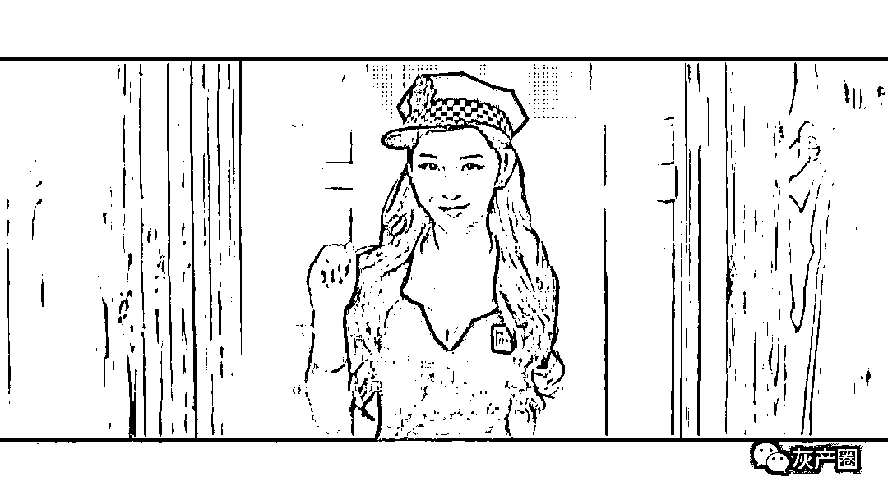  

仙人跳，指的就是先由女生抛头露面，招揽客人。再让幕后老板进行敲诈勒索，进而赚到一大笔钱的违法行为。 

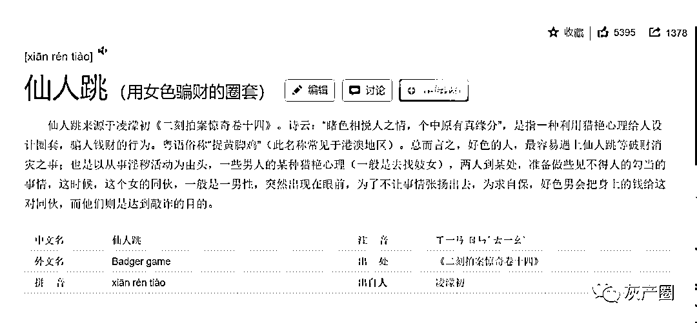

以上来自百度百科

**仙人跳背后的黑色产业链**

# 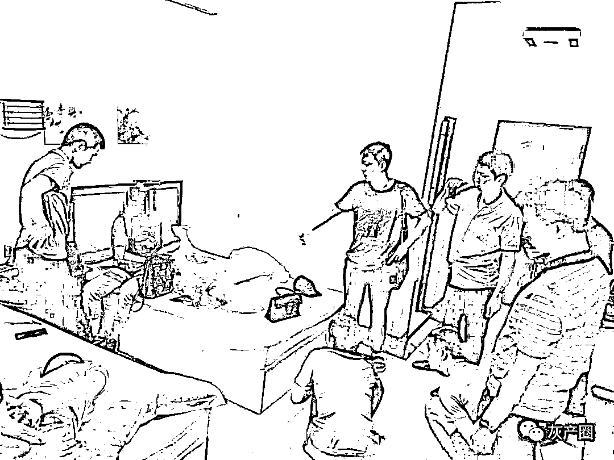

仙人跳一般是 7、8 个人组成。其中，貌美的小姐一名，幕后大哥一名，“司机”一名，其余都是打手。一般来说，仙人跳的过程分为两种。

**第一种，是女生带男子进入房中后，趁男子洗澡的功夫，给同伙打电话。拍下男子的照片，对其敲诈；**

**第二种，则是事成之后，趁男子休息的时候，给同伙打电话，进而敲诈。**

一般来说，仙人跳成功的几率很高。因为这本身就是违法行为，对方光脚不怕穿鞋的。但是受害者往往要考虑颜面、家庭和事业。只能退而求其次，甘心被敲诈还不敢报警。

而那帮违法分子，就是看准了受害人的这种心态，才敢肆无忌惮地从事犯罪活动。

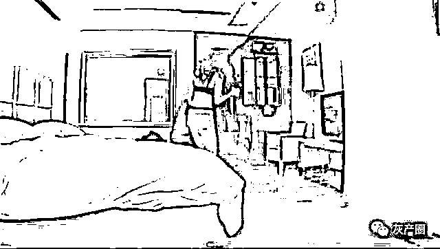

除了团队本身的黑色产业链，他们还有一个重要的**“同伙”**，就是快捷酒店。

说是同伙，也许有点偏颇。但一般这种事情，都发生在快捷酒店。但凡有点阅历的，都知道你开了房间后，没多久有人就会往屋里扔**“小卡片”**。

一些耐不住寂寞的男子，可能就会打卡片上的电话，最后就被仙人跳了。那为什么酒店不管这件事呢？答案是，大多数酒店都是“默许”的。

这个想想也能理解，从事仙人跳的都是本地人，肯定有一定的**人脉势力**。酒店如果砸了他们的生意，没准就会遭到报复，所以酒店都是睁一只眼，闭一只眼。

我还亲眼见过，**保洁阿姨**从一个男的手里接下卡片，按个房间塞。也许，他们也收买了一些工作人员，帮他们完成仙人跳。这里面的每个环节，都是黑色产业链。

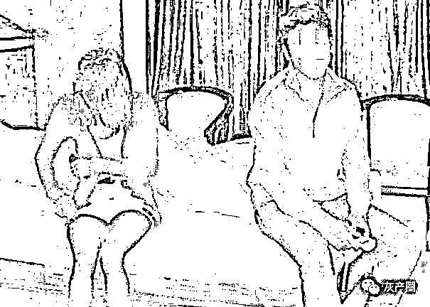

**我讲个我朋友的真实经历**

# 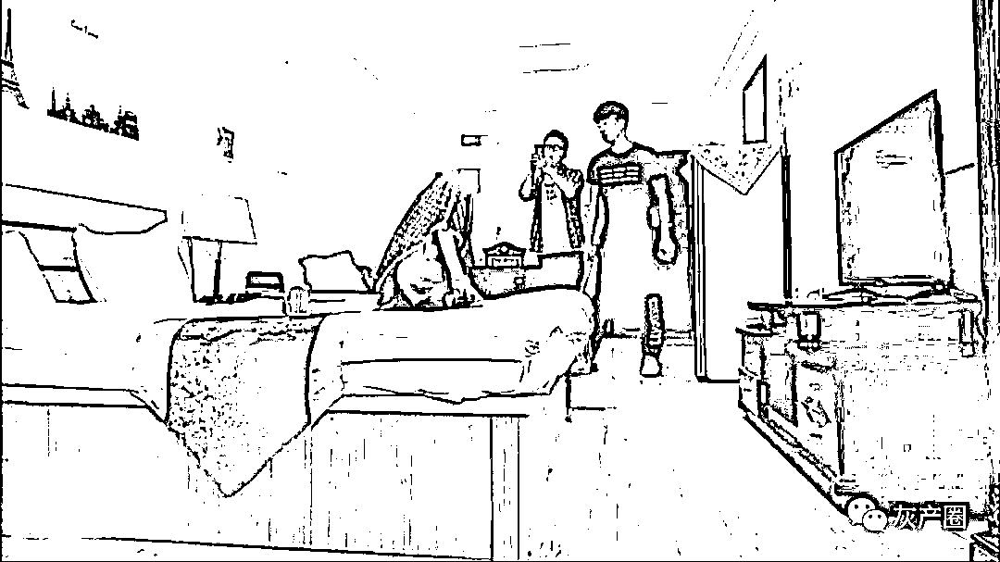  

我朋友那时候还在上学，他不知道听谁说的，半夜看哪个发廊、洗浴外面是**粉色的灯光**，那就是风月场所。

后来有一回，他晚上就四处乱逛。大街上店铺几乎都关门了，就有一家发廊还开着，外面还真是粉色的灯。他壮着胆子就进去了，因为事先有准备，他就隐晦地问了问，那个女的就带他上了楼。

中间的过程他没说，到了上面包房。他刚脱光衣服，准备进去洗个澡。几个壮汉就推门进来了，套路就跟电视里演的一样。那个为首的男子说：**“你找死吧？老子的女朋友也敢碰！”**

我朋友也不是傻子，心想这是碰到仙人跳了。他就直说，需要多少钱。最后，他把手机里的**6000 块钱**全给了对方，这才给他放了出去。此后，他对这种事讳莫如深。想想也是，6000 块钱的课，搁谁都得记一辈子......

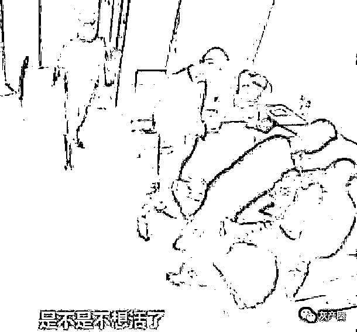

**哪些人群容易被骗**

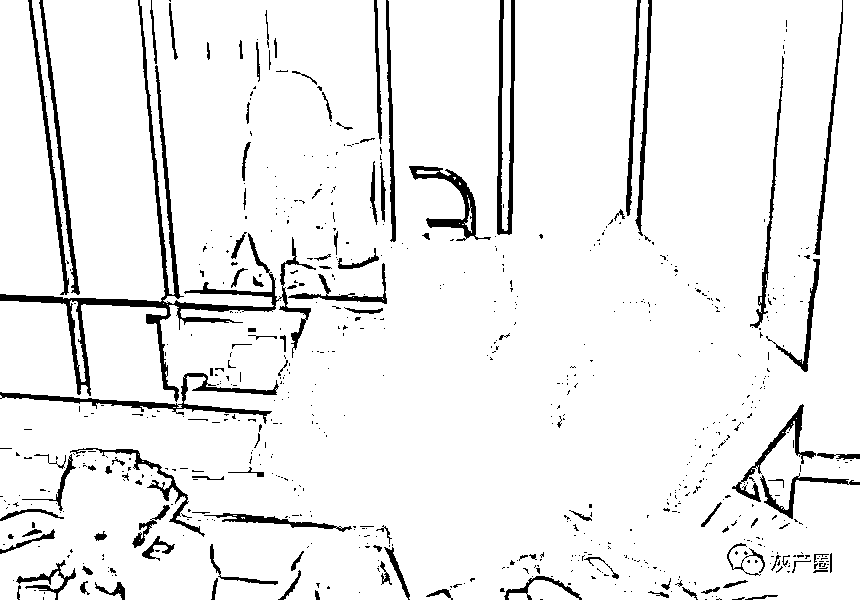

什么样的人最容易遇上“仙人跳”，总而言之，喜欢吃免费午餐的人，最容易遇上仙人跳等破财消灾之事。俗话说，不要钱的最贵，或是别人的东西不要碰。如果你不信邪，认为天下掉下来的礼物全因为自己貌似潘安、帅过唐璜。或者，吃鳖一辈子，终于盼到仙女下凡，解救自己体内成千上万窜流精虫的荼毒，你真的有这么俊俏与幸运，那你早就是刘德华或是亿万大乐透得主，所以，若有稍具姿色的女人对你眼送秋波、唇赠香吻的话，请小心，仙人跳这出情色陷阱已经找上你了。

1、单纯的，也就是笨到容易上勾的。

2、好色的，看到美女就鬼迷心窍。

3、贪婪的，以为送上口的嫩肉不要钱。

4、有钱的，若每天为三餐都快吃不饱，哪有机会。

**仙人跳作案类型**

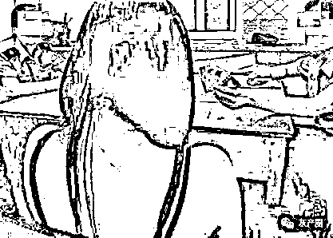

1、传统基本型

最常听到的仙人跳的例子，就是让姿色不错的女子勾引单身或落单的男性，将他引入房间准备办事之时，说时迟那时快，突然房门被踹开，冲入一堆自称是女方的丈夫、兄长或是父亲等同伙，将性欲高涨的男方当场抓住，逼迫他签下巨额赔偿金，若有不从，拳脚暴力相向，拿不到所谓的遮羞费誓不罢休。21 世纪则因为网络发达，设下仙人跳陷阱的男女会利用手机交友软件或是交友网站，表达想要与男方交往的心意，等男方到了二人相约的地点时，就会出现自称是女方男友的凶神恶煞，以调戏女友为名义要求赔偿数千元或上万元遮羞费，否则就围殴被害人。这就是所谓的传统基本型，中招者为了逃过皮肉之苦，通常都会花钱消灾。

2、足不出户型

人在家中做、祸从天上来，案例景文高中玻璃娃娃事件。他利用网络视讯认识一个名叫李姓女子，由于自己心太软、加上意志不够坚定，一步一步踏入她的温柔陷阱，不但用甜言蜜语让他卸下心防，李女更引诱他来一场远距性爱，要他脱下衣裤在网络视讯前面坦露私处抒发情欲，没想到竟被侧录，而成为勒索工具。而我们奥运的金牌国手朱先生，也是遇上类似的网络仙人跳，不但花钱消不了灾，还被一再勒索最后不得已只好糗事曝光。这种连小手都没牵到就要被海削一顿，只能说众多仙人跳招式中，死得最不明不白的！

3、打劫一空型

还有另外一种网络仙人跳的型态，就真的是“赔了夫人又折兵”。有个王姓的好色男子在网络钓到了一名自称是莎莎 69 的女子，王姓男子请莎莎 69 到他家玩 SM，莎莎 69 欣然同意。莎莎到王姓男子家，跟他搂搂抱抱一阵子后，就拿出胶带，把他绑在床柱上，当王姓男子以为要开始 SM 戏码而心痒难耐时，没想到莎莎走到大门将门打开，走进一个男子。这对男女就当着王姓男子的面，拿走了他家的电视、录像机、光驱、数码相机、打印机、移动电话和手表。

4、误食幼齿型

你别以为你准备大快朵颐的对象已经满了 18 岁，这年头的女人光靠化妆与造型，就可以让你吃上妨害性自主的官司了。一个名叫小瑜的女网友跟网上认识的阿民说，自己已经满 18 岁了。之后相约见面，小瑜接着就把阿民带回家并开始色诱阿民跟她发生性行为，小瑜还特别强调她父母出远门，短时间不会回家，所以绝对不会被发现。当阿民受不了小瑜的诱惑正准备大开杀戒时，好巧不巧小瑜的爸妈回家了，阿民这才发现原来小瑜根本还没满 18 岁，这时，不是付出 50 万就是要被扭送警察局，阿民这才发现是场仙人跳已经来不及了。

5、喝醉误事型

之前在台北市某私立大学发生一起罕见的仙人跳纠纷，当时一名大一的女学生主动邀约喜欢的男同学出来喝酒，两个人喝着、喝着，带着醉意喝到了床上去，隔天醒来，女学生竟然翻脸不认人，说他猥亵，开口要 100 万元，男同学根本凑不出钱来，只好硬着头皮跑去自首。这类醉不上女人的事件也包括喧腾一时的董事长乐团性侵害疑云，女方硬说被性侵害，男方却因喝醉了对所发生之事一无所知，虽然后来因无法证明酒店小姐妮可曾遭性侵害，裁定全案不起诉处分，但对董事长乐团所造成的伤害，已然形成。

6、毛片主角型

全拜现代科技日新又新的发明，有不少新型的仙人跳戏码就是借着针眼等摄影器材，将做爱过程拍下来后以散布光盘等要胁的方法，连骗带狠的硬是向冤大头敲下大笔金钱，2011 年有澎恰恰光盘事件，早在 1999 年，四大天王郭富城传出在澳洲遭人设计仙人跳，就是被对方以偷拍手法拍到他咸猪手画面而来威胁恐吓勒索。对方利用郭富城对感情的猴急，刻意制造了灯光美、气氛佳的环境，让两人有亲昵肢体接触，而所有的画面全都被针孔给偷拍下来，借机向郭富城勒索，这么糗的事居然会发生在四大天王之一的郭富城身上，可想而知当时新闻有多么轰动。

7、敲诈勒索型

在某些场所故意勾引男士，到酒店开房后敲诈男士数十万，如若不给则起诉男方强奸，而男士则会被公安机关关押半年甚至更久，而具体审判原则也比较模糊，如果女方一口咬定男方强奸了，就算无其他人证物证男方也会被判处数年之久，具体可见香港知名影星张家辉电影提防老千，狱中大佬因得罪香港赌场老大被设计陷害，指派女手下勾引某某在后山做 X，欢合时指派另一手下报警，随后警方当场捉住，女方坚称男方强奸，男方随后被判入狱。

**反仙人跳套路**

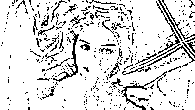

　　一、了解仙人跳下手目标的共同特点，自查

**单纯、有钱、好色**

　　二、不轻易相信任何陌生人

　　即便是朋友都有可能会存在背后捅刀的情况，更何况是陌生人，不轻易相信陌生人能够降低男性遭遇仙人跳的风险。

　　三、约见网友见面、吃饭都要到正规的场所

　　仙人跳的最终目的无非是为了钱，所以男士们既然免不了最终的买单，不如将消费的地点选在自己有把控的安全场所，以免出现不可控的问题，你非要去开房，那后果不堪设想。

　　四、收起泛滥的同情心

　　如果碰到以生活很困难想你博取同情借钱的女性，应当立即决绝，虽然说男人两大爱好，拉良家妇女下水，劝风尘女子从良，但一定要稳住。

　　综合来说，以骗取钱财为目的的仙人跳都是有迹可循并可以防患于未然的。所以为了避免的大家在中招之后悔恨难当，不如提前斩断仙人跳事件发生在自己身上的可能性。

**最后**

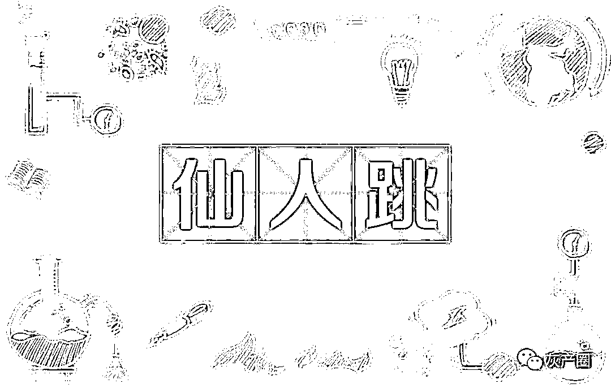最后，告诫大家千万别信那些小卡片，全是骗人的。

做人还是要洁身自好，要承担起对家庭的责任。也许你一次两次没被发现，尝到了甜头。

但保不住哪天，你就栽了。

**灰产圈视频号已开通，欢迎关注**

<mpvideosnap class="js_uneditable custom_select_card channels_iframe" data-pluginname="videosnap" data-id="export/UzFfAgtgekIEAQAAAAAA1lkrXZlZZQAAAAstQy6ubaLX4KHWvLEZgBPEvIIwOnpaPtf6zNPgMIkFZbaV7PzZRsCKbllrHgl3" data-url="https://findermp.video.qq.com/251/20350/stodownload?encfilekey=jEXicia3muM3GjTlk1Z3kYCefzc4VU4EASpjxic8oEN0JZaYLu06SBDvRRV3icUIAomPhPaETDNv4ga25UN5Do6Ou236sibIiawHbD3BDamj1Khm2XicvgBdIWmI7HF3ia3vWJqJZhzTUxuVxcqB9ibSErCG7nt8YtscIfoph&amp;bizid=1023&amp;dotrans=0&amp;hy=SH&amp;idx=1&amp;m=859db8d90f4134fb9c770ae3278acc59&amp;token=x5Y29zUxcibCtekDPxkTKvd7UvZLI6Kx8ZSJiaODbY8v3UPKCIricZ7pqrUgdaE778v" data-headimgurl="http://wx.qlogo.cn/finderhead/PiajxSqBRaEISAKibugHhUQs74zK9sdqn9QvawbxCzU7AuxCgU4kpS0A/0" data-username="v2_060000231003b20faec8cae18b1bcad5cb00e937b0779ef044c516b0481d185bbca60dd9c21f@finder" data-nickname="灰产圈 HCQ" data-desc="我和卖茶女的爱情故事#卖茶女#" data-nonceid="1821287821186864099" data-type="video"></mpvideosnap>

← 向右滑动与灰产圈互动交流 →

