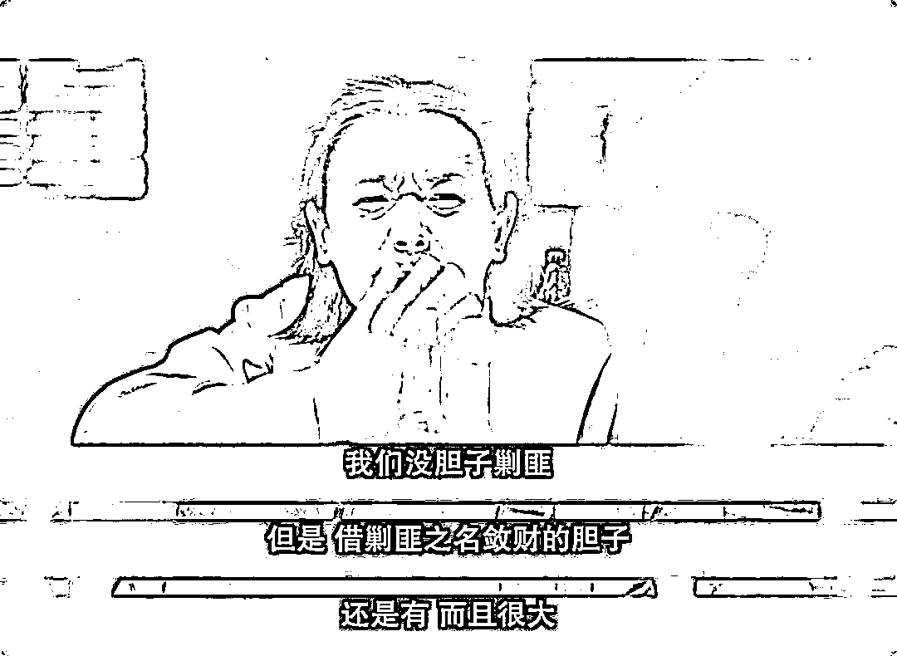
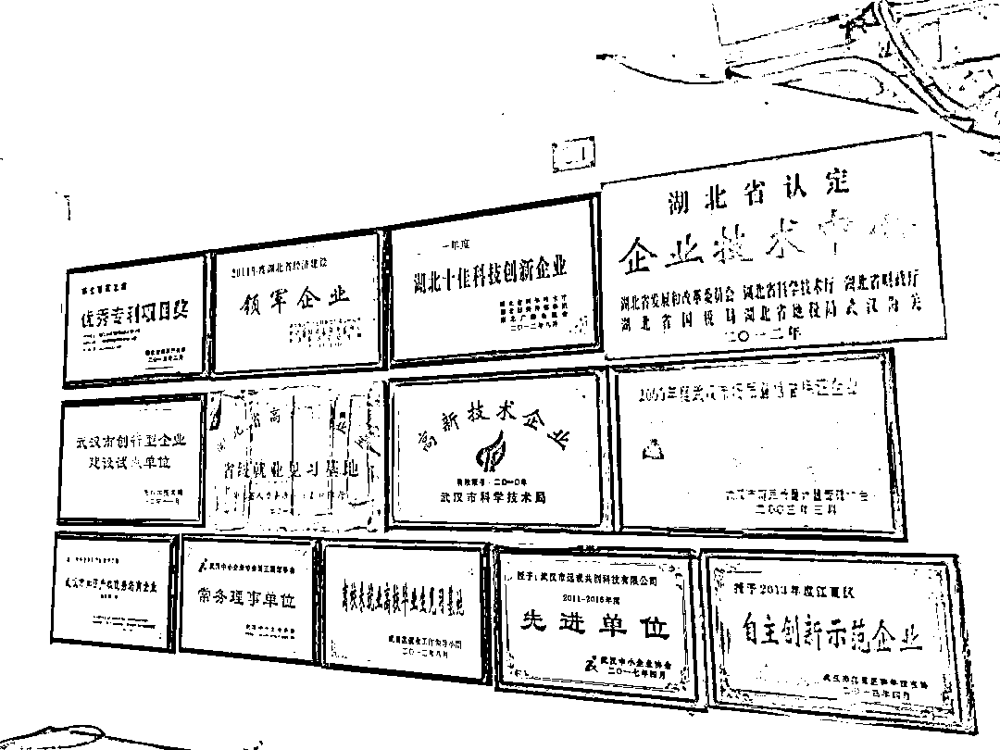

# “办案初衷就是要搞点钱”，一开价就是 5000 万！

> 原文：[`mp.weixin.qq.com/s?__biz=MzIyMDYwMTk0Mw==&mid=2247502971&idx=2&sn=e7366635a36c6ff4ceba6116e771826e&chksm=97cb0743a0bc8e556826a896d7414025eb6e053f51cd829e1e1cb17959c438d468a310ece72b&scene=27#wechat_redirect`](http://mp.weixin.qq.com/s?__biz=MzIyMDYwMTk0Mw==&mid=2247502971&idx=2&sn=e7366635a36c6ff4ceba6116e771826e&chksm=97cb0743a0bc8e556826a896d7414025eb6e053f51cd829e1e1cb17959c438d468a310ece72b&scene=27#wechat_redirect)

点击蓝字“**灰产圈**”关注我们！

[`mp.weixin.qq.com/mp/readtemplate?t=pages/video_player_tmpl&action=mpvideo&auto=0&vid=wxv_1553452106039296000`](https://mp.weixin.qq.com/mp/readtemplate?t=pages/video_player_tmpl&action=mpvideo&auto=0&vid=wxv_1553452106039296000)

「**办这个案子的初衷就是要搞点钱****搞个千把万一两千万就行了****谈钱是最好摆平的**」 「**每次办这种案子都是这样搞的**」 这是在张家界市慈利县的鲤鱼桥派出所公安办案人员刘鹏（所长）对远成公司人员说的话 2019 年 7 月，慈利公安以配合调查为名将两名员工跨省从武汉抓走第一次**所长刘鹏和指导员****涂绍吾****直接开价****5000****万**并表示**只要拿钱****即可销案**由于武汉远成公司拿不出**后来慈利公安不断****降价****先降到****2700****万****后又降到****2000****万****再后来又把金额降到****1500****万**见公司还是没动静**不久又主动把金额降到****1000****万**2020 年 6 月 12 日，远成公司律师与指导员涂绍吾电话联系涂绍吾明确说：**「我们不是想搞人，我们只想把那****800****万****盘了」**与武汉远成公司类似的
其他省有大概十几家企业、数十余人**都是在****交钱之后****被撤案或不起诉**比如山东某医药科技有限公司及其法人李某、还有杜某丽等 一方面是用钱就可以决定公司的生死存亡一方面是尊严、正义与法律为此，武汉远成公司有过无数次犹豫特别是霓虹灯下**公安办案人员借来武汉调查案件之机****接受****异性有偿陪侍****心安理得入住着公司安排的酒店****每晚****1200****元，五星级**也许，正如公安所说，金钱能很快解决一切可最终，武汉远成公司还是选择了相信法律慈利县鲤鱼桥派出所所长刘鹏接受异性有偿陪侍 

* * *

武汉远成的注册地为湖北武汉五位被告人的户籍所在地或者居住地**都不在慈利县境内**被指控“非法经营”的行为地、结果地**均与湖南省慈利县无任何关联**慈利县公安局也未获指定管辖依据法律规定**慈利县公安对于该案根本是****无权管辖**更为蹊跷的是 2019 年 7 月 5 日，在没有相关合法手续情况下**慈利县公安欲将远成公司的员工跨省带走****遭到武汉当地的公安机关****明确拒绝****慈利公安竟****当场上网****将公司的相关人员列为网上追逃对象****强行将公司人员带回慈利进行羁押**直到将近一个月后即 2019 年 8 月 3 日才正式对武汉远成以“非法经营罪”立案也就是说**慈利县公安是****先抓人，后立案**

* * *

自从 2019 年 7 月公司实际控制人被上网追逃流动资金被冻结后武汉远成公司已被迫全面停业**约 2.7 亿元库存货物过期报废****国内所有业务中断** **近千名员工失业**公司昔日的热闹辉煌已经完全不再 刑事侦查权的突然介入让很多武汉远成很多工作未能及时处理产生的员工工资、供应商货款等问题让远成公司至今疲于应付各种仲裁、诉讼 **武汉远成公司原是一家由原国有企业改制而来的民营企业****在化工贸易行业经营长达近****20 余年****销售全国各地的产品两万多种****公司有员工近千人、年纳税****2000 余万元****也是湖北地区乃至全国最早从事化工产品电子商务经营的企业**武汉远成公司荣誉墙（部分）由于涉及到各种类化工产品的经销武汉远成在产品的采购、销售方面从技术上建立科学的防范机制并设立专门岗位对购买企业信息的合法性进行审核值得一提的是涉及到食品添加类产品武汉远成每年都会向湖北省、武汉市食药监部门的专家请教相关专业问题****公安部有关部门的领导还曾组织湖北省公安厅、武汉市局****多次到远成公司调研********对产品的采购、销售渠道，购买客户的信息实行技术双管控的先进做法****给予充分肯定****

* * *

**2019 年 8 月，湖南省张家界市慈利县公安机关****认定武汉远成公司销售的两款产品****即「4-甲基哌嗪枸橼酸盐」和**「**他达那非」是原料药******武汉远成公司认为这两款产品是化工原料********并不是原料药********在销售时已严格审核********购买企业的营业执照、法人身份证明和承诺函********合同条款也明确对产品用途进行严格限制********远成公司已经尽到****合理注意义务******那涉案的两款产品究竟是化工原料还是原料药？****办案机关将武汉远成公司进口产品「4-甲基哌嗪枸橼酸盐」认定为「西地那非」****但根据武汉远成公司提供的证据显示******「4-甲基哌嗪枸橼酸盐」********是武汉远成从国外进口********且经过武汉机场海关严格审验********报关手续齐全******其监管方式属于一般贸易****无任何监管条件******即海关未按照属于原料药或者药品进行监管******而且最为关键的是****「4-甲基哌嗪枸橼酸盐」与「西地那非」******两者不管是从名称、HS 编码，还是化学分子结构、性质上**********都有本质的区别**********至于另外一款产品虽称为**「**他达拉非」**********其用途广泛************不仅仅只是可以用来制药************也可以用来科研等**************根本不能与原料药划为等号**************而且武汉远成公司也是严格按照国家及行业规定向具有销售资质的贸易公司采购****** ********最让武汉远成公司不解的是****************生产该产品的企业同样没有取得药品生产许可****************都没有被追究责任****************为何自己只是采购、销售的环节反而被追责？******** 

* * *

******检察院具有法律监督的职能************自从被立案调查开始**************远成公司将纠正的希望寄托于慈利县检察院******** ********为此，远成公司多次向慈利县检察院的办案人员、检察院领导****************反映案件存在的诸多违法问题****************但并没有人理睬和重视**************在案件到了慈利检察院审查起诉期间************远成公司法律顾问及前期辩护律师也先后向检察院陈情************就公安机关明显无权管辖、所指控事实和证据存在重大问题************以及公司是合法经营、不构成非法经营罪等************和检察院进行了十几次沟通**************可检察院对于公安的“抢钱”似乎已心知肚明****************因为与武汉远成类似的企业****************正是****交了钱之后****************从同一个****承办****检察官代娇娇****手中获得不起诉的**************显然，法律监督并没有让碾压武汉远成公司的巨轮停下************反而将权力变成为巨轮的加速器**************清华大学张明楷教授曾一针见血地指出：****************“****一个机关为自己的利益去办事的时候，他们的胆子可大了。****”**************为何检察院甘愿为公安的违法背书以“非法经营罪”强行起诉至法院？************也许从武汉远成公司不同意向慈利公安交钱保命那一刻开始就已注定******

* * *

********公安部在 2020 年 7 月份曾召开会议****************要求各级公安机关充分发挥职能作用****************强化法治保障严格落实公安机关异地办案协作有关规定****************坚决防止发生趋利性执法和单方面跨区域执法等问题**************武汉远成公司坚信自己选择的道路************一定会通向光明************当下，政法系统“刀刃向内、刮骨疗毒”**************慈利县成为湖南省整顿“试点”单位****************武汉远成公司举双手赞成**************不管身居何处，我们都会面临有许多的选择************不同的选择会走出不同的道路，可最终结果只有两种**************一种是通往光明，感受着不同且持久的温暖，了解幸福的真正含义****************而另一种是走向灰暗，得到的是一种暂时的满足，随之而来的就是一种恐惧和心慌**************新疆石河子检察官张彪用自己的执着推动张高平、张辉强奸杀人案件的再审************他曾给案件的辩护律师发了这样的短信：************「**我今年就要退休了****************张辉、张高平的案子我希望你不要放弃****************每到夜晚****************我想起张高平向我哭诉被刑讯逼供冤案****************我都无法如入眠**」************这是一个基层驻所检察官关于良知的选择************可当下，谈良知或是怜悯，似乎都成为一种奢侈和虚幻**************武汉远成案****************看起来是一起“非法经营案”****************可实质上却仍是一场关于金钱、权力与法律角逐的游戏****************只是，在金钱、权力与法律之间****************慈利公安、检察却****不忘初衷，牢记搞钱**************唯独武汉远成公司选择了相信法律************来源：廉政法制观察******************

******← 向右滑动与灰产圈互动交流 →******

************