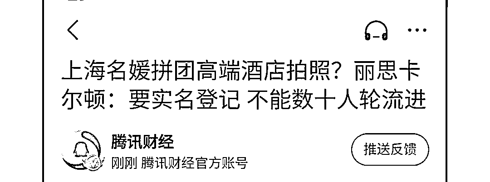

# 上海“名媛群”被曝光，我又看到了“男版咪蒙”的一篇 10 万+

> 原文：[`mp.weixin.qq.com/s?__biz=MzIyMDYwMTk0Mw==&mid=2247502971&idx=3&sn=474fbe9627977e9aec1f924fdaa5eee7&chksm=97cb0743a0bc8e5513605e76acd92d9856c9e842c6daf17f3ade7b61eeab39072ec97377cce5&scene=27#wechat_redirect`](http://mp.weixin.qq.com/s?__biz=MzIyMDYwMTk0Mw==&mid=2247502971&idx=3&sn=474fbe9627977e9aec1f924fdaa5eee7&chksm=97cb0743a0bc8e5513605e76acd92d9856c9e842c6daf17f3ade7b61eeab39072ec97377cce5&scene=27#wechat_redirect)

点击蓝字“**灰产圈**”关注我们！

李中二的一篇文章，彻底让上海“名媛圈”炸开了锅。 

原来表面上光鲜亮丽的生活，全都是私下高阶版的“拼多多”。

只有你想不到的，没有你拼不到的。

或许，成为“名媛”，你只是差了一个二维码的邀请。

（以下图源：爆料公众号）

在这里，你可以拼丽思卡尔顿的双人下午茶，人均只需 85。

你还可以拼，丽思卡尔顿的套房，人均 200。

还可以拼宝格丽的酒店，人均 125。 

也可以拼各种名牌包包，甚至是 Gucci 丝袜。

总之，共享经济“下沉式”体验，在这个圈子里被彻底实现。

虽然这个事儿“被曝光”，但总觉得这篇文章哪里怪怪的？

不对劲。

其实，这种以共享租借等形式包装网红的现象已经不是一天两天了。

有很多 MCN 在运作网红和打造个人 IP 的时候，往往会选择用这种方式，营造一种“向往的生活”。

也有一些“网红”个人，通过租借的方式，提升消费等级，吸引粉丝。

怎么说呢？ 

这里面的逻辑就是在“现实感”这件事儿上大做文章。

不会有“网红”承认这一切都是假的，但也不会承认这一切都是真的。

如何判断，就成了粉丝自己的事情。

你可以说，有一部分“网红”在消费粉丝。 

但这个公众号曝光的所谓“名媛群”登上了热搜，更像是消费之后的“二次消费”——

假造得很。 

首先，看群的名字“上海名媛群”。

非常直白而且明了，更像是已经精准锁定了用户，时间人物全有了。 

“名媛”这个词如今更多的是贬。

为什么 90 后、甚至 00 后不能起一个更富有个性的群名，非要把一个已经被人黑出翔的词，当作代言呢？

看一下，群聊天的内容。

所谓的丽思卡尔顿、宝格丽等五星级酒店拼房，40 个人住一间，轮流拍照。 

这已经是假得不能再假的事情了。

可能造谣的人，也没有去过上面这些酒店。

（上海丽思卡尔顿）

丽思卡尔顿已经明确表示：

**要实名登记，入住客人要面部识别。**

而且进入客房首先要进入前台，前台人员看到这么多人难道不会上前询问吗？

再仔细看一下，聊天中的一些细节。 

时间都是 5：01 分？

而且聊天展现的要素实在是太多了，好像是刻意为之，生怕一个截屏不能展现全部内容。

看一下对白，也是极具“戏剧性”。

为什么搞对象，需要名画品鉴？

聊天内容上下衔接也过于生硬，一个话题没有结束，另一个就开始了。 

刚聊完宝马男，接着就开始拼袜子了。

不觉得想要表现的素材太多了吗？ 

这篇文章更像是被营造出来的网文，既有剧情上的起伏，又有卖点足够吸引读者眼球。 

再看看这个公众号其他的文章，你会发现还有很多人给他们“投稿”。

但所有的投稿好像人用的全都是一部 iPhone 手机。 

而且截图工整规范。

他们家其他的爆款文章，也都有一定的套路。

非常喜欢写一些看上去匪夷所思，难以置信的话题。 

而且喜欢挑起所谓“直男癌”和“绿茶女”之间的矛盾。

而且紧跟热点，“秋天的第一杯奶茶”话题一出来，他们针对女性的文章也出来了。

“江浙沪夜店小公主”、“成都千杯不倒翁”。 

几乎所有的推文都在说女性如何如何不好。

调性堪称是“男版咪蒙”。

每曝光一个男明星的“丑闻”，这个公众号就要写一篇类似的女性事件。

当然，这种选题无论是在公众号还是别的平台都会引起读者的广泛猎奇心理。

很显然，这次的名媛群营销非常成功。

广泛的热度和话题的衍生就是最好的效果。 

前阵子，贴吧一篇帖子《哥咱家有钱了》成了当下热点—— 

女方家要 50 万彩礼，不给钱不结婚，最后楼主无奈只能把爸妈的房子卖了。

有了 150 万最后才结的婚。

但这件事儿，最后被原楼主亲自曝光，从头到位就是一场营销。

想必大家十分清楚爱马仕的销售套路：

**全球每卖出一件爱马仕 Birkin,就有三到五款爱马仕积压单品被同时卖空。**

这就是爱马仕（Hermès）臭名昭著的“配货原则”，想要买一款 8 万的 Birkin 包包，对不起，请你先买 5～7 万其他的单品，满足了累计消费记录，你才有购买 Birkin 的名额。 

**一般配货比例是 1:1，也有 1:5**，餐具、丝巾、挂饰，甚至小皮具。针对不同国家、不同的店面、不同人，具体情况也不同。

爱马仕这么做，一方面考验客户对品牌的“忠诚度”，另一方面也在划分着一种无形的“阶层”。

**拿全球限量的 Birkin 来说，如果，人人都可以背着逛大街，只会让更多客源流失。**

一款全球限量的 Birkin 包，意味着某种“圈子”的一张 VIP 入场券。

对于北上广深的许多白领来说，刚工作的第一年，即便四个季度不吃不喝，也要攒钱买够 4 款名牌包包，这是同样的道理。

人类社会中，但凡是圈子，就有门槛，为了挤进一个圈子，势必要付出代价。

于是很多人看到了在这样一个挤压的社会空间中，有太多的挣扎和矛盾。

咪蒙看到了其中的“营销逻辑”，并且实现了自己的“人生成就”。

**如同一些水平很烂的高中生**

**炮制的死妈死爹卖惨的高考作文一样**

**几乎每篇咪蒙系爆款文背后**

**都要“弄死”一个“我有一个朋友”**

还记得导致咪蒙覆灭的那篇文章吗？

《一个出身寒门的状元之死》。

通篇文章充满着事实性错误和逻辑矛盾，但并不影响整个文章情绪的输出。

甚至，咪蒙还写过一篇《我曾想过，让父母死去》的文章。 因为被骂得太严重，不得不删除文章。这可能是咪蒙营销最失败的一次。

类似这样的结论，广泛存在于 2018 年刷屏的各种公众号“爆文”里，也是现在各公众号写手正在做的事情。

比如在收到 15 亿光年外的 FRB 之后，人民日报这样的官媒会采访业内大咖，给出比较专业的意见。

没办法刷屏的自媒体会说许多事实，最后加一句“不排除是外星人的可能”。

但某些爆文公众号，就一定要这么说： 

还有滴滴悲剧发生后，某公众号用臆想脑补出当时奸杀的情景。 **贩卖焦虑，脸谱化主角，下结论，搞对立面。**我不说这是错误，因为这根本不是错误，反而正是如何做好一个公众号的秘诀——**在毫无关系的事情中间加上若有若无的联系。****必要的时候可以造谣，添油加醋，春秋笔法。**最后提醒一下：造谣是有代价的。排版酒六 来源：北美留学生日报<mpvideosnap class="js_uneditable custom_select_card channels_iframe" data-pluginname="videosnap" data-id="export/UzFfAgtgekIEAQAAAAAAPmAF_8qTBQAAAAstQy6ubaLX4KHWvLEZgBPEvIJoY2ouUNH6zNPgMIlUJRQO0y7tVCblSoQ4P69G" data-url="https://findermp.video.qq.com/251/20350/stodownload?encfilekey=RBfjicXSHKCOONJnTbRmmlD8cOQPXE48ib4rPo6Ej665icviczEQ7uRy3hohQtJvfkT6wtsAricn8FSEja7zXwAkziaqubGHLqIiaV7HljbcQyTWej0yvHUO73XzRemBZI884s2NEOAGSzNibibakewE5mjPJk9a7MOOyCJYC&amp;bizid=1023&amp;dotrans=0&amp;hy=SH&amp;idx=1&amp;m=a26b089cc6c79eef08848b28b312b34f&amp;token=x5Y29zUxcibCvkDbNQE5SdAoOTXPciafRiaAhKhqyOdYdA90FWNa5HXzBwvPPN3f3Ww" data-headimgurl="http://wx.qlogo.cn/finderhead/PiajxSqBRaEISAKibugHhUQs74zK9sdqn9QvawbxCzU7AuxCgU4kpS0A/0" data-username="v2_060000231003b20faec8cae18b1bcad5cb00e937b0779ef044c516b0481d185bbca60dd9c21f@finder" data-nickname="灰产圈 HCQ" data-desc="朋友圈虚假打造产业链内幕大揭秘！#朋友圈##灰产圈#" data-nonceid="8482695777524449012" data-type="video"></mpvideosnap>

← 向右滑动与灰产圈互动交流 →

