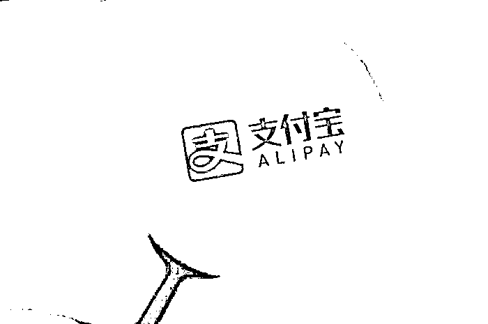
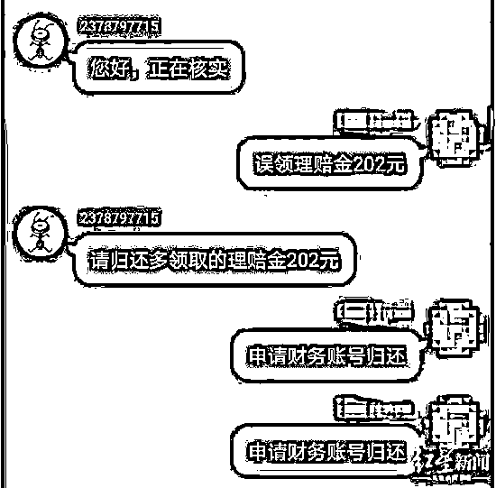
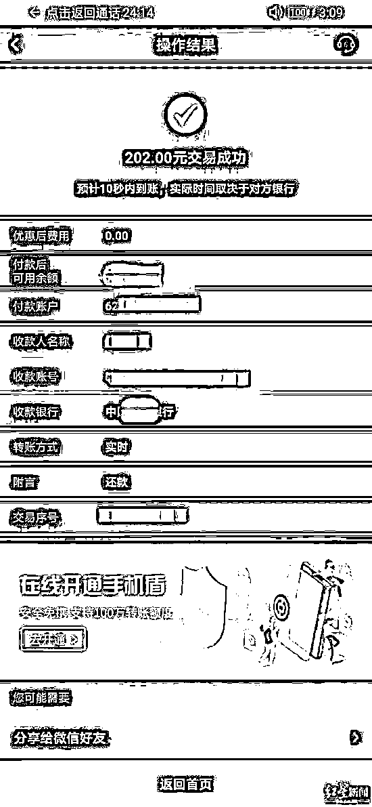
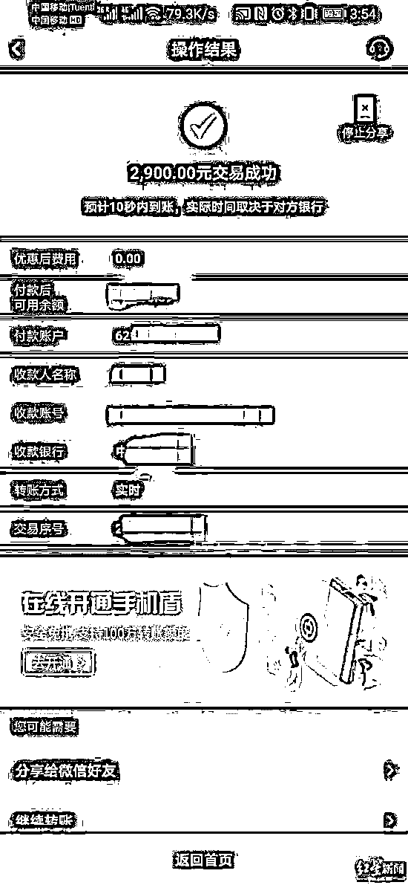
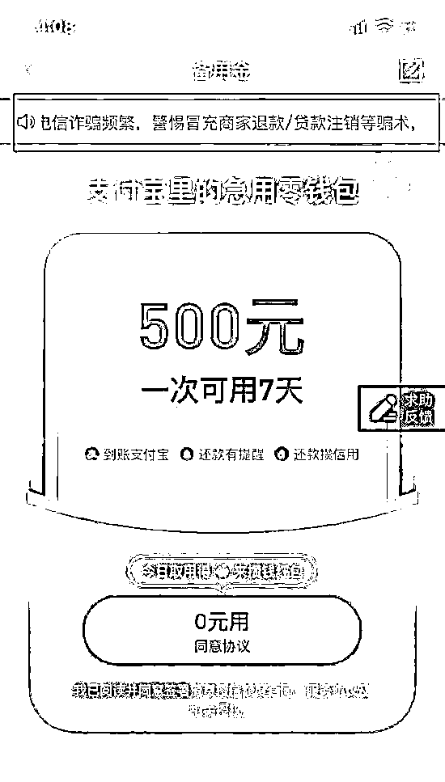

# 支付宝这个功能，小心了！

> 原文：[`mp.weixin.qq.com/s?__biz=MzIyMDYwMTk0Mw==&mid=2247502971&idx=4&sn=f7525c0c71fca21df43ae27aad0d948d&chksm=97cb0743a0bc8e55fac6c45a962e60fc9693f466639d5b99a9b7b88330b56a69a3084fc437d6&scene=27#wechat_redirect`](http://mp.weixin.qq.com/s?__biz=MzIyMDYwMTk0Mw==&mid=2247502971&idx=4&sn=f7525c0c71fca21df43ae27aad0d948d&chksm=97cb0743a0bc8e55fac6c45a962e60fc9693f466639d5b99a9b7b88330b56a69a3084fc437d6&scene=27#wechat_redirect)

点击蓝字“**灰产圈**”关注我们！

今年国庆，在成都居住的小王过得并不愉快。

10 月 5 日，小王接到自称是支付宝客服的电话，对方对于细节非常清楚，以小王**此前购买的商品有质量问题需要退款为由**，要求小王开启支付宝的一个功能，一个多小时里骗取了小王 5.3 万元。

**从一通“支付宝客服”电话开始**

10 月 5 日，小王接到一个自称是支付宝客服的电话。“对方给我打电话，说我购买的东西里含有甲醛，需要退款退货。”半个月前，小王通过网络购买了一瓶香水，价格是 298 元，“我之所以没有怀疑（是骗子），**因为对方一开始就知道我个人信息，对于我购买的东西、价格都很清楚很了解。**”

小王自己表示，香水已经使用，没有出现不适。小王没想到，“对方坚持要求退款，说要保护我的安全，还建议我去医院检查。”

按照“支付宝客服”的说法，会把退款 298 元打到小王的支付宝账户，并且次日有快递员来收回香水。“等了一会，我也没有收到支付宝退款。他（对方）又让我打开支付宝的理赔金，看看有没有商家理赔，我发现也没有。”

**“对方又让我打开支付宝的备用金，领取 500 元。表示这部分由商家来归还。”**小王回忆。（备用金是一款小额短期借款产品，可以实时放款，7 天内自动扣款归还，每人备用金额度不同，最高 500 元）

因为购买商品价格为 298 元，与备用金存在 202 元差价，“对方就表示，我需要退还差价 202 元给他们。”小王按照对方的提示，添加了一个自称是支付宝客服的 QQ，进行沟通“退款”。

**一个多小时被骗 5.3 万元  **

10 月 10 日，红星新闻通过小王提供的截图上看到：小王按照指示，一直在向“支付宝客服”说明，自己“误领理赔金 202 元”。转款后，**对方以超时卡单为由，又要求小王转钱到固定的银行账户上。**

小王与自称“支付宝客服”的人对话

这一次的“理赔”，不再是通过“备用金理赔通道”，而是另一种“还呗理赔通道”——对方以超时卡单为由，**要求用过“还呗”来还，**“说还呗是支付宝旗下的，我当时不知道‘还呗’不是支付宝旗下的，就去借了‘还呗’。”

事实上，“还呗”不是支付宝旗下产品，而是一款信用卡账单分期产品。

转款记录

**随后对方又以做流水为由，要求小王打款 2900 元。**小王说之所以愿意打款 2900 元，是对方告知他自己的信用分太低了，这样可以帮助提高信用分，“对方说这 2900 元得打到指定的银行卡里，可以帮助我提高信用分，我的信用分太低了，以后对我买房、买车造成影响。后来我才知道，我的信用分挺高的，就是骗了我。”

自称“支付宝客服”的人给小王提供了一张截图，上面显示的备注写明：“保证金已下发至还呗，辅助关闭理赔通道，清空无需本人还款。”

小王回忆，后来客服又告知他，卡单了。

**就这样，小王再次打款 4.9 万元到对方指定银行账户。一个多小时里，小王三次分别打款 202 元、2900 元、49988.6 元。**

“在最后转钱时，没有出现对方提到的 A、B 选项。我觉得不对。”小王以找家属要钱为由，希望拖延时间方便警方破案。10 月 5 日，小王向派出所报案。据悉，目前警方已受理，案件正在进一步调查中。

事后，小王联系了支付宝，“支付宝说从来没有客服跟我联系过。”小王透露，自己也联系过支付宝、网店客服、快递方，**“都说不是自己泄露的个人信息。”**

“现在我就希望警方能够迅速破案，我早点找回这些钱。”小王说。

**支付宝人工客服判断为骗局  **

10 月 11 日，红星新闻联系上支付宝人工客服，对方表示**支付宝客服不会私下联系顾客，**建议当事人尽快报警，同时提醒当事人不要泄露银行卡等重要个人信息。

“根据您提供的情况，应该是被骗了，请您尽快联系银行和警方。”支付宝人工客服表示，“**备用金是一款借贷产品，里面的钱不是骗子转给你的钱，是支付宝借给你的钱**，卖家返款退款也不会转到备用金里。”支付宝人工客服建议，下次遇到类似问题，一定要先跟正规官方客服确认了以后再进行操作。

在支付宝-备用金页面，上方有滚动字幕写着：“最近电信诈骗频繁，警惕冒充商家退款、贷款注销等骗术，请不要相信。”

**【延伸】为了 230，损失 23000！**

事实上，上文小王遭遇的骗局已屡见不鲜。刚过去的 9 月底就有一个几乎一模一样的案例。

据济源公安反信息诈骗中心，刘女士接到一个自称淘宝商家客服的电话，**对方称刘女士在网上购买的 118 元的奶瓶质量有问题，**宝宝使用会嘴巴起泡、对身体健康造成影响等原因，可以申请退货退款，且能按照购买奶瓶原价格的双倍理赔，要求刘女士添加客服 QQ 进行理赔，刘女士信以为真。

按照客服要求打开支付宝中理赔进行操作，一通操作之后客服以各种理由对刘女士进行忽悠，说刘女士支付宝信用分不够高、理赔系统出现故障、无法到账为由，紧接着又诱导刘女士**在网络上下载云闪付、小米贷款、58 同城等软件才能进行操作理赔**，并诱导刘女士在网络借贷平台进行借贷并转给对方，就这样刘女士一步步按照对方的要求进行操作，最后将自身的存款 6300 元及在各大网络平台上借贷的 17500 元资金全部转给诈骗分子，后刘女士发现被骗，共计被骗 23800 元。

**诈骗套路**

1、骗子通过不法途径获取当事人网购订单数据，冒充客服，联系当事人谎称网购物品存在“质量问题”，主动提出“退货退款”。当事人在骗子提供订单详情信息后，产生了初步信任。

2、诈骗分子联系当事人退款，并要求当事人添加客服 QQ，并按照客服要求操作。

3、理赔操作期间谎称当事人支付宝芝麻信用分值不够、理赔系统出现故障、理赔款无法到账为由，进一步诱骗当事人进入网络借贷平台借款，并一步步从网贷平台借出资金并转账给诈骗分子。

**警方提示**

1、网络退货退款一般由买家发起而并非卖家，任何主动联系你的淘宝、平台等客服一般都是诈骗分子。

2、商品质量等相关问题和退货退款在购物平台上操作即可完成，不要另加客服微信、QQ 或者填写个人重要信息。

3、退款发起后，资金会原路返回，不需要另外转账。

4、身份证、银行卡、验证码等个人信息都是十分重要的，不要轻易向他人透露。

5、对方一旦让你操作转账或者任何贷款产品，统统不要理会。

图：图虫 来源：红星新闻

← 向右滑动与灰产圈互动交流 →

← 向右滑动与灰产圈互动交流 →

