# 靳东是假的，直播骗钱是真的

> 原文：[`mp.weixin.qq.com/s?__biz=MzIyMDYwMTk0Mw==&mid=2247503005&idx=1&sn=7c8faed2305ca480d53b741ba0696e1b&chksm=97cb07a5a0bc8eb380d21d381d978a7ad8211ba04b2f20688591f1e656ba36457ab22cb3edad&scene=27#wechat_redirect`](http://mp.weixin.qq.com/s?__biz=MzIyMDYwMTk0Mw==&mid=2247503005&idx=1&sn=7c8faed2305ca480d53b741ba0696e1b&chksm=97cb07a5a0bc8eb380d21d381d978a7ad8211ba04b2f20688591f1e656ba36457ab22cb3edad&scene=27#wechat_redirect)

点击蓝字“**灰产圈**”关注我们！

最近观察到了一种新型明星直播卖货

他们不出镜，不露脸

就靠着机械合成音

叫着几句“哥哥，姐姐”

就能让粉丝们乖乖掏钱付账

我也不知道该怎么称呼这种模式

就姑且叫它

“明星”直播卖货吧

[`mp.weixin.qq.com/mp/readtemplate?t=pages/video_player_tmpl&action=mpvideo&auto=0&vid=wxv_1559971980563562499`](https://mp.weixin.qq.com/mp/readtemplate?t=pages/video_player_tmpl&action=mpvideo&auto=0&vid=wxv_1559971980563562499)

这样的“明星”有很多 

包括“靳东”“董卿”“刘涛”

甚至还有“马云”

他们都有一个共同的特点

**【深受中老年人的喜爱】**

这个喜爱

不是长辈对晚辈的慈爱

也不是粉丝对偶像的崇拜

就是爱

很单纯的男女之爱

[`mp.weixin.qq.com/mp/readtemplate?t=pages/video_player_tmpl&action=mpvideo&auto=0&vid=wxv_1559953337150717955`](https://mp.weixin.qq.com/mp/readtemplate?t=pages/video_player_tmpl&action=mpvideo&auto=0&vid=wxv_1559953337150717955)

他们会去“靳东”的视频下留言

虽然三十个字里能找出四五个错别字

会因为“靳东”的一句质问向他道歉

虽然她们并没有做错什么

会为“靳东”的直播卖货买账

虽然最后只收获了一声好姐姐

以及一堆合格证都没有的洗衣液和化妆品

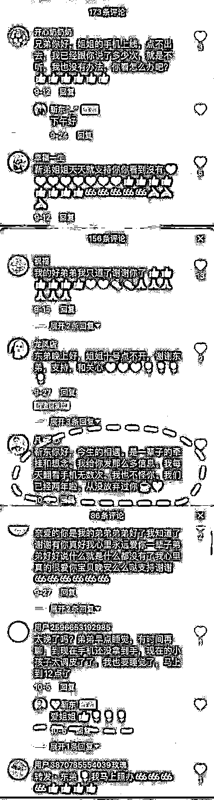

当家人告诉他们

他们关注的“靳东”和“马云”都是假的

人家根本没有注册抖音时

他们根本不愿承认

甚至破口大骂

态度决绝得让我想起了

我说我妈转发到家族群的新闻是谣言时

她瞬间把我踢出群聊的画面

 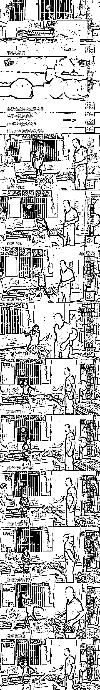

这样的剧情其实很熟悉

像极了十年前

向中老年人兜售保健品的那群骗子们

只不过方式变了

以前只是用科学去哄骗和恐吓老人

现在则是用爱

用老人们对互联网的无知

去给他们营造一个 

和他们这个年纪格格不入的粉色幻梦

以前只求骗得一份钱财

现在既骗感情又骗钱

 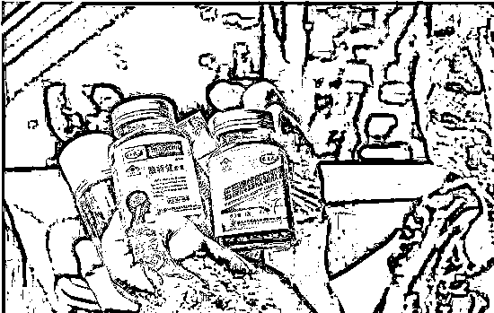

其实写这篇文章的时候

我想往搞笑的方向写

因为真的挺滑稽的

一群这辈子都不知道爱情是什么滋味的老人们

会愿意相信

那些只在电视里出现

“璀璨如星辰”的明星们

会需要他们的小红心

需要他们的捧场

需要他们的爱

甚至误以为“他”也爱着自己

 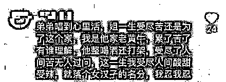

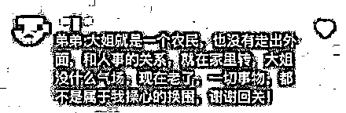

但其实这就是一种病

一种叫做**「钟情妄想」**的妄想症

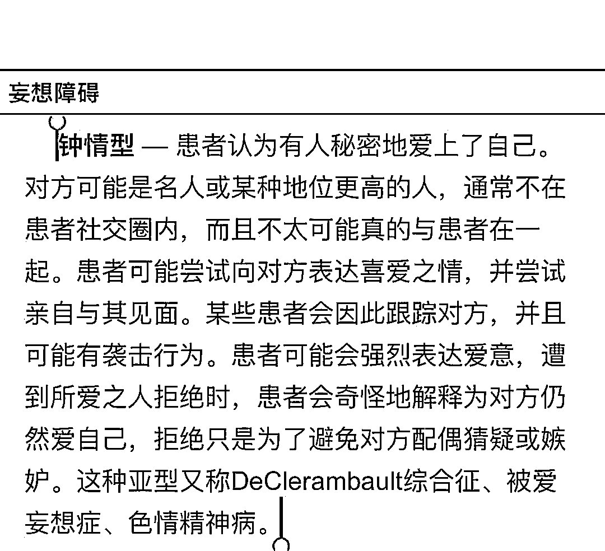

相比于说他们有病

其实我更想称之为一种无望的爱

一种空置了几十年的心里

突然被某种东西填满的情绪

人，不光是为了活着

还需要爱才行

在这种种看似癫狂的行为中

我看到了一个老人孤注一掷的情感

“我这辈子没尝过爱情是什么滋味

现在有这样一个人说爱我

无论是真是假

我都想试一下”

 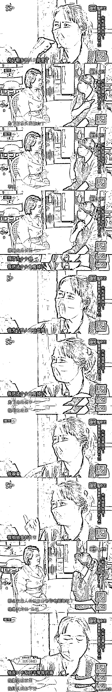

类似的骗局在网上数不胜数，

随便一找就找到很多案例

一位网友的父亲也被骗了..

说有好多女明星喜欢他....

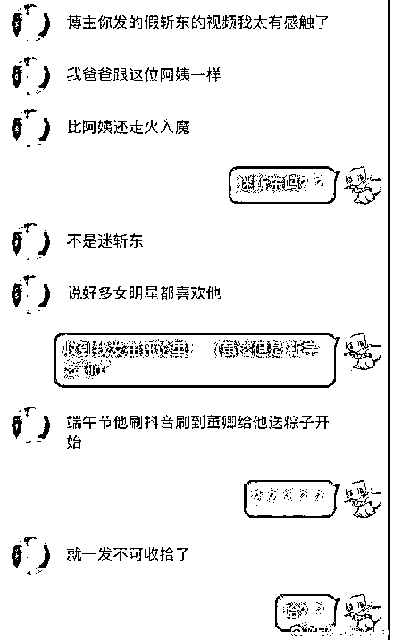

还有某网友的奶奶迷和某网友朋友的妈妈

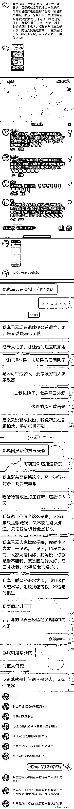

居然还有大 3 学生以为加到王俊凯 qq 的....

也是“钟情妄想”吧...

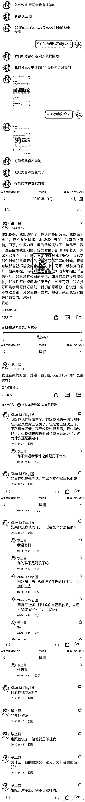

上年纪的人还有点理解，青少年怎么还会这样？

相信广告学科班出身的朋友

应该都上过一门课

《广告心理学》

虽然可能已经忘了具体学了啥

但也基本明白

广告营销，有时候就是在利用人的心理

喜怒哀乐，怨憎恐恶

这不是一件卑鄙的事

但广告是广告

骗，就是骗

在我们看来

“假靳东”们和那些虚假的保健品广告一样

利用弱势群体的无知和渴望

去掏空他们身上所剩无几的东西

甚至是对生活的希望

目前在抖音搜索靳东

已经搜不到结果了

希望平台能够加强管理吧

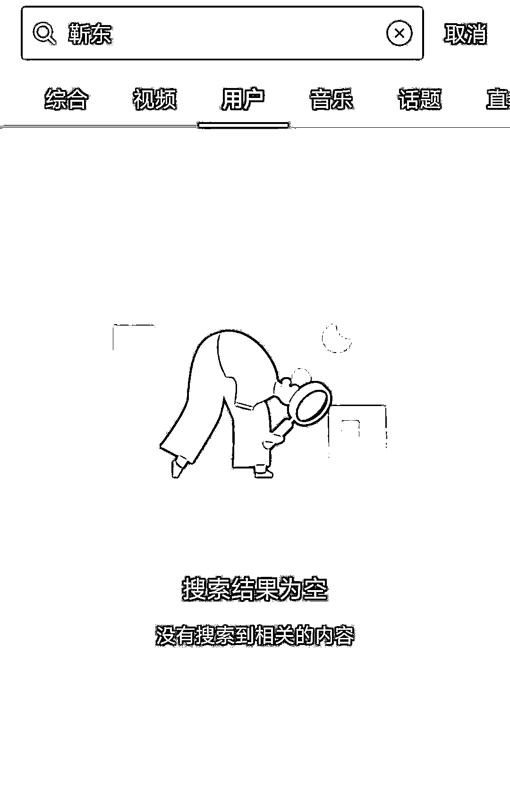

← 向右滑动与灰产圈互动交流 →

