# 30 元邂逅爱情，陪聊哄睡打游戏：爆火的“虚拟恋人”正沦为新型灰产

> 原文：[`mp.weixin.qq.com/s?__biz=MzIyMDYwMTk0Mw==&mid=2247503005&idx=2&sn=01c012de8a409548f11bb05812c0226f&chksm=97cb07a5a0bc8eb3f9fb0a39a48179fd39a5aad204729339e2af15a62becd03f0ff56fbfeab1&scene=27#wechat_redirect`](http://mp.weixin.qq.com/s?__biz=MzIyMDYwMTk0Mw==&mid=2247503005&idx=2&sn=01c012de8a409548f11bb05812c0226f&chksm=97cb07a5a0bc8eb3f9fb0a39a48179fd39a5aad204729339e2af15a62becd03f0ff56fbfeab1&scene=27#wechat_redirect)

点击蓝字“**灰产圈**”关注我们！

> 饮爱情之鸩，止孤独之渴，认真就输了。

“只需花费数十元，就能私人订制男/女朋友，体验一次浪漫恋爱。”

看似天方夜谭般的事情，正在现实中发生着。以主打新型网络情感形式走红的“虚拟恋人”，如同久旱逢甘霖，出道即爆火。

所谓“虚拟男/女友”，指的是在付费前提下，由真人双方通过各类社交平台，以文字、图片、语音、视频等建立临时情感关系，磁性动人的声音，撩拨心弦的情话，让压抑已久的荷尔蒙迅速达到精神高潮。

**消费者不仅可根据喜好选择“恋人”类型，还提供叫醒、哄睡、游戏陪练等个性化附加项目，只有想不到，没有做不到。**

但当情感变成可供交易的商品，“虚拟恋人”上一秒刚挂掉电话，下一秒就能对他人嘘寒问暖。

▲图/电影《Her》

而利益驱动下，服务中大打擦边球的现象屡禁不止，涉黄较为普遍，甚至成了诈骗分子的温床。

“虚拟”二字的含义，表明关系是假的，但其中的“人”，却又保留了真实的感觉，恋爱幻觉背后，更像一场海市蜃楼的乌托邦。

**饮爱情之鸩，止孤独之渴，认真就输了。**

01**聊天哄睡陪打游戏****花万元包月者众多**

人总是矛盾综合体，要享受自由人生，又渴望拥有爱情。

早在 2018 年，我国单身人口已达 2.49 亿，相当于英国、法国和德国人口的总和，且数据连年升高，根据预测，未来单身人口将突破 4 亿大关。

珍爱网对单身青年进一步调查发现，一直母胎 solo 的占据 13%左右，将近 90%的年轻人渴望脱单。

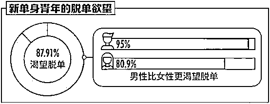

男多女少的现实尴尬，以及高强度的工作节奏，双重催化剂下，越来越多的年轻人失去了时间和心情，而完整的恋爱，必然要耗费大量精力。

与疲于奔命相伴而生的，是与日俱增的孤单感。据《金融时报》调查，80%的人都会有孤独的感觉，难以言说的心事，无法倾诉的惆怅，让“虚拟恋人”的叫座变得理所当然。

“虚拟恋人”的概念并非新事物，其最早起源于日本。**从 2014 年开始，“虚拟恋人”作为网络新兴职业，在国内流行起来。**

淘宝指数显示，虚拟恋人曾创下一天被搜索 24688 次的高频数，巅峰时期，共有 4474 家店铺售卖这项服务。

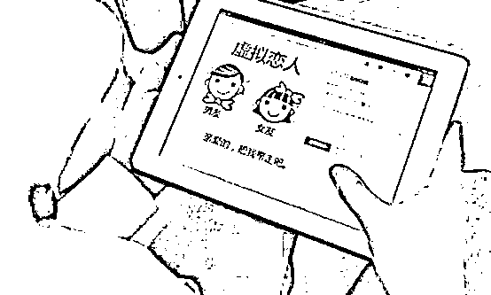

与此同时，“陪我”、“喃喃”等首批以陌生人付费情感社交为主营业务的 APP 迅速上线，“爱情”变得更加随手可得。

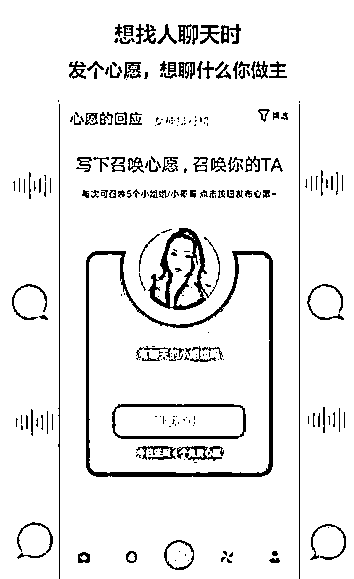

▲“陪我”APP

今年 5 月，一位 B 站上的视频博主“GMH 十三”，为了满足粉丝的要求，体验了虚拟男友服务，一夜间播放量突破 100 万+，喜提热搜的同时，掀起一场全民飓风。

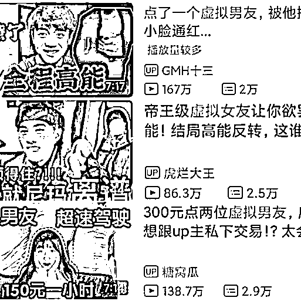

▲B 站上的“虚拟恋人”视频，人气很高

进化至今，“虚拟恋人”的品种已相当丰富，细化程度与购买实体商品有过之而无不及：“女友”有傲娇、萝莉、御姐、邻家、可爱等类型，“男友”则有高冷、暖男、逗比、正太、霸气等类型。

服务业务涵盖虚拟恋人、游戏陪玩、哄睡叫醒、情感咨询、表白帮追等，还可代发短信，代打电话、代写论文，并提供小青蛙、小火车之类的搞笑表演。

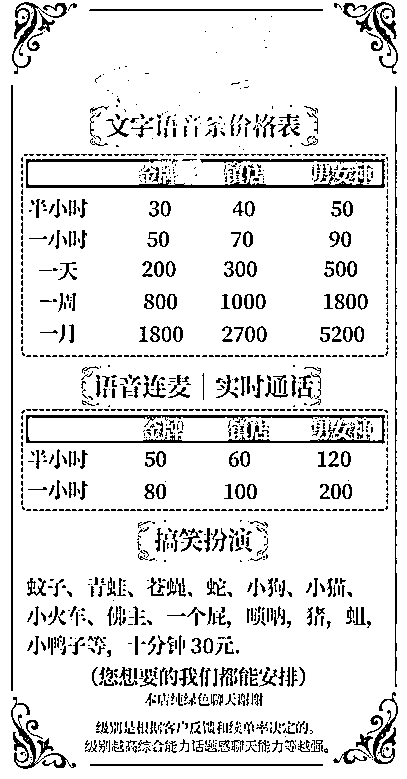

▲某店铺价格表

**只要顾客肯出钱，一些店铺还会专门招募和明星声音类似的“明星音”，或由“虚拟恋人”来扮演动漫人物的性格，全方位满足幻想。**

不用线下见面，没有身份负担，既能保持距离，又能有专注的交流，正中年轻男女的私密情感需求。

并且，虚拟恋人的主导权牢牢掌握在消费者手中，这种绝对满足自己需求的高精准度付费陪伴模式，足以让人疯狂。

有位知乎网友，从 18 年开始，点了一百多个虚拟恋人：“他会包容你的一切，不会问你飞的高不高，只会问你飞那么高冷不冷，他们唯一的任务就是把你哄开心，有人倾听，在乎你的感觉确实很美好。”

“开始有点不好意思，后来就很放得开。”因为害怕和身边的男孩交流，内向的小君（化名）尝试了虚拟恋人服务：“真的就像拥有了一个男朋友，每天充满期待。”

得到寄托后，小君花 10000 元买下了更具性价比的包月套餐。随意点开一些排名靠前的店铺，翻翻评论就能发现，像小君这样一掷万元者并不在少数，销量最高的网店一个月内能售出 2 万多次服务。

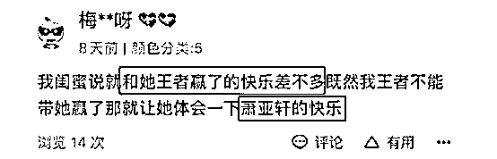

▲服务好评极高

窥得商机的华子（化名）就从体验者变成了服务者，他坦言店铺情况比预想中好得多：“营业一个月以来，每天稳定接单 30 笔左右。”

华子透露，店员的工资按照接单金额的 50%分成，兼职学生居多，也有工作多年的白领：“每天都有人来应聘，但通过率并不高，店要做大就必须提高标准，包括在线时间、声音、类型、年龄等，我都会亲自上阵考核。”

**有人得意，就有人失意。这些社交替代者将人们从自我孤独中解救出来之时，却也引导着他们跌入另一种深渊。**

和女友分手后，阿蒋（化名）通过网络购买了“虚拟恋人”服务，没想到假戏成真，阿蒋爱上了手机那头的“恋人”，表白后向对方提出线下见面发展的要求，却遭到了冰冷拒绝，昔日无微不至的恋人，好像变了一个人。

“我原本是想走出阴影，没想到却陷入了更大的阴影。”阿蒋自嘲，“虚拟恋爱是在金钱关系中建立起来的，而真正的爱情却是去利益化的，千万别过度投入。”

**以野蛮之速生长着的“虚拟恋人”，含情脉脉的面纱下，亦藏着另一副阴暗面。**

02**失控的“虚拟恋人”****灰色地带大量滋生**

白热化的竞争状态下，尽管“虚拟恋人”已衍生出不少升级服务，但价格仍没有太多起伏。

**利益让人甘于铤而走险，于是有人开始突破底线，大肆售卖“软色情”，将整个行业的水搅浑。**

除了正常的陪聊服务，虚拟恋人中还有一种“污单”，包括且不限于文爱、磕炮、裸聊、同城见面等。

因为收费翻倍，这类单子大多要求接单人提前进入“爆照+试音”群，待顾客挑选满意后，关系才算成立，要求中“听话”、“黑色丝袜”、“JK 萝莉”等等敏感词汇屡见不鲜。

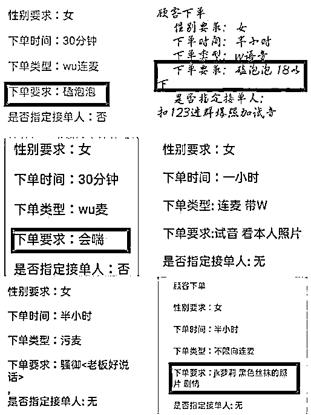

▲尺度惊人

曾有南都网记者卧底进入一个 2000 人的虚拟陪伴 QQ 群，发现 75%的成员都是 00 后，最小的才 12 岁。

细思极恐的是，群里的未成年少女们驾轻就熟地发送着推销名片，照片中不乏性感部位的特写，唯恐在抢单时落了下风，秒接率极高。

不但如此，女孩们还会争相晒“工资”，为月入过万而沾沾自喜，为能赶上潮流而洋洋自得，三观已经扭曲。

深挖下去，虚拟恋人行业甚至还有所谓的“中介”。缴纳入会费后（一般为 30～50 元），介绍人会将意向应聘者拉入“新人培训”的群聊，培训内容除了接单流程、升职、奖励惩罚等，还有一项颇有深意的“代理制度”。

所谓代理，即成员可以通过“外宣”（拉新人）来获得另外的抽成收入。每成功外宣一个人，给群主上缴 8.88 元会费后，剩下的 21 元差价，全部归于外宣人，这种滚雪球的招纳方式，在增加动力的同时，使得新人源源不断涌入。

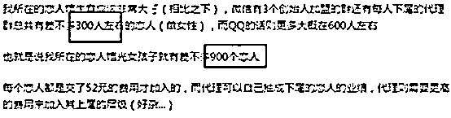

▲水更深的代理

因多次被举报“涉黄”、“危害未成年人健康”等问题，淘宝进行了全面整顿，要求相关店铺出具“100%绿色聊天”承诺书；腾讯也在不断加强对 QQ、微信群聊里的“色情内容”的打击力度。

但由于这类服务多是在社交平台上发生的私人行为，网安部门很难监控，阳光不及的地方，罪恶仍在滋生。

道高一尺，魔高一丈，阵地不断转移和扩大。闲鱼、拼多多、百度贴吧、知乎话题下方都能发现不少出售虚拟恋人服务的商家，留下“一对一表演视频秀”等暧昧文字和联系方式。

事实上，很少有人愿意为几百块就将自己暴露在屏幕上，交钱后不露面，直接将客人拉黑的做法比比皆是，因为交易内容并不光彩，大部分顾客都选择息事宁人，赔钱认栽。

而在某些推出“虚拟恋人”的交友软件上，近一半是穿着暴露的照片，通过浮想联翩的“限时”功能，每张可供看三秒钟，之后则会跳出付费提示，司马昭之心暴露无遗。

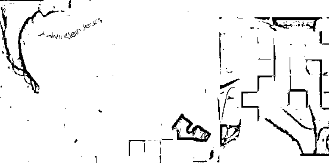

▲X 暗示明显

今年 9 月，上海警方披露了多起借着“虚拟恋人”的幌子，实则以“裸聊”实施诈骗勒索的恶性犯罪案件。

为将犯罪团队一网打尽，上海市公安局不惜成立专案组，抽调百余名资深警力进行抓捕行动，已登记受害人超过万人，遍布全国多省市，平均损失在三万元左右，最高达 40 余万元。

**只要需求存在，买卖就不会停止，可以预见的是，“虚拟恋人”的灰色地带，并不会绝迹。**

03**唯有套路最得人心****续单赚钱才是目标**

实际上，虚拟恋人并非表面看起来那般“平价”，为了享受身居“权利顶峰”的情感关系，顾客需要付出的费用比想象中更多。

当所谓的“男友”或“女友”加上你之后，对方会通过有的放矢的聊天技巧让你卸下心房，在潜移默化中迎合你的喜好，并制造出神秘、新鲜的快感和气氛，当你兴致渐浓时，往往已到服务时间，继续则要续单。

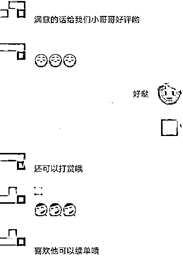

文语聊天的平均价格为 90 元/小时，包月套餐为 6000 元（每天四小时封顶，折后价）；连麦为 200 元/小时，包月套餐为 15000 元（同样是每天四小时封顶，折后价），里面的利润操作空间很多。

说到底，**所有善解人意的体贴，都是架构在等价交换的原则上的各种套路，其首位特征仍然是以“金钱”作为价值衡量。**

毕竟这些服务提供者们身负 KPI 考核，只有续费越多，等级才会上升，不同等级对应不同收费（按从业水平分为金牌、镇店、男女神等），拿到手的工资也越多，谈钱伤感情，不谈钱就没感情。

通过这种付费手段获得的短暂慰藉，如同精神鸦片。何况，这些虚拟恋人的服务提供者，有部分还是尚处于懵懂阶段的学生，很难提供精神上的深层碰撞或心理上的疏导陪伴，更多不过是肤浅的闲言碎语，模板化的话术演练。

另一方面，从业者也并非没有困扰。做到爆单顶流的川佑（化名）就选择了离开，他曾创下同时服务 30 个虚拟女友的最高记录，对于他们来说，由于频繁与客人搭建恋爱关系，“推翻-重建”的程序不断上演，如果没有强大的心理能力，留下的后遗症反而会引起社交障碍。

但无论接受与否，“虚拟恋人”已然成为现代生活的重要部分，连 AI 机器人，也在抢食市场。

今年 1 月，人工智能小冰框架，以女性恋人身份，启动首批限量测试，999 个名额在 2 小时内被申请一空，随后人数被追加到 9999 人；4 个月后，小冰又继续以男性恋人身份，启动第二批测试，7 天内创造出 118 万个专属虚拟男友。

在两次测试中，虚拟男友（女友）的生命长度被冻结在 168 小时，实验结束后，依然寂寞空虚冷。

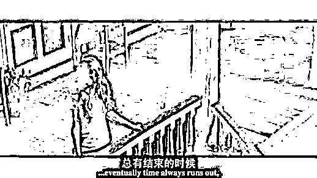

▲图/《分手信》剧照

当所有亲密都能被明码标价，当我们可以任意切换一段激情，看似带来更可控关系的同时，又何尝不是另一种悲哀。

**因为我们终究无法欺骗内心，我们终究要回归现实。**

← 向右滑动与灰产圈互动交流 →

