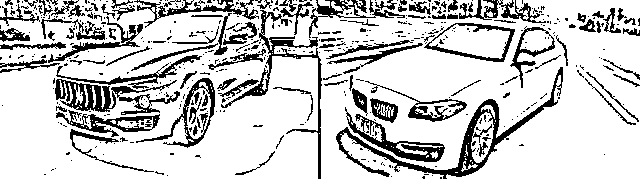

# 400 元牵出数十亿元大案，有人半年输了 3000 万

> 原文：[`mp.weixin.qq.com/s?__biz=MzIyMDYwMTk0Mw==&mid=2247503005&idx=3&sn=9021cfb42b6a9cecd43184c1532402ee&chksm=97cb07a5a0bc8eb3a103754e6c1520f3ca1baaa1316b6054af3bb86c08126c1ffe2ee04ecd7e&scene=27#wechat_redirect`](http://mp.weixin.qq.com/s?__biz=MzIyMDYwMTk0Mw==&mid=2247503005&idx=3&sn=9021cfb42b6a9cecd43184c1532402ee&chksm=97cb07a5a0bc8eb3a103754e6c1520f3ca1baaa1316b6054af3bb86c08126c1ffe2ee04ecd7e&scene=27#wechat_redirect)

点击蓝字“**灰产圈**”关注我们！

“赢只是过程，输才是结果……”

落网的“90 后”犯罪嫌疑人黄某在接受采访时懊悔地说。

2018 年 12 月至 2020 年 3 月期间，黄某在某境外赌博网站上进行非法赌博。

起初投入几百、几千元，之后赌资逐渐增加，不仅输光妻子的陪嫁款 100 余万，还铤而走险利用职务之便，盗取公司账面资金 3000 余万并全部输光。

而这还只是部督“3·10 跨境网络赌博案”露出的冰山一角……

3·10 专案行动部署会

**400 元赌资牵出数十亿元大案**

**跨境赌博网站服务器藏身国外**

2020 年 3 月，河南省周口市公安局港区分局接到辖区一名市民举报，称其在某网站上输掉 400 多元。

通过对该平台的深入调查，一个涉案金额高达数十亿的跨境网络赌博犯罪集团逐渐浮出水面。

经侦查，警方发现这是一家将服务器设在境外的违法网络赌博网站，赌博门类众多，网站规模较大。

而在背后操纵这些赌博网站的主要犯罪嫌疑人，也隐藏在境外。

依靠上下游犯罪产业链，该团伙设计了各种赌博花样，采取让参赌人员先赢后赔的套路，利用赌客嗜赌心理，不断垒高投注金额，使其深陷债务旋涡，造成很多家庭倾家荡产、家破人亡，也导致国内资产大量流失。

为了吸引更多赌客，该赌博网站还将活跃度较高的参赌人员拉拢为“网络赌博平台”代理，利用他们为赌博平台赚取高额赌资。

为了将其彻底套牢，赌博平台还会根据代理人员所拉下线的投注情况，返还千分之一至千分之三不等的佣金。投注越多，代理人员从中获取的佣金越多。

据警方介绍，仅 2019 年 12 月至 2020 年 2 月期间，**该网站的充值会员数就高达 54900 人，资金流水达 80 多亿元**。

警方扣押的部分银行卡

警方扣押的部分现金、黄金首饰

**跨省“断链”**

收到相关线索后，周口市公安局高度重视，迅速成立专案组，以港区分局为主侦力量，抽调全市精干警力，各警种通力配合，迅速开展工作。

经过不懈努力，从研判出的信息流和资金流入手，基本掌握了该网络赌博平台的组织架构、运作模式和部分代理的真实身份。

一条涉及非法赌博、地下钱庄、银行卡倒卖等黑灰产链条的跨境网络赌博犯罪脉络渐渐清晰。

3 月 27 日，公安机关组成 12 个抓捕小组，连夜奔赴广东、湖南、江苏、浙江等 15 省，对犯罪嫌疑人实施集中抓捕，一举捣毁 6 个重大涉嫌贩卡、洗钱犯罪团伙，抓获犯罪嫌疑人 45 人，依法冻结涉案银行卡 976 张，扣押、冻结涉案资金 2000 余万元，为后续打击工作顺利进行打开了局面。

在对涉案人员进行抓捕的同时，专案组民警从研判涉案银行卡的资金流和信息流入手，认真分析每一个涉案银行卡的流水，用足“笨功夫”寻求案件突破口。

从打击境内招赌的代理人员和赌徒入手，对调取的 1500 余张银行卡内近三个月的银行流水进行梳理，初步查清了资金流向，顺线追查，最终突破瓶颈，撕开了口子。

犯罪嫌疑人在 ATM 机取款

其中，何某军贩卡团伙受雇于赌博平台，在国内以每套每月 1000 元的价格，大肆收购银行卡四件套。

他们将银行卡绑定在手机上，通过 ATM 机取现，再以将现金交给指定人员或网上银行转账等方式，帮助赌博网站转移赌资。

2019 年 7 月以来，该团伙共收购银行卡四件套 600 多套，获利 500 余万元。

同时，该团伙还利用赌博网站给其每套卡每月 3500 元的差价，在国内招募人员帮助其从事收购活动，危害极大。

抓捕行动期间，正逢疫情来势汹汹，给警方异地抓捕工作带来重重困难。

据港区分局民警王钢峰回忆，他们除了要做好防护工作，还必须自备干粮。

千里奔袭，时不待人，饿了就靠方便面、面包、牛奶、矿泉水等容易携带和保存的食物充饥。

遇到防控疫情形势严峻的地区，“连宾馆都不能住，就在警车里蹲守几天几夜”。

据负责执行抓捕任务的港区分局案件侦办大队大队长陈伟回忆，通过前期研判，警方锁定了福建省晋江市的蔡某。

仅 1 月份期间，就有 1.7 亿元违法资金转移至蔡某银行卡中，是本案重要犯罪嫌疑人。

经侦查，该犯罪嫌疑人潜藏在镇上的某小区三楼，但他白天基本不出来，晚上也很少出门。

为了不打草惊蛇，专案组民警在单元楼门口蹲守了两天一夜，直到第二天上午，其中一名犯罪嫌疑人从外面回来，在其敲门之际，抓捕人员快速出动实施抓捕，当场缴获大量银行卡、手机、电脑等作案工具，一举捣毁该窝点、查获大量证据。

另一场抓捕行动也同样充满戏剧性。

据港区分局民警牛超回忆，在抓捕负责转移赃款的犯罪嫌疑人王某顺时，发现前期锁定的犯罪嫌疑人窝点已悄悄转移。

后经进一步调查发现，犯罪嫌疑人已搬去隔街的另外一个小区，具体位置不详。

正当抓捕小队在该小区准备下一步行动时，突然，犯罪嫌疑人的车辆出现在民警眼前！

“我们侦查员刚走到这个小区门口，就发现了要查找的车辆，然后我们就派侦查员上前探查。”

此时，有两名男子拉着行李箱、背着双肩包，向嫌疑车辆走来。侦查员敏锐地发现，他们跟要抓捕的对象高度相似！

抓捕小队当机立断，对二人实施抓捕，当场缴获即将转移至珠海的赃款人民币 200 余万元。

经突审，警方在当天下午 6 点又顺利抓获另外两名犯罪嫌疑人。

“有时候刑侦工作就是这样，早一分钟就可能大获全胜，晚一分钟就要多经历一些波折。”

牛超说，侦查员那段时间就跟打仗一样，争分夺秒，脑子反应必须要快。

**精准研判强力攻坚**

** “3·10 专案”再扩战果**

“3·10”专案取得初步战果，案件侦办也进入攻坚阶段。

4 月 16 日，全国公安机关打击治理跨境赌博工作视频会议召开，要求全国公安机关迅速形成对跨境赌博犯罪的压倒性态势。

河南省公安厅要求省、市、县三级层面建立横向多部门协作、纵向多警种合成的有效机制，积极构建上下联动、齐抓共管、协同推进的打击治理跨境赌博工作新格局。

省厅领导专门听取汇报并指导案件侦办，要求专案组坚定必胜信心，采取精准有力的攻坚举措推进案件侦办，并协调省厅相关业务警种对案件侦办提供强力支持。

2020 年 8 月 8 日，该案被公安部列为督办案件。

在公安部、河南省公安厅的统一部署指导下，专案组以“横向拓展网络赌博平台犯罪，纵向深挖各类黑灰产犯罪”为目标，聚焦重点线索，强化精准打击，围绕信息流和资金流追踪溯源，在海量信息中抽丝剥茧，循线追击，精准研判，继续扩大战果。

警方扣押的部分现金

地下钱庄犯罪嫌疑人转移资金时使用的点钞机

截至 9 月 21 日，共抓获各类违法犯罪嫌疑人 123 人，其中代理人员 34 人，赌徒 26 人，涉嫌贩卡、洗钱人员 61 人，提供网络技术服务 2 人。该案还捣毁地下钱庄 3 个；

扣押涉案财物人民币 616.2 万元、港币 60 万元，没收赌资人民币 430.2 万元，共计 1046.4 万元；冻结银行卡 1890 张，冻结银行卡资金 1.23 亿元；扣押玛莎拉蒂等高档车辆 9 台；冻结房产 2 处。

警方扣押的玛莎拉蒂、宝马等车辆

周口市公安局相关负责人表示，下一步，全市公安机关将在重视程度上再加力，在组织保障上再强化，在创新打法上下真功，进一步扩线经营，乘胜追击，彻底斩断这起跨境赌博案件的资金链、技术链、推广链，为维护广大群众合法权益和社会稳定做出应有贡献。

周口警方赴全国多地抓获犯罪嫌疑人

**90 后赌徒狂输 3000 万**

**美容院女老板败光父母养老钱**

随着警方的深入调查，掩藏在案件背后一个个心酸的赌徒故事，也逐渐浮出水面，令人唏嘘。

半年时间，输掉 3000 万！

很难想象，这一恐怖的数字，是由一个月薪仅 7000 元的“90 后”酿成的。

黄某

这名“90 后”黄某，原本是一家大型企业的财务人员，因无意中接触到赌博网站，上演了这场疯狂的赌徒游戏。

“开始的时候几百几千的玩，后来断断续续输了几万，就想投注多一点，哪怕赢个一两把也行。”

从最初只是成百上千的玩，到后来输钱为了翻本开始上万甚至数十万的赌，黄某就跟着了魔似的，四处借、刷信用卡、到处贷款……

在输光了身上的现金后，黄某又偷偷将妻子陪嫁时带过来的 100 多万元也尽数投入其中，“因为自己的一时糊涂，把给小孩准备的钱也都用在了赌博上。”

可怕的是，在败光家里的全部积蓄后，已经输红了眼的黄某仍不知悔改，还一心想着翻本。

此时，已经没有人愿意借钱给他了。

于是，黄某便盯上了公司账户。

他利用自己作为公司财务人员的身份，从公司账户盗用 3000 余万元，转身全部投入到赌博网站中。

仅半年时间，输了个精光。

“每次都是几万几万的投，最疯狂的一次下注 100 多万。”黄某说。

令人啼笑皆非的是，今年 4 月，民警上门对其实施抓捕时，黄某竟仍执迷不悟地说：“让我赢了这一把再走。”

目前，黄某已被批准逮捕，等待他的将是法律的惩罚。

另一名落网赌徒郝某，经历也极为悲惨。

郝某

郝某本是当地一家小有名气的美容院女老板，手上有 3 家美容院，还有房有车。

然而，噩梦从 2019 年 9 月 31 日那天开始。

那天，郝某在朋友李某的鼓动下，下载了一款名叫“统一”的手机 APP。

“当时跟我说这是一款理财软件，可以让我挣钱。”郝某回忆。

下载完软件后，李某便给她介绍了一位“指导员”，还将她拉进“统一”APP 的玩家群里。

“起初，她叫我跟着群里的投注信息投钱，我投了 1000 元，结果输了。”本来也就是玩玩的心态，郝某没有在意，想着就此收手。

但好友李某却不愿意，“让你输了 1000 元，我心里不舒服，你再充 3000 元，我教你赢回来。”

结果，3000 元依旧打了水漂。

但这 3000 元，已在郝某心里种下了一颗嗜赌的种子。

之后，好友李某与所谓的“指导员”又以“保本”、“赢了你分我，输了算我的”等言语诱惑，不断鼓动郝某增加投注。

郝某也一直认为自己只是“运气不好”，一心想要翻本，结果一发不可收拾。

抵押车辆、借高利贷、网贷、向朋友借钱……

郝某通过各种手段，先后筹集了 70 余万元，结果全部在该 APP 上输光。

而她父母、弟弟的钱，也被用来赎回车辆、偿还高利贷。

在公安干警侦破案件的过程中，郝某所谓的“运气”也露出真相。

原来，像郝某这样的赌客在使用该 APP 时，其一切行为都已经被设计好，每场下注都有人在后台操控。

“赢少输多，小赢大输”，看似简单的操作手段，却让深陷其中的赌徒丧失理智。

据警方介绍，这类网络赌博网站通常下设运营部、客服部、技术部等部门，各自扮演拉人、“导师”、操控赌局等角色。

网站先以“充 10000 送 3000”“注册即送现金”等形式诱导人进行在线赌博，之后还会加以“充值返现”“保本跟投”等形式持续吸引赌客加大投入。

层层设置陷阱，步步诱导深入。

众多赌徒也在接触赌博网站后迷失方向。

有人倾家荡产负债累累，有人家庭破裂众叛亲离，有人铤而走险走向犯罪……

等待他们的不仅有法律的严惩，还有此后挥之不去的梦魇。

采访时，赌徒黄某说，第二天就是他 28 岁的生日，要独自一人在看守所里度过了。

“沾上赌博以前，我的日子虽然算不上大富大贵，但也是平平安安。现在回想起来，生活中还有很多值得去关注和留恋的东西，包括跟家人、跟孩子……其实这些远远都大于金钱所能带来的快感，是金钱买不来的……”

然而，从他开始疯狂参与网络赌博的那刻起，这一切，就被自己亲手葬送了……

来源：人民日报

← 向右滑动与灰产圈互动交流 →

