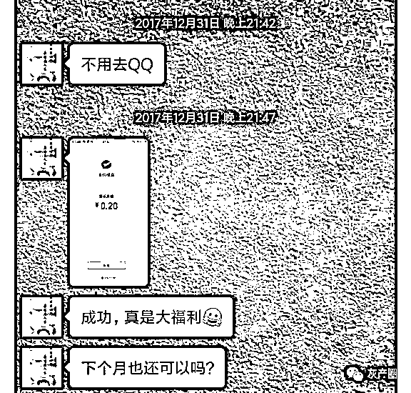
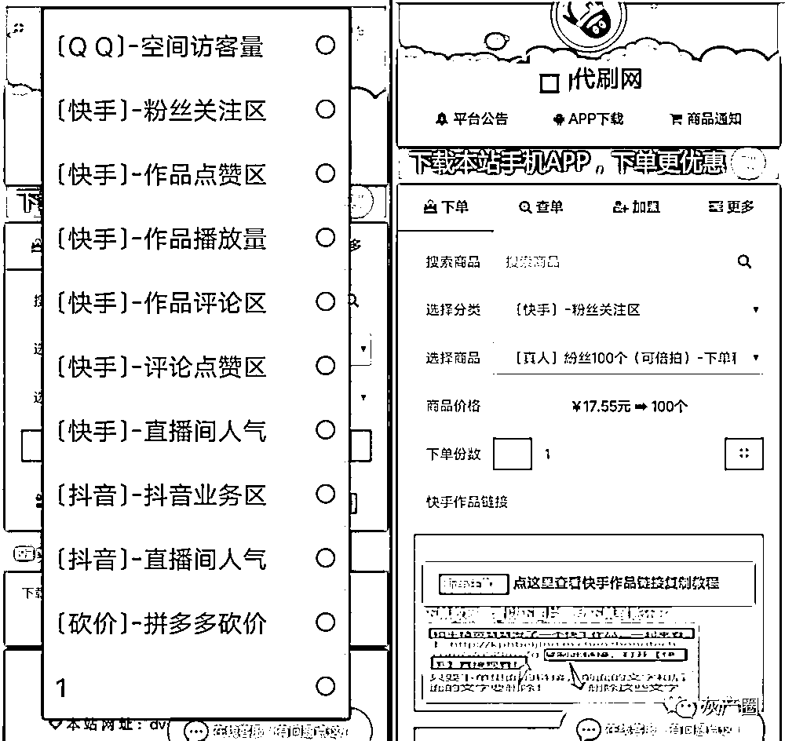
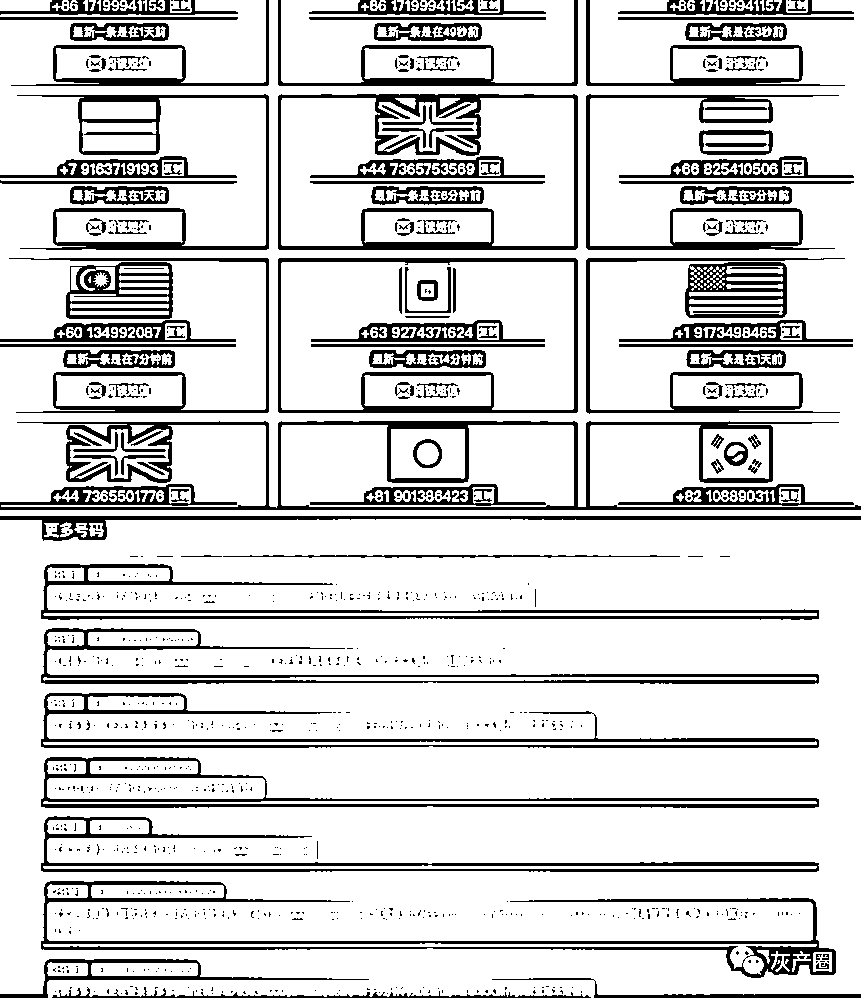
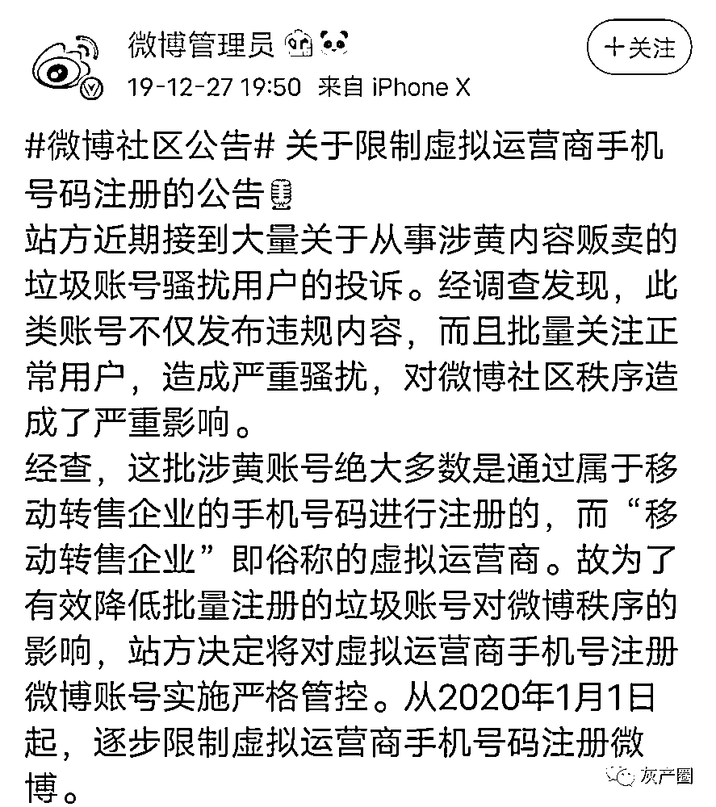
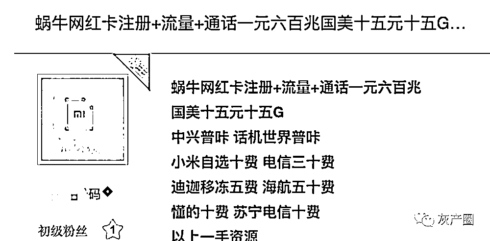

# 刷单、刷粉、薅羊毛，互联网大厂难斗“灰产基建”接码平台？

> 原文：[`mp.weixin.qq.com/s?__biz=MzIyMDYwMTk0Mw==&mid=2247503093&idx=2&sn=254b8a565ef1c1072d1983f547e77c82&chksm=97cb07cda0bc8edba5ccd4a5aec4e1d0d3a1d34ea3b794c2d455feffa6a55acd22bdca4db882&scene=27#wechat_redirect`](http://mp.weixin.qq.com/s?__biz=MzIyMDYwMTk0Mw==&mid=2247503093&idx=2&sn=254b8a565ef1c1072d1983f547e77c82&chksm=97cb07cda0bc8edba5ccd4a5aec4e1d0d3a1d34ea3b794c2d455feffa6a55acd22bdca4db882&scene=27#wechat_redirect)

点击蓝字“**灰产圈**”关注我们！

导语

8 月 16 日，雷军在抖音上首场直播就带货 2.1 亿元，其中巨能写中性笔等很多福利产品“一秒没”。

类似京东、拼多多等电商平台经常举办促销活动，也出现过大量低价“秒杀”商品瞬间被抢光，或许你会因为没能抢到福利商品而懊恼，实际上并不是你的手速不够快，而是薅羊毛等灰产大军太狡猾。

大家熟知的网上刷单、刷赞、刷粉、薅羊毛等业务，往往需要注册大批量的账号进行后续操作，这也就意味着，需要大量的实名制手机号去各平台上注册账号，灰产大军正是创造这些“真实的虚拟”用户，抢走了消费者的福利。

而灰产大军之所以经常得手，得益于一项“灰产基础设施”被开发出来，这个产品的名字是大家还陌生的“接码平台”，它的作用就是接收来自于在各大平台网站注册账号时的验证码，再通过注册脚本，瞬间生成成千上万的虚拟账号，即便抖音这样 AI 算法强大的平台都防不胜防。这也就造成了许多互联网公司的损失，而有时，这种损失甚至是巨大的。

互联网公司难道没有对这类接码平台进行打击吗？答案当然是否定的。但俗语说“冰冻三尺非一日之寒”，接码平台能在各大互联网公司眼皮子底下存活，是有一定特殊的套路和“本领”，正因如此，才使得接码平台至今仍是各大互联网公司的一块挥之不去的“心病”。

**灰产的攻防战**

“最近，雷军在抖音上直播卖货很火，特别是一些例如巨能写中性笔、体重秤等的福利商品，当这些商品开卖的时候，你认为你能够抢到，但实际上一开卖就秒没了。其实并不是这些观众的网速、手速不够快，而是还有比他们更快的人。”知情人士王力说道。

等开播的时候，他们会用脚本将各个账号提前预置不同的地址和联系信息，然后去抢购。由于抖音的相关规定是，5 分钟内未支付会释放该订单，所以他们会提前将有意愿购买的人建一个群，然后就会在该群内进行售卖。

等群里交易成功后，羊毛党会在抖音上支付该笔订单，然后找客服修改地址，或者在快递运输的中途中，将此前预留的收件信息改成买家的，最终完成整个交易。

通过王力了解到的信息可知，一个羊毛党拥有的抖音号，并不能百分百地抢到这些低价商品。但由于账号多，所以抢到的几率也会增大。“10 个账号里至少有 4 个账号，可以抢到商品，就会赚到。”

比如雷军这次直播带货的体重秤，以 10 元的价格抢到体重秤后，羊毛党会以 30 到 40 元的价格转卖脱手，利润是 20 到 30 元不等，而且卖得很快。由于在抖音上有众多的直播带货福利活动，所以他们作案的机会也比较多，往往一个月就能够获利几十万元之多。

这类羊毛党的存在，对于普通用户很不公平，抖音对此也是深恶痛绝，但由于这些羊毛党操作的隐蔽性，以及活动平台方存在防不胜防的劣势，所以导致互联网平台很难根绝这种现象。

当然，目前抖音虽无法有效监测出“接码平台”用户，但是也采取了类似于封账号的措施，虽然仍会有大量利用“接码平台”的用户去抢购一些特价商品，造成商家以及平台损失，但相比以前还是少了许多。而在以前，不仅是抖音，其他互联网平台被羊毛党卷走几千万，甚至上亿资产的事情也发生过，造成的损失更大。

“快来薅腾讯视频的羊毛啊！一个月会员只要两毛。”一位 QQ 群的网友在群内@全体成员说，这是“接码平台”3 年前造成的一次巨额损失事件。

2017 年最后一天，腾讯视频准备了一场“9 折开通腾讯视频 VIP”活动。但由于活动服务器后台出现异常，所以有部分用户进入活动付款页面时，发现只要 2 毛/月。于是一传十，十传百，让不少捡漏的用户一次性充值好几年，甚至几十年的会员。

经腾讯官方的统计，本次系统漏洞共产生了 287 万笔订单，涉及 39 万名用户，薅走了 5000 万元，而腾讯实际订单产生的收费仅 50 万元，造成的损失巨大。

李维曾经历过这件事情的全过程，当时在整个 QQ 群都沸腾了，大家争相去薅羊毛，下手早的人，就在自己的 QQ 号上买了几十年的腾讯视频会员。

除了这些“散兵游勇”之外，还有一部分人发现了其中的“商机”。

据他回忆，那天晚上，他们通过多家接码平台注册的号码多达 300 个，如果不是腾讯修复 BUG 的时间比较快，他们会注册更多的号码进行以上操作。

紧接着，他们将这些带有 3 个月左右腾讯视频会员的 QQ 号，放到专门处理账号买卖上的平台上转手卖出，这样一个 QQ 号标价为 35 元，比在官方上开通 3 个月视频会员的最低价格还便宜 10 元。而一个 QQ 号的注册成本仅为 1.5 元，相当于一个号净赚 33.5 元，300 个号则可以获利 1 万左右，而这仅仅只是他们一个晚上所赚到的灰色收入，其他规模更大的灰产大军薅到的“羊毛”更多。

腾讯视频方面因为是自身的操作失误，所以并没有对这些羊毛党进行大强度的追责。但是腾讯在经历过这件事后，对于再次出现的类似问题，基本采取退款并收回业务时限，严重的甚至封号处理。

除了羊毛党外，接码平台还被应用于刷赞、刷粉等灰产上。例如，最熟悉的微信点赞、抖音点赞、微博刷粉、拼多多砍价这类量级比较大的业务，基本都是利用接码平台完成的。

除此外，还有一部分人则通过在接码平台买验证码，然后去美团、苏宁、国美等平台上抢优惠券，然后低价卖出，以此获利，虽然这样的账号存活率不高，但是短期使用足够。

**起底接码平台：**

**灰产的“基础设施”**

很难想象，薅羊毛、刷粉、刷赞等灰产背后的关键，原来核心是公众并不太熟知的接码平台。

接码平台之所以不可或缺，关键在于灰产业务都需要大批量手机号，且能够接受验证码，去完成各大平台网站的账号注册，通过后续交易获利。因此，接码平台相当于充当了灰产的“基础设施”。

张帅介绍，“接码平台”本质上是一个 WebApp，它由卡商端、猫池、用户端、API、后台等几部分组成。实际上，搭建一个这样的平台，并不需要高门槛的技术，只需要做好验证码的接收，并通过网页完好地显示给用户即可。

卡商是可以批量提供手机卡的服务商，售卖实体或者虚拟手机卡，还可进一步分为短信卡商、语音卡商；卡商单次提供的手机卡往往达到几十张乃至几百张，一个大型的平台可以接纳几百万张手机卡，这里提供的手机卡一般是虚拟运营商的注册卡，因为这类卡具有月租低的价格优势。

而猫池则是一个能插入大量 SIM 卡的设备，猫池提供商一般会给卡商提供大量接受验证码的猫池设备。一般而言，一台普通的台式电脑连接几台“猫池”就可以形成验证码接收平台。

每一个 SIM 卡都会产生一位虚拟的用户，例如，点赞等业务都可以靠这些虚拟用户完成。据一位刷粉网的运营人员透露，他们所提供的粉丝，绝大部分是在接码平台上注册账号生成的假用户，然后买家下单后，他们就开始操作，像刷一万的粉，一般需要一个小时，都是软件自动操作。

为了防止被相关的平台检测到异常状态，他们会将这些账号的 IP 动态调整，而且也不是所以账号都会在同一天刷业务，可能今天用这一万个号，明天就换另外一批号，防止平台的打击。买家一般来自于微博的博主、甚至明星，还有微信、QQ 上的用户，一个月至少有几万元进账。

而且，他们不仅可以接国内业务，从下图中可以看到，接码平台提供的手机号不局限于国内，还有国外的，因为在国外市场上同样有需求。

一位不愿具名的从业者表示，海外的一些在线购物平台经常会发放优惠券，他们会利用国内接码平台上的国外手机注册账号，从而抢夺大量的优惠券，然后在国外的线上交易市场卖出，其业务逻辑与国内基本一致。

接码平台运营方除了对于接刷单、薅羊毛的发起者提供服务外，还会收取一定的佣金，比如一条验证码，接码平台会向需求方收取 1 到 2 元的服务费，但一条验证码短信的成本价是 0.1 元到 0.2 元。由于，灰产需求方通过薅羊毛等，获利远高于这些，所以接码平台收取的服务佣金对于他们并不算高，各取所需。

**互联网公司如何解围？**

正是由于这些灰产的肆虐，导致各个互联网平台上的普通用户的体验受到影响，近期各大互联网平台纷纷重拳出击。

比如，抖音在 6 月永久封禁了 2.7 万个灰产黑产等账号，腾讯 QQ 启动了为期三个月的安全专项行动“绿萝行动”。

而微博则于今年 1 月发布通告，直接采取封禁 170\171 等虚拟运营商的手机号注册微博账号，这意味着间接阻断了接码平台对微博的影响，因为接码平台上的绝大部分手机号是虚拟运营商的，但这样做，也会导致原本正常使用虚拟运营商手机号去注册微博的用户的使用体验。

因此，到目前为止，各大互联网平台除了封有问题账号外，并没有更好的办法去应对在接码平台上滋生的灰产，导致接码平台在与互联网各大公司的“猫鼠对抗”中，难以根除。

行业分析人士认为，实际上，接码平台可以看做是整条灰产产业链的核心，所以治本的关键也就是如何将接码平台取缔。

这些互联网平台为了吸引新用户，往往砸重金做各种用户拉新、促销等活动，甚至导致各种羊毛党利用接码平台攻陷各互联网平台，平台的活动经费大量的落入羊毛党的口袋中，活动的效果大打折扣，有的公司甚至被直接薅到倒闭。

正是因为虚拟运营商的注册卡成本非常低，一张卡只需花费几元左右，而且 0 月租，仅具备接收短信的功能，相比于三大运营商对手机卡的严格监管，虚拟运营商的注册卡轻易满足了接码平台的需求，所以也被大量应用于灰产业务。

值得注意的是，这些虚拟运营商中不乏有苏宁、小米这样的互联网巨头，像国美旗下的极信通信注册卡、小米移动注册卡，以及苏宁的注册卡都曾是接码平台的首选。

在行业人士看来，虚拟运营商需加强对注册卡的管理，特别是部分互联网巨头旗下的虚拟运营业务，同样要加强管理，否则就会导致“羊毛出在自家羊身上”的恶性后果。

为了杜绝接码平台的肆虐，互联网平台也在不断提升防御能力，而且通信行业也在讨论加强法规监管。

8 月 7 日，在“2020 移动转售产业呼和浩特研讨会”上，中国信息通信研究院高级工程师陶承怡表示，有部分虚拟运营商在今年上半年经营困难情况下，难以克服向“灰产”寻求业绩的诱惑，而此处的“灰产”实际上就包括接码平台。

如今，相关部门也在加大打击这些违规甚至违法的接码平台的力度。

这将是一个长期对抗的过程，互联网平台单单依靠一方面的力量，难以取得根本性改观的成效，需要聚合包括政府、运营商、平台企业等多方面的资源和力量，形成合力，才能最终根治这块“心病 ”。

作者：陈桥辉

← 向右滑动与灰产圈互动交流 →

