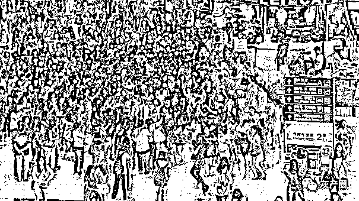
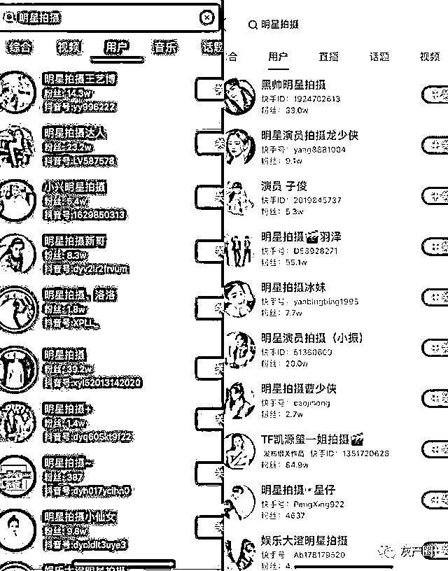
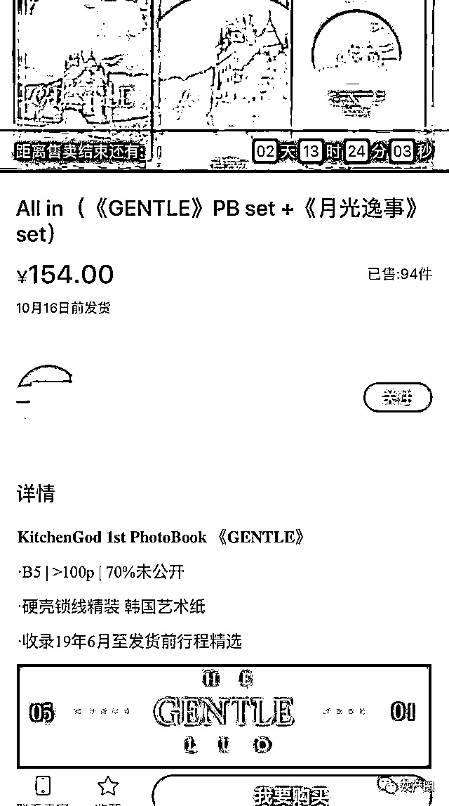
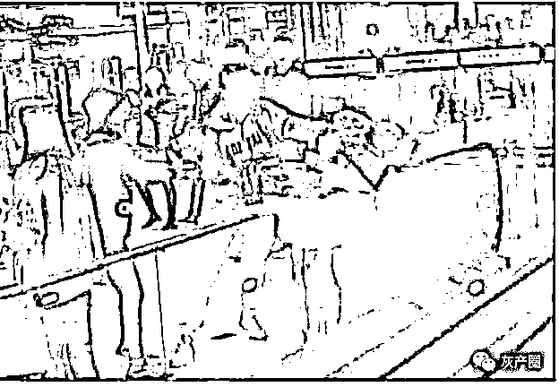
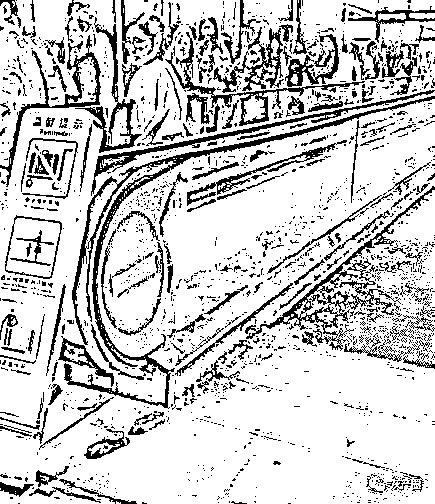
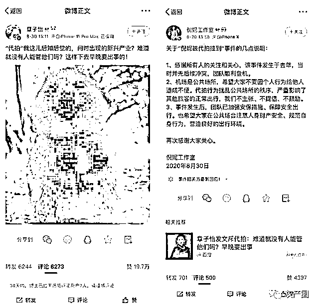
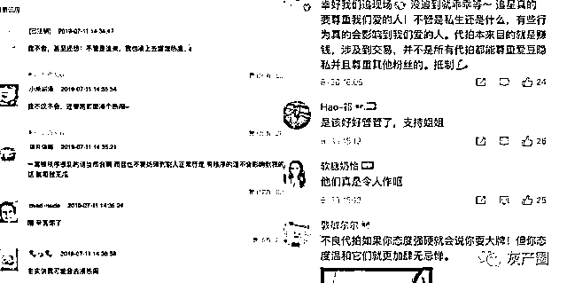
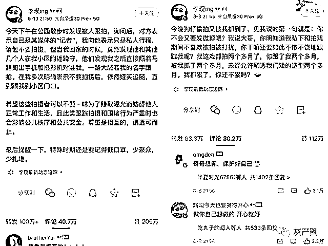

# 代拍如何“割韭菜”？起底粉丝经济下的灰色产业链

> 原文：[`mp.weixin.qq.com/s?__biz=MzIyMDYwMTk0Mw==&mid=2247503093&idx=3&sn=92141d24733848d8fdfeb7a2f8ae2d41&chksm=97cb07cda0bc8edb0e165e2efdb3d81dccbc3074a9d0704df714847f59d0f581cac0cf7e6d89&scene=27#wechat_redirect`](http://mp.weixin.qq.com/s?__biz=MzIyMDYwMTk0Mw==&mid=2247503093&idx=3&sn=92141d24733848d8fdfeb7a2f8ae2d41&chksm=97cb07cda0bc8edb0e165e2efdb3d81dccbc3074a9d0704df714847f59d0f581cac0cf7e6d89&scene=27#wechat_redirect)

点击蓝字“**灰产圈**”关注我们！

如今社会上，有一类职业横跨多个领域，其主要工作是代替别人做事。

代替人买东西、拍视频、拍车牌，在多年之前就兴起的各种淘宝商家代办签证，还有活跃在微信朋友圈的代购，这些都属于“代”职业的一种。

很多人选择“代”职业替代自己主要是因为不在现场、不会操作或者减少时间精力成本等，而做“代”职业的人也可以从中获利。

"代"职业发展到现在已经形成了一个完整的产业链。代拍作为“代”职业的一种，是粉丝经济下衍生出的灰色产业链，发展速度极快且不可小觑。

代拍主要是代替那些不能去现场拍摄明星照片或视频的粉丝们赶赴现场代为拍摄，并收取一定费用的行为。主要活动范围包括机场、演唱会和片场等特定地。

代拍为什么会走红？其中暗含多少乱象？明星艺人对此又持哪种态度？

**一、代拍为什么这么火？**

随着互联网的崛起和国内娱乐行业的发展，通过社交媒体平台上的官网工作室、明星站子分享的明星工作和生活日常照片，成为粉丝获取明星动态的主要渠道。

国内各种影视综艺节目的开播，明星效应越发显著，国内娱乐市场已经达到一个饱和的状态。

由于电视剧电影都有特定播放期播完即没，综艺也多为季播节目，粉丝能看到的明星动态是有限的。

但粉丝对明星动态的需求是随之上升的，很多明星站子会专门从代拍手上买现场照片和视频来维持一个长期的对外曝光率，“明星代拍”这个职业逐渐走红。

▲来源：新华财经网

对于一些希望距离喜欢的艺人更近一点的粉丝来说，机场、片场和演唱会是粉丝们跟拍的主要路径。

通常情况下，艺人的节目或活动主要安排在一二线的大城市，如北京、上海、长沙、广州、重庆等地，因此很多在其他城市的粉丝就会找代拍来拍自己喜欢的明星偶像的机场照。

机场接机的粉丝数量侧面能反映出一个明星艺人的流量程度，很多时候，明星也希望通过粉丝接机的方式来展现自己的人气，甚至有部分明星会雇专门的摄影师来拍机场照片。

**二、“粉丝经济”下的代拍乱象**

代拍主要分为两种类型：一种是使用专业相机拍摄现场照片，然后卖给粉丝或者制作周边来赚取利润；另一种是以直播的形式拍摄明星走机场的全过程来获取流量从而变现。

在“代拍”这个职业刚刚兴起的阶段，大多数代拍者为粉丝，其也会在接机过程中通过拍摄照片来获取一些小额利润。

大众对代拍所拍摄的照片和视频的需求导致了行业的兴起，但这其中也不乏乱象丛生。

随着代拍市场的越发膨胀，越多越多人开始进入这个行业，鱼龙混杂的代拍市场里，有一群人与普通代拍者有着最大的区别：他们在拍摄过程中，没有底线、缺乏原则。

▲某平台的代拍账号

比如，不同角度拍摄的照片和视频相对的价格也不同，多数代拍会长期跟随着明星的一举一动来拍摄视频和照片获取利润。

据查询，明星对视镜头的照片和不看镜头的照片，以及和其他人合影的代拍价位不一。对视的照片会比不看镜头的照片卖价更高，合影的价格基本都在千位数字以上。

就现在的娱乐市场来说，cp 粉主要来源于剧粉和组合中，而 cp 粉的存在也让代拍市场发展更加多样化戏剧化。

在一个组合长期处于未合体的状态或者参演的影视剧结束的时候，一起参与活动时的同框照片在代拍市场会被炒到天价，毕竟对于 cp 粉来说，同框照片可谓"一张难求"。

据了解，去年年末出席了许多盛典的易烊千玺，个人的 10 张照片已达到数百元的价格，而易烊千玺和王俊凯、王源的同框照片的价格则成倍增长，达到上千元的价格。

流量也是定价的一个关键因素，一线明星的照片是粉丝们愿意花高价购买的。这就相当于统一品种的蔬菜摆在一起售卖，从国外进口的白菜会比普通市场上的白菜价格高出一倍。

据在线导购平台返利网发布的最新消费数据显示，追星的男女粉丝比例为 1 : 4, 女性占绝大部分。其中作为粉丝经济的主要产物的明星周边的绝大部分消费者为未成年人。

许多代拍或站姐会将所拍到的照片做成一个 photo book 售卖，平均一个 pb 的价格为 100-200 左右不等。“一夜暴富”对于部分站姐和代拍来说不难实现。

在目前的市场来说，女性和未成年是代拍的经济来源的基础。粉丝对照片的需求也使代拍可以名正言顺的“割韭菜”。

**三、明星艺人：不主张，不提倡，不鼓励**

近日，各种关于代拍、明星个人信息泄露、公共场所安全的问题频上热搜。

早在 2019 年，吴京怒斥代拍的视频就登上过热门新闻。从相关报道中可以看出代拍为了拍摄吴京的机场照片，不顾机场行人的走向，差点撞到路人小孩，吴京对此态度十分气愤，而代拍对此却毫无反应。

同年，一名机场代拍和粉丝在争斗最佳拍摄角度时，产生了争执，代拍直接动手并对粉丝造成了肢体行为伤害。大部分都是看客，现场一度十分混乱。

▲来源：Angelababy 粉丝被机场代拍锁喉视频截图

诸如此类的消息经常出现，机场追星造成踩踏事件的几率非常高。在 2019 年 4 月 20 号，上海虹桥机场就发生过因推搡而挤碎机场玻璃的事件，代拍和粉丝在机场追星过程中严重影响了公共秩序。

▲来源：妆点网

针对代拍产业，艺人们也纷纷对此表达了明确的态度。知名演员章子怡不禁发文表示对代拍产业兴起的质疑，并希望有关部门对代拍产业进行一定的管控。

倪妮工作室也对代拍热门事件作出了回应，"代拍行为扰乱公共场所的秩序，严重影响了其他旅客的正常出行，我们不主张、不提倡、不鼓励"。

▲来源：艺人微博截图

有网友表示自己在场的话也会处于看戏状态，会上前拿出手机蹭蹭热度。也有一部分网友表示机场追星影响了秩序，并对此现象唏嘘不已。

▲来源：豆瓣评论和微博评论

同时，有网友表示，代拍行为应该被抵制，并对机场追星持不支持的态度。“机场追星是具有一定的风险性的。这对社会安全秩序造成了很严重的负面影响。在混乱中，没有人能够保证你的生命安全”。

**四、灰色产业链下的犯罪试探**

曾有报道针对机场代拍事件，采访到了四川省委党校社会和文化教研部教授肖尧中。

教授表示，“隐私是一个相对概念，公众人物的隐私度要比一般人宽泛一些。但是，在公众场合里，如果拍照不是专门去盈利的，那么这种行为就没有问题；反之，如果拍照成了一种盈利的行为，那么拍摄者是需要获得被拍摄者的许可的”。

根据《中华人民共和国治安管理处罚法》第二条规定，扰乱公共秩序，妨害公共安全，侵犯人身权利、财产权利，妨害社会管理，具有社会危害性，依照《中华人民共和国刑法》的规定构成犯罪的，依法追究刑事责任；尚不够刑事处罚的，由公安机关依照本法给予治安管理处罚。

由于追究刑事责任的手续繁杂且周期长，通常明星在被侵害相关权益时会选择采取口头和公开发文警告的方式。

早在 2020 年 5 月 13 号，艺人李现就在微博发声警告代拍不要影响公共安全和他人生活，相隔 2 个月后，又再次针对代拍行为发声警告。

无论是普通人还是明星，个人的空间和时间是一个人可以支配的基本权利，而对于明星而言，工作以外的日常生活却仍被时时刻刻监控着，长期摄像头所带来的压迫给艺人造成了很大的烦恼和压力。

虽然许多明星多次发博文警告，但代拍产业依旧盛行的主要原因是很难从根本解决代拍问题。

在大众的需求下，他们必须完成自己的“工作”，只要有粉丝购买艺人的照片或通过直播关注，代拍行业就不会消失。

而且很多情况下，部分艺人也会选择与代拍达成“双赢”的合作。因为部分艺人会直接使用代拍所拍摄的机场照片来减少宣传和修图成本。

作为粉丝经济灰色衍生品的代拍行业已形成了一个完整的产业链。名人对代拍不是选择发声、合作就是选择沉默，吃瓜群众有人痛恨有人无所谓，而机场追星又确实会对路人正常的出行造成一定的困扰和影响。

所以，相关安全部门依旧需要针对公共场合追星带来的影响作出及时回应和采取有力措施，受到伤害的明星也要主动维权并引导粉丝理性追星。而作为粉丝，离艺人的作品近一些，离生活远一点，也不乏是对偶像本人最大的尊重。

来源：蓝鲸浑水

← 向右滑动与灰产圈互动交流 →

