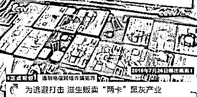
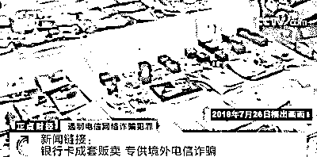
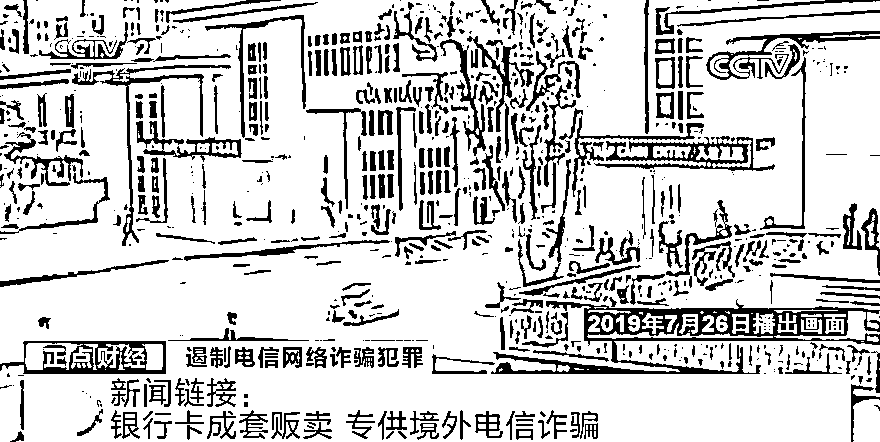
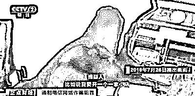
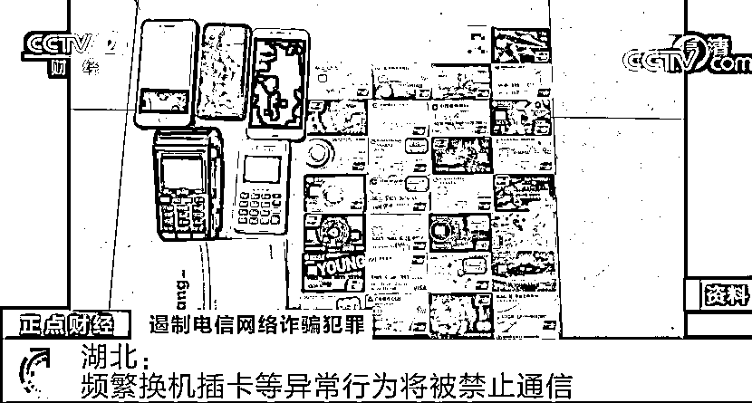
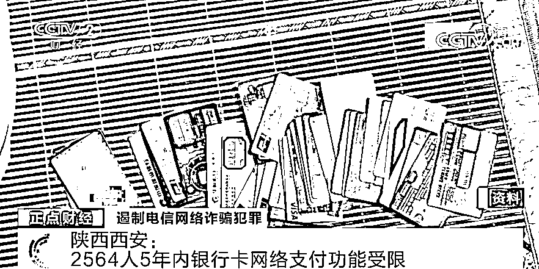

# 严打！全国开展“断卡”行动！再见了，银行卡电话卡黑产！

> 原文：[`mp.weixin.qq.com/s?__biz=MzIyMDYwMTk0Mw==&mid=2247503093&idx=4&sn=96abc4d39681f4f16a545c23604bf2a9&chksm=97cb07cda0bc8edbe10f46d1898f863b8d9cd8a123c0e2ced2011e1a02e30c614d7788a83b4e&scene=27#wechat_redirect`](http://mp.weixin.qq.com/s?__biz=MzIyMDYwMTk0Mw==&mid=2247503093&idx=4&sn=96abc4d39681f4f16a545c23604bf2a9&chksm=97cb07cda0bc8edbe10f46d1898f863b8d9cd8a123c0e2ced2011e1a02e30c614d7788a83b4e&scene=27#wechat_redirect)

点击蓝字“**灰产圈**”关注我们！

尽管电信网络诈骗手段不断翻新

但万变不离其宗

都离不开手机卡和银行卡

去年

警方就曾破获

一个特大贩卖银行卡案

[`mp.weixin.qq.com/mp/readtemplate?t=pages/video_player_tmpl&action=mpvideo&auto=0&vid=wxv_1558514702471725058`](https://mp.weixin.qq.com/mp/readtemplate?t=pages/video_player_tmpl&action=mpvideo&auto=0&vid=wxv_1558514702471725058)

△央视财经《正点财经》栏目视频

**银行卡成套贩卖**

** 专供境外电信诈骗**

2019 年 7 月，一个在境内办卡，在境外实施诈骗的特大买卖银行卡犯罪网络被警方摧毁，600 多名犯罪嫌疑人落网。警方缴获银行卡 11000 多张、企业对公账户 1800 多个。

这是警方在广西凭祥市内一个窝点内查获到的银行卡。这些准备被送往境外的成套银行卡被分为“小套”和“大套”两大类，其中，包含有私人银行卡、手机卡、U 盾、身份证“四件套”称为“小套”，而同时含有公司营业执照、公司印章、银行卡、对公账户的则称为“大套”。这些整套用于诈骗犯罪的工具，近几个月内从全国各地汇集到广西凭祥市内的一家快递公司，再由这家公司安排人员运到越南，通过越南空运到菲律宾，最终流入东南亚各电信网络诈骗犯罪窝点。那么，**这一万多套银行卡又是如何办理出来的呢？**经过调查发现，**有大量从事银行卡非法交易的中介收购卡证、雇佣开卡人员开设银行卡，随后贩卖银行卡，**形成了一个巨大的黑灰产业链。在深圳市内的三和人才市场外围，活跃着这些买卖银行卡的黑中介，当记者刚走到三和人才市场外，就有人以又清闲又能赚钱的噱头，向记者推荐起买卖银行卡的生意。

让记者跟随他们去广州市，去工商部门注册空壳公司，去银行开设企业对公账户，办理成套的银行卡，然后以 2000 元一套的价格卖给他们。这种“大套”的银行卡会几次倒手，并层层加价，**最终以 15000 元左右的价格卖到境外的电信诈骗团伙。**这种非法交易已扩大到全国 27 个省市区，警方在全国共查获 567 个买卖银行卡的窝点。 

**国务院部署 **

**在全国范围内开展“断卡”行动**

10 月 10 日，国务院打击治理电信网络新型违法犯罪工作部际联席会议部署在全国范围内开展“断卡”行动，严厉打击整治非法开办贩卖电话卡、银行卡违法犯罪。

[`mp.weixin.qq.com/mp/readtemplate?t=pages/video_player_tmpl&action=mpvideo&auto=0&vid=wxv_1558513463340105732`](https://mp.weixin.qq.com/mp/readtemplate?t=pages/video_player_tmpl&action=mpvideo&auto=0&vid=wxv_1558513463340105732)

△央视财经《正点财经》栏目视频

对公安机关认定的出租、出售、出借、购买银行账户或者支付账户的单位和个人及相关组织者，假冒他人身份或者虚构代理关系开立银行账户或者支付账户的单位和个人，实施 5 年内暂停其银行账户非柜面业务、支付账户所有业务，并不得为其新开立账户的惩戒措施。

同时，制定出台对出租、出借、出售、购买电话卡的失信用户的惩戒措施，公开曝光一批开办涉案“两卡”较多的营业网点和行业人员。

**多地出台措施**

近日

四川、湖北等地也都出台了具体措施

从源头卡住电信诈骗高发势头

[`mp.weixin.qq.com/mp/readtemplate?t=pages/video_player_tmpl&action=mpvideo&auto=0&vid=wxv_1558515295042994180`](https://mp.weixin.qq.com/mp/readtemplate?t=pages/video_player_tmpl&action=mpvideo&auto=0&vid=wxv_1558515295042994180)

△央视财经《正点财经》栏目视频

**四川：设黑名单**

**限制涉嫌诈骗人员办通信业务**

9 月 27 日，四川省通信管理局、四川省公安厅联合印发了《四川省涉嫌电信网络诈骗电话用户黑名单管理意见（试行）》，从即日起对电信网络诈骗涉案人员、涉案电话号码登记人员和单位等涉嫌电信网络诈骗电话用户实施黑名单管理，在黑名单管理期内最多可允许持有 1 个移动电话号码，没有移动电话的也只能办理一次新入网号卡业务，限制周期最长为 5 年。申请解除黑名单限制的用户，需到公安机关、通信管理部门提出申请。

**湖北：****频繁换机插卡等**

**异常行为将被禁止通信**

在湖北，公安机关近期联合当地通信运营商，发布加强移动电话号码开卡管控措施的公告。对开卡后 24 小时内未正常使用的；频繁换机插卡或频繁补换卡的；短期内多次新开号码或同一证件在同一运营商开办多张号卡的；存在高频呼出、静默未使用等其他异常用卡行为的，暂停通信服务。

**陕西西安：****2564 人**

**5 年内银行卡网络支付功能受限**

近日，西安市多部门共同开展联合惩戒，首次向相关单位移送了第一批涉嫌买卖或出租个人银行卡、对公账户、电话卡等法人主体和个人名单，并要求实施惩戒。目前，全市累计通报惩戒买卖对公账户法人代表 1041 人，惩戒买卖手机卡、银行卡、法人代表 1523 人。这些被惩戒人员在西安地区五年内不能新开立个人银行卡、手机卡，其网络社交工具和网络支付工具相关功能也将受到限制。 

**明知犯罪 **

**仍提供支付结算帮助或触犯刑法**

事实上

贩卖“两卡”不仅会受到严厉的惩戒

还会触犯刑法

[`mp.weixin.qq.com/mp/readtemplate?t=pages/video_player_tmpl&action=mpvideo&auto=0&vid=wxv_1558515647414861827`](https://mp.weixin.qq.com/mp/readtemplate?t=pages/video_player_tmpl&action=mpvideo&auto=0&vid=wxv_1558515647414861827)

△央视财经《正点财经》栏目视频

《刑法》第 287 条，对帮助信息网络犯罪活动罪做出规定：明知他人利用信息网络实施犯罪，为其犯罪提供支付结算等帮助，情节严重的，处三年以下有期徒刑或者拘役，并处或者单处罚金。

来源：央视财经、广州普法

← 向右滑动与灰产圈互动交流 →

