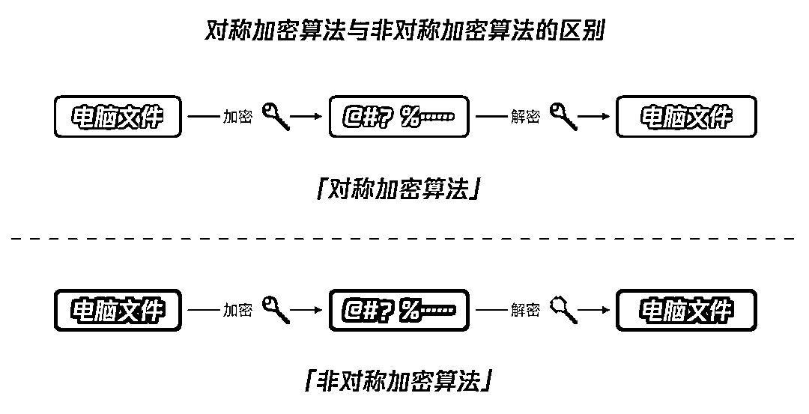

# 勒索病毒 | 普通人“自救指南”

> 原文：[`mp.weixin.qq.com/s?__biz=MzIyMDYwMTk0Mw==&mid=2247503137&idx=2&sn=42fb9945077549740a69da081189e28e&chksm=97cb0619a0bc8f0fe6528b330822e9896da12fb1ce38dbdf8fb0360dfb0f33d7c081524c3f8f&scene=27#wechat_redirect`](http://mp.weixin.qq.com/s?__biz=MzIyMDYwMTk0Mw==&mid=2247503137&idx=2&sn=42fb9945077549740a69da081189e28e&chksm=97cb0619a0bc8f0fe6528b330822e9896da12fb1ce38dbdf8fb0360dfb0f33d7c081524c3f8f&scene=27#wechat_redirect)

点击蓝字“**灰产圈**”关注我们！

近日，公安机关在“净网 2020”专项行动中，成功侦破一起由公安部督办的特大制作、使用勒索病毒破坏计算机信息系统从而实施网络敲诈勒索的案件。据官方消息，犯罪嫌疑人巨某是全国公安机关抓获的首名比特币勒索病毒的制作者。截止案发，巨某已先后向 400 多家网站和计算机系统植入敲诈勒索病毒，受害单位涉及医疗、金融等行业，非法获利的比特币折合人民币 500 余万元。**勒索病毒就像是游走在互联网里的有害细胞，形式多变且难以捉摸。而它的蔓延，给企业和个人都带来了严重的安全威胁。**所以，今天鹅师傅就来扒一扒关于勒索病毒的那些事以及普通人应该如何有效“自救”。

1

****勒索病毒的发展史：由个人化演变为产业化黑产链**********1、原始期：**********大家知道最早的勒索病毒是什么时候出现的吗？其实早在 1989 年，第一个勒索病毒（AIDSTrojan，又名“艾滋病特洛伊木马”）就已经诞生了！********这个木马会以“艾滋病信息引导盘”的形式进入系统，把系统文件替换成含病毒的文件，并在开机时开始计数，一旦系统启动达到 90 次，木马就会隐藏磁盘的目录，C 盘全部文件也会被加密，从而导致系统无法启动。而这时，电脑屏幕就会弹出一个窗口要求用户邮寄 189 美元来解锁系统。****************2006 年，我国首款勒索软件 Redplus 勒索木马出现。这个病毒并不会删除电脑里的文件，而是把它们转移到一个具有隐藏属性的文件夹里，然后弹出窗口要求用户将赎金汇到指定的银行账户，金额从 70 元至 200 元不等。********这个时期的勒索病毒还处于萌芽阶段，传播途径主要通过钓鱼邮件，挂马，社交网络的方式。********所谓的挂马就是用户在浏览有安全威胁的网站，系统会被植入木马感染勒索病毒。********而钓鱼邮件这种传播方式算是病毒界比较老套路的传播方式了。攻击者会以广撒网的方式大量发送含有勒索病毒的文件，一旦收件人打开该文件或链接，勒索软件会以用户看不见的形式在后台静默安装，然后实施勒索。********但由于过去技术有限，大多勒索病毒都存在着漏洞，很容易就会被识别破解，加上这阶段交付赎金的方式多数以邮寄现金和转账为主。********而这种交付形式，真的很不适合勒索病毒，**不管是邮寄的地址还是转账的账号，都很容易暴露黑客的行踪，为了几百块的勒索金就这样铤而走险就像玩过家家一样，**特别不划算。**********2、成长期：**********2013 年是勒索病毒发展的一个重要的“分水岭”。CryptoLocker 病毒作为首个采用比特币作为勒索金支付手段的加密勒索软件出现了！****************（图片来源网络）**** ****这个时期的勒索病毒一般使用 AES 和 RSA 对特定文件类型进行加密，而这种加密算法就现在的计算技术来说，几乎是没办法破解的。********那为什么黑客们会喜欢选择比特币呢？********像**比特币这样的虚拟货币可以完美地隐藏黑客的身份**，完全匿名且不受各种金融限制，几乎很难从一个比特币账户追查到另一个。让整个交易过程难以被追踪。********让被勒索者把钱放在公园第三个垃圾桶旁边，或者从过街天桥丢下这些熟悉的桥段，真的只会在电影里出现了，黑客们再也不用为因收钱而暴露的风险操心了······**********3、成熟期：**********2017 年，一款名叫“WannaCry”的勒索病毒席卷了全球 150 多个国家。相信各位即使自己电脑没感染过这个病毒，也曾有所耳闻。********那为什么“WannaCry”的传染力如此之强呢？主要是因为一个叫 “The Shadow Brokers” 的黑客组织把它的病毒攻击工具和用于加密的密码公布到了网上。换句话说，无论是谁都可以下载下来并进行远程攻击利用。而这一思路恰恰为黑产分子打开了“新世界”的大门！**********在这个阶段，勒索病毒逐渐演变成了产业化模式，并形成了一条完整的黑产产业链。******************从勒索病毒作者、勒索实施者、传播渠道商、代理等等，各环节分工明细。而攻击的对象不再仅限于个人，更多的是针对企业，尤其是中大型企业，让企业核心业务网络陷入瘫痪，而不得不缴纳巨额的赎金。********收到赎金的黑客们会将钱分批转给病毒制作者和各渠道的合作商。当然啦，这些钱的大部分都落入了勒索者和组织运营的平台，其他环节虽然分成不多，但“薄利多销”，总数还是很可观的。****************（勒索病毒演变历程）**** ******勒索病毒演变到今天，已经不再是单纯的个人行为，而已经形成小具规模的成熟产业链。******

****2****

******勒索病毒究竟是个什么东西？**********勒索病毒是黑客通过锁屏、加密文件等方式劫持用户文件并以此敲诈用户钱财的恶意软件。********就像我们人体会通过喷嚏、咳嗽、说话感染到病毒那样，电脑也会通过系统漏洞或网络钓鱼等方式感染到勒索病毒。********目前大部分勒索病毒所用到的加密方式就是非对称加密算法或者对称与非对称混合加密。**********什么是对称加密算法？什么是非对称加密算法？******************对称加密算法（如：AES），就是使用相同的密钥进行加密和解密。而非对称加密算法（如：RSA），加密和解密使用的是不同的密钥。****************使用非对称加密算法，会同时产生一对密钥，一把是公钥，一把是私钥。**非对称加密常见的用法有两种：一是公钥加密，私钥解密；另外一种就是私钥加密，公钥解密。两种方式，应用场景各有不同。**********鹅师傅举个例子说明：********隔壁的女神如花准备用“情书招亲”的方式挑选夫婿，广邀村里的有志青年前来大展身手。她在家门口设置了一个信箱，该信箱由“情书投递”和“结果公布”两部分组成。********前来应聘的青年可直接将写好的情书放进“情书投递”处，但打开“情书投递”处取出里面的情书需要密码，该密码只有如花一人有，以确保所有的情书内容只有如花一人知道，避免相互抄袭，确保公平竞争。此处的信箱就相当于公钥，是公开的，谁都可以往里放信件，相当于谁都可以用公钥来加密。但打开信箱的密码只有如花自己有，相当于解密的私匙，由加密者自己持有。**这是公钥加密，私钥解密的应用场景。**********两天后，如花已挑中如意郎君张三，准备公布结果，他把张三的名字写在纸上放进“结果公布”信箱，往该信箱里投递需要密码。该密码同样只有如花一人有，避免街对面的东施嫉妒使坏，将奇丑无比的李四放进邮箱内，让如花错嫁李四。但从该信箱里取出邮件却不需要密码，直接倒出来即可，该方法如花已事先告诉了所有人，众人用该方法顺利取出了招亲结果。此处投信的密码相当于私钥，而取信的方法相当于公钥，用私钥加密的目的是为了确保该结果确实是如花发布的，实际上是进行签名，而不是为了加密。**这是私钥加密，公钥解密的应用场景。******

****3****

********勒索病毒都是怎么来进行加密的？**************首先病毒制作者 A 基于 RSA 或椭圆曲线的原理，在自己电脑上生成私钥 A 和公钥 A；然后在目标电脑 B（也就是被植入了勒索病毒的电脑）上随机生成私钥 B 和公钥 B；接着用公钥 B 把目标电脑 B 的文件进行加密，同时用公钥 A 加密私钥 B；最后删除目标电脑 B 上的私钥 B、公钥 A 以及数据。************************等被勒索的用户 B 支付完赎金后，病毒制作者可以通过自己手上的私钥 A 解出私钥 B，再用私钥 B 来解密用户的数据。************中了勒索病毒就像有人用一个非常非常复杂的锁，把你的房子锁上了。能解开这个锁的钥匙掌握在上锁的黑客手里，你是没有的，而且以你现在的开锁技术，也没办法在零损失的前提下强行把这个锁破开。**************既然你无法打开这把“锁”，那有没有其他专业的“开锁匠”能解开呢？我们又如何发现自己“房子”被上的是哪一类“锁”？**************************首先，我们可以通过下面 3 种情况来判断自己的电脑是否中了勒索病毒：******

> ******①服务器、数据库无法正常运作，比如服务器无法登录；******
> 
> ******②访问服务器、数据库出现勒索提示信息，比如连接服务器或数据库时出现索要赎金信息；******
> 
> ******③电脑文件名被修改，添加后缀名，比如在文件名后添加随机字符。******

******如果确定自己电脑中了勒索病毒，那么根据被加密文件的后缀名和勒索信息，我们就可以在网络上搜索到自己中的是哪一种病毒。************但**目前来说，大部分的勒索病毒基本是无解的，**有两种情况：************1、主要针对数据库服务的勒索病毒，这种非加密方式，它会删除数据，然后插入条含有勒索信息的记录。这种叫做**欺骗式勒索**。************也就是说，**即使你按黑客要求交了赎金，你的数据会瞬间被删除，再也没办法恢复了。**************因为这类勒索病毒都是批量入侵的，如果把成千上万入侵的数据都打包备份存储好，他们就得需要庞大的服务器来支撑，这对攻击成本来说，是大大的不利。************2、另外一种是真的把文件加密的形式，Wecanhelp 就归属这种了，这种勒索病毒从加密原理来看，没有私钥的情况下基本是无解。************那么**有没有可以破解的情况呢？也是有的！**************1、勒索病毒作者主动公开私钥，比如著名勒索病毒 Petya 作者可能是为了跟横扫欧洲的变种 Petrwrap 划清关系(该变种影响严重，可能是怕被牵连)公开了私钥；************2、勒索病毒自身存在漏洞被破解的情况，比如说 Gryphon 就是由于加密算法存在漏洞而被暴力破解；************3、另外网上也有各种可以解密的方法。有的只是放出来骗人的方法；有的虽然能解密，但只能恢复部分数据。如果非要寻求网上的解密方式，鹅师傅建议大家选择安全厂商提供发布的工具，这样可信度会更高。******

******4******

************应对**勒索病毒百宝箱，需要可收藏********************识别类工具********************这类工具主要用于识别和检索各类已知的病毒。********************1、腾讯勒索病毒搜索引擎：https://guanjia.qq.com/pr/ls/****************************************2、VenusEye 勒索病毒搜索引擎：https://lesuo.venuseye.com.cn/****************************************3、奇安信勒索病毒搜索引擎：https://lesuobingdu.qianxin.com/****************************************4、深信服勒索病毒搜索引擎：https://edr.sangfor.com.cn/#/information/ransom_search******************************************解密类工具**********************这类工具主要是提供一些根据已知的病毒制作的杀毒、解密、备份等软件。********** **********1、腾讯哈勃勒索软件专杀工具：https://habo.qq.com/tool/index****************************************2、火绒勒索病毒解密工具集合：http://bbs.huorong.cn/thread-65355-1-1.html****************************************3、瑞星解密工具下载：http://it.rising.com.cn/fanglesuo/index.html****************************************4、nomoreransom 勒索软件解密工具集：https://www.nomoreransom.org/zh/index.html****************************************5、卡巴斯基免费勒索解密器：https://noransom.kaspersky.com/******************************

**********5**********

**************自救指南：勒索病毒当真防不胜防吗？************************以前我们总抱有侥幸心理，觉得自己电脑的资料不重要，不值得黑客一窃。但随着勒索病毒的黑产兴起，传播范围的不断扩大，只要你身处互联网中就很难做到独善其身。********************对于企业来说，网络安全防护是日常必不可少的重要一环。但对个人来说，自我的防护措施就可以忽略了吗？答案肯定是不行的。********************鹅师傅强烈建议，日常多读一读勒索病毒自救指南：********************1、目前网络上的杀毒和解密工具仅仅针对已知的病毒，所以必须提高自身的安全意识，事前防御更为重要！********************2、坚持三不三要原则：不上钩、不打开、不点击，要备份、要确认、要更新。********************3、尽量不要安装盗版软件！盗版软件很容易给黑客分子悄悄“开后门”，所以一定要安装和使用可信来源的应用服务，并及时修复操作系统和应用服务的漏洞。********************4、根据鹅师傅上面介绍的病毒识别方法和解密方法尝试自我恢复和解密数据，而且事后必须更要重视电脑日常的安全加固，多检测，多杀毒，多备份。********************5、当然，最重要的，赶紧报警寻求警察的帮助啦！**********************************************************************

**********← 向右滑动与灰产圈互动交流 →**********

********************