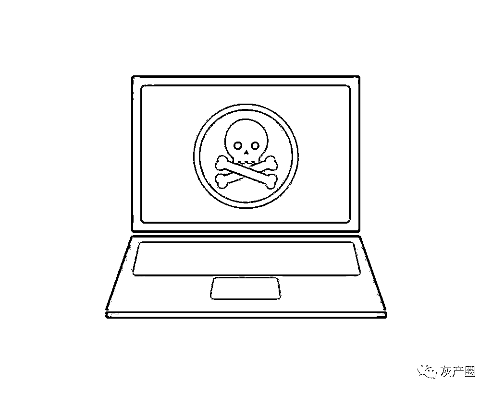

# 被“男神”骗了 68 万后，她找了个假警察报警......

> 原文：[`mp.weixin.qq.com/s?__biz=MzIyMDYwMTk0Mw==&mid=2247503166&idx=1&sn=dd40432ea8169e03096a60024a26c472&chksm=97cb0606a0bc8f109d2f0d8b36e51a91a728a0abe38a8bb97a8d95052eca97378e5d39f96cf3&scene=27#wechat_redirect`](http://mp.weixin.qq.com/s?__biz=MzIyMDYwMTk0Mw==&mid=2247503166&idx=1&sn=dd40432ea8169e03096a60024a26c472&chksm=97cb0606a0bc8f109d2f0d8b36e51a91a728a0abe38a8bb97a8d95052eca97378e5d39f96cf3&scene=27#wechat_redirect)

点击蓝字“**灰产圈**”关注我们！

都说网恋需谨慎，一不小心，爱情和金钱就都没了。近日，文山一位女子就掉入了虚拟世界的“爱情陷阱”，被网友骗走了 68 万！

这能忍？

报警啊！让人啼笑皆非的是，“报警”这个常规操作，又让她被骗走了 8 千元。

**网恋掉进“杀猪盘”，**

**被骗 68 万**

家住文山的孙女士平时喜欢上上网，逛逛淘宝，今年 9 月 1 日晚上 10 点左右，她在微信上认识了一个网名为“在水一方”的好友。此后的几天，二人从陌生人的寒暄，逐步变成无话不谈的密友。“在水一方”言语间成熟有主见，孙女士对他十分信任，没多久，感情渐渐升温的他们就确定了男女朋友关系。

一天，“在水一方”向孙女士推送了一个叫“Acorns”理财 APP，说可以在上面投资赚钱。出于对男友的信任，孙女士第一次就向这个 APP 里充值了 7 千元。你还别说，还真赚了几百块，见孙女士很高兴，男友“在水一方”趁机说：“你不如冲个会员，这样赚的钱更多。”按照男友的指点，孙女士一次性充了 30 万。平台上显示，这回赚到了不少钱，这让孙女士高兴坏了。

然而没过几天，孙女士就发现自己的账号被封了！客服解释是因为她的账号有恶意刷流水之嫌。这怎么办？客服称，要解封账号，要么充账户金额的 20%，要么升级为会员。

看懂了吗？翻译成大白话就是：你不继续往里充钱，你就拿不到里面的钱。孙女士疑虑了一阵，按客服要求，又充了 38 万。可充完后照样提不了现，客服告诉她：“提不了现只是因为一笔彩金没到，24 小时后会解封，你别着急。”后来孙女士没有继续提现，只是每天在投资平台上浏览一下，数字显示，孙女士的投资赚了不少钱。

10 月 2 日，孙女士因需要用钱去平台提现，发现账号被盗，客服告诉她找回账号需要继续交钱。

这一回，孙女士意识到被骗了。

**刚走出网友“杀猪盘”**

**又踏进“假网警”圈套**

得知被骗走 68 万，孙女士心急火燎的想报警。但她没有拨打“110”或者去派出所，而是在网上搜到一个叫“赵警官”的人的 QQ，加好友之后，孙女士向这位“赵警官”报了警。

经过一番询问，孙女士把个人信息、转账记录等材料都传给了“赵警官”。“赵警官”声称一定帮孙女士找回损失的 68 万元钱，但“你的支付宝存在安全隐患，需要缴纳 8 千元作保证金。”为了追回 68 万，孙女士也没多想，赶紧向“赵警官”交了 8 千元的保证金。接下来你猜到了，这 8 千元也一去不回。

最终孙女士被一个“杀猪盘”诈骗 68 万，被一个“假网警”诈骗 8 千，损失共计 68.8 万元。

下面要说的非常重要！

**建议用小本本抄下，并背诵三遍：**

**首先：“杀猪盘”套路是这样的：**

***第一步 · 寻找目标***

首先，他们会在 QQ 或微信上寻找年龄段相同段且有一定经济基础的人作为目标。

***第二步 · 取得信任***

骗子会在添加好友之后，频繁与人聊天，让你对其产生信任，有些骗子甚至会对你关怀备至，与你确定恋爱关系，信任更深。

***第三步 · 怂恿投资***

等到关系稳定，骗子便开始怂恿你在对方的平台上投资，大多数人就会试着小额投入几笔，骗子会通过后台操作，让你小赚几笔，尝到甜头。

***第四步 · 大量投入***

当你尝到甜头之后，骗子会并声称自己已经掌握了这个投资平台的漏洞，只要跟着对方投资稳赚不赔。这时，你已经深信不疑，便往平台里面大量资金投入。

***第五步 · 无法提现***

等到受害人投入大量现金之后，看到平台上赚了很多，甚至成倍赚钱，准备将里面的金额提现时，发现却提不出现金来，其实里面的数字是诈骗分子后台操作的，数字都是假的。

***第六步 · 销声匿迹***

当一个人问另一个人“敢不敢”的时候，另一个人必须说“敢”，这就是游戏的规则。

其次：“网警”到底是啥？

据了解，网警是指“从事公共信息网络安全监察工作的人民警察”，而不是“在网上搜索找到”的“警察”。

诈骗分子披着“网警”的外衣骗钱的案件发生过多起，请务必记住：

一是凡是称将钱打入安全账号的“网警”均是冒充警察的骗子；

二是报警立案无须缴纳任何费用；

三是报警要通过正规渠道，不要轻信网站、社交应用上随意搜出的“网警”；

四是任何人以任何借口索要“保证金”时，都要保持警惕，不随意转账汇款，索取“保证金”的都是“假网警”；

五是遇到紧急情况时，请及时拨打 110 报警，不要上网报警。

来源：云南省反电信网络诈骗中心

← 向右滑动与灰产圈互动交流 →

